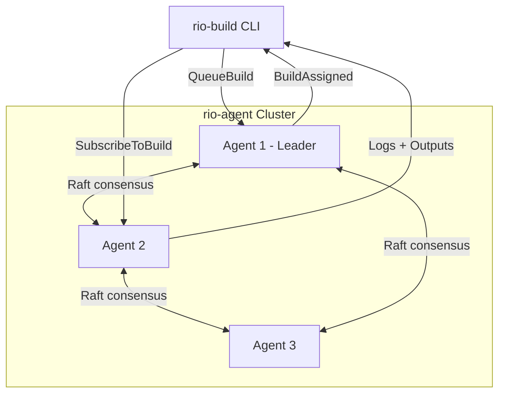
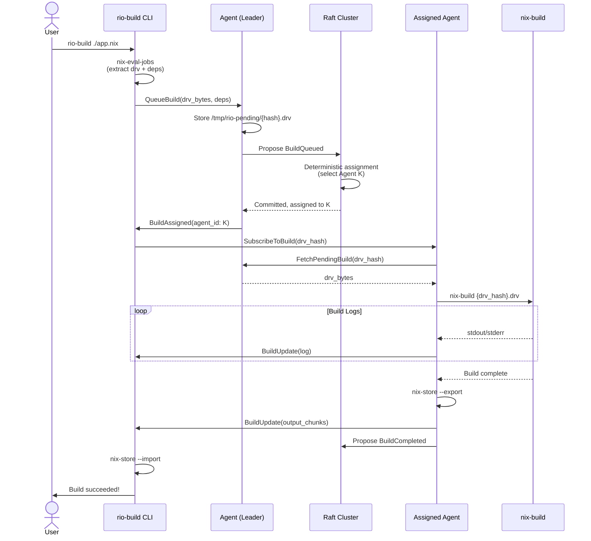
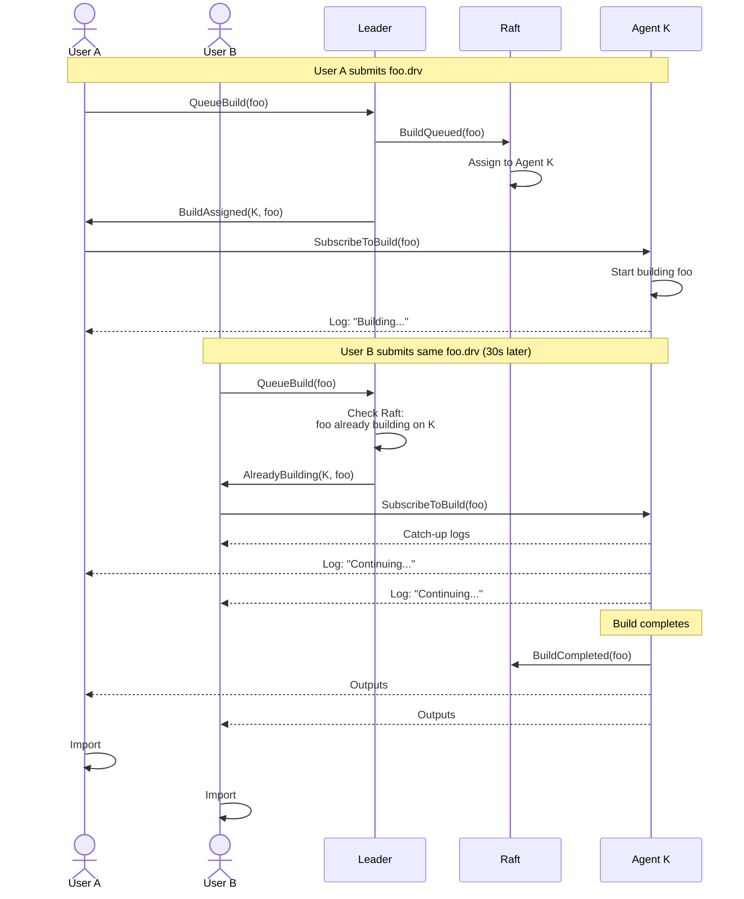
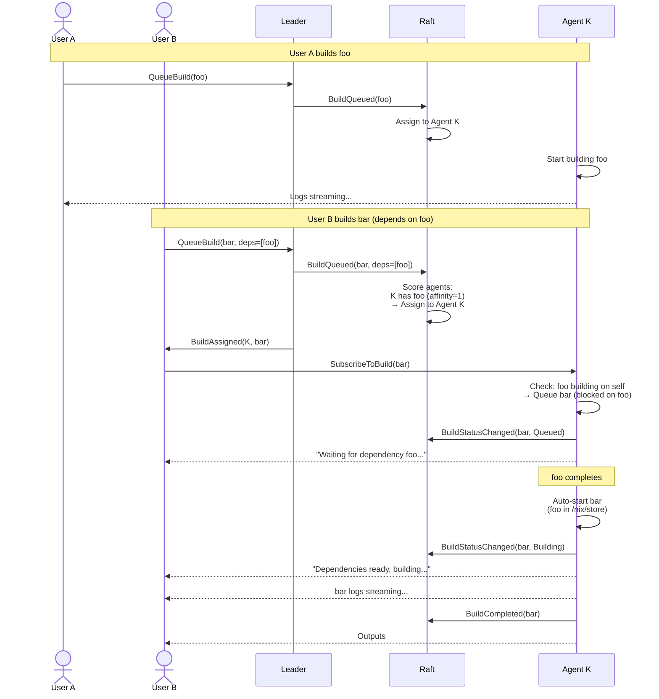
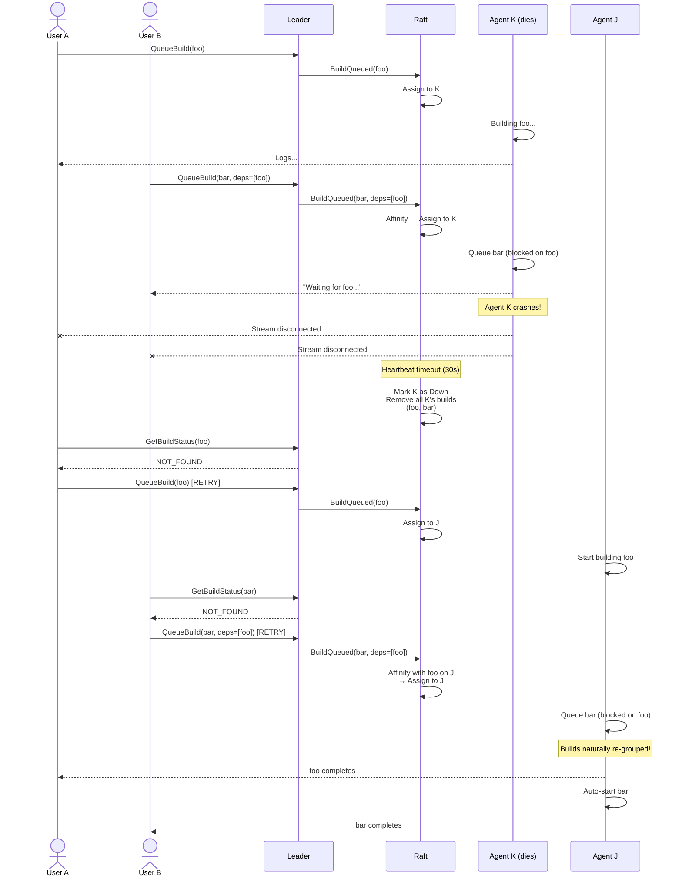

# Rio Design Document

## Overview

Rio is an open-source distributed build service for Nix that eliminates the traditional broker architecture by using a peer-to-peer agent cluster coordinated via Raft consensus.

**Key Innovation:** Instead of a central dispatcher that becomes a bottleneck and single point of failure, agents coordinate via Raft consensus while build data (derivations, logs, outputs) flows directly between CLI and agents.

## Architecture

### High-Level Design



**Critical Insights:**

- **Control Plane (Raft):** Membership, build tracking, deterministic assignment
- **Data Plane (gRPC):** Derivations, logs, outputs flow directly CLI ↔ Agent
- **No Bottleneck:** Data bypasses Raft entirely, streams point-to-point
- **Deterministic:** All agents run same state machine → agree on assignment

**Automatic Build Recovery:**

When an agent fails, no manual intervention or complex reassignment logic is needed:
1. Raft cleanup removes failed agent's builds
2. Each affected CLI independently retries
3. Affinity + deduplication naturally re-group builds on new agent
4. Work continues seamlessly

## Core Design Decisions

### 1. What Does Raft Coordinate?

Raft maintains a **shared state machine** with:

```rust
struct ClusterState {
    // Cluster membership
    agents: HashMap<AgentId, AgentInfo>,

    // Active builds: derivation hash → which agent is building it
    builds_in_progress: HashMap<DerivationHash, BuildTracker>,

    // Recently completed builds (5 minute LRU cache for fast retrieval)
    completed_builds: LruCache<DerivationHash, CompletedBuild>,
}

struct BuildTracker {
    agent_id: AgentId,
    started_at: Timestamp,
    parent_build: Option<DerivationHash>,  // None = top-level, Some(hash) = dependency
    status: BuildStatus,
}

enum BuildStatus {
    Queued { blocked_on: Vec<DerivationHash> },  // Waiting for dependencies
    Building,  // Currently executing
}

struct CompletedBuild {
    agent_id: AgentId,  // Where outputs are stored in /nix/store
    output_paths: Vec<Utf8PathBuf>,
    completed_at: Timestamp,
}

struct AgentInfo {
    id: AgentId,
    address: String,           // gRPC endpoint
    platforms: Vec<String>,    // ["x86_64-linux", "i686-linux"] (from system + extra-platforms)
    features: Vec<String>,     // ["kvm", "big-parallel"] (from system-features)
    capacity: BuilderCapacity,
    last_heartbeat: Timestamp,
    status: AgentStatus,       // Available, Busy, or Down
}

enum AgentStatus {
    Available,  // Idle, can accept builds
    Busy,       // Currently executing one build
    Down,       // Failed heartbeats
}

// Note: JobAssignment removed - redundant with BuildTracker
// Derivation hash serves as the job identifier
```

**Raft Commands:**

```rust
enum RaftCommand {
    // Membership
    AgentJoined { id: AgentId, info: AgentInfo },
    AgentLeft { id: AgentId },
    AgentHeartbeat { id: AgentId, timestamp: Timestamp },

    // Build lifecycle (derivation hash is the job identifier)
    // Leader proposes this when CLI submits work
    // State machine deterministically assigns to best agent
    BuildQueued {
        top_level: DerivationHash,
        dependencies: Vec<DerivationHash>,
        platform: String,
        features: Vec<String>,
    },
    // Agent updates status when starting/queuing
    BuildStatusChanged {
        derivation_hash: DerivationHash,
        status: BuildStatus,  // Queued or Building
    },
    BuildCompleted {
        derivation_hash: DerivationHash,
        output_paths: Vec<Utf8PathBuf>,
    },
    BuildFailed {
        derivation_hash: DerivationHash,
        error: String,
    },
}
```

**What Raft Does NOT Store:**

- Build derivations (too large, sent via gRPC to leader, then fetched by assigned agent)
- Build logs (streamed to subscribers in real-time)
- Build outputs (stored in agent's /nix/store, exported on demand)

**Deterministic Agent Assignment:**

When a build is queued, the Raft state machine (running on ALL agents) deterministically selects which agent should execute it:

```rust
fn apply_build_queued(state: &mut ClusterState, cmd: BuildQueued) -> AgentId {
    // 1. Filter eligible agents
    let eligible: Vec<_> = state.agents.values()
        .filter(|a| {
            a.platforms.contains(&cmd.platform) &&
            cmd.features.iter().all(|f| a.features.contains(f)) &&
            a.status == AgentStatus::Available
        })
        .collect();

    // 2. Score by affinity (count matching dependencies)
    let mut scores: HashMap<AgentId, usize> = HashMap::new();
    for dep_hash in &cmd.dependencies {
        if let Some(tracker) = state.builds_in_progress.get(dep_hash) {
            *scores.entry(tracker.agent_id).or_insert(0) += 1;
        }
        if let Some(completed) = state.completed_builds.get(dep_hash) {
            *scores.entry(completed.agent_id).or_insert(0) += 1;
        }
    }

    // 3. Select highest affinity, tie-break by smallest agent_id
    let selected = scores.iter()
        .filter(|(id, _)| eligible.iter().any(|a| &a.id == *id))
        .max_by_key(|(_, score)| *score)
        .map(|(id, _)| *id)
        .or_else(|| eligible.iter().min_by_key(|a| &a.id).map(|a| a.id))
        .expect("No eligible agents");

    // 4. Update state (all agents do this identically)
    state.builds_in_progress.insert(cmd.top_level, BuildTracker {
        agent_id: selected,
        status: BuildStatus::Building,
        parent_build: None,
        started_at: now(),
    });

    // Register dependencies
    for dep_hash in cmd.dependencies {
        state.builds_in_progress.entry(dep_hash).or_insert(BuildTracker {
            agent_id: selected,
            status: BuildStatus::Building,
            parent_build: Some(cmd.top_level),
            started_at: now(),
        });
    }

    state.agents.get_mut(&selected).status = AgentStatus::Busy;
    selected  // All agents compute the same result!
}
```

**Why this works:**
- ✅ Deterministic - Same cluster state + same BuildQueued command = same agent selected
- ✅ No races - Assignment happens in state machine, not via distributed claiming
- ✅ Best agent wins - Affinity scoring is explicit and deterministic
- ✅ Consistent - All agents agree on who was assigned

**Build Deduplication:**

- Derivation hash serves as the job identifier (no separate JobId needed)
- When User A submits a build, leader proposes BuildQueued to Raft
- State machine assigns to best agent
- When User B submits the **same** derivation, they're transparently subscribed to the in-progress build
- Both users receive logs and outputs from the single build execution
- Completed builds cached for 5 minutes to serve late arrivals

### 2. Build Submission Flow (End to End)

#### Sequence Diagram



#### Detailed Steps

```
User runs: rio-build ./my-package.nix

┌─────────────────────────────────────────────────────┐
│ 1. CLI: Evaluate with nix-eval-jobs                 │
└─────────────────────────────────────────────────────┘
   - Run: nix-eval-jobs --check-cache-status \
            --show-input-drvs \
            --show-required-system-features \
            --flake <nix-expression>
   - Parse JSON output (one line for top-level package):
     * drvPath: /nix/store/abc123-foo.drv
     * system: x86_64-linux
     * requiredSystemFeatures: ["kvm", "big-parallel"]
     * cacheStatus: "notBuilt" | "cached" | "local"
     * neededBuilds: [list of .drv files that need building]
     * neededSubstitutes: [list of paths fetchable from cache]
   - If cacheStatus is "cached" or "local":
     → Skip remote build, run `nix build` locally instead
   - Read derivation bytes for top-level
   - Compute DerivationHash for top-level and each neededBuilds entry
   - Result: BuildInfo with minimal set of builds needed

┌─────────────────────────────────────────────────────┐
│ 2. CLI: Connect to cluster leader                   │
└─────────────────────────────────────────────────────┘
   - Read seed agents from ~/.config/rio/config.toml
   - Connect to first available seed agent
   - Call GetClusterMembers() RPC
   - Identify current leader from cluster state
   - Connect to leader (or stay if already connected)

┌─────────────────────────────────────────────────────┐
│ 3. CLI → Leader: Submit work to queue               │
└─────────────────────────────────────────────────────┘
   CLI → Leader: QueueBuild(drv_bytes, deps, platform, features)

   Leader receives derivation bytes (via gRPC, not Raft)
   Leader stores temporarily: /tmp/rio-pending/{drv_hash}.drv
   Leader returns: BuildQueued { drv_hash }

┌─────────────────────────────────────────────────────┐
│ 4. Leader: Propose to Raft                          │
└─────────────────────────────────────────────────────┘
   Leader proposes: BuildQueued {
     drv_hash,
     platform,
     features,
     dependency_hashes,
   }

┌─────────────────────────────────────────────────────┐
│ 5. Raft: Deterministic agent assignment             │
└─────────────────────────────────────────────────────┘
   ALL agents apply BuildQueued to state machine:

   1. Filter eligible agents (platform + features + Available)
   2. Score agents by affinity (count matching dependencies)
   3. Select highest score
   4. Tie-breaker: lexicographically smallest agent_id
   5. Update state:
      - builds_in_progress[drv_hash] = { agent_id: selected, ... }
      - agents[selected].status = Busy

   Result: ALL agents agree on assignment (deterministic!)

┌─────────────────────────────────────────────────────┐
│ 6. Assigned agent: Fetch derivation and start       │
└─────────────────────────────────────────────────────┘
   Agent K sees: "I was assigned drv_hash"

   If K is leader:
     - Read from /tmp/rio-pending/{drv_hash}.drv
   Else:
     - FetchPendingBuild(drv_hash) from leader via gRPC

   Check dependencies:
     - If deps building on self → Queue with Queued status
     - Else → Start immediately with Building status

   Write derivation to /tmp/rio-agent/{drv_hash}.drv
   Spawn: nix-build /tmp/rio-agent/{drv_hash}.drv

┌─────────────────────────────────────────────────────┐
│ 7. Leader: Respond to CLI with assignment           │
└─────────────────────────────────────────────────────┘
   Leader waits for Raft commit
   Leader reads state machine: drv_hash assigned to Agent K
   Leader → CLI: BuildAssigned { agent_id: K, drv_hash }

┌─────────────────────────────────────────────────────┐
│ 8. CLI → Assigned Agent: Subscribe to build         │
└─────────────────────────────────────────────────────┘
   CLI → Agent K: SubscribeToBuild(drv_hash)
   Agent K streams: logs + outputs
   CLI displays logs in real-time

┌─────────────────────────────────────────────────────┐
│ 9. Agent: Export outputs                            │
└─────────────────────────────────────────────────────┘
   - nix-build completes → /nix/store/abc123-result
   - Run: nix-store --export /nix/store/abc123-result
   - Capture NAR (Nix ARchive) bytes

┌─────────────────────────────────────────────────────┐
│ 10. Agent → CLI: Stream outputs                     │
└─────────────────────────────────────────────────────┘
   Send BuildUpdate {
       output_chunk: OutputChunk {
           path: "/nix/store/abc123-result",
           data: [bytes...],
           chunk_index: 0,
       }
   }

┌─────────────────────────────────────────────────────┐
│ 11. CLI: Import outputs                             │
└─────────────────────────────────────────────────────┘
   - Receive all chunks, reassemble NAR
   - Run: nix-store --import < output.nar
   - Outputs now in local /nix/store

┌─────────────────────────────────────────────────────┐
│ 12. Agent: Mark complete and unblock dependents     │
└─────────────────────────────────────────────────────┘
   - Propose RaftCommand::BuildCompleted { derivation_hash, output_paths }
   - Raft removes top-level from builds_in_progress
   - Raft removes ALL dependencies (where parent_build = this hash)
   - Send BuildUpdate { completed: BuildCompleted { output_paths, duration } }
   - Check pending_builds for anything waiting on this derivation
   - Auto-start any builds that are now unblocked
   - If no pending builds: mark agent as Available
   - Clean up temp files
   - Leader deletes /tmp/rio-pending/{drv_hash}.drv

┌─────────────────────────────────────────────────────┐
│ 13. CLI: Report success                             │
└─────────────────────────────────────────────────────┘
   Print to user:
       Build succeeded!
       Outputs:
         /nix/store/abc123-result
       Duration: 42s
```

### 3. Build Deduplication (Multiple Users, Same Derivation)

**Problem:** Users A and B submit the same derivation simultaneously. We want to avoid duplicate work.

**Solution:** Transparent build sharing via Raft coordination.

#### Deduplication Sequence



#### Detailed Scenario: User B joins in-progress build

```
Time T0: User A submits /nix/store/abc123-foo.drv
1. CLI extracts build closure:
   - foo.drv (top-level)
   - bar.drv (dependency)
   - baz.drv (dependency)
2. CLI → Leader: QueueBuild(foo_drv_bytes, deps=[bar_hash, baz_hash])
3. Leader stores: /tmp/rio-pending/foo_hash.drv
4. Leader proposes: BuildQueued {
     top_level: foo_hash,
     dependencies: [bar_hash, baz_hash],
     platform: "x86_64-linux",
     features: []
   }
5. Raft state machine (on ALL agents) applies BuildQueued:
   - Filters eligible agents
   - Scores by affinity (no deps yet, all score 0)
   - Tie-breaks: selects Agent K (smallest agent_id among eligible)
   - Atomically registers:
     * builds_in_progress[foo_hash] = { agent: K, parent: None, status: Building }
     * builds_in_progress[bar_hash] = { agent: K, parent: Some(foo), status: Building }
     * builds_in_progress[baz_hash] = { agent: K, parent: Some(foo), status: Building }
     * agents[K].status = Busy
6. Agent K sees assignment, fetches drv_bytes from leader
7. Agent K starts building, streaming logs to User A

Time T1: User B submits same foo.drv (30s later)
1. CLI extracts build closure: [foo, bar, baz]
2. CLI → Leader: QueueBuild(foo_drv_bytes, deps=[bar_hash, baz_hash])
3. Leader checks Raft: builds_in_progress[foo_hash] = Some(BuildTracker {
     agent_id: K,
     started_at: T0,
     parent_build: None
   })
4. Leader returns: AlreadyBuilding { agent_id: K, drv_hash: foo_hash }
5. CLI → Agent K: SubscribeToBuild(foo_hash)
6. Agent K sends User B:
   - Catch-up: All logs from T0 to T1
   - Live: New logs as they arrive
7. Build completes at T2
8. Agent K streams outputs to BOTH User A and User B
9. Both users import outputs, done
```

**Scenario: User C requests recently completed build**

```
Time T2: Build completed
1. Agent-1 proposes: BuildCompleted {
     derivation_hash: drv_hash,
     output_paths: ["/nix/store/abc123-result"]
   }
2. Raft moves from builds_in_progress → completed_builds (LRU cache)

Time T3: User C submits same derivation (3 minutes later)
1. CLI → Agent-2: SubmitBuild(drv_bytes)
2. Agent-2 computes drv_hash, checks Raft
3. Finds in completed_builds: CompletedBuild {
     agent_id: "agent-1",
     output_paths: ["/nix/store/abc123-result"]
   }
4. Agent-2 returns: Redirect { target_agent: "agent-1", derivation_hash: drv_hash }
5. CLI → Agent-1: GetCompletedBuild(derivation_hash: drv_hash)
6. Agent-1 exports: nix-store --export /nix/store/abc123-result
7. Agent-1 streams NAR chunks to User C
8. User C imports, done
```

**Agent-Side Implementation:**

```rust
struct Agent {
    // Currently executing build (one at a time)
    current_build: Option<DerivationHash>,

    // Builds waiting for dependencies to complete
    pending_builds: HashMap<DerivationHash, PendingBuild>,

    // Build state with multiple subscribers (keyed by derivation hash)
    build_jobs: HashMap<DerivationHash, BuildJob>,
}

struct PendingBuild {
    derivation: Vec<u8>,
    blocked_on: Vec<DerivationHash>,
    subscribers: Vec<BuildSubscriber>,
}

struct BuildJob {
    derivation_hash: DerivationHash,
    derivation_path: Utf8PathBuf,  // /nix/store/abc123-foo.drv
    process: Child,  // nix-build process
    subscribers: Vec<BuildSubscriber>,
    log_history: Vec<LogLine>,  // For late joiners (last 10,000 lines)
}

struct BuildSubscriber {
    stream: ResponseStream,
    joined_at_line: usize,  // Log line index when they joined
}

impl Agent {
    async fn submit_build(&self, req: SubmitBuildRequest) -> Result<Stream<BuildUpdate>> {
        let drv_hash = hash_derivation(&req.derivation);

        // Check Raft state
        let existing = self.raft.query_build(drv_hash).await?;

        match existing {
            None => {
                // Check which dependencies are building on THIS agent
                let mut deps_building_here = Vec::new();
                for dep_hash in &req.dependency_hashes {
                    if let Some(tracker) = self.raft.query_build(dep_hash).await? {
                        if tracker.agent_id == self.id {
                            deps_building_here.push(*dep_hash);
                        }
                    }
                }

                let status = if deps_building_here.is_empty() {
                    BuildStatus::Building
                } else {
                    BuildStatus::Queued { blocked_on: deps_building_here.clone() }
                };

                // Register atomically
                self.raft.propose(BuildStartedWithDependencies {
                    top_level: drv_hash,
                    dependencies: req.dependency_hashes,
                    agent_id: self.id,
                    platform: req.platform,
                    status: status.clone(),
                }).await?;

                // Mark agent as Busy
                self.raft.propose(AgentStatusChanged {
                    agent_id: self.id,
                    status: AgentStatus::Busy,
                }).await?;

                if matches!(status, BuildStatus::Queued { .. }) {
                    self.queue_build(drv_hash, req, deps_building_here).await
                } else {
                    self.start_build(drv_hash, req).await
                }
            }
            Some(BuildTracker { agent_id, status, .. }) if agent_id == self.id => {
                // Building/queued on THIS agent - add subscriber
                self.subscribe_to_build(drv_hash).await
            }
            Some(BuildTracker { agent_id, .. }) => {
                // Building on different agent - redirect
                Err(RedirectToAgent { agent_id, derivation_hash: drv_hash })
            }
            Some(CompletedBuild { output_paths, .. }) => {
                // Recently completed - stream outputs from /nix/store
                self.stream_completed_build(drv_hash, output_paths).await
            }
        }
    }

    async fn on_build_completed(&mut self, drv_hash: DerivationHash, outputs: Vec<Utf8PathBuf>) {
        // Propose completion to Raft
        self.raft.propose(BuildCompleted {
            derivation_hash: drv_hash,
            output_paths: outputs.clone(),
        }).await?;

        // Broadcast to all subscribers
        self.broadcast_to_subscribers(drv_hash, BuildUpdate::Completed(...)).await?;

        // Check pending builds waiting on this dependency
        let mut unblocked = Vec::new();

        for (pending_hash, pending) in &mut self.pending_builds {
            pending.blocked_on.retain(|h| h != &drv_hash);

            if pending.blocked_on.is_empty() {
                unblocked.push(*pending_hash);
            }
        }

        // Start unblocked builds
        if let Some(next_hash) = unblocked.first() {
            let pending = self.pending_builds.remove(next_hash)?;
            self.current_build = Some(*next_hash);
            self.start_build(*next_hash, pending.derivation).await?;
        } else {
            // No more work - mark as Available
            self.current_build = None;
            self.raft.propose(AgentStatusChanged {
                agent_id: self.id,
                status: AgentStatus::Available,
            }).await?;
        }
    }

    async fn on_build_failed(&mut self, drv_hash: DerivationHash, error: String) {
        // Propose failure to Raft
        self.raft.propose(BuildFailed {
            derivation_hash: drv_hash,
            error: error.clone(),
        }).await?;

        // Find all builds waiting on this dependency (cascading failures)
        let dependents: Vec<_> = self.pending_builds.iter()
            .filter(|(_, pending)| pending.blocked_on.contains(&drv_hash))
            .map(|(hash, _)| *hash)
            .collect();

        // Recursively fail dependents
        for dependent_hash in dependents {
            self.fail_build_cascade(dependent_hash, format!(
                "Dependency {} failed: {}", drv_hash, error
            )).await?;
        }

        // Mark agent as Available (unless other pending builds exist)
        if self.pending_builds.is_empty() {
            self.current_build = None;
            self.raft.propose(AgentStatusChanged {
                agent_id: self.id,
                status: AgentStatus::Available,
            }).await?;
        }
    }
}
```

**CLI Handling of Redirects:**

```rust
async fn submit_build_with_retry(drv_path: Utf8PathBuf) -> Result<()> {
    let drv_bytes = tokio::fs::read(&drv_path).await?;
    let mut agent = select_agent(&cluster)?;

    loop {
        match agent.submit_build(drv_bytes.clone()).await {
            Ok(stream) => {
                return handle_build_stream(stream).await;
            }
            Err(RedirectToAgent { agent_id, derivation_hash }) => {
                // Transparently redirect to correct agent
                agent = cluster.find_agent(agent_id)?;
                // Retry will call SubscribeToBuild instead
                continue;
            }
            Err(e) => return Err(e),
        }
    }
}
```

**Cache Duration:**
- Active builds: In Raft until BuildCompleted/BuildFailed
- Completed builds: 5 minutes in LRU cache (configurable)
- Failed builds: Immediately removed (allow instant retry)

**Benefits:**
- ✅ Zero user action required
- ✅ No duplicate work
- ✅ Multiple users benefit from single build
- ✅ Works for in-progress AND recently completed builds
- ✅ No artificial output caching (uses /nix/store directly)
- ✅ Failed builds can retry immediately

### 4. Multi-Derivation Builds, Deduplication, and Build Affinity

**The Problem:**

A typical `nix build` involves building multiple derivations, not just one:

```bash
$ nix build ./my-app.nix
these 15 derivations will be built:
  /nix/store/abc-dep1.drv
  /nix/store/def-dep2.drv
  ...
  /nix/store/xyz-my-app.drv
```

If User A builds `my-app` (which depends on `dep1`) and User B builds `dep1` directly, we want to deduplicate the `dep1` build.

**Solution: Pre-registration + Build Affinity + Dependency Waiting**

The CLI uses `nix-eval-jobs` with cache checking to extract **only derivations that need building**:

```rust
// Run nix-eval-jobs with cache checking
$ nix-eval-jobs --check-cache-status \
                --show-required-system-features \
                --show-input-drvs \
                --expr "{ pkg = import ./my-app.nix {}; }"

// Output (JSON):
{
  "attr": "pkg",
  "drvPath": "/nix/store/xyz-my-app.drv",
  "system": "x86_64-linux",
  "requiredSystemFeatures": ["kvm"],
  "cacheStatus": "notBuilt",
  "neededBuilds": [
    "/nix/store/xyz-my-app.drv",
    "/nix/store/abc-dep1.drv",  // Needs building
    "/nix/store/def-dep2.drv"   // Needs building
  ],
  "neededSubstitutes": [
    "/nix/store/ghi-dep3",  // In cache.nixos.org
    "/nix/store/jkl-dep4"   // In cache.nixos.org
  ]
}

// Only register derivations in neededBuilds!
let top = hash(my-app.drv);
let deps = [hash(dep1.drv), hash(dep2.drv)];  // NOT dep3, dep4!

// Submit with minimal dependency list
agent.submit_build(my-app_bytes, deps);
```

**Agent atomically registers all derivations:**

```rust
// Agent proposes single Raft command
BuildStartedWithDependencies {
    top_level: hash(my-app.drv),
    dependencies: [hash(dep1.drv), hash(dep2.drv), hash(dep3.drv)],
    agent_id: "agent-1",
    platform: "x86_64-linux",
}

// Raft state machine applies atomically:
builds_in_progress[hash(my-app.drv)] = BuildTracker {
    agent_id: agent-1,
    parent_build: None,  // Top-level
}

builds_in_progress[hash(dep1.drv)] = BuildTracker {
    agent_id: agent-1,
    parent_build: Some(hash(my-app.drv)),  // Dependency
}

builds_in_progress[hash(dep2.drv)] = BuildTracker {
    agent_id: agent-1,
    parent_build: Some(hash(my-app.drv)),  // Dependency
}

// Now ALL derivations are registered and reserved!
```

**Deduplication in action:**

```
Time T0: User A runs: rio-build ./my-app.nix
- nix-eval-jobs returns:
  * neededBuilds: [my-app.drv, dep1.drv, dep2.drv]
  * neededSubstitutes: [dep3, dep4, dep5, ...]  (will fetch from cache)
- CLI → Leader: QueueBuild(my-app_bytes, deps=[dep1, dep2])
- Raft assigns to Agent K
- Agent K starts: nix-build /nix/store/my-app.drv
- Nix automatically fetches dep3, dep4, dep5 from substituters

Time T1: User B runs: rio-build ./dep1.nix (30 seconds later)
- nix-eval-jobs returns:
  * cacheStatus: "notBuilt"
  * neededBuilds: [dep1.drv]
- CLI → Leader: QueueBuild(dep1_bytes, deps=[])
- Leader checks Raft: builds_in_progress[hash(dep1)] = Some(BuildTracker {
    agent_id: K,
    parent_build: Some(hash(my-app))  // Being built as dependency!
  })
- Leader returns: AlreadyBuilding { agent_id: K, drv_hash: dep1 }
- CLI → Agent K: SubscribeToBuild(hash(dep1))
- User B receives logs for dep1 (even though it's part of my-app's build)
- When my-app completes, dep1 outputs are included
- User B gets dep1 outputs automatically!

Time T2: User C runs: rio-build ./dep3.nix (dep3 was in substituters)
- nix-eval-jobs returns:
  * cacheStatus: "cached"
  * neededBuilds: []
  * neededSubstitutes: [dep3]
- CLI exits: "Package available in cache, fetching locally..."
- Runs: nix build ./dep3.nix (local Nix handles it)
- No remote build needed!
```

#### Build Affinity and Dependency Waiting



**Scenario: Build affinity with dependency waiting**

```
Time T0: User A runs: rio-build ./foo.nix
- Registers: foo.drv on Agent K (status: Building)
- Agent K starts building foo
- Agent K status: Busy

Time T1: User B runs: rio-build ./bar.nix (bar depends on foo)
- CLI extracts closure: [bar.drv, foo.drv]
- CLI checks cluster:
  - foo is building on Agent K
- CLI scores agents:
  - Agent K: affinity=1 (has foo building)
  - Agent J: affinity=0
  - Agent M: affinity=0
- CLI selects Agent K (best affinity!)
- CLI → Agent K: SubmitBuild(bar_bytes, deps=[hash(foo)])

Time T2: Agent K receives bar submission
- Checks: foo is building on me (self.current_build = Some(hash(foo)))
- Status: Queued { blocked_on: [hash(foo)] }
- Registers in Raft: BuildStartedWithDependencies {
    top_level: hash(bar),
    dependencies: [hash(foo)],
    agent_id: K,
    status: Queued
  }
- Adds bar to pending_builds queue
- Sends to User B: "Waiting for dependency /nix/store/abc-foo.drv..."

Time T3: foo build completes
- Agent K marks foo complete in Raft
- Agent K checks pending_builds
- Finds bar blocked on [hash(foo)]
- Removes hash(foo) from bar.blocked_on → now empty!
- Agent K auto-starts bar build
- Sends to User B: "Dependencies ready, starting build..."
- nix-build finds foo in local /nix/store (cache hit!)

Time T4: bar build completes
- Agent K marks bar complete
- Agent K status: Available (no more pending builds)
- User B gets outputs
```

**Scenario: Cascading dependency failure**

```
Time T0: User A builds foo (Agent K)
Time T1: User B builds bar (depends on foo, queued on Agent K)
Time T2: foo FAILS

Agent K's on_build_failed():
1. Marks foo as failed in Raft
2. Checks pending_builds
3. Finds bar blocked on [hash(foo)]
4. Sends to User B: BuildFailed {
     error: "Dependency /nix/store/abc-foo.drv failed: compile error"
   }
5. Removes bar from pending_builds
6. Marks bar as failed in Raft
7. Agent K status: Available (all work done)

User B sees:
  "Waiting for dependency /nix/store/abc-foo.drv..."
  "Error: Build cannot proceed: dependency failed"
```

**Cleanup on Completion:**

```rust
// When build completes
fn apply_build_completed(
    state: &mut ClusterState,
    drv_hash: DerivationHash,
    outputs: Vec<Utf8PathBuf>
) {
    // Remove top-level
    state.builds_in_progress.remove(&drv_hash);

    // Remove ALL dependencies tied to this build
    state.builds_in_progress.retain(|_, tracker| {
        tracker.parent_build != Some(drv_hash)
    });

    // Cache result
    state.completed_builds.put(drv_hash, CompletedBuild {
        agent_id: tracker.agent_id,
        output_paths: outputs,
        completed_at: now(),
    });
}
```

**Benefits:**

- ✅ Full deduplication across entire dependency tree
- ✅ Build affinity - builds go where dependencies are
- ✅ Dependency waiting - automatically waits for in-progress deps
- ✅ Zero cross-agent transfers - dependencies are local
- ✅ Cascading failures - dependents fail immediately
- ✅ Atomic registration prevents race conditions
- ✅ One build at a time per agent (simple execution model)
- ✅ Transparent to users (automatic subscription, waiting, retry)
- ✅ Cache-aware - only builds what's not available in substituters
- ✅ Minimal Raft overhead - only registers derivations that need building

**Key Scenarios Handled:**

1. **Same derivation, multiple users** → Share single build
2. **Dependency already building** → Queue on same agent, wait
3. **Dependency recently completed** → Prefer agent with cached outputs
4. **Dependency fails** → Cascade failure to dependents
5. **Agent dies** → All builds on that agent fail, users retry elsewhere
6. **Dependency in cache** → Skip registration, let Nix fetch from substituters
7. **Top-level in cache** → Skip remote build entirely, use local Nix

**Performance:**

- nix-eval-jobs filters to only derivations needing builds
- Example: 100 total deps, 5 need building → Register only 6 derivations (top + 5 deps)
- Typical Raft command: ~2-10KB for most builds
- Large builds (100+ uncached deps): ~60KB Raft entry
- Much better than registering everything!

### 5. Failure Handling

#### Agent Failure and Recovery



**Scenario A: Agent dies with active and queued builds**

```
Time T0: User A submits foo
- builds_in_progress[hash(foo)] = { agent_id: K, status: Building }
- User A's CLI → Agent K (streaming logs)

Time T1: User B submits bar (depends on foo)
- CLI detects foo building on Agent K (affinity!)
- builds_in_progress[hash(bar)] = { agent_id: K, status: Queued { blocked_on: [foo] } }
- User B's CLI → Agent K (sees "Waiting for dependencies...")

Time T2: Agent K crashes
- Both CLIs detect stream disconnection
- Raft heartbeat timeout (30s)
- Raft marks Agent K as Down
- Raft cleanup removes ALL of Agent K's builds:
  * builds_in_progress.remove(hash(foo))
  * builds_in_progress.remove(hash(bar))
  * Remove dependencies of foo and bar

Time T3: User A retries foo
- CLI: GetJobStatus(hash(foo)) → NotFound (cleaned up)
- CLI: Resubmit foo to cluster
- CLI selects Agent J (available)
- Agent J starts building foo
- builds_in_progress[hash(foo)] = { agent_id: J, status: Building }

Time T3+1ms: User B retries bar (nearly simultaneous)
- CLI: GetJobStatus(hash(bar)) → NotFound
- CLI: Resubmit bar, check dependencies
- Raft shows: hash(foo) = { agent_id: J, status: Building } ← User A's build!
- CLI selects Agent J (affinity with foo!)
- Agent J receives bar, detects foo building on self
- Agent J queues: Queued { blocked_on: [hash(foo)] }
- builds_in_progress[hash(bar)] = { agent_id: J, status: Queued }
- User B's CLI reconnects to Agent J: "Waiting for dependencies..."

Time T4: foo completes on Agent J
- Agent J auto-starts bar
- User B's build continues seamlessly

Result: Both builds naturally migrate to Agent J via independent retry + affinity!
```

**Scenario B: Network partition during submission**

```
1. CLI sends SubmitBuildRequest
2. Agent receives, proposes to Raft
3. Network partition: agent can't reach Raft quorum
4. Agent's proposal times out (no consensus)
5. Agent returns error to CLI: "Cluster unavailable"
6. CLI waits and retries
```

**Scenario C: CLI dies mid-build**

```
1. Agent is building, CLI crashes
2. Agent completes build, tries to stream outputs
3. Stream fails (CLI gone)
4. Agent still marks build complete in Raft
5. Build moved to completed_builds cache (5 minutes)
6. Outputs remain in agent's /nix/store
7. If CLI reconnects: GetCompletedBuild(drv_hash) from assigned agent
8. Agent exports outputs from /nix/store on demand
```

### 6. Cluster Membership

**Bootstrap (first agent):**

```bash
rio-agent --bootstrap --listen=0.0.0.0:50051 --data-dir=/var/lib/rio
```

- Creates single-node Raft cluster
- Agent ID: generated UUID
- Raft state: { agents: { self }, active_jobs: {} }

**Join existing cluster:**

```bash
rio-agent --join=https://agent1.example.com:50051 --listen=0.0.0.0:50051
```

- Connects to agent1 via gRPC
- Sends JoinCluster RPC
- agent1 (or leader) proposes RaftCommand::AgentJoined
- Once committed, new agent becomes voting member

**Heartbeats and Failure Detection:**

- Every 10 seconds, each agent proposes RaftCommand::AgentHeartbeat
- If agent misses 3 heartbeats (30s), marked as Down
- When agent marked as Down, Raft automatically:
  * Removes all builds assigned to that agent (Building or Queued)
  * Removes dependencies registered by those builds
  * Clears the builds from Raft state
- Disconnected CLIs automatically retry on different agents
- Affinity mechanism naturally re-groups related builds on new agent

**Graceful shutdown:**

```
1. Agent receives SIGTERM
2. Agent stops accepting new builds
3. Agent waits for active builds to complete (or timeout)
4. Agent proposes RaftCommand::AgentLeft
5. Agent shuts down
```

### 7. Platform and Feature Matching

**Agent Startup: Query Nix configuration**

Each agent queries its local Nix configuration on startup:

```rust
// Query all Nix configuration at once
let output = Command::new("nix")
    .args(&["config", "show"])
    .output()
    .await?;

let config = String::from_utf8(output.stdout)?;

// Parse configuration (format: "key = value")
let mut system = None;
let mut extra_platforms = Vec::new();
let mut features = Vec::new();

for line in config.lines() {
    if let Some((key, value)) = line.split_once(" = ") {
        match key.trim() {
            "system" => {
                system = Some(value.trim().to_string());
            }
            "extra-platforms" => {
                extra_platforms = value.split_whitespace()
                    .map(|s| s.to_string())
                    .collect();
            }
            "system-features" => {
                features = value.split_whitespace()
                    .map(|s| s.to_string())
                    .collect();
            }
            _ => {}
        }
    }
}

// Combine: agent can build for primary + extra platforms
let mut platforms = vec![system.expect("system not found in nix config")];
platforms.extend(extra_platforms);

// Agent now advertises:
// platforms: ["x86_64-linux", "i686-linux"]
// features: ["kvm", "big-parallel", "nixos-test"]
```

**Examples of platform compatibility:**
- `x86_64-linux` can often build `i686-linux` (32-bit on 64-bit)
- `aarch64-darwin` (Apple Silicon) can build `x86_64-darwin` via Rosetta 2
- `armv7l-linux` can build `armv6l-linux` and `armv5tel-linux`

**System Features** (from Nix documentation):
- `kvm` - KVM virtualization support (required for VM tests)
- `big-parallel` - Suitable for highly parallel builds (many cores)
- `nixos-test` - Can run NixOS integration tests
- `benchmark` - Suitable for performance benchmarks
- `ca-derivations` - Supports content-addressed derivations
- Custom features defined in `nix.conf`

**Error Handling:**

If no agents satisfy requirements:
```
Error: No agents available for platform 'x86_64-linux' with features: [kvm, big-parallel]
Available agents: 3 (none match requirements)
```

This is detected by the Raft state machine when applying BuildQueued - the `eligible` filter returns empty.

### 8. Build Dependencies

**How does agent get dependencies?**

Derivations reference inputs: `/nix/store/xyz-dep1`, `/nix/store/abc-dep2`

**Option 1: Agent fetches from substituters** (MVP approach)

- Agent has standard Nix configuration
- Agent configured with substituters: `https://cache.nixos.org`
- When `nix-build` runs, Nix automatically fetches missing inputs
- Pros: Simple, uses existing infrastructure
- Cons: Requires internet access, external dependency

**Option 2: CLI pushes dependencies** (future)

- CLI runs `nix-store --query --references /nix/store/foo.drv`
- CLI identifies all dependencies
- CLI exports dependencies to NAR, streams to agent before build
- Agent imports dependencies
- Pros: Offline builds, controlled
- Cons: Complex, high bandwidth

**MVP: Option 1.** Let Nix handle it.

### 9. gRPC Protocol

```protobuf
syntax = "proto3";

package rio.v1;

// Service exposed by agents to CLI clients
service RioAgent {
  // Cluster discovery
  rpc GetClusterMembers(GetClusterMembersRequest)
      returns (ClusterMembers);

  // Build submission (leader only - queues work for Raft assignment)
  rpc QueueBuild(QueueBuildRequest)
      returns (QueueBuildResponse);

  // Subscribe to an in-progress build (for deduplication and redirects)
  rpc SubscribeToBuild(SubscribeToBuildRequest)
      returns (stream BuildUpdate);

  // Get outputs from a recently completed build
  rpc GetCompletedBuild(GetCompletedBuildRequest)
      returns (stream BuildUpdate);

  // Build status queries (for failure recovery)
  rpc GetBuildStatus(GetBuildStatusRequest)
      returns (BuildStatus);

  // Agent management (for joining cluster)
  rpc JoinCluster(JoinClusterRequest)
      returns (JoinClusterResponse);

  // Agent-to-agent: Fetch pending derivation (non-leader needs drv_bytes)
  rpc FetchPendingBuild(FetchPendingBuildRequest)
      returns (FetchPendingBuildResponse);
}

message GetClusterMembersRequest {}

message ClusterMembers {
  repeated AgentInfo agents = 1;
  string leader_id = 2;
}

message AgentInfo {
  string id = 1;
  string address = 2;
  repeated string platforms = 3;
  repeated string features = 4;
  AgentStatus status = 5;
  BuilderCapacity capacity = 6;
}

enum AgentStatus {
  AGENT_STATUS_UNSPECIFIED = 0;
  AGENT_STATUS_AVAILABLE = 1;  // Idle, can accept builds
  AGENT_STATUS_BUSY = 2;       // Executing one build (or has queued builds)
  AGENT_STATUS_DOWN = 3;       // Failed heartbeats
}

message BuilderCapacity {
  int32 cpu_cores = 1;
  int64 memory_mb = 2;
  int64 disk_gb = 3;
}

// Build submission to leader
message QueueBuildRequest {
  bytes derivation = 1;
  repeated string dependency_hashes = 2;  // From neededBuilds
  string platform = 3;
  repeated string required_features = 4;
  optional int32 timeout_seconds = 5;
}

message QueueBuildResponse {
  oneof result {
    BuildAssigned assigned = 1;
    AlreadyBuilding already_building = 2;
    AlreadyCompleted already_completed = 3;
    NoEligibleAgents no_agents = 4;
  }
}

message BuildAssigned {
  string agent_id = 1;
  string derivation_hash = 2;
}

message AlreadyBuilding {
  string agent_id = 1;
  string derivation_hash = 2;
}

message AlreadyCompleted {
  string agent_id = 1;  // Where outputs are
  string derivation_hash = 2;
}

message NoEligibleAgents {
  string reason = 1;  // "No agents with platform x86_64-linux and features [kvm]"
}

message BuildUpdate {
  string derivation_hash = 1;  // Job identifier
  oneof update {
    LogLine log = 2;
    OutputChunk output_chunk = 3;
    BuildCompleted completed = 4;
    BuildFailed failed = 5;
  }
}

message LogLine {
  int64 timestamp = 1;
  string line = 2;
}

message OutputChunk {
  string output_path = 1;
  bytes data = 2;
  int32 chunk_index = 3;
  bool last_chunk = 4;
}

message BuildCompleted {
  repeated string output_paths = 1;
  int64 duration_ms = 2;
}

message BuildFailed {
  string error = 1;
  optional string stderr = 2;
}

message GetBuildStatusRequest {
  string derivation_hash = 1;
}

message BuildStatus {
  string derivation_hash = 1;
  BuildState state = 2;
  optional string agent_id = 3;
  optional string error = 4;
}

enum BuildState {
  BUILD_STATE_UNSPECIFIED = 0;
  BUILD_STATE_QUEUED = 1;
  BUILD_STATE_BUILDING = 2;
  BUILD_STATE_COMPLETED = 3;
  BUILD_STATE_FAILED = 4;
  BUILD_STATE_NOT_FOUND = 5;
}

message JoinClusterRequest {
  AgentInfo agent_info = 1;
}

message JoinClusterResponse {
  bool success = 1;
  string message = 2;
}

// Build subscription messages

message SubscribeToBuildRequest {
  string derivation_hash = 1;
}

message GetCompletedBuildRequest {
  string derivation_hash = 1;
}

// Agent-to-agent communication

message FetchPendingBuildRequest {
  string derivation_hash = 1;
}

message FetchPendingBuildResponse {
  bytes derivation = 1;
  repeated string dependency_hashes = 2;
}

// Note: SubscribeToBuild and GetCompletedBuild return stream BuildUpdate
```

## Technology Stack

### Nix Tooling

**`nix-eval-jobs`** (with PR #387 for system features)
- Parallel evaluation with streamable JSON output
- Source: Fork with `--show-required-system-features` until merged
- Flake input: `github:nix-community/nix-eval-jobs/pull/387/head`
- Replaces: `nix-instantiate` + `nix-store --query` + manual .drv parsing

**Standard Nix commands:**
- `nix-build` - Build execution on agents
- `nix-store --export/import` - Output transfer
- `nix config show` - Agent capability detection

### Raft Consensus

**Choice: `openraft`** (formerly async-raft)

- Tokio-native async implementation
- Well-maintained, good documentation
- Ergonomic API for state machine
- Supports dynamic membership

Alternative considered: `tikv/raft-rs` (too low-level, requires custom transport)

### gRPC

- `tonic` 0.14 + `tonic-prost` 0.14
- Already in use, proven

### Persistent Storage

Raft requires persistence for:

- Log entries
- Current term
- Voted-for state

**Choice: RocksDB via `rocksdb` crate**

- Embedded, no external database
- High performance
- Used by many Raft implementations

**Storage Layout:**

```
/var/lib/rio/agent-{id}/
  raft-log/          # Raft log entries (RocksDB)
  raft-state/        # Raft metadata (RocksDB)
```

### Nix Integration

**CLI side:**
- `nix-eval-jobs` with cache checking and system features
  - Using fork `github:lovesegfault/nix-eval-jobs/for-rio` with PR #387
  - Flags: `--check-cache-status --show-required-system-features --show-input-drvs`
  - Provides in single JSON output:
    * `drvPath` - Top-level derivation path
    * `system` - Required platform
    * `requiredSystemFeatures` - Required features array
    * `cacheStatus` - "notBuilt", "cached", or "local"
    * `neededBuilds` - Array of .drv files that actually need building
    * `neededSubstitutes` - Array of paths available in caches
  - **Key benefit:** Only register derivations in `neededBuilds`, skip cached ones
  - If `cacheStatus` is "cached" or "local", skip remote build entirely

**Agent side:**
- `nix-build` for build execution
- `nix-store --export` / `nix-store --import` for output transfer
- `nix config show` for agent capability detection (system, extra-platforms, system-features)

## Implementation Phases

### Phase 1: Single-Agent MVP (No Raft)

**Goal:** Prove build execution works end-to-end

- CLI runs nix-instantiate, gets .drv
- CLI connects directly to single agent
- Agent executes nix-build
- Agent streams logs back to CLI
- Agent exports outputs, streams to CLI
- CLI imports outputs

**No Raft, no cluster.** Just prove the data plane works.

### Phase 2: Raft Cluster (No Builds)

**Goal:** Prove Raft coordination works

- Agents form Raft cluster
- Agents track membership
- Agents handle join/leave
- CLI discovers cluster members
- Test failure scenarios (leader election, network partition)

**No builds yet.** Just prove Raft works.

### Phase 3: Integrate Builds + Raft

**Goal:** Full system integration

- CLI submits to cluster
- Agent registers job in Raft before building
- Agent builds, streams to CLI
- Agent marks complete in Raft
- Test failure scenarios (agent dies mid-build, CLI disconnects)

### Phase 4: Production Hardening

- TLS/mTLS for gRPC
- Authentication for CLI clients
- Build result caching
- Binary cache integration
- Monitoring and metrics
- Web UI for cluster status

## Open Questions

### 1. Agent assignment model

**Decision: Raft state machine assigns builds deterministically**

- CLI submits to leader via QueueBuild RPC
- Leader proposes BuildQueued to Raft
- State machine on ALL agents runs same selection logic
- Deterministic assignment (affinity + tie-breaker)
- No races, no stale cluster state issues
- Simpler CLI, more robust

### 2. How long to cache cluster membership in CLI?

**Proposal: 60 seconds**

- Cache for 60s to avoid repeated GetClusterMembers calls
- Refresh on failure (if selected agent is down)
- Config option for cache TTL

### 3. Should we support multi-output derivations?

Nix derivations can have multiple outputs: `out`, `dev`, `doc`, etc.

**MVP: Support only single-output derivations**
Future: Export all outputs as separate NARs

### 4. How to handle concurrent builds on same agent?

**Decision: One build at a time per agent (MVP)**

- Agent status: Available or Busy (binary)
- Simple execution model
- Future: Add configurable concurrency with build slots

### 5. Should we persist build history?

**Decision: Short-term cache in Raft only (MVP)**

- Raft state machine keeps recent completed builds (5 minute LRU cache)
- Enough for build deduplication and status queries
- Future: External database for long-term history/analytics

### 6. Leader stores pending derivations - what if leader changes?

When leader election happens:
- Old leader's /tmp/rio-pending/ data is lost
- Builds in `builds_in_progress` but not yet started have no derivation bytes
- CLI will timeout waiting for assignment response
- CLI retries (has derivation bytes)
- New leader receives, queues, assigns

Acceptable for MVP - leader elections are rare

## Success Metrics

- **Correctness**: Any build that works with `nix-build` works with Rio
- **Performance**: <100ms overhead for agent selection
- **Scalability**: Build throughput scales linearly with agent count
- **Reliability**: Cluster tolerates minority agent failures
- **Availability**: No single point of failure

## Security Considerations

### MVP (Trusted Environment)

- Agents trust each other
- CLI trusts agents
- No authentication, no encryption
- Suitable for: internal networks, VPNs

### Future (Production)

- mTLS for all gRPC connections
- Client certificates for CLI authentication
- Raft communication encrypted
- Build isolation (containers/VMs for multi-tenancy)

## References

- [Raft Consensus Algorithm](https://raft.github.io/)
- [openraft Documentation](https://docs.rs/openraft/)
- [nix-eval-jobs](https://github.com/nix-community/nix-eval-jobs) - Parallel evaluator with JSON output
- [nix-eval-jobs PR #387](https://github.com/nix-community/nix-eval-jobs/pull/387) - Add requiredSystemFeatures support
- [Nix Manual: Derivations](https://nixos.org/manual/nix/stable/language/derivations.html)
- [Nix Manual: system-features](https://nix.dev/manual/nix/2.18/command-ref/conf-file.html#conf-system-features)
- [nixbuild.net](https://nixbuild.net/) - Inspiration for distributed Nix builds
