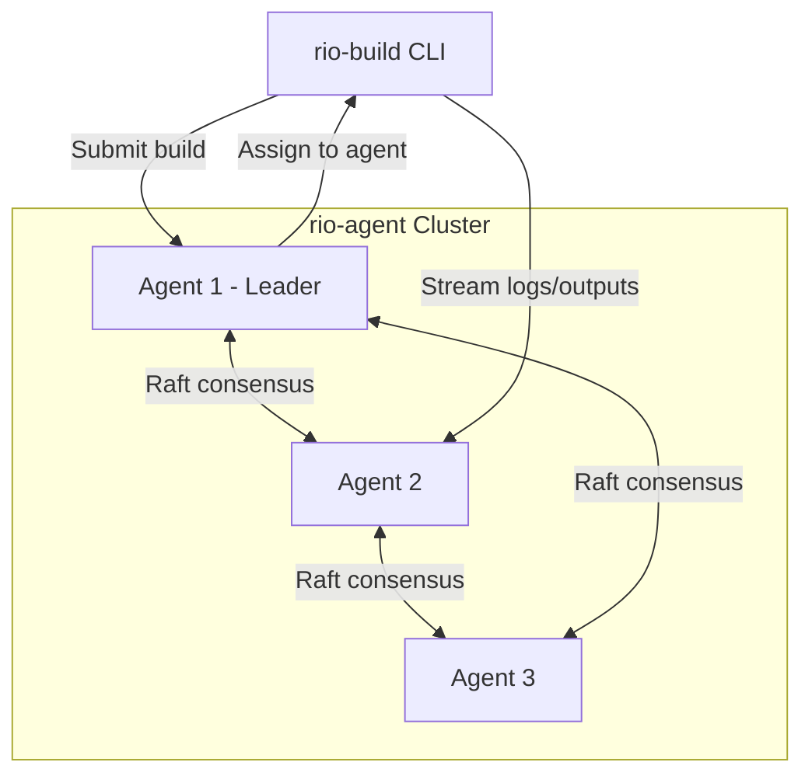

# Rio

**Distributed builds for Nix**

Rio is a distributed build service for Nix that uses Raft consensus to coordinate a cluster of build agents. Unlike traditional architectures with a central broker, agents coordinate amongst themselves while build data flows directly between your CLI and the assigned agent.

## Overview



**How it works:** Agents use Raft to agree on cluster membership and build assignments. Once a build is assigned, your CLI connects directly to that agent for logs and outputs. Build data never flows through the consensus protocol, avoiding central bottlenecks.

**Key capabilities:**

- Multiple users building the same derivation automatically share a single build
- Builds with shared dependencies are routed to the same agent when possible
- Agents advertise platform support and system features for intelligent assignment
- When an agent fails, affected builds are automatically retried on other agents

## Status

🚧 **Active Development**

Phase 1 (gRPC protocol) is complete with full test coverage. Phase 2 (Raft consensus) is in progress. See [TODO.md](TODO.md) for the roadmap.

## Development

This project uses Nix flakes. Enter the development environment with:

```bash
nix develop
# or with direnv
direnv allow
```

Common commands:

```bash
cargo build                # Build all workspace members
cargo test                 # Run tests
cargo clippy               # Lint
nix fmt                    # Format code
nix flake check            # Full CI checks (clippy + tests + docs + coverage)
```

Project structure:

```
rio/
├── crates/
│   ├── rio-build/     # CLI client
│   ├── rio-agent/     # Build agent
│   └── rio-common/    # Shared protocol definitions
├── DESIGN.md          # Architecture details
└── CLAUDE.md          # Development guide
```

## Planned Usage

```bash
# Start first agent
rio-agent --bootstrap --listen=0.0.0.0:50051

# Join existing cluster
rio-agent --join=https://agent1.example.com:50051 --listen=0.0.0.0:50052

# Configure CLI (one-time)
rio-build config set agents https://agent1.example.com:50051

# Submit a build
rio-build ./my-package.nix
```

## Documentation

- [DESIGN.md](DESIGN.md) - Comprehensive architecture and design decisions
- [CLAUDE.md](CLAUDE.md) - Development setup and contributor guide
- [TODO.md](TODO.md) - Implementation roadmap

## Technology

- Rust (edition 2024), Tokio async runtime
- tonic for gRPC, openraft for consensus, RocksDB for persistence
- `nix-eval-jobs` for parallel evaluation, `nix-store` for artifact transfer

## Contributing

Contributions welcome. Before committing, run `nix fmt && nix flake check`. See [CLAUDE.md](CLAUDE.md) for guidelines.

## License

BSD 3-Clause License. See [LICENSE](LICENSE) for details.
