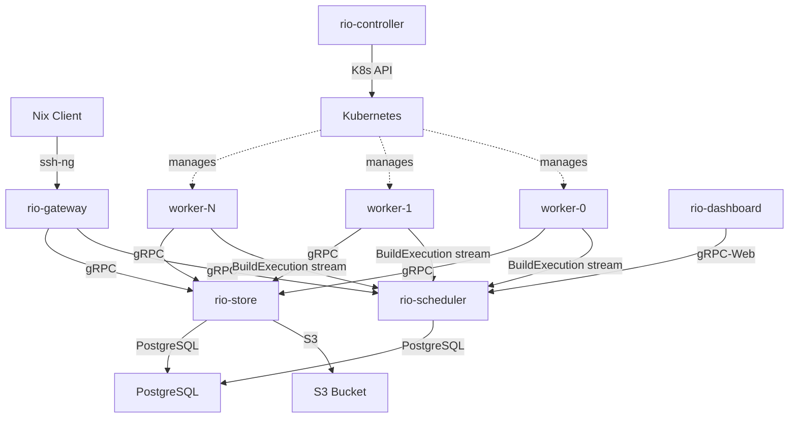

# System Architecture

## Overview

```
┌──────────────────────────────────────────────────────────────────────┐
│                        Nix Clients                                   │
│                                                                      │
│  Path A (remote store):                                              │
│    nix build --store ssh-ng://rio .#package                          │
│                                                                      │
│  Path B (remote builder / build hook):                               │
│    nix.buildMachines = [{ hostName="rio"; protocol="ssh-ng"; ... }]  │
│    nix build .#package  (daemon delegates via build hook)             │
└─────────────┬──────────────────────────────────┬─────────────────────┘
              │ ssh-ng (worker protocol)         │ ssh-ng (worker protocol)
              ▼                                  ▼
┌──────────────────────────────────────────────────────────────────────┐
│                  rio-gateway (multiple replicas)                      │
│                                                                      │
│  SSH server (russh) -> Nix worker protocol handler                   │
│  Handles: handshake, wopSetOptions, wopBuildDerivation,              │
│           wopQueryPathInfo, wopAddToStoreNar, wopNarFromPath, etc.   │
│  Translates protocol ops -> internal gRPC calls                      │
│  Auth: SSH key-based, maps to tenants                                │
│  Multiplexes concurrent SSH sessions (no persistent state;           │
│  per-connection ephemeral state only)                                │
└──────────┬──────────────────────┬────────────────────────────────────┘
           │ gRPC                 │ gRPC
           ▼                     ▼
┌────────────────────┐  ┌─────────────────────────────────────────────┐
│   rio-scheduler    │  │              rio-store                      │
│   (leader-elected) │  │                                             │
│                    │  │  Chunked CAS (FastCDC + BLAKE3)             │
│  Global build DAG  │  │  ┌─────────────────────────────────┐       │
│  Critical-path     │◄►│  │ Metadata (PostgreSQL)            │       │
│  scheduling        │  │  │ narinfo, references, manifests   │       │
│  Transfer-cost     │  │  │ CA content index (SHA-256)       │       │
│  locality scoring  │  │  └─────────────────────────────────┘       │
│  Streaming worker  │  │  ┌─────────────────────────────────┐       │
│  assignment        │  │  │ Blobs (S3-compatible)            │       │
│  State: PostgreSQL │  │  │ Deduplicated chunks (BLAKE3)     │       │
│                    │  │  │ Inline blobs for NARs < 256 KiB  │       │
└────────┬───────────┘  │  └─────────────────────────────────┘       │
         │              │  Binary cache HTTP server (substituter)    │
         │ gRPC         └──────────────┬──────────────────────────────┘
         │  (workers stream            │ gRPC + HTTP (binary cache)
         │   work via BuildExecution)  │
         ▼                             ▼
┌──────────────────────────────────────────────────────────────────────┐
│                     Worker Pods (K8s, CAP_SYS_ADMIN)                 │
│                                                                      │
│  ┌────────────┐  ┌────────────┐  ┌────────────┐  ┌────────────┐    │
│  │  worker-0  │  │  worker-1  │  │  worker-2  │  │  worker-N  │    │
│  │            │  │            │  │            │  │            │    │
│  │ FUSE mount │  │ FUSE mount │  │ FUSE mount │  │ FUSE mount │    │
│  │ /nix/store │  │ /nix/store │  │ /nix/store │  │ /nix/store │    │
│  │ (fuse mod) │  │ (fuse mod) │  │ (fuse mod) │  │ (fuse mod) │    │
│  │ + local    │  │ + local    │  │ + local    │  │ + local    │    │
│  │   SSD cache│  │   SSD cache│  │   SSD cache│  │   SSD cache│    │
│  │            │  │            │  │            │  │            │    │
│  │ per-build  │  │ per-build  │  │ per-build  │  │ per-build  │    │
│  │ overlayfs │  │ overlayfs │  │ overlayfs │  │ overlayfs │    │
│  │ + synth    │  │ + synth    │  │ + synth    │  │ + synth    │    │
│  │ SQLite DB  │  │ SQLite DB  │  │ SQLite DB  │  │ SQLite DB  │    │
│  │            │  │            │  │            │  │            │    │
│  │ nix sandbox│  │ nix sandbox│  │ nix sandbox│  │ nix sandbox│    │
│  └────────────┘  └────────────┘  └────────────┘  └────────────┘    │
└──────────────────────────────────────────────────────────────────────┘

┌──────────────────────────────────────────────────────────────────────┐
│                   rio-controller (K8s Operator)                       │
│                                                                      │
│  Manages: WorkerPool scaling, Build lifecycle, GC                    │
│  CRDs: WorkerPool, WorkerPoolSet                                     │
│  Watches: K8s API -> reconciles StatefulSets, Services               │
│  Single-replica by design (not leader-elected)                       │
└──────────────────────────────────────────────────────────────────────┘
```

The controller is a supervisor that manages the lifecycle of all other components via the Kubernetes API. It does not receive direct traffic from workers or other components --- it watches CRDs and reconciles desired state.

### Component Links

- **[rio-gateway](./components/gateway.md)** --- SSH server, Nix protocol frontend
- **[rio-scheduler](./components/scheduler.md)** --- DAG-aware build scheduler
- **[rio-store](./components/store.md)** --- Chunked CAS, binary cache server
- **[rio-worker](./components/worker.md)** --- Build executor with FUSE store
- **[rio-controller](./components/controller.md)** --- Kubernetes operator
- **[rio-proto](./components/proto.md)** --- gRPC service definitions
- **rio-nix** --- Nix protocol implementation library (wire primitives, ATerm, NAR, store paths)
- **rio-common** --- shared utilities (limits, bloom filter, observability init)
- **[rio-dashboard](./components/dashboard.md)** --- Web dashboard (Phase 5)


