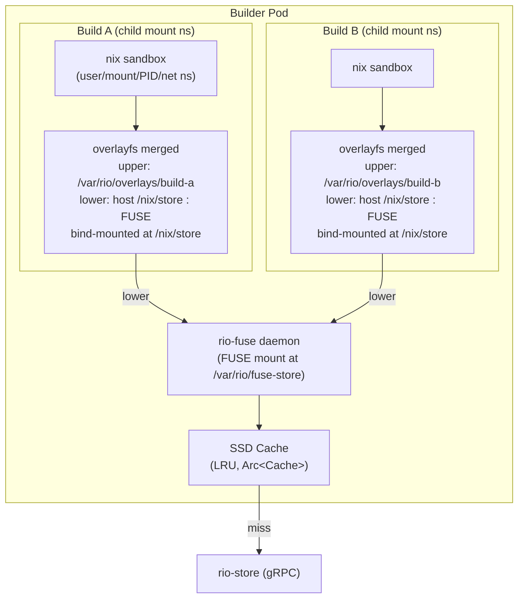

# rio-builder

Long-running process in a StatefulSet pod that executes individual derivations.

Per [ADR-019](../decisions/019-builder-fetcher-split.md), this component is scoped to **non-FOD builds only** — fully airgapped, no internet egress. Fixed-output derivation fetches route to the separate [rio-fetcher](fetcher.md) executor. Both share the same `rio-builder` binary, distinguished by `RIO_EXECUTOR_KIND`.

> **Formerly `rio-worker`.** Renamed in ADR-019 alongside the builder/fetcher split. Tracey markers moved from `r[worker.*]` to `r[builder.*]`.

## Responsibilities

- Receive build assignments from scheduler via gRPC
- Run the FUSE store daemon (`rio-fuse`) that mounts at `/var/rio/fuse-store` (configurable) with lazy on-demand fetching from rio-store
- Manage per-build overlay filesystem: FUSE mount as lower layer, local SSD as upper layer; the overlay's merged dir is bind-mounted at `/nix/store` inside the build's mount namespace
- Execute build: invoke `nix-daemon --stdio` locally for sandboxed build execution
- Stream build logs back to scheduler via gRPC bidirectional streaming
- After build: upload output NAR to rio-store (chunked), report completion
- Heartbeat / health checking to scheduler
- Resource usage reporting (CPU, memory, disk, build duration)

## FUSE Store (`rio-fuse`)

Each builder runs a FUSE filesystem that presents store paths to the build environment. The FUSE daemon mounts at `/var/rio/fuse-store` (configurable --- **never** directly at `/nix/store`, which would shadow the host store and break every process on the machine including the builder itself). The per-build overlay's merged directory is what gets bind-mounted at `/nix/store`, and only inside the build's mount namespace. The FUSE daemon communicates with rio-store via gRPC to lazily fetch store path content on demand.

```
                         Builder Pod
┌──────────────────────────────────────────────────────────┐
│                                                          │
│  rio-fuse (FUSE daemon)                                  │
│  ├── Mounts /var/rio/fuse-store                          │
│  ├── On file access: fetches from rio-store via gRPC     │
│  ├── Local SSD cache (LRU eviction)                      │
│  ├── Immutable content → no cache invalidation needed    │
│  └── Accepts prefetch hints from scheduler               │
│                                                          │
│  ┌──────────────────┐  ┌──────────────────┐             │
│  │    Build A        │  │    Build B        │             │
│  │  overlayfs        │  │  overlayfs        │             │
│  │  ┌──────────────┐ │  │  ┌──────────────┐ │             │
│  │  │ Upper (SSD)  │ │  │  │ Upper (SSD)  │ │             │
│  │  │ - outputs    │ │  │  │ - outputs    │ │             │
│  │  │ - db.sqlite  │ │  │  │ - db.sqlite  │ │             │
│  │  ├──────────────┤ │  │  ├──────────────┤ │             │
│  │  │ Lower        │ │  │  │ Lower        │ │             │
│  │  │ (FUSE mount) │ │  │  │ (FUSE mount) │ │             │
│  │  └──────────────┘ │  │  └──────────────┘ │             │
│  │  nix sandbox      │  │  nix sandbox      │             │
│  └──────────────────┘  └──────────────────┘             │
└──────────────────────────────────────────────────────────┘
```

### Why FUSE Instead of a Shared PV

- **Overlay-over-NFS is unsupported**: The Linux kernel does not guarantee overlayfs correctness over NFS/EFS. FUSE mounts appear as local filesystems and work correctly with overlayfs.
- **No shared infrastructure**: Each builder manages its own cache independently. No RWX PersistentVolume, no NFS/EFS/CephFS provisioning, no StoreSync reconciler.
- **Lazy loading**: Only paths actually accessed during a build are fetched. A nixpkgs closure is tens of GB, but a typical build accesses a small fraction.
- **Perfect caching**: Store paths are immutable and content-addressed. Once cached, data never needs invalidation or re-fetching. The SSD cache is purely additive with LRU eviction under disk pressure.
- **Predictive prefetch**: The scheduler sends prefetch hints via the build execution stream before assigning work. The FUSE daemon warms its cache with the build's input closure paths before the build starts.

### FUSE Cache

r[builder.fuse.cache-lru]
- **Backend**: Local SSD (`emptyDir` or a dedicated PVC)
- **Eviction**: LRU by last-access time when cache exceeds configured size limit
- **Granularity**: Whole store paths (not individual chunks). The FUSE daemon reassembles NARs from chunks via rio-store and materializes them as directory trees on disk.
- **Metadata**: A lightweight SQLite index tracks cached paths, sizes, and access timestamps for eviction decisions
- **Cache warming**: On startup, the cache is cold. The first build on a new builder fetches all inputs from rio-store. Subsequent builds benefit from cached common paths (glibc, coreutils, etc.)

r[builder.nar.entry-name-safety]
NAR directory entry names MUST be rejected at parse time if empty,
equal to `.` or `..`, or containing `/` or NUL. This matches the Nix
C++ reference (`archive.cc` `parseDump`). The rejection happens in
`rio_nix::nar::parse_directory` before any filesystem call —
`extract_to_path` never sees a dangerous name. Rationale:
`Path::join("..")` traverses upward; `Path::join("/abs")` discards the
base. A crafted NAR from a compromised store could otherwise write
arbitrary files on builder nodes via the FUSE fetch path.

### FUSE Implementation

r[builder.fuse.lookup-caches]
The FUSE daemon is implemented using the `fuser` crate and runs as part of the builder process (not a sidecar). It handles:

- `lookup`: **Top-level lookups** (direct children of the FUSE root, i.e., store basenames like `abc...-hello`) **MUST call `ensure_cached()`** to materialize the whole store-path tree on disk before returning. The kernel caches the lookup attr with 1h TTL and never calls `getattr`, so child lookups (`lookup(busybox_ino, "bin")`) would hit an empty cache → ENOENT otherwise. **Child lookups** (inside an already-materialized tree) hit local disk directly with `symlink_metadata` --- no gRPC.
- `getattr`: Return file metadata from cached path info
- `read`/`readlink`/`readdir`: Serve content from local SSD cache, fetching from rio-store on cache miss

r[builder.fuse.circuit-breaker+2]
The FUSE fetch path has a circuit breaker. Two trip conditions (EITHER
opens the circuit): (a) `threshold` (default 5) consecutive
`ensure_cached` failures; (b) `last_success.elapsed() > wall_clock_trip`
(default 90s) AND at least one failure since the last success — catches
the degraded-but-alive store (accepting connections, serving slowly)
without waiting for 5×fetch-timeout. The failure-gate on (b) is
critical: an idle build (no store traffic for >90s, e.g., a long sleep)
has a stale `last_success` but a healthy store — without the gate, the
first post-idle fetch trips → EIO on upload → InfrastructureFailure →
reassign loop. After `auto_close_after` (default 30s) the circuit goes
half-open: the next `check()` probes — success closes the circuit,
failure re-opens it. The fetch timeout is `fuse_fetch_timeout_secs`
(default 180) from `worker.toml` — NOT the global `GRPC_STREAM_TIMEOUT`.
**CRITICAL: std::sync ONLY** — FUSE callbacks run on fuser's thread
pool, NOT in a tokio context. `AtomicU32` + `parking_lot::Mutex`; zero
`tokio::sync`, zero `.await`.

r[builder.heartbeat.store-degraded]
`HeartbeatRequest.store_degraded` (proto bool, field 9) reflects
`CircuitBreaker::is_open()`. Scheduler treats it like `draining`:
`has_capacity()` returns false, builder is excluded from assignment.
Wire-compatible: old workers don't send it, scheduler reads default
`false`. Cleared when the breaker closes or half-opens.
- `open`: Open the already-materialized local file (fast path, since `lookup` fetched the tree). Falls back to `ensure_cached()` on ENOENT. With passthrough enabled, hands the kernel a backing fd via `open_backing()` so subsequent `read()` calls bypass userspace. **Prefetch is separate** --- it's scheduler-driven via `PrefetchHint` messages on the assignment stream, not triggered by `open()`.

### FUSE Design Notes

The FUSE daemon is split across submodules: `fuse/mod.rs` (daemon lifecycle, mount management, `NixStoreFs` struct), `fuse/ops.rs` (the `Filesystem` trait impl --- all kernel callbacks: `lookup`, `getattr`, `open`, `read`, `readlink`, `readdir`, `forget`), `fuse/inode.rs` (bidirectional inode↔path map with kernel `nlookup` refcounting), `fuse/lookup.rs` (attribute helpers: `stat_to_attr`, `ATTR_TTL`), `fuse/read.rs` (file-range read helper + errno translation), `fuse/cache.rs` (LRU cache management, SQLite-backed), and `fuse/fetch.rs` (`ensure_cached`: NAR fetch + extract from rio-store). The FUSE daemon handles concurrent access from multiple overlays via `Arc<Cache>` with a read-mostly access pattern --- store paths are immutable, so concurrent reads require no synchronization beyond the cache index.

**`fuser` 0.17 API (validated in Phase 1a spike):**

The `fuser` 0.17 crate includes breaking API changes from 0.14/0.15 that affect the FUSE daemon implementation:
- `Filesystem` trait data-path methods (e.g., `lookup`, `read`, `open`, `readdir`) changed from `&mut self` to `&self`, requiring interior mutability patterns (`RwLock`, `Atomic*`) for all mutable state. Lifecycle methods (`init`, `destroy`) retain `&mut self`.
- Raw integer parameters replaced by newtypes: `INodeNo(u64)`, `FileHandle(u64)`, `Generation(u64)`, `LockOwner(u64)`, `Errno`, `FopenFlags`, `OpenFlags`, `AccessFlags`.
- Mount configuration uses a `Config` struct with `mount_options: Vec<MountOption>`, `acl: SessionACL` (replaces `MountOption::AllowOther` with `SessionACL::All`), `n_threads`, and `clone_fd`.
- Passthrough API: `KernelConfig::set_max_stack_depth(1)` in `init()`, `ReplyOpen::open_backing(impl AsFd) -> Result<BackingId>`, `ReplyOpen::opened_passthrough(FileHandle, FopenFlags, &BackingId)`. `BackingId` must be kept alive (via a map keyed by file handle) until `release()`.

**Fallback architecture:** If the FUSE+overlay spike (Phase 1a) fails, the fallback is a bind-mount approach with `nix-store --realise` pre-materialization. All input store paths are fully materialized on the builder's local disk before the build starts and bind-mounted into the sandbox. This trades lazy loading for simplicity and eliminates the FUSE dependency, at the cost of higher pre-build latency (full closure materialization instead of on-demand fetching). **Phase 1a result: GO --- the FUSE+overlay approach works; fallback not activated.**



## Builder Nix Configuration

Builder pods ship a minimal `nix.conf` with an optional operator override from the `rio-nix-conf` ConfigMap, mounted **as a directory** at `/etc/rio/nix-conf/` (not via `subPath` --- an optional ConfigMap with `subPath` produces an empty directory rather than a clean ENOENT, which caused `substitute=true` to silently re-enable and hang on DNS). `setup_nix_conf` checks `/etc/rio/nix-conf/nix.conf` first; if present, it's copied into the overlay. Otherwise the compiled-in default is used:

```ini
# Prevent build hook recursion --- workers ARE the builders
builders =
# All substitution handled by rio-store; don't try external substituters
substitute = false
# Enable sandbox for build purity
sandbox = true
# Hard-fail if sandbox setup fails (never fall back to unsandboxed builds)
sandbox-fallback = false
# Prevent derivations from accessing paths outside the Nix store during eval
restrict-eval = true
# Content-addressed derivation support (Phase 2c+)
experimental-features = ca-derivations
```

> **Security note**: `__noChroot` derivations (which disable the sandbox) are rejected at the gateway level before they ever reach a builder. See [Derivation Validation](../security.md#derivation-validation).

This configuration ensures workers only build derivations locally and never attempt to delegate or substitute externally.

### Builder Capabilities

Each builder advertises two capability lists in its heartbeat so the scheduler can route derivations:

- **`systems`** (`Vec<String>`): Nix system identifiers this builder can build for (e.g., `x86_64-linux`, `aarch64-linux`). The scheduler's `can_build()` does an **any-match** against the derivation's `system` field. If unset, the builder auto-detects a single element as `{arch}-{os}` via `std::env::consts`. Multi-element configurations are for qemu-user-static or cross-arch builders. Configure via `RIO_SYSTEMS=x86_64-linux,aarch64-linux` (comma-separated env), `systems = ["x86_64-linux"]` (TOML array), or repeated `--system` CLI flags.
- **`features`** (`Vec<String>`): `requiredSystemFeatures` this builder supports (e.g., `kvm`, `big-parallel`). The scheduler's `can_build()` does an **all-match** --- every feature the derivation requires must be present here. Empty by default. Configure via `RIO_FEATURES`, `features` in TOML, or repeated `--feature` flags.

> **Recursive Nix is not supported.** Derivations that invoke Nix internally (`__recursive` / `recursive-nix` experimental feature) will fail because `substitute = false` and `builders =` prevent the inner Nix from fetching dependencies or delegating builds, and `recursive-nix` is not in `experimental-features`. This is an explicit non-goal for the initial release. Supporting recursive Nix would require the builder to act as both a builder and a store client for the inner Nix instance, significantly complicating the builder architecture.

## rio-nix Client Protocol

r[builder.daemon.stdio-client]
Workers invoke `nix-daemon --stdio` and must speak the Nix worker protocol as a *client*. The `rio-nix` crate implements both server-side (gateway: responds to opcodes from Nix clients) and client-side (worker: sends `wopBuildDerivation` to the local daemon and receives `BuildResult`) protocol handling.

r[builder.daemon.no-unwrap-stdio]
When spawning `nix-daemon --stdio`, never `.unwrap()` on `daemon.stdin.take()` / `daemon.stdout.take()` --- use `.ok_or_else()`.

r[builder.daemon.timeout-wrap]
Wrap all daemon communication in `tokio::time::timeout` (default: 2h, configurable via `RIO_DAEMON_TIMEOUT_SECS` / `--daemon-timeout-secs` / `worker.toml`).

r[builder.daemon.kill-both-paths]
Always `daemon.kill().await` in both success and error paths, and set `kill_on_drop` on the Command to guard against early-exit leaks.

r[builder.silence.timeout-kill]
`maxSilentTime` (seconds, forwarded from client `--option
max-silent-time`) is enforced rio-side in the stderr read loop: on
each `STDERR_NEXT` and `STDERR_RESULT BuildLogLine` (types 101/107 —
the output-producing messages), reset `last_output`; a `select!` arm
fires at `last_output + max_silent_time` → `BuildResult { status:
TimedOut, error_msg: "no output for Ns (maxSilentTime)" }` → caller's
unconditional `cgroup.kill()`. Activity/Progress chatter does NOT
reset the timer — a build spinning progress updates with no stderr
output is still "silent". The local nix-daemon MAY also enforce it
(forwarded via `client_set_options`) — rio-side is the authoritative
backstop ensuring the correct `TimedOut` status regardless.

r[builder.daemon.stderr-result-logs]
Modern `nix-daemon` sends build output via `STDERR_RESULT` with `BuildLogLine`, NOT raw `STDERR_NEXT`. The builder's stderr loop MUST handle `STDERR_RESULT` --- otherwise all build logs are silently dropped.

## Overlay Store Architecture

r[builder.overlay.per-build]
Each active build gets its own overlayfs mount with a separate upper directory and work directory. A synthetic Nix store SQLite database is placed in each overlay's upper layer so that Nix recognizes the input paths.

r[builder.overlay.stacked-lower]
The overlay lower-dir stack is `lowerdir=/nix/store:{fuse_mount}` --- host store **first** so `nix-daemon` and its deps are reachable after bind-mount at `/nix/store`. FUSE second for rio-store paths. With `writableStore=false` on the builder VM, `/nix/store` is a plain mount; otherwise the VM's store would itself be an overlay and overlay-as-lower may break.

r[builder.overlay.upper-not-overlayfs]
> **Filesystem constraint (validated in Phase 1a spike):** The overlayfs upper and work directories must reside on a different filesystem than the FUSE lower layer. The kernel rejects overlay mounts where upper and lower are on the same filesystem when the lower is a FUSE mount. In practice, the upper/work directories should be on the builder's local SSD (`emptyDir` or PVC), while the lower is the FUSE mount at `/var/rio/fuse-store`. The upper also MUST NOT itself be on an overlayfs (containerd root overlay) — overlayfs-as-upperdir cannot create `trusted.*` xattrs and `mount()` returns `EINVAL`.

After build completes:

1. Read new paths from upper layer
2. Chunk and upload to rio-store (CAS). Each `PutPath` request carries the scheduler-issued HMAC assignment token in the `x-rio-assignment-token` gRPC metadata header; the store verifies the token and rejects uploads for paths not in `claims.expected_outputs` (see [Security: assignment tokens](../security.md#boundary-2-gatewayworker--internal-services-grpc))
3. Register path metadata (narinfo, references)
4. Discard upper layer

**Teardown failure handling:** Overlay teardown (`umount2`) can fail if the mount is stuck busy (open file handles, zombie `nix-daemon`, FUSE hang). The builder tracks these leaks with a builder-lifetime counter. After `max_leaked_mounts` failures (default 3, configurable), `execute_build` short-circuits at entry with `InfrastructureFailure` so the scheduler reassigns to a healthy builder and the supervisor can restart this one. The check is at build **entry**, not exit --- a build that completes successfully isn't penalized if its own teardown later fails; the *next* build is what gets refused.

### Multi-Output Derivation Upload

r[builder.upload.idempotent-precheck]
Before uploading, the builder batch-checks all scanned outputs via `FindMissingPaths`. Outputs already present in the store (`'complete'` manifest exists) are skipped --- `QueryPathInfo` fetches the existing `nar_hash`/`nar_size` instead of re-reading disk + re-streaming the NAR. The skip is **best-effort**: if `FindMissingPaths` errors (store transient), all outputs fall back to the upload path and `r[store.put.idempotent]` catches duplicates server-side. The skip saves the pre-scan disk read, the NAR-stream disk read, and the gRPC stream setup --- NOT a correctness requirement. Emits `rio_worker_upload_skipped_idempotent_total` per skipped output.

r[builder.upload.multi-output]
Derivations may produce multiple outputs (e.g., `out`, `dev`, `lib`). After a build completes:

1. **Detect outputs**: Scan the overlay upper layer for all new store paths. A multi-output derivation produces one path per output (e.g., `/nix/store/abc...-hello`, `/nix/store/def...-hello-dev`).
2. **NAR each output**: Serialize each output path independently into a NAR archive.
3. **Chunk**: Split each NAR into content-addressed chunks (matching rio-store's chunk size).
4. **Upload**: Upload chunks to rio-store in parallel across outputs. Deduplicate against existing chunks (CAS).
5. **Register**: Register each output path's NAR hash, NAR size, references, and deriver with rio-store. Signatures are sent empty --- output signing is done store-side (see [store signing](store.md#signing)).

r[builder.upload.references-scanned]
Before the retry loop, `upload_output` performs a **pre-scan pass**: a single extra disk read through `RefScanSink` only (no hash, no network). The NAR is dumped via `dump_path_streaming` into the scanner, which finds every candidate hash part embedded anywhere in the stream (including inside binaries, RPATH strings, symlink targets, directory names). The candidate set is the **transitive input closure** ∪ `drv.outputs()`: every path reachable via BFS over store references from the derivation's inputs, plus all of this derivation's own outputs (for self-references and cross-output references). This matches Nix's `computeFSClosure` (`derivation-building-goal.cc:444,450` / `derivation-builder.cc:1335-1344`). A build can legitimately embed any transitively-reachable path --- e.g. `hello-2.12.2` references `glibc`, which is not a direct input but arrives via `closure(stdenv)`. The resolved reference list is **sorted** (affects the narinfo signature fingerprint --- must be deterministic).

r[builder.upload.deriver-populated]
`PathInfo.deriver` is set to the `.drv` store path of the derivation that produced this output. The deriver is the same for all outputs of a multi-output derivation.

> **Pre-scan cost:** the scan is a separate disk read before the first upload attempt. Retries do NOT re-scan (the scan result is deterministic). The Boyer-Moore skip-scan over the restricted nixbase32 alphabet does ~memcpy speed on binary sections (skips ~31/32 bytes); a 4 GiB output adds ~4s wall time on NVMe. If this becomes measurable, the escape hatch is a trailer-refs protocol extension (send refs in `PutPathTrailer` instead of the first `PathInfo` message) --- deferred to a later phase.

For **multi-output derivations (≥2 outputs)**, the builder uses `PutPathBatch`: all outputs stream serially on one RPC, the store commits them in ONE database transaction. If any output fails validation, zero outputs are registered --- atomic per `r[store.atomic.multi-output]`. The v1 batch handler is inline-only; if any output is ≥ `INLINE_THRESHOLD` (256 KiB NAR) it returns `FailedPrecondition` and the builder falls back to independent `PutPath` calls (pre-P0267 behavior: `buffer_unordered(MAX_PARALLEL_UPLOADS)`, no cross-output atomicity).

For **single-output derivations**, the builder uses independent `PutPath` directly (atomicity is vacuous for one output).

**Upload failure handling:** If the upload to rio-store fails (S3 unavailable, network timeout), the builder retries the upload with exponential backoff (up to 3 attempts). If all upload retries are exhausted, the builder reports an `InfrastructureFailure` to the scheduler. The scheduler may reassign the derivation to a different builder, which must rebuild from scratch --- there is no mechanism to transfer the completed output from the original builder's local overlay. This is a known limitation; the completed output on the original builder is lost when the overlay is discarded.

## Store Database Management

r[builder.synth-db.per-build]
Nix requires a functional store database (SQLite at `/nix/var/nix/db/db.sqlite`) to operate. It refuses to build derivations whose inputs are not registered in the local database, even if the paths physically exist on disk.

For each build, the builder synthesizes a minimal SQLite database in the overlay upper layer:

1. Query rio-store's PostgreSQL for path metadata of the build's input closure (deriver, NAR hash, NAR size, references, sigs, ca).
2. Generate the database via direct SQLite writes into the overlay's upper layer at `var/nix/db/db.sqlite`. Use a single transaction with `PRAGMA journal_mode=WAL` and `PRAGMA synchronous=OFF` for maximum speed (the DB is ephemeral).
3. The database must include the `ValidPaths`, `Refs`, and `DerivationOutputs` tables with proper indexes (`IndexValidPathsPath`, `IndexValidPathsHash`). The `SchemaVersion` in the `Config` table must match the Nix version running in the builder (target: Nix 2.20+ schema).
4. The database contains only path registrations for that specific build's input closure --- not the entire store.
5. After the build completes, the synthetic database is discarded along with the rest of the overlay upper layer.

r[builder.synth-db.derivation-outputs]
The `DerivationOutputs` table MUST be populated --- `nix-daemon`'s `queryPartialDerivationOutputMap()` reads it. Empty → `scratchPath = makeFallbackPath(drvPath)` → `OutputRejected`.

r[builder.executor.resolve-input-drvs]
The executor must merge resolved inputDrv outputs into `BasicDerivation`
inputSrcs before constructing the derivation. The sandbox only bind-mounts
inputSrcs; unresolved inputDrv paths would be invisible.

r[builder.executor.kind-gate]
Per [ADR-019](../decisions/019-builder-fetcher-split.md), the executor re-derives `is_fod` from the `.drv` (ground truth, not the scheduler-sent flag) and checks it against `config.executor_kind` BEFORE overlay setup or daemon spawn. If `is_fod != (executor_kind == Fetcher)`, the build fails with `ExecutorError::WrongKind`. Defense-in-depth --- the scheduler's `hard_filter` should never misroute, but a bug or stale-generation race must not grant a builder internet access even transiently.

r[builder.synth-db.refs-table]
> **Critical (validated in Phase 1a spike):** The `Refs` table must accurately reflect each path's references. When `sandbox = true`, Nix resolves the derivation's input closure by walking the `Refs` table to determine which store paths to bind-mount into the sandbox chroot. If references are missing, the sandbox will not bind-mount transitive dependencies (e.g., `glibc` needed by `bash`), causing builds to fail with "No such file or directory" errors when the builder's dynamic linker cannot be found.

Performance: direct SQLite writes handle 1000+ paths in <50ms. The bottleneck is the PostgreSQL metadata query, not the SQLite generation.

### Synthetic DB Risks

- **Schema version coupling**: Nix store DB schema (currently version 10) is an internal API with no stability guarantees. Pin to a specific Nix version and test schema compatibility on upgrade.
- **`Realisations` table**: Required for Phase 5 CA support. Add the table structure proactively but leave empty until CA early cutoff is activated.
- **`registrationTime`**: Set to 0 for input paths (not locally built). Only outputs built on this builder get a real timestamp.
- **`ultimate`**: Always 0 for input paths (they were not built on this builder). Set to 1 only for locally built outputs.
- **Journal mode**: Create with `journal_mode=WAL` (matching Nix's expectation) instead of `journal_mode=OFF`. While the DB is ephemeral, Nix may check the journal mode on open.

## Concurrent Build Isolation

r[builder.cgroup.sibling-layout]
Per-build cgroups are **siblings** of the builder's own cgroup under the delegated root. With systemd `DelegateSubgroup=builds`, the builder lives at `.../service/builds/`; per-build cgroups go in `.../service/` as siblings. When running in a cgroup-namespace root (containerd in pods: `/proc/self/cgroup` shows `0::/`), the builder MUST move itself into a `/leaf/` subgroup first so the namespace root becomes the delegated_root --- otherwise writing to `/sys/fs/cgroup/` would hit the HOST root.

r[builder.cgroup.ns-root-remount]
When running in a cgroup-namespace root (`/proc/self/cgroup` shows `0::/`) under a non-privileged security context, the builder MUST remount `/sys/fs/cgroup` read-write before creating the `/leaf/` subgroup. Containerd mounts `/sys/fs/cgroup` read-only for non-privileged pods even with `CAP_SYS_ADMIN`; the `MS_REMOUNT | MS_BIND` call clears the per-mount-point RO flag (preserving superblock `nosuid`/`nodev`/`noexec`). Under `privileged: true` containerd mounts rw already and the remount is a no-op --- this path is load-bearing only in the production `privileged: false` + device-plugin configuration (ADR-012).

r[builder.cgroup.memory-peak]
cgroup v2 `memory.peak` + polled `cpu.stat` provide **tree-wide** resource accounting for each build. This fixes the Phase 2c bug where `VmHWM` (daemon PID only) measured ~10MB regardless of what the builder consumed.

r[builder.cgroup.kill-on-teardown]
On any error exit after the build cgroup is populated, the executor MUST write `cgroup.kill` and poll `cgroup.procs` until empty (bounded) before dropping the cgroup handle. `daemon.kill()` alone only signals the daemon PID; forked builders reparent to init.

r[builder.cgroup.per-build-limits]
Per-build cgroups enforce `memory.max` and `cpu.max` limits when configured. The executor writes these interface files after `BuildCgroup::create` and before `add_process`, so the daemon and every forked builder are constrained from the first allocation. When a build's memory exceeds `memory.max`, the kernel's cgroup OOM killer fires **inside the build's subtree** --- the runaway build dies with `SIGKILL`, concurrent builds and the builder process survive, and the executor reports `BuildFailure` (the daemon exit code reflects the OOM). Without limits (`build_memory_max_bytes` unset), a single runaway build can OOM the entire builder pod and take all concurrent builds with it.

### Build Resource Limits

| Config | Env | cgroup file | Default | Notes |
|---|---|---|---|---|
| `build_memory_max_bytes` | `RIO_BUILD_MEMORY_MAX_BYTES` | `memory.max` | unset (unbounded) | Bytes. Operators SHOULD set to ~80% of the pod memory limit. |
| `build_cpu_max_quota_us` | `RIO_BUILD_CPU_MAX_QUOTA_US` | `cpu.max` | unset (unbounded) | µs per 100ms period. `200000` = 2.0 cores. Usually left unset --- CPU contention degrades gracefully. |

The 80% memory recommendation leaves headroom for the builder process itself (FUSE cache, gRPC buffers, log batching). There is **no in-process auto-detect** from the pod's `/sys/fs/cgroup/memory.max`: applying the full pod limit per-build would still let N concurrent builds sum to N× the pod limit. The NixOS module and Helm chart derive the per-build limit from `resources.limits.memory` / `maxConcurrentBuilds`.

When both fields are unset, `BuildCgroup::apply_limits` is a no-op and the cgroup stays measurement-only (the pre-limits behavior). The builder logs a `WARN` at startup in this case.

The overlay is per-build, not per-builder. Each active build on a builder gets its own independent overlayfs mount with separate upper and work directories. This means:

- Multiple builds run concurrently on the same builder without filesystem interference.
- Maximum concurrent builds per builder is configured via the `BuilderPool` CRD (`maxConcurrentBuilds` field).
- The Nix sandbox provides additional process-level isolation (user, mount, PID, and network namespaces) between concurrent builds on the same builder.
- Each build's upper layer is independent, so output paths from one build never leak into another.
- Even if the Nix sandbox is compromised, the per-build overlay upper layer ensures rogue writes are isolated and discarded.

## Fixed-Output Derivation (FOD) Handling

> **Per [ADR-019](../decisions/019-builder-fetcher-split.md), FODs route to the [rio-fetcher](fetcher.md) executor, not builders.** Builders are airgapped (`r[builder.netpol.airgap]`) and reject any FOD assignment with `ExecutorError::WrongKind` (`r[builder.executor.kind-gate]`). The section below documents the FOD verification logic that the `rio-builder` binary runs when invoked as a fetcher (`RIO_EXECUTOR_KIND=fetcher`).

r[builder.fod.verify-hash]
Fixed-output derivations (FODs) have a known output hash declared in `outputHash`. They require special handling:

1. **Detection**: A derivation is a FOD if its `outputHash` attribute is non-empty.
2. **Network access**: Unlike regular derivations, FODs are allowed network access inside the sandbox. This is handled by `nix-daemon` internally — when it sees `outputHash` set on a derivation via `wopBuildDerivation`, it automatically relaxes network namespace isolation for that build. `sandbox = true` in `nix.conf` is sufficient (Nix's sandbox is FOD-aware). Network egress is governed at the pod level by the fetcher NetworkPolicy (`r[fetcher.netpol.egress-open]`).
3. **Output verification**: After the build completes, the executor computes the hash of the output and verifies it matches the declared `outputHash`. A mismatch is a build failure.
4. **Caching**: FODs are cached by their output hash, not their derivation hash. Two FODs with different `src` attributes but the same `outputHash` share the same cached output.

## Namespace Ordering

r[builder.ns.order]
Both overlayfs and the Nix sandbox use mount namespaces. The correct ordering is:

1. Builder sets up the FUSE mount at `/var/rio/fuse-store` and creates the per-build overlayfs (stacked lower: host `/nix/store` then FUSE; upper: SSD) --- both in the builder's mount namespace
2. Builder forks `nix-daemon --stdio` in a fresh child mount namespace (`unshare(CLONE_NEWNS)`)
3. Inside the child's mount namespace only, the overlay's merged dir is bind-mounted at `/nix/store` --- the builder's own view of `/nix/store` is untouched
4. Nix sandbox does another `unshare(CLONE_NEWNS)` for the build itself
5. Inside the sandbox, Nix bind-mounts specific paths from the overlay into the build chroot
6. Nix calls `pivot_root` to enter the chroot

The builder must NOT drop `CAP_SYS_ADMIN` between overlay setup and Nix invocation, as both operations require it.

## Security Context

Workers require elevated privileges for FUSE mounts, overlayfs mounts, and the Nix sandbox (user/mount/PID/network namespaces).

**Required capabilities:** `CAP_SYS_ADMIN` + `CAP_SYS_CHROOT`. Do NOT use `privileged: true` --- it disables seccomp profiles entirely.

> **Spike finding (Phase 1a):** `CAP_SYS_ADMIN` + `CAP_SYS_CHROOT` without `privileged: true` is not sufficient for `/dev/fuse` access because the container's device cgroup does not include the FUSE character device (major 10, minor 229) by default. Production deployments must use a FUSE device plugin (e.g., [`smarter-device-manager`](https://gitlab.com/arm-research/smarter/smarter-device-manager)) that adds `/dev/fuse` to the device cgroup allowlist, enabling the non-privileged security context described above.

**Seccomp profile:** Builder pods set `seccompProfile: Localhost` pointing at [`seccomp-rio-builder.json`](../../../infra/helm/rio-build/files/seccomp-rio-builder.json) when `privileged != true`. The profile is a default-deny allowlist derived from moby `default.json` v27.5.1 (see `r[builder.seccomp.localhost-profile]`), permitting the namespace/mount syscalls the FUSE mount + overlayfs + nix-daemon sandbox need while blocking `ptrace`, `bpf`, `keyctl`, `kexec_load`, `open_by_handle_at`, `userfaultfd`. When the profile is unset (or `privileged=true`), pods fall back to `RuntimeDefault`.

**Recommended cluster configuration:**
- Dedicated node pool with taint `rio.build/builder=true:NoSchedule` to isolate builder pods from other workloads.
- `automountServiceAccountToken: false` --- builders communicate with the scheduler via gRPC, not the Kubernetes API.
- NetworkPolicy restricting egress to rio-scheduler and rio-store only (gRPC ports). No access to the Kubernetes API server or cloud metadata service (`169.254.169.254`). See `r[builder.netpol.airgap]` in [ADR-019](../decisions/019-builder-fetcher-split.md).
- IMDSv2 with hop limit = 1 on builder nodes (defense-in-depth against metadata access from privileged pods).

## Device Access

Workers require access to `/dev/fuse` for the FUSE filesystem. Mount it as a `hostPath` volume:

```yaml
volumes:
  - name: dev-fuse
    hostPath:
      path: /dev/fuse
      type: CharDevice
containers:
  - name: builder
    volumeMounts:
      - name: dev-fuse
        mountPath: /dev/fuse
```

Without `/dev/fuse`, the FUSE daemon cannot create the store mount and the builder will fail to start.

## FUSE Passthrough Mode (Linux 6.9+)

r[builder.fuse.passthrough]
Linux 6.9 introduced FUSE passthrough mode (`FUSE_PASSTHROUGH`), which allows the FUSE daemon to hand off file descriptors to backing files. For cached store paths on local SSD, passthrough mode bypasses the kernel-userspace context switch entirely, providing near-native I/O performance.

This is relevant to rio-fuse because the warm-cache path (store paths already fetched to local SSD) is the most performance-critical. With passthrough:
- Reads from cached paths go directly to the SSD-backed file via the kernel, no userspace FUSE daemon involvement
- Only cache-miss reads require the full FUSE round-trip to rio-store via gRPC
- The performance concern from [Challenge #13](../challenges.md) ("FUSE overhead must be < 2x direct reads") may be reduced to near-native for warm builds

**Status:** Validated in Phase 1a spike. `fuser` 0.17 supports passthrough natively via `KernelConfig::set_max_stack_depth(1)` + `ReplyOpen::open_backing()` + `opened_passthrough()`.

### Spike Findings

The Phase 1a spike validated passthrough on EKS AL2023 (kernel 6.12). Key findings:

1. **Passthrough works on ext4/xfs-backed files.** `open_backing()` succeeds and the kernel handles `read()` directly without entering userspace.

2. **Passthrough does NOT work on overlay-backed files.** The kernel's `fuse_passthrough_open` checks the backing file's filesystem stack depth and returns `EPERM` if it's on a stacked filesystem (overlayfs, another FUSE mount). This means the backing files must be on a real filesystem (local SSD, emptyDir), not on a container's overlay rootfs. This is consistent with the production design where `rio-fuse` serves from local SSD cache.

3. **Passthrough does not help for open-heavy workloads.** The spike benchmark (open+read+close per file, 74k files) showed identical latency with and without passthrough. The bottleneck is `lookup()` and `open()` calls which still traverse userspace even with passthrough enabled. Passthrough only bypasses `read()`.

4. **Passthrough benefits sustained reads on open file handles.** For production `rio-fuse`, this means the cache should keep file handles open across multiple reads from the same store path. A build that reads a large `.so` or header file repeatedly will benefit; a build that opens thousands of small files once will not.

**Implications for `rio-fuse` design:**
- The FUSE cache (`fuse/cache.rs`) should maintain open file handles for cached paths, not just the path data. When a file is opened via `open()`, register a passthrough backing fd and keep it alive until eviction.
- `max_stack_depth` must be set to 1 in `init()`. Setting it to 2 allows the FUSE mount itself to be used as the lower layer of an overlayfs (which is the production layout: FUSE lower + SSD upper).
- The `fuser` crate (0.17+) supports passthrough without patches or forks.

> **Constraint:** `max_stack_depth` has a kernel maximum of 2. With `max_stack_depth=1`, the FUSE mount can be stacked under one overlayfs layer. With `max_stack_depth=2`, the backing files themselves can be on a stacked filesystem. For production, `max_stack_depth=1` is correct: backing files are on ext4 (depth 0), FUSE adds depth 1, and overlayfs adds the final layer.

## Nix Version Pinning

r[builder.nix.pinned-schema]
The synthetic SQLite store database generated per-build in the overlay upper layer is coupled to Nix's internal DB schema (version 10). This schema (`ValidPaths`, `Refs`, `DerivationOutputs` tables) is an internal API with no stability guarantees from the Nix project.

**Requirements:**
- Pin the Nix version in the builder container image (e.g., `nix_2_24` from nixpkgs)
- CI must test synthetic DB generation against the pinned Nix version (Phase 3a validation checklist)
- Nix version upgrades should be treated as potentially breaking changes: test the synthetic DB against the new version before rolling out
- Document the pinned Nix version and the expected schema version in the builder configuration

## Future: Privilege Splitting

The current design holds `CAP_SYS_ADMIN` throughout build execution because both overlayfs setup and the Nix sandbox require it. A sandbox escape gives the attacker full `CAP_SYS_ADMIN` capabilities.

A future improvement would split the builder into two processes:

1. **Privileged setup process** (`rio-builder-setup`): Runs with `CAP_SYS_ADMIN`. Creates the overlayfs mount, generates the synthetic SQLite DB, and prepares the build environment. After setup, it forks the unprivileged supervisor and exits (or drops capabilities).

2. **Unprivileged build supervisor** (`rio-builder-supervisor`): Runs WITHOUT `CAP_SYS_ADMIN`. Invokes `nix-daemon --stdio` within the pre-configured overlay (which is already mounted). Streams logs, monitors the build process, and uploads outputs via gRPC. The Nix sandbox itself uses `CLONE_NEWUSER` which does not require `CAP_SYS_ADMIN` when user namespaces are enabled (requires `sysctl kernel.unprivileged_userns_clone=1`).

**Open question:** Can `nix-daemon --stdio` operate without `CAP_SYS_ADMIN` if the mount namespace is already set up? The answer depends on whether the Nix sandbox uses `mount()` directly (requires capability) or only `unshare(CLONE_NEWNS)` + `pivot_root()` (may work with user namespaces). This requires empirical testing against the target Nix version.

**Status:** Deferred. Will be investigated when the basic builder architecture is stable (post Phase 3).

## Build Status Reporting

r[builder.status.nix-to-proto]
The mapping from `rio_nix::BuildStatus` to `proto::BuildResultStatus` MUST be exhaustive (no `_` arm). Adding a Nix variant is a compile error until the mapping is extended.

r[builder.timeout.no-reassign]
Build timeout is a build outcome, not an executor fault. It MUST surface as `BuildResultStatus::TimedOut` (permanent, not reassignable), not as `InfrastructureFailure`.

## Build Cancellation

r[builder.cancel.cgroup-kill]
When the scheduler sends a `CancelSignal` on the BuildExecution stream, the builder's `try_cancel_build` writes `1` to the target build's `cgroup.kill` (SIGKILLs the entire cgroup tree). The build's executor task detects the daemon exit, releases the semaphore permit, tears down the overlay, and sends `CompletionReport{status: Cancelled}`. If the cancel arrives before the cgroup exists (race with build setup), `cgroup.kill` returns ENOENT --- logged and ignored; the cancel is lost and the build proceeds (harmless: a cancel mid-setup will be retried by the scheduler's backstop timeout if needed). This is used for pod-preemption handling: the scheduler cancels builds on an evicting node before the SIGTERM grace period wastes `terminationGracePeriodSeconds`.

r[builder.cancel.flag-clear-enoent]
If `cgroup.kill` returns ENOENT (cancel raced cgroup creation), the cancel flag MUST be cleared. Leaving it set causes a subsequent unrelated failure to be misreported as Cancelled.

## Shutdown

r[builder.shutdown.sigint]
The builder handles both SIGTERM and SIGINT by breaking the BuildExecution select loop, running `run_drain()`, and returning from `main()`. Local development (`cargo run` → Ctrl+C) and Kubernetes pod deletion (kubelet → SIGTERM) share the same exit path. Returning from `main()` lets `fuse_session`'s `Mount` drop (`fusermount -u`) and atexit handlers fire (LLVM profraw flush).


## Key Files

- `rio-builder/src/config.rs` --- `Config` + `CliArgs` (two-struct figment split) and `detect_system()`
- `rio-builder/src/executor/` --- Build execution (spawns nix-daemon in mount namespace, drives protocol)
- `rio-builder/src/overlay.rs` --- overlayfs setup and teardown
- `rio-builder/src/fuse/mod.rs` --- FUSE daemon lifecycle, mount management, `NixStoreFs` struct
- `rio-builder/src/fuse/ops.rs` --- `Filesystem` trait implementation (all kernel callbacks: `lookup`, `getattr`, `open`, `read`, `readlink`, `readdir`, `forget`, `init`, `destroy`)
- `rio-builder/src/fuse/inode.rs` --- Bidirectional inode↔path map with kernel `nlookup` refcounting
- `rio-builder/src/fuse/lookup.rs` --- Attribute helpers: `stat_to_attr`, `ATTR_TTL`, `BLOCK_SIZE`
- `rio-builder/src/fuse/read.rs` --- File-range read helper (`pread`) + `io::Error` → `Errno` translation
- `rio-builder/src/fuse/cache.rs` --- LRU cache management (SQLite-indexed, SSD-backed)
- `rio-builder/src/fuse/fetch.rs` --- `ensure_cached`: NAR fetch + extract from rio-store (prefetch + on-demand)
- `rio-builder/src/synth_db.rs` --- Synthetic SQLite DB generation for nix-daemon
- `rio-builder/src/upload.rs` --- Chunk and upload build outputs (streaming NAR → rio-store PutPath)
- `rio-builder/src/log_stream.rs` --- Build log batching (64-line/100ms) and streaming via gRPC
- `rio-builder/src/cgroup.rs` (Phase 3a) --- cgroup v2 per-build subtree: memory.peak + polled cpu.stat for tracking; memory.max + cpu.max for enforcement. Fixes the Phase 2c VmHWM bug (daemon-PID measured ~10MB; cgroup is tree-wide).
- `rio-builder/src/health.rs` (Phase 3a) --- axum `/healthz` + `/readyz` (builder has no gRPC server; K8s probes hit HTTP). Readiness tracks heartbeat-accepted.
- `rio-builder/src/runtime.rs` (Phase 3a) --- Heartbeat request builder + build-spawn context + prefetch-hint handler. Extracted glue between `main.rs` and the subsystems.
