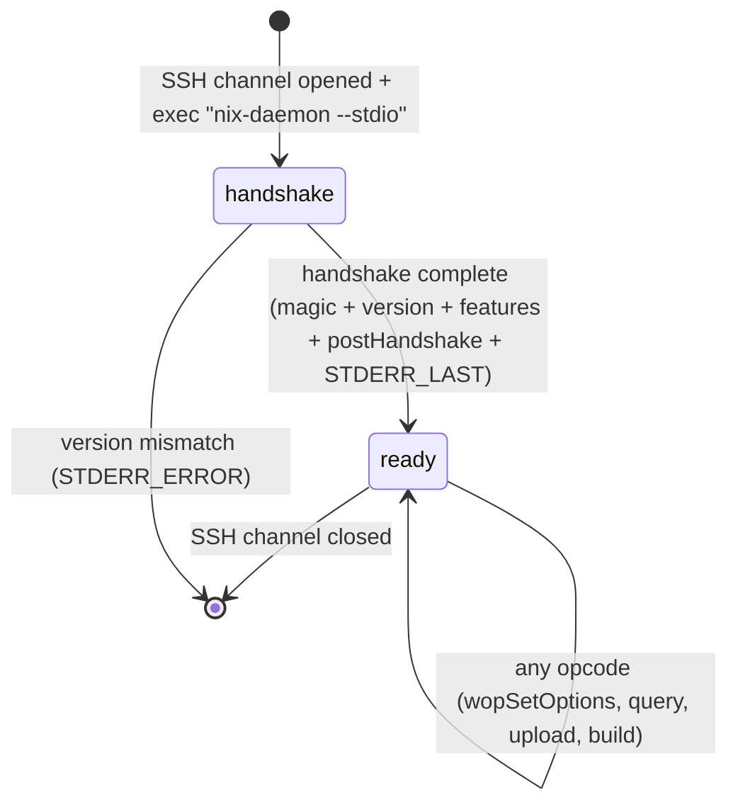

# rio-gateway

The gateway is the entry point. It terminates SSH connections and speaks the Nix worker protocol, making rio-build appear as a standard Nix remote store/builder.

## Responsibilities

- SSH server via `russh` crate --- accepts connections, authenticates via SSH keys
- Implement the Nix worker protocol (version negotiation, opcode handling)
- Handle both remote store mode (full DAG submission) and build hook mode (per-derivation delegation)
- STDERR streaming loop: send `STDERR_NEXT`, `STDERR_START_ACTIVITY`, `STDERR_STOP_ACTIVITY`, `STDERR_RESULT`, `STDERR_LAST` during operations
- Translate protocol ops into internal gRPC calls to scheduler and store
- Each SSH channel maintains independent protocol state (separate handshake and option negotiation)

## Critical Opcodes

r[gw.opcode.mandatory-set]
The opcodes below are the mandatory implementation set for a working `ssh-ng://` store. Each has a dedicated wire-format section below.

| Opcode | Value | Description |
|--------|-------|-------------|
| `wopIsValidPath` | 1 | Check if a store path exists |
| `wopAddToStore` | 7 | Legacy content-addressed store path import |
| `wopAddTextToStore` | 8 | Legacy text file import (builtins.toFile) |
| `wopBuildPaths` | 9 | Build a set of derivations |
| `wopEnsurePath` | 10 | Ensure a store path is valid/available |
| `wopAddTempRoot` | 11 | Add temporary GC root |
| `wopSetOptions` | 19 | Accept client build configuration |
| `wopQueryPathInfo` | 26 | Return full path metadata |
| `wopQueryPathFromHashPart` | 29 | Resolve a store path from its hash prefix |
| `wopQueryValidPaths` | 31 | Batch validity check |
| `wopBuildDerivation` | 36 | Build a single derivation |
| `wopAddSignatures` | 37 | Add signatures to a path |
| `wopNarFromPath` | 38 | Export path as NAR |
| `wopAddToStoreNar` | 39 | Accept NAR imports |
| `wopQueryMissing` | 40 | Report what needs building |
| `wopQueryDerivationOutputMap` | 41 | Get output name -> path mapping |
| `wopRegisterDrvOutput` | 42 | Register CA derivation output |
| `wopQueryRealisation` | 43 | Query CA realisation |
| `wopAddMultipleToStore` | 44 | Batch NAR import |
| `wopBuildPathsWithResults` | 46 | Build paths and return results |

### wopSetOptions (19) Field Sequence

r[gw.opcode.set-options.field-order]
The fields are sent in order, all as `u64` unless noted. `wopSetOptions` is **mandatory** as the first opcode after handshake --- Nix always sends it before any other operation.

1. `keepFailed` (u64 bool)
2. `keepGoing` (u64 bool)
3. `tryFallback` (u64 bool)
4. `verbosity` (u64)
5. `maxBuildJobs` (u64)
6. `maxSilentTime` (u64)
7. `obsolete_useBuildHook` (u64: always 1)
8. `verboseBuild` (u64)
9. `obsolete_logType` (u64: 0)
10. `obsolete_printBuildTrace` (u64: 0)
11. `buildCores` (u64)
12. `useSubstitutes` (u64 bool)
13. `overrides_count` (u64) followed by `overrides_count` pairs of `(key: string, value: string)` --- always present since the minimum accepted client version is 1.37

r[gw.opcode.set-options.propagation]
**Override propagation:** The `overrides` key-value pairs contain client build settings (e.g., `max-silent-time`, `build-timeout`). The gateway extracts relevant overrides and propagates them through the build pipeline: gateway -> scheduler (via gRPC) -> workers. This ensures client-specified timeouts are honored by the actual build execution.

### wopNarFromPath (38) Wire Format

r[gw.opcode.nar-from-path]
Exports a store path as a NAR archive.

| Direction | Field | Type | Description |
|-----------|-------|------|-------------|
| C -> S | `path` | string | Store path to export |

r[gw.opcode.nar-from-path.raw-bytes]
**Behavior:** rio-gateway sends `STDERR_LAST` to close the stderr loop, then streams the raw NAR bytes directly on the connection (no framing, no length prefix). This matches the canonical nix-daemon behavior. The Nix client's `copyNAR()` reads until the NAR is complete.

**Historical note (bug #11):** Earlier phases sent the NAR inside the stderr loop via `STDERR_WRITE` chunks, described in this document as an "intentional divergence". That was wrong — the Nix client's `processStderr()` for this opcode passes no sink, so `STDERR_WRITE` frames caused `error: no sink`. Fixed to `STDERR_LAST` + raw bytes. See `handle_nar_from_path` in `rio-gateway/src/handler/opcodes_read.rs`.

### wopAddToStore (7) Wire Format

Legacy content-addressed store path import. The client sends a name, a content-address method string, references, and the raw file contents (or NAR) as a framed stream. The server computes the store path, wraps non-recursive data in a NAR, and returns the full `ValidPathInfo`.

| Direction | Field | Type | Description |
|-----------|-------|------|-------------|
| C -> S | `name` | string | Store path name component |
| C -> S | `camStr` | string | Content-address method (see CAM formats below) |
| C -> S | `references` | string collection | Referenced store paths |
| C -> S | `repair` | u64 bool | Whether to repair/overwrite (read and discarded) |
| C -> S | `dump` | framed byte stream | Raw file contents (flat) or NAR bytes (recursive) |

**Content-address method (`camStr`) formats:**

| Format | Meaning |
|--------|---------|
| `text:sha256` | Text import (builtins.toFile-style); hash is over raw bytes; store path via `makeTextPath` |
| `fixed:sha256` | Flat fixed-output; hash is over raw bytes; gateway wraps in a single-file NAR |
| `fixed:r:sha256` | Recursive fixed-output; dump IS a NAR; hash is over the NAR bytes |
| `fixed:git:sha1` | Git tree import; treated as recursive |

Response (after `STDERR_LAST`) is a full `ValidPathInfo`:

| Field | Type | Description |
|-------|------|-------------|
| `path` | string | Computed store path |
| `deriver` | string | Always empty |
| `narHash` | string | SHA-256 hash of the NAR (hex-encoded digest, no prefix) |
| `references` | string collection | Echoed references |
| `registrationTime` | u64 | Always 0 |
| `narSize` | u64 | NAR size in bytes |
| `ultimate` | u64 bool | Always 1 (trusted source) |
| `sigs` | string collection | Always empty |
| `ca` | string | Content address: `text:sha256:<nixbase32>` or `fixed:[r:]<algo>:<nixbase32>` |

### wopAddToStoreNar (39) Wire Format

r[gw.opcode.add-to-store-nar]
For protocol >= 1.25 (always present since we target 1.37+):

| Field | Type | Description |
|-------|------|-------------|
| `path` | string | Store path being imported |
| `deriver` | string | Deriver path (empty if unknown) |
| `narHash` | string | SHA-256 hash of the NAR (hex-encoded digest, no algorithm prefix) |
| `references` | string collection | Referenced store paths |
| `registrationTime` | u64 | Registration timestamp |
| `narSize` | u64 | Size of the NAR in bytes |
| `ultimate` | u64 bool | Whether this is the ultimate trusted source |
| `sigs` | string collection | Signatures |
| `ca` | string | Content address (empty for input-addressed) |
| `repair` | u64 bool | Whether to repair/overwrite existing path |
| `dontCheckSigs` | u64 bool | Skip signature verification (read and discarded by rio-gateway; signature enforcement, if any, is delegated to rio-store) |

r[gw.opcode.add-to-store-nar.framing]
After sending the metadata fields, the NAR data is transferred as a **framed byte stream** (protocol >= 1.23, always true for 1.37+):

1. Client sends framed data: sequence of `u64(chunk_len) + chunk_bytes`, terminated by `u64(0)` sentinel
2. Chunk data is NOT padded (unlike string encoding)
3. Server sends `STDERR_LAST` (`0x616c7473`) — no result value follows

> **Correction (discovered during implementation review):** The original design described a `STDERR_READ` pull loop for NAR data transfer. This is only used for protocol versions 1.21-1.22. For protocol >= 1.23, the Nix C++ daemon uses `FramedSource` (in the `wopAddToStoreNar` handler's `protoVersion >= 1.23` branch in `daemon.cc`), and the client sends data via `FramedSink` (in `RemoteStore::addToStore`). The framed stream format is the same as used by `wopAddMultipleToStore`. Additionally, the original design omitted the `dontCheckSigs` field and incorrectly included a `u64(1)` result value after `STDERR_LAST`.

### wopAddMultipleToStore (44) Wire Format

r[gw.opcode.add-multiple.batch]
Added in protocol 1.32 (always present for 1.37+). This is the primary upload path for modern Nix clients, replacing per-item `wopAddToStoreNar` for source paths.

| Field | Type | Description |
|-------|------|-------------|
| `repair` | u64 bool | Whether to repair/overwrite |
| `dontCheckSigs` | u64 bool | Skip signature verification (see note below) |

r[gw.opcode.add-multiple.unaligned-frames]
Followed by a **framed byte stream** containing a count prefix and all entries concatenated. The framed stream is a byte transport --- **entry boundaries do not align with frame boundaries**. A single frame may contain the end of one entry and the beginning of the next, or an entry may span multiple frames. The receiver must:

1. Reassemble frames into a contiguous byte stream
2. Read `num_paths: u64` from the start of the reassembled stream
3. Parse `num_paths` entries sequentially

The reassembled stream begins with:

| Field | Type | Description |
|-------|------|-------------|
| `num_paths` | u64 | Number of entries that follow (MUST be bounds-checked against `MAX_COLLECTION_COUNT`) |

Each entry in the reassembled stream contains:

| Field | Type | Description |
|-------|------|-------------|
| `pathInfo` | (same 9 fields as wopAddToStoreNar metadata, minus the trailing `repair` and `dontCheckSigs` flags) | Path metadata |
| NAR data | `narSize` plain bytes | The NAR content — **NOT nested-framed**; read `narSize` bytes directly from the reassembled outer stream |

The outer framed stream terminates with a `u64(0)` sentinel.

> **Correction (discovered via VM test):** Earlier versions of this spec described the per-entry NAR as an inner framed stream and omitted the `num_paths` prefix. Both were wrong. Nix's `Store::addMultipleToStore(Source &)` reads `num_paths` first (`readNum<uint64_t>(source)`) and then for each entry calls `addToStore(info, source)` which reads `narSize` plain bytes directly. The bug was masked by a byte-level test written to match the buggy parser rather than the spec.

r[gw.opcode.add-multiple.dont-check-sigs-ignored]
**`dontCheckSigs` handling:** The gateway reads and discards `dontCheckSigs`. The gateway does not perform signature verification itself; signature enforcement (if any) is delegated to rio-store. The field is consumed to maintain wire compatibility.

**Response:** The server sends `STDERR_LAST` with no result value (matching the `wopAddMultipleToStore` handler's `logger->stopWork()` sequence in `daemon.cc`).

### DerivedPath Wire Format

r[gw.wire.derived-path]
`DerivedPath` is used by `wopBuildPaths` (9) and `wopBuildPathsWithResults` (46) to specify what to build. It is sent as a single string that the server must parse. There are three forms:

| Form | Syntax | Example | Description |
|------|--------|---------|-------------|
| Opaque | plain store path | `/nix/store/abc...-foo` | Build/fetch this exact path |
| Built (explicit outputs) | `drvPath!output1,output2` | `/nix/store/abc...-foo.drv!out,dev` | Build specific outputs of a derivation |
| Built (all outputs) | `drvPath!*` | `/nix/store/abc...-foo.drv!*` | Build all outputs of a derivation |

The `!*` form is the **default** used by `nix build`. When a client runs `nix build /nix/store/abc...-foo.drv`, it sends the `drvPath!*` form.

Both `wopBuildPaths` and `wopBuildPathsWithResults` send a `string collection` of `DerivedPath` values. The gateway must parse each string to determine the form and extract the derivation path and requested outputs.

### wopBuildDerivation (36) -- BasicDerivation Wire Format

r[gw.opcode.build-derivation]
Sends an inline `BasicDerivation` (without `inputDrvs`). For protocol 1.37+:

| Field | Type | Description |
|-------|------|-------------|
| `drvPath` | string | The `.drv` store path |
| `outputs` | collection of output tuples | See below |
| `inputSrcs` | string collection | Input source store paths |
| `platform` | string | e.g. `x86_64-linux` |
| `builder` | string | Builder executable path |
| `args` | string collection | Builder arguments |
| `env` | string-pair collection | Environment variables |
| `buildMode` | u64 | 0=Normal, 1=Repair, 2=Check |

Each **output tuple** (protocol >= 1.32):

| Field | Type | Description |
|-------|------|-------------|
| `name` | string | Output name (e.g. `out`, `dev`) |
| `path` | string | Output store path |
| `hashAlgo` | string | Hash algorithm for CA outputs (empty for input-addressed) |
| `hash` | string | Expected hash for CA outputs (empty for input-addressed) |

**DAG reconstruction:** The gateway cannot reconstruct the dependency DAG from `BasicDerivation` alone (it has no `inputDrvs`). The gateway reconstructs the full DAG by parsing the `.drv` files uploaded in the preceding `wopAddToStoreNar`/`wopAddMultipleToStore` step. Each `.drv` file contains `inputDrvs` references that form the DAG edges.

### wopQueryDerivationOutputMap (41) Wire Format

r[gw.opcode.query-derivation-output-map]
**Important:** This opcode is called by all modern Nix clients unconditionally, not just for CA derivations. For input-addressed derivations, it must return the statically-known output paths (computable from the derivation itself).

**Resolution strategy:** The gateway computes the output map locally from the parsed `.drv` file (obtained from the per-session `.drv` cache built during `wopAddToStoreNar`/`wopAddMultipleToStore`, or fetched from rio-store if the `.drv` was uploaded in a previous session). For input-addressed derivations, the output paths are deterministic and computed from the derivation's ATerm representation. For CA derivations (Phase 5), the gateway first checks rio-store for realized output paths via `QueryPathInfo`; if unknown, it returns the placeholder output paths from the `.drv`.

| Direction | Field | Type | Description |
|-----------|-------|------|-------------|
| C -> S | `drvPath` | string | The `.drv` store path to query |
| S -> C | `count` | u64 | Number of output mappings |
| S -> C | (per output) `name` | string | Output name |
| S -> C | (per output) `path` | string | Output store path |

### wopIsValidPath (1) Wire Format

r[gw.opcode.is-valid-path]
| Direction | Field | Type | Description |
|-----------|-------|------|-------------|
| C -> S | `path` | string | Store path to check |

Response (after STDERR loop):

| Direction | Field | Type | Description |
|-----------|-------|------|-------------|
| S -> C | `valid` | u64 bool | 1 if path exists in store, 0 otherwise |

### wopQueryPathInfo (26) Wire Format

r[gw.opcode.query-path-info]
| Direction | Field | Type | Description |
|-----------|-------|------|-------------|
| C -> S | `path` | string | Store path to query |

Response (after STDERR loop). First, a validity flag:

| Field | Type | Description |
|-------|------|-------------|
| `valid` | u64 bool | 1 if path exists, 0 if not (stop here if 0) |

If `valid == 1`, the following fields are sent in order:

| Field | Type | Description |
|-------|------|-------------|
| `deriver` | string | Deriver path (empty if unknown) |
| `narHash` | string | NAR hash (hex-encoded digest, no algorithm prefix) |
| `references` | string collection | Referenced store paths |
| `registrationTime` | u64 | Registration timestamp |
| `narSize` | u64 | NAR size in bytes |
| `ultimate` | u64 bool | Whether this is the ultimate source |
| `sigs` | string collection | Signatures |
| `ca` | string | Content address (empty for input-addressed) |

### wopQueryValidPaths (31) Wire Format

r[gw.opcode.query-valid-paths]
| Direction | Field | Type | Description |
|-----------|-------|------|-------------|
| C -> S | `paths` | string collection | Store paths to check |
| C -> S | `substitute` | u64 bool | Whether to attempt substitution for missing paths (ignored by rio-build) |

Response (after STDERR loop):

| Direction | Field | Type | Description |
|-----------|-------|------|-------------|
| S -> C | `validPaths` | string collection | Subset of input paths that exist in the store |

### wopBuildPaths (9) Wire Format

r[gw.opcode.build-paths]
| Direction | Field | Type | Description |
|-----------|-------|------|-------------|
| C -> S | `paths` | string collection | `DerivedPath` values (see DerivedPath Wire Format above) |
| C -> S | `buildMode` | u64 | 0=Normal, 1=Repair, 2=Check |

Response (after STDERR loop): `u64(1)` for success. On failure, the STDERR loop includes `STDERR_ERROR`.

**Note:** Unlike `wopBuildPathsWithResults`, this opcode does NOT return per-path `BuildResult` structures.

### wopQueryMissing (40) Wire Format

r[gw.opcode.query-missing]
| Direction | Field | Type | Description |
|-----------|-------|------|-------------|
| C -> S | `paths` | string collection | `DerivedPath` values to check |

Response (after STDERR loop):

| Field | Type | Description |
|-------|------|-------------|
| `willBuild` | string collection | Store paths that need building |
| `willSubstitute` | string collection | Store paths that can be substituted (always empty for rio-build) |
| `unknown` | string collection | Store paths with unknown status |
| `downloadSize` | u64 | Estimated download size in bytes |
| `narSize` | u64 | Estimated total NAR size in bytes |

### wopBuildPathsWithResults (46) Response Wire Format

r[gw.opcode.build-paths-with-results]
`wopBuildPathsWithResults` (opcode 46) returns one `KeyedBuildResult` per requested path --- the key echoes the `DerivedPath` string the client sent. Response structure (after the STDERR loop):

| Field | Type | Description |
|-------|------|-------------|
| `count` | u64 | Number of result entries |
| (per entry) `derivedPath` | string | The `DerivedPath` string exactly as the client sent it |
| (per entry) `buildResult` | BuildResult | See `BuildResult` format below |

#### BuildResult Wire Format

For protocol 1.37+, all fields are present:

| Field | Type | Description |
|-------|------|-------------|
| `status` | u64 | See status enum below |
| `errorMsg` | string | Error message (empty on success) |
| `timesBuilt` | u64 | Number of times this derivation was built |
| `isNonDeterministic` | u64 bool | Whether non-deterministic output was detected |
| `startTime` | u64 | Build start time (Unix epoch) |
| `stopTime` | u64 | Build stop time (Unix epoch) |
| `cpuUser` | optional i64 | CPU user time (u64 tag: 0=absent, 1=present; if present, followed by u64 value interpreted as i64) |
| `cpuSystem` | optional i64 | CPU system time (same encoding as cpuUser) |
| `builtOutputs` | collection | Output entries (see below) |

**BuildResult status enum:**

| Value | Name | Description |
|-------|------|-------------|
| 0 | Built | Successfully built |
| 1 | Substituted | Fetched from substituter |
| 2 | AlreadyValid | Output already existed |
| 3 | PermanentFailure | Build failed (not retryable) |
| 4 | InputRejected | Input was rejected |
| 5 | OutputRejected | Output was rejected |
| 6 | TransientFailure | Build failed (may succeed on retry) |
| 7 | CachedFailure | Previously recorded failure |
| 8 | TimedOut | Build exceeded timeout |
| 9 | MiscFailure | Other failure |
| 10 | DependencyFailed | A dependency failed |
| 11 | LogLimitExceeded | Build log exceeded size limit |
| 12 | NotDeterministic | Non-deterministic output detected |
| 13 | ResolvesToAlreadyValid | Derivation resolves to already valid output |
| 14 | NoSubstituters | No substituters available |

Each **builtOutput** entry is a `(DrvOutput, Realisation)` pair:

| Field | Type | Description |
|-------|------|-------------|
| `drv_output_id` | string | DrvOutput key, e.g. `sha256:abcdef...!out` |
| `realisation_json` | string | Realisation as JSON: `{"id":"...","outPath":"...","signatures":[],"dependentRealisations":{}}` |

## Wire Format

r[gw.wire.all-ints-u64]
All wire integers are 64-bit unsigned little-endian. There are **no exceptions** --- even logically-u8 values (BuildStatus, verbosity) and magic bytes are sent as u64 LE.

r[gw.wire.string-encoding]
Strings/buffers: `u64(len) + bytes + zero-pad-to-8-byte-boundary`. Empty strings: `u64(0)` with no bytes and no padding.

r[gw.wire.collection-max]
Collections: `u64(count) + elements`. **Every** count-prefixed loop MUST enforce `MAX_COLLECTION_COUNT` before entering the loop --- not just in `read_strings`/`read_string_pairs`, but in any custom reader (e.g., `read_basic_derivation` output loop, `read_build_result` built-outputs loop, STDERR trace/field readers).

r[gw.wire.framed-no-padding]
Framed data (for NARs): sequence of `u64(chunk_len) + chunk_data` terminated by `u64(0)` --- chunk data is NOT padded (unlike strings).

r[gw.wire.narhash-hex]
`narHash` fields on the wire are hex-encoded SHA-256 digests with **no algorithm prefix and no nixbase32**. Use `hex::decode` + `NixHash::new`, not `NixHash::parse_colon`. The `sha256:nixbase32` format appears in narinfo text, not on the wire.

- All integers: 64-bit unsigned, little-endian
- Strings/buffers: `u64(len) + bytes + zero-pad-to-8-byte-boundary`
- Empty strings: `u64(0)` with no bytes and no padding
- Collections: `u64(count) + elements`
- Framed data (for NARs): sequence of `u64(chunk_len) + chunk_data` terminated by `u64(0)` --- chunk data is NOT padded (unlike strings)

### Handshake Sequence (Protocol 1.38+)

> **Correction (discovered during implementation):** The original design stated that magic bytes are u32, the only exception to the u64 rule. This is incorrect. In the actual Nix C++ source, `readInt()` / `writeInt()` serialize all integers as u64 LE, **including the magic bytes**. The handshake uses u64 throughout, with no exceptions.

r[gw.handshake.phases]
The handshake has three phases: magic+version exchange (`BasicClientConnection::handshake`), feature exchange (protocol >= 1.38), and post-handshake (`postHandshake`).

r[gw.handshake.magic]
**Phase 1: Magic + Version Exchange**

| Step | Direction | Data | Type |
|------|-----------|------|------|
| 1 | C -> S | `WORKER_MAGIC_1` (`0x6e697863`) | u64 |
| 2 | S -> C | `WORKER_MAGIC_2` (`0x6478696f`) | u64 |
| 3 | S -> C | Protocol version (encoded as `(major << 8) \| minor`, e.g. `0x126` = 1.38) | u64 |
| 4 | C -> S | Client protocol version | u64 |

r[gw.handshake.version-negotiation]
The negotiated version is `min(client_version, server_version)`. If the client version < 1.37, the server should send `STDERR_ERROR` and close the connection.

r[gw.handshake.features]
**Phase 2: Feature Exchange (protocol >= 1.38)**

| Step | Direction | Data | Type |
|------|-----------|------|------|
| 5 | C -> S | Client feature set | string collection |
| 6 | S -> C | Server feature set | string collection |

The feature sets are intersected to determine the negotiated features. rio-build currently advertises an empty feature set.

**Phase 3: Post-Handshake (`postHandshake`)**

| Step | Direction | Data | Type |
|------|-----------|------|------|
| 7 | C -> S | Obsolete CPU affinity (always 0; if non-zero, followed by a second u64 mask) | u64 |
| 8 | C -> S | `reserveSpace` (always 0) | u64 |
| 9 | S -> C | Nix version string (e.g. `"rio-gateway 0.1.0"`) | string |
| 10 | S -> C | Trusted status: 0 = unknown, 1 = trusted, 2 = not-trusted | u64 |

r[gw.handshake.initial-stderr-last]
**Phase 4: Initial STDERR_LAST**

| Step | Direction | Data | Type |
|------|-----------|------|------|
| 11 | S -> C | `STDERR_LAST` (`0x616c7473`) | u64 |

The client calls `processStderrReturn()` after the handshake, which reads messages until `STDERR_LAST`. The server must send `STDERR_LAST` to complete the handshake before the client will send any opcodes.

r[gw.handshake.flush-points]
> **Note on flush points:** The server must flush after steps 2-3, after step 6, after steps 9-10, and after step 11. Without explicit flushes, data may remain buffered and the client will block waiting for the response.

## Protocol Multiplexing

r[gw.conn.sequential]
The Nix worker protocol is strictly sequential within a single connection --- the client sends a request, waits for the full response (including the STDERR streaming loop), then sends the next request. There is no pipelining or out-of-order execution.

r[gw.conn.per-channel-state]
Multiple clients require multiple SSH channels or connections. The gateway multiplexes at the SSH channel level (one protocol session per channel), not at the protocol level. Each SSH channel has independent protocol state, including separate handshake and option negotiation. During long `wopBuildDerivation` calls, the connection is blocked (the STDERR loop runs for the duration of the build). Nix handles this by opening separate SSH channels for concurrent operations (e.g., IFD during evaluation).

## DAG Reconstruction

r[gw.dag.reconstruct]
When the gateway receives `wopBuildDerivation` or `wopBuildPathsWithResults`, it must reconstruct the full derivation DAG to send to the scheduler via `SubmitBuild`. The algorithm:

1. **During store uploads:** The gateway intercepts each uploaded path. If the path ends in `.drv`, the gateway extracts the `.drv` file from the NAR, parses the ATerm-format derivation, and caches the parsed result in per-session memory (keyed by store path). This applies to all upload opcodes: `wopAddToStore` (7), `wopAddTextToStore` (8), `wopAddToStoreNar` (39), and `wopAddMultipleToStore` (44). For `wopAddToStoreNar` and `wopAddMultipleToStore`, the handler branches on the path name: `.drv` paths (small --- typically <10KB, capped at `DRV_NAR_BUFFER_LIMIT` = 16MiB) are buffered and parsed via `try_cache_drv`; non-`.drv` paths stream directly to the store via `grpc_put_path_streaming` without buffering. `wopAddToStore` and `wopAddTextToStore` still buffer (they compute the store path from the content hash, so need the full bytes before `PutPath` metadata). A `.drv` NAR exceeding `DRV_NAR_BUFFER_LIMIT` is streamed without caching --- `resolve_derivation` fetches it from the store later during DAG reconstruction.
2. **On `wopBuildDerivation`/`wopBuildPathsWithResults`:** The gateway identifies all requested derivation paths. For each, it looks up the parsed derivation from the session cache (step 1). If a `.drv` was not uploaded in the current session (e.g., it was uploaded in a previous session and already exists in the store), the gateway fetches it from rio-store via `GetPath`, unpacks the NAR, and parses the ATerm.
3. **DAG construction:** Starting from the requested derivation(s), the gateway walks `inputDrvs` references recursively (BFS) to build the full DAG. **DAG reconstruction is capped at 10,000 transitive input derivations** (`MAX_TRANSITIVE_INPUTS`) to prevent DoS via pathological derivation graphs. The gateway sends the **full DAG** to the scheduler; cache-hit determination (which nodes have outputs already in the store) happens in the scheduler, not here.
4. **Validation (`validate_dag`):** Malformed `.drv` files cause `STDERR_ERROR` with type `"Error"` and a descriptive message. Missing `.drv` files (referenced by `inputDrvs` but not in the store) cause `STDERR_ERROR` with type `"Error"`. `validate_dag` also enforces two early rejections before the gRPC round-trip: (a) `nodes.len() > MAX_DAG_NODES` (scheduler enforces this too, but gateway-side early reject saves the submission), and (b) any derivation with `__noChroot=1` in its env (sandbox escape --- this check is ONLY at the gateway; the scheduler does not re-check). `validate_dag` is invoked from all three build handlers (`wopBuildDerivation`, `wopBuildPaths`, `wopBuildPathsWithResults`).
5. **The reconstructed DAG is sent to the scheduler via `SubmitBuild`.** The gateway holds the SSH connection open and converts the `BuildEvent` response stream into STDERR messages for the Nix client.

r[gw.reject.nochroot]
The gateway MUST reject any derivation (at SubmitBuild time) whose env contains `__noChroot = "1"`. This is a sandbox-escape request that rio-build does not honor. Rejection happens at two points: (1) `validate_dag` checks every node's drv_cache entry before the gRPC SubmitBuild call; (2) `wopBuildDerivation` handler checks the inline BasicDerivation's env directly (covering the case where the full drv is not in the cache). Both paths send `STDERR_ERROR` with a "sandbox escape — not permitted" message. The scheduler does not see the `__noChroot` env (DerivationNode doesn't carry it), so this check is gateway-only.

### Inline .drv Optimization

After DAG construction, the gateway optionally inlines the ATerm content of `.drv` files into the `drv_content` field of each `DerivationNode`. This saves one worker -> store round-trip per dispatched derivation (the `GetPath` fetch). The optimization:

- Is **gated by a single batched `FindMissingPaths` call** over all expected output paths. Only nodes with at least one missing output (i.e., nodes that will actually dispatch) are inlined. Cache-hit nodes stay empty — the scheduler short-circuits them to `Completed` and they never dispatch.
- Applies a **per-node cap of 64 KB** (`MAX_INLINE_DRV_BYTES`). Larger `.drv` files (e.g., flake inputs serialized into `env`) fall back to worker-fetch.
- Applies a **total budget of 16 MB** (`INLINE_BUDGET_BYTES`) across all inlined nodes. Once the budget is exhausted, remaining nodes fall back to worker-fetch.
- Is **best-effort**: on any error (`FindMissingPaths` timeout, store unreachable), inlining is skipped entirely and all nodes fall back to worker-fetch. This is an optimization, not a correctness requirement.

> **Session state:** Although the gateway is described as "stateless beyond the lifetime of a single SSH connection," each SSH channel does accumulate per-session state: the parsed `.drv` cache and the `wopSetOptions` configuration. `wopAddTempRoot` is acknowledged as a no-op (rio's GC is store-side with explicit pins; a gateway-session-scoped set would be invisible to it). This state is connection-scoped and discarded when the SSH channel closes.

## Authentication + Tenant Identity

r[gw.auth.tenant-from-key-comment]

The tenant name lives in the **server-side `authorized_keys` entry's comment field**, not the client's key (SSH key authentication sends raw key data only). During `auth_publickey`, the gateway matches the client's presented key against its loaded entries via `.find()`, then reads `.comment()` from the **matched entry** to get the tenant name. This is stored on the connection and passed through to `SubmitBuildRequest.tenant_id`. Empty comment = single-tenant mode (tenant name is empty string → scheduler treats as `None`).

r[gw.jwt.claims]

JWT claims: `sub` = tenant_id UUID (server-resolved at mint time), `iat`, `exp` (SSH session duration + grace), `jti` (unique token ID for revocation). Signed ed25519, public key distributed via ConfigMap.

r[gw.jwt.issue]

On successful SSH authentication, the gateway MUST mint a JWT with `sub` set to the resolved tenant UUID and store it on the session context. The scheduler reads `jti` from the interceptor-attached `Claims` extension (per `r[gw.jwt.verify]` below) — NO proto body field. For audit, the `SubmitBuild` handler INSERTs `jti` into `builds.jwt_jti` (column added in migration 016). Zero wire redundancy: `jti` lives once in the JWT, parsed once by the interceptor, read once by the handler.

r[gw.jwt.verify]

The tonic interceptor on scheduler and store MUST extract `x-rio-tenant-token`, verify signature+expiry, attach `Claims` to request extensions, and reject invalid tokens with `Status::unauthenticated`. (Controller has no gRPC ingress — kube reconcile loop + raw-TCP /healthz only.) The scheduler ADDITIONALLY checks `jti NOT IN jwt_revoked` (PG lookup — gateway stays PG-free).

r[gw.jwt.dual-mode]

Gateway auth is two-branched PERMANENTLY: `x-rio-tenant-token` header present → JWT verify; absent → SSH-comment fallback. Operator chooses per-deployment via `gateway.toml auth_mode`. Both paths stay maintained. (Does NOT bump `r[gw.auth.tenant-from-key-comment]`.)

## Connection Lifecycle

r[gw.conn.lifecycle]
Each SSH channel follows this lifecycle:

> **Correction:** The original design required `wopSetOptions` as the mandatory first opcode after handshake. In practice, the real `nix-daemon` does not enforce this --- it accepts any opcode after the handshake completes. Nix clients conventionally send `wopSetOptions` first, but may send other opcodes (e.g., `wopQueryMissing`) first on multiplexed SSH channels. rio-build accepts any opcode after handshake.

r[gw.conn.exec-request]
**SSH transport:** Nix connects via `ssh ... nix-daemon --stdio`. The gateway must handle `exec_request` for this command and start the protocol on the SSH channel data stream. The `channel_open_session` alone does not start the protocol.

The gateway matches the **suffix** of the second-to-last whitespace-separated argument (`ends_with("nix-daemon")`) and requires the last argument to be exactly `--stdio`. This allows clients that send a full store path (e.g., `/nix/store/...-nix-2.20.0/bin/nix-daemon --stdio`) to connect successfully.

r[gw.conn.session-error-visible]
Any error propagated from an SSH handler method (via `?`) is logged at
`error!` and increments `rio_gateway_errors_total{type="session"}`. The
russh default swallows these silently.

r[gw.conn.channel-limit]
A single SSH connection may open at most `MAX_CHANNELS_PER_CONNECTION`
(default 4) active protocol sessions. Additional `channel_open_session`
requests receive `SSH_MSG_CHANNEL_OPEN_FAILURE`. The limit matches Nix's
default `max-jobs`.

r[gw.conn.keepalive]
The gateway sends SSH keepalive requests every 30 seconds. After 3
consecutive unanswered keepalives (~90 s), the connection is closed.
This detects half-open TCP that kernel-level keepalive would not.

r[gw.conn.nodelay]
TCP_NODELAY is set on all accepted sockets. The worker protocol's
small-request/small-response pattern interacts pathologically with
Nagle's algorithm (~40 ms added per round-trip).

r[gw.conn.real-connection-marker]
`rio_gateway_connections_total{result="new"}` and
`rio_gateway_connections_active` count connections that reached the SSH
authentication layer (any `auth_*` callback). TCP probes that close
before the SSH handshake are logged at `trace!` only.

## STDERR Message Types

r[gw.stderr.message-types]
| Constant | Value | Direction | Meaning |
|----------|-------|-----------|---------|
| `STDERR_NEXT` | `0x6f6c6d67` | S -> C | Log/trace message (followed by: `string msg`) |
| `STDERR_READ` | `0x64617461` | S -> C | Server needs data from client (followed by: `u64 count` bytes requested) |
| `STDERR_WRITE` | `0x64617416` | S -> C | Server sending data to client (followed by: `string data`) |
| `STDERR_LAST` | `0x616c7473` | S -> C | End of stderr stream; result follows |
| `STDERR_ERROR` | `0x63787470` | S -> C | Error occurred (see format below) |
| `STDERR_START_ACTIVITY` | `0x53545254` | S -> C | Start structured activity |
| `STDERR_STOP_ACTIVITY` | `0x53544f50` | S -> C | End structured activity |
| `STDERR_RESULT` | `0x52534c54` | S -> C | Structured result for an activity |

### STDERR_ERROR Wire Format

r[gw.stderr.error-format]
This is a complex nested structure. The gateway must construct it correctly for every error response (rejected opcodes, failed builds, etc.):

r[gw.stderr.error-before-return+2]
**`STDERR_ERROR` and `STDERR_LAST` are mutually exclusive terminal frames. A handler sends exactly one of them, exactly once.**

- If a handler returns `Err(...)`, it MUST send `STDERR_ERROR` first, and the session loop MUST NOT follow up with `STDERR_LAST`. Never use bare `?` to propagate errors from store operations, NAR extraction, or ATerm parsing --- always wrap in a match that sends `STDERR_ERROR` before returning.
- If a handler sends `STDERR_ERROR`, it MUST `return Err(...)` immediately after. It MUST NOT call `stderr.finish()`, and it MUST NOT write a result payload. `STDERR_ERROR` is terminal for the operation --- the client stops reading STDERR frames and throws, so any bytes that follow are stranded in the TCP buffer and corrupt the next opcode on a pooled connection.
- To report a **recoverable** per-operation failure while keeping the session open for subsequent opcodes, use `BuildResult::failure` (or the opcode's equivalent failure-carrying result type) delivered via `STDERR_LAST` + result. For batch opcodes like `wopBuildPathsWithResults`, per-entry errors push `BuildResult::failure` and `continue` --- they do not abort the batch.

The `StderrWriter` API enforces this: `error()` poisons the writer so that subsequent `finish()` returns `Err` and `inner_mut()` panics.

> **Exception — `wopQueryRealisation`:** The handler invokes the store first, then sends `STDERR_LAST` unconditionally, then matches on the store result. A store error (already past `STDERR_LAST`) is too late for `STDERR_ERROR`; instead the handler returns empty-set (`u64(0)`) and logs a warning. This is a degraded path (one missed CA cache hit), not a correctness violation; the next opcode on the session will hit the same store and fail through its own error path. (This could be restructured to match before `STDERR_LAST` --- the result is already buffered --- but the degraded-path cost is trivial and the structure is simpler.)

| Field | Type | Description |
|-------|------|-------------|
| `type` | string | Error type (e.g. `"Error"`, `"nix::Interrupted"`) |
| `level` | u64 | Error level |
| `name` | string | Program name (e.g. `"rio-build"`) |
| `message` | string | Human-readable error message |
| `havePos` | u64 bool | Whether position info follows |
| (if havePos) `file` | string | Source file |
| (if havePos) `line` | u64 | Line number |
| (if havePos) `column` | u64 | Column number |
| `traceCount` | u64 | Number of trace entries |
| (per trace) `havePos` | u64 bool | Whether trace position follows |
| (per trace, if havePos) `file`, `line`, `column` | string, u64, u64 | Trace position |
| (per trace) `message` | string | Trace message |

### STDERR_START_ACTIVITY Wire Format

r[gw.stderr.activity]
| Field | Type | Description |
|-------|------|-------------|
| `id` | u64 | Activity ID (unique per session) |
| `level` | u64 | Verbosity level |
| `type` | u64 | Activity type (see enum below) |
| `text` | string | Human-readable activity description |
| `fieldsCount` | u64 | Number of structured fields |
| (per field) | u64 type + value | Typed field data |
| `parentId` | u64 | Parent activity ID (0 = no parent) |

**Activity type enum:**

| Value | Name | Description |
|-------|------|-------------|
| 0 | Unknown | Unknown/unclassified activity |
| 101 | CopyPath | Copying a single store path |
| 102 | FileTransfer | Downloading/uploading a file |
| 103 | Realise | Realising a derivation output |
| 104 | CopyPaths | Copying multiple store paths |
| 105 | Builds | Top-level "building N derivations" |
| 106 | Build | Building a single derivation |
| 107 | OptimiseStore | Optimising the store (dedup) |
| 108 | VerifyPaths | Verifying store paths |
| 109 | Substitute | Substituting a path |
| 110 | QueryPathInfo | Querying path info from a substituter |
| 111 | PostBuildHook | Running post-build hook |
| 112 | BuildWaiting | Build waiting for a lock |

Note: values 1--100 are unused. The enum starts at 0 (Unknown) then jumps to 101.

## Protocol Compatibility

r[gw.compat.version-range]
Target: protocol version **1.38+** (Nix 2.20+, advertised as `0x126`). Minimum accepted client version is 1.37. Older clients are rejected at handshake with a human-readable error.

> **Correction:** rio-build advertises protocol 1.38 (not 1.37) to support the feature exchange step added in that version. The minimum accepted client version remains 1.37 for backwards compatibility.

r[gw.compat.unknown-opcode-close]
Unknown or unsupported opcodes return `STDERR_ERROR` and **close the connection**. This is necessary because the opcode's payload remains unread in the stream and its format is unknown, making it impossible to skip to the next opcode without corrupting the protocol. The Nix client will reconnect automatically.

| Category | Opcodes |
|----------|---------|
| Fully implemented | `wopIsValidPath`, `wopQueryPathInfo`, `wopQueryValidPaths`, `wopAddToStore`, `wopAddTextToStore`, `wopAddToStoreNar`, `wopEnsurePath`, `wopNarFromPath`, `wopBuildDerivation`, `wopBuildPaths`, `wopBuildPathsWithResults`, `wopQueryMissing`, `wopAddTempRoot`, `wopSetOptions`, `wopAddMultipleToStore`, `wopQueryDerivationOutputMap`, `wopQueryPathFromHashPart`, `wopAddSignatures`, `wopRegisterDrvOutput`, `wopQueryRealisation` |
| Rejected (STDERR_ERROR) | Everything else |

**Note on CA opcodes:** `wopRegisterDrvOutput` / `wopQueryRealisation` parse the Nix Realisation JSON (`{"id":"sha256:<hex>!<name>","outPath":...,"signatures":[...],"dependentRealisations":{}}`) and call the store's RegisterRealisation/QueryRealisation RPCs. Soft-fail on malformed input (discard/empty-set rather than STDERR_ERROR) to avoid regressing buggy clients that worked against the old stubs. Full CA early cutoff (dependentRealisations tracking in the DAG) is Phase 5.

**Note on `wopQueryDerivationOutputMap`:** Moved from "CA-aware" to "Fully implemented" because modern Nix clients call this for ALL derivation types. For input-addressed derivations, it returns the statically-known output paths. For CA derivations, it returns the realized output paths if known.

**Note on `wopAddTempRoot`:** Accepts the store path and records it as a connection-scoped temporary GC root in-memory. These temp roots prevent GC of paths the client is actively using. They are lost on gateway pod restart, which is acceptable given the store's GC grace period (default 2h). The store's GC relies on the grace period rather than querying gateways for active temp roots.

## Build Hook Protocol Path

r[gw.hook.single-node-dag]
When a Nix client uses `--builders` (build hook mode) instead of `--store ssh-ng://` (remote store mode), the interaction pattern changes significantly:

**How it works:** The local `nix-daemon` drives DAG traversal and delegates individual derivations to rio-build one at a time via `wopBuildDerivation`. Each hook invocation is an independent SSH session that submits a single derivation without the full DAG context.

**What the gateway does:**
- Receives `wopAddToStoreNar` for the derivation's inputs, then `wopBuildDerivation` for the target derivation
- Creates a **single-node "DAG"** for each hook invocation (no edges, no DAG context)
- Submits to the scheduler via `SubmitBuild` as usual

**Scheduling optimizations lost in build hook mode:**
- **No critical-path analysis** --- the scheduler sees each derivation in isolation, not as part of a graph
- **No multi-build DAG merging** --- shared derivations between concurrent builds cannot be deduplicated at the scheduling level
- **Limited closure-locality scoring** --- the scheduler can still use bloom filter locality data, but cannot pre-plan affinity across the build graph
- **No CA early cutoff** --- without the full DAG, the scheduler cannot propagate cutoffs to downstream nodes

r[gw.hook.ifd-detection]
**IFD detection:** When a `wopBuildDerivation` call arrives without a preceding `wopBuildPathsWithResults` on the same session, the gateway sets `is_ifd_hint = true`, and the scheduler assigns `priority_class = "interactive"` regardless of the build's configured priority.

> **Recommendation:** Prefer `ssh-ng://` (remote store mode) over `--builders` (build hook mode) for better scheduling. The build hook path exists for compatibility with existing `nix.conf` setups, but delivers worse throughput and scheduling quality for large builds.

## Rate Limiting & Connection Management

r[gw.rate.per-tenant]

Per-tenant build-submit rate limiting via `governor`
`DefaultKeyedRateLimiter<String>` keyed on `tenant_name` (from
authorized_keys comment — operator-controlled, cannot be forged by
client; `None` → key `"__anon__"`). **Disabled by default** — no
quota unless `gateway.toml [rate_limit]` section is present. When
enabled: quota is operator-configured (`per_minute`, `burst`). On
rate-limit violation: `STDERR_ERROR` with wait-hint, early return —
do NOT close the connection. Phase 5: key becomes `Claims.sub` (tenant
UUID from JWT) instead of `tenant_name` (SSH comment) — same bounded
keyspace, JWT-native source. No eviction needed either way.

r[gw.conn.cap]

Global connection cap via `Arc<Semaphore>` (default 1000, configurable
via `gateway.toml max_connections`). `try_acquire_owned()` in the
accept loop before spawning the session task; permit is held by the
task and dropped on disconnect. At cap: russh
`Disconnect::TooManyConnections` before session spawn.

## High Availability

- Multiple gateway replicas sit behind a TCP load balancer (NLB on EKS with idle timeout ≥ 3600s).
- Session state is connection-scoped --- the gateway is stateless beyond the lifetime of a single SSH connection.
- If a gateway pod dies, the affected SSH connections drop. Clients reconnect automatically (standard Nix retry behavior) and land on a healthy replica.
- Builds that were already in progress continue in the scheduler; only the log-streaming link is lost.

r[gw.reconnect.backoff]
**WatchBuild reconnect:** When the `SubmitBuild` / `WatchBuild` response stream breaks (scheduler failover, transient network), the gateway's `process_stream` distinguishes error classes via `StreamProcessError`:
- `Transport` (scheduler connection dropped) → retried up to **5 times** with exponential backoff (**1s/2s/4s/8s/16s**). The scheduler replays `BuildEvent`s from `build_event_log` starting at `since_sequence`.
- `EofWithoutTerminal` / `Wire` → **not** retried; the gateway returns `MiscFailure` to the Nix client immediately. These indicate the build itself terminated incompletely or a protocol bug, not a transient connectivity issue.
The reconnect counter resets on the first successful `BuildEvent` received after a reconnect.

r[gw.reconnect.since-seq]
The gateway MUST track the sequence number of the first peeked `BuildEvent` and use it as the initial `since_sequence` for reconnect, not hardcode `0`. The scheduler never emits `sequence=0` (it's the `WatchBuildRequest`-side "from start" sentinel); hardcoding `0` causes every first-event reconnect to replay one extra event.

- The gateway does not own durable state. All persistent data lives in the scheduler (PostgreSQL) and the store.
- Consider using a non-standard SSH port (e.g., 2222) to avoid conflicts with host SSH daemons and corporate firewalls blocking port 22 for non-standard destinations.
- Gateway pods should have a preStop hook and `terminationGracePeriodSeconds` (e.g., 600s) to allow in-flight SSH sessions to complete during rolling updates.

## Key Files

- `rio-gateway/src/server.rs` --- SSH server setup (russh), per-channel task spawning, `exec_request` matching
- `rio-gateway/src/session.rs` --- Per-SSH-channel protocol session loop (`run_protocol`), CancelBuild on disconnect
- `rio-gateway/src/handler/` --- Nix worker protocol opcode handlers:
    - `mod.rs` --- opcode dispatch (`handle_opcode`), `SessionContext`, `.drv` cache
    - `opcodes_read.rs` --- read-only opcodes (`wopIsValidPath`, `wopQueryPathInfo`, `wopNarFromPath`, ...)
    - `opcodes_write.rs` --- write opcodes (`wopAddToStore`, `wopAddToStoreNar`, `wopAddMultipleToStore`, ...)
    - `build.rs` --- build opcodes (`wopBuildDerivation`, `wopBuildPaths`, `wopBuildPathsWithResults`)
    - `grpc.rs` --- gRPC helpers for store put/get
- `rio-gateway/src/translate.rs` --- DAG reconstruction from `.drv` references, inline-`.drv` optimization, proto <-> wire translation
