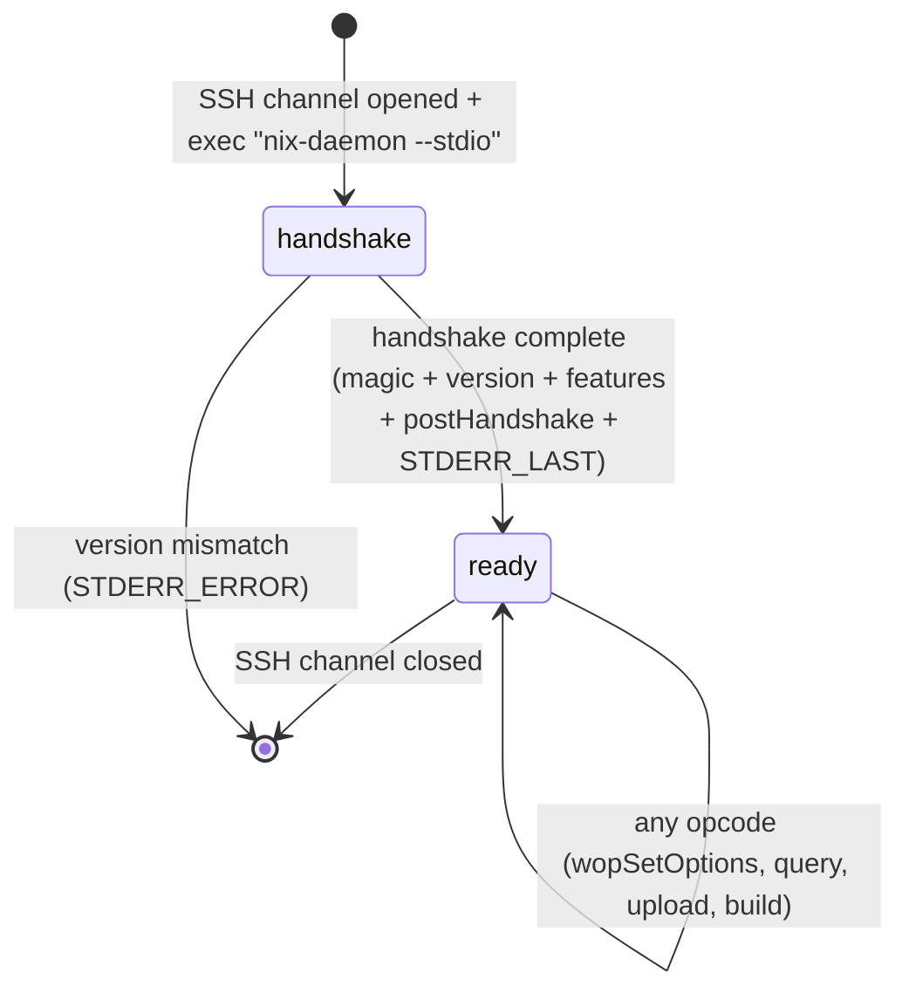

# rio-gateway

The gateway is the entry point. It terminates SSH connections and speaks the Nix worker protocol, making rio-build appear as a standard Nix remote store/builder.

## Responsibilities

- SSH server via `russh` crate --- accepts connections, authenticates via SSH keys
- Implement the Nix worker protocol (version negotiation, opcode handling)
- Handle both remote store mode (full DAG submission) and build hook mode (per-derivation delegation)
- STDERR streaming loop: send `STDERR_NEXT`, `STDERR_START_ACTIVITY`, `STDERR_STOP_ACTIVITY`, `STDERR_RESULT`, `STDERR_LAST` during operations
- Translate protocol ops into internal gRPC calls to scheduler and store
- Each SSH channel maintains independent protocol state (separate handshake and option negotiation)

## Critical Opcodes

| Opcode | Value | Description |
|--------|-------|-------------|
| `wopIsValidPath` | 1 | Check if a store path exists |
| `wopBuildPaths` | 9 | Build a set of derivations |
| `wopAddTempRoot` | 11 | Add temporary GC root |
| `wopSetOptions` | 19 | Accept client build configuration |
| `wopQueryPathInfo` | 26 | Return full path metadata |
| `wopQueryPathFromHashPart` | 29 | Resolve a store path from its hash prefix |
| `wopQueryValidPaths` | 31 | Batch validity check |
| `wopBuildDerivation` | 36 | Build a single derivation |
| `wopAddSignatures` | 37 | Add signatures to a path |
| `wopNarFromPath` | 38 | Export path as NAR |
| `wopAddToStoreNar` | 39 | Accept NAR imports |
| `wopQueryMissing` | 40 | Report what needs building |
| `wopQueryDerivationOutputMap` | 41 | Get output name -> path mapping |
| `wopRegisterDrvOutput` | 42 | Register CA derivation output |
| `wopQueryRealisation` | 43 | Query CA realisation |
| `wopAddMultipleToStore` | 44 | Batch NAR import |
| `wopBuildPathsWithResults` | 46 | Build paths and return results |

### wopSetOptions (19) Field Sequence

The fields are sent in order, all as `u64` unless noted. `wopSetOptions` is **mandatory** as the first opcode after handshake --- Nix always sends it before any other operation.

1. `keepFailed` (u64 bool)
2. `keepGoing` (u64 bool)
3. `tryFallback` (u64 bool)
4. `verbosity` (u64)
5. `maxBuildJobs` (u64)
6. `maxSilentTime` (u64)
7. `obsolete_useBuildHook` (u64: always 1)
8. `verboseBuild` (u64)
9. `obsolete_logType` (u64: 0)
10. `obsolete_printBuildTrace` (u64: 0)
11. `buildCores` (u64)
12. `useSubstitutes` (u64 bool)
13. *(version >= 1.12)* `overrides_count` (u64) followed by `overrides_count` pairs of `(key: string, value: string)`

**Override propagation:** The `overrides` key-value pairs contain client build settings (e.g., `max-silent-time`, `build-timeout`). The gateway extracts relevant overrides and propagates them through the build pipeline: gateway -> scheduler (via gRPC) -> workers. This ensures client-specified timeouts are honored by the actual build execution.

### wopNarFromPath (38) Wire Format

Exports a store path as a NAR archive. The NAR content is sent inside the STDERR streaming loop using `STDERR_WRITE` messages, **not** as a standalone byte stream.

| Direction | Field | Type | Description |
|-----------|-------|------|-------------|
| C -> S | `path` | string | Store path to export |

The server then enters the STDERR loop:

1. Server sends one or more `STDERR_WRITE` (`0x64617416`) messages, each containing a chunk of NAR data as `string data` (length-prefixed with padding)
2. Server may interleave `STDERR_NEXT` log messages
3. Server sends `STDERR_LAST` (`0x616c7473`) to end the loop

The client must concatenate the data from all `STDERR_WRITE` messages to reconstruct the full NAR. There is no explicit result value after `STDERR_LAST` for this opcode --- the NAR data IS the result.

### wopAddToStoreNar (39) Wire Format

For protocol >= 1.25 (always present since we target 1.37+):

| Field | Type | Description |
|-------|------|-------------|
| `path` | string | Store path being imported |
| `deriver` | string | Deriver path (empty if unknown) |
| `narHash` | string | SHA-256 hash of the NAR (`sha256:...`) |
| `references` | string collection | Referenced store paths |
| `registrationTime` | u64 | Registration timestamp |
| `narSize` | u64 | Size of the NAR in bytes |
| `ultimate` | u64 bool | Whether this is the ultimate trusted source |
| `sigs` | string collection | Signatures |
| `ca` | string | Content address (empty for input-addressed) |
| `repair` | u64 bool | Whether to repair/overwrite existing path |

After sending the metadata fields, the NAR data is transferred via the **STDERR_READ pull loop** (not a trailing framed stream):

1. Server sends `STDERR_READ` (`0x64617461`) + `u64 count` (bytes requested)
2. Client responds with length-prefixed data: `u64(len) + bytes + padding-to-8`
3. The loop repeats until the server has received `narSize` bytes
4. Server sends `STDERR_LAST` (`0x616c7473`) followed by the result (`u64 1` = success)

This is a server-driven pull: the server controls the flow by requesting specific chunk sizes. The client must not send NAR data until prompted by `STDERR_READ`.

### wopAddMultipleToStore (44) Wire Format

Added in protocol 1.32 (always present for 1.37+). This is the primary upload path for modern Nix clients, replacing per-item `wopAddToStoreNar` for source paths.

| Field | Type | Description |
|-------|------|-------------|
| `repair` | u64 bool | Whether to repair/overwrite |
| `dontCheckSigs` | u64 bool | Skip signature verification (see note below) |

Followed by a **framed byte stream** containing all entries concatenated. The framed stream is a byte transport --- **entry boundaries do not align with frame boundaries**. A single frame may contain the end of one entry and the beginning of the next, or an entry may span multiple frames. The receiver must:

1. Reassemble frames into a contiguous byte stream
2. Parse entries sequentially from the reassembled stream

Each entry in the byte stream contains:

| Field | Type | Description |
|-------|------|-------------|
| `pathInfo` | (same fields as wopAddToStoreNar metadata) | Path metadata |
| NAR data | embedded framed stream | The NAR content (this inner framed stream IS frame-aligned) |

The outer framed stream terminates with a `u64(0)` sentinel.

**`dontCheckSigs` handling:** The gateway always treats `dontCheckSigs` as `false` regardless of the value sent by the client. This is a security requirement --- remote clients must never bypass signature verification. The field is read and discarded to maintain wire compatibility.

### DerivedPath Wire Format

`DerivedPath` is used by `wopBuildPaths` (9) and `wopBuildPathsWithResults` (46) to specify what to build. It is sent as a single string that the server must parse. There are three forms:

| Form | Syntax | Example | Description |
|------|--------|---------|-------------|
| Opaque | plain store path | `/nix/store/abc...-foo` | Build/fetch this exact path |
| Built (explicit outputs) | `drvPath!output1,output2` | `/nix/store/abc...-foo.drv!out,dev` | Build specific outputs of a derivation |
| Built (all outputs) | `drvPath!*` | `/nix/store/abc...-foo.drv!*` | Build all outputs of a derivation |

The `!*` form is the **default** used by `nix build`. When a client runs `nix build /nix/store/abc...-foo.drv`, it sends the `drvPath!*` form.

Both `wopBuildPaths` and `wopBuildPathsWithResults` send a `string collection` of `DerivedPath` values. The gateway must parse each string to determine the form and extract the derivation path and requested outputs.

### wopBuildDerivation (36) -- BasicDerivation Wire Format

Sends an inline `BasicDerivation` (without `inputDrvs`). For protocol 1.37+:

| Field | Type | Description |
|-------|------|-------------|
| `drvPath` | string | The `.drv` store path |
| `outputs` | collection of output tuples | See below |
| `inputSrcs` | string collection | Input source store paths |
| `platform` | string | e.g. `x86_64-linux` |
| `builder` | string | Builder executable path |
| `args` | string collection | Builder arguments |
| `env` | string-pair collection | Environment variables |
| `buildMode` | u64 | 0=Normal, 1=Repair, 2=Check |

Each **output tuple** (protocol >= 1.32):

| Field | Type | Description |
|-------|------|-------------|
| `name` | string | Output name (e.g. `out`, `dev`) |
| `path` | string | Output store path |
| `hashAlgo` | string | Hash algorithm for CA outputs (empty for input-addressed) |
| `hash` | string | Expected hash for CA outputs (empty for input-addressed) |

**DAG reconstruction:** The gateway cannot reconstruct the dependency DAG from `BasicDerivation` alone (it has no `inputDrvs`). The gateway reconstructs the full DAG by parsing the `.drv` files uploaded in the preceding `wopAddToStoreNar`/`wopAddMultipleToStore` step. Each `.drv` file contains `inputDrvs` references that form the DAG edges.

### wopQueryDerivationOutputMap (41) Wire Format

**Important:** This opcode is called by all modern Nix clients unconditionally, not just for CA derivations. For input-addressed derivations, it must return the statically-known output paths (computable from the derivation itself).

**Resolution strategy:** The gateway computes the output map locally from the parsed `.drv` file (obtained from the per-session `.drv` cache built during `wopAddToStoreNar`/`wopAddMultipleToStore`, or fetched from rio-store if the `.drv` was uploaded in a previous session). For input-addressed derivations, the output paths are deterministic and computed from the derivation's ATerm representation. For CA derivations (Phase 5), the gateway first checks rio-store for realized output paths via `QueryPathInfo`; if unknown, it returns the placeholder output paths from the `.drv`.

| Direction | Field | Type | Description |
|-----------|-------|------|-------------|
| C -> S | `drvPath` | string | The `.drv` store path to query |
| S -> C | `count` | u64 | Number of output mappings |
| S -> C | (per output) `name` | string | Output name |
| S -> C | (per output) `path` | string | Output store path |

### wopIsValidPath (1) Wire Format

| Direction | Field | Type | Description |
|-----------|-------|------|-------------|
| C -> S | `path` | string | Store path to check |

Response (after STDERR loop):

| Direction | Field | Type | Description |
|-----------|-------|------|-------------|
| S -> C | `valid` | u64 bool | 1 if path exists in store, 0 otherwise |

### wopQueryPathInfo (26) Wire Format

| Direction | Field | Type | Description |
|-----------|-------|------|-------------|
| C -> S | `path` | string | Store path to query |

Response (after STDERR loop). First, a validity flag:

| Field | Type | Description |
|-------|------|-------------|
| `valid` | u64 bool | 1 if path exists, 0 if not (stop here if 0) |

If `valid == 1`, the following fields are sent in order:

| Field | Type | Description |
|-------|------|-------------|
| `deriver` | string | Deriver path (empty if unknown) |
| `narHash` | string | NAR hash (sha256:...) |
| `references` | string collection | Referenced store paths |
| `registrationTime` | u64 | Registration timestamp |
| `narSize` | u64 | NAR size in bytes |
| `ultimate` | u64 bool | Whether this is the ultimate source |
| `sigs` | string collection | Signatures |
| `ca` | string | Content address (empty for input-addressed) |

### wopQueryValidPaths (31) Wire Format

| Direction | Field | Type | Description |
|-----------|-------|------|-------------|
| C -> S | `paths` | string collection | Store paths to check |
| C -> S | `substitute` | u64 bool | Whether to attempt substitution for missing paths (ignored by rio-build) |

Response (after STDERR loop):

| Direction | Field | Type | Description |
|-----------|-------|------|-------------|
| S -> C | `validPaths` | string collection | Subset of input paths that exist in the store |

### wopBuildPaths (9) Wire Format

| Direction | Field | Type | Description |
|-----------|-------|------|-------------|
| C -> S | `paths` | string collection | `DerivedPath` values (see DerivedPath Wire Format above) |
| C -> S | `buildMode` | u64 | 0=Normal, 1=Repair, 2=Check |

Response (after STDERR loop): `u64(1)` for success. On failure, the STDERR loop includes `STDERR_ERROR`.

**Note:** Unlike `wopBuildPathsWithResults`, this opcode does NOT return per-path `BuildResult` structures.

### wopQueryMissing (40) Wire Format

| Direction | Field | Type | Description |
|-----------|-------|------|-------------|
| C -> S | `paths` | string collection | `DerivedPath` values to check |

Response (after STDERR loop):

| Field | Type | Description |
|-------|------|-------------|
| `willBuild` | string collection | Store paths that need building |
| `willSubstitute` | string collection | Store paths that can be substituted (always empty for rio-build) |
| `unknown` | string collection | Store paths with unknown status |
| `downloadSize` | u64 | Estimated download size in bytes |
| `narSize` | u64 | Estimated total NAR size in bytes |

### BuildResult Wire Format (returned by wopBuildPathsWithResults)

`wopBuildPathsWithResults` (opcode 46) returns one `BuildResult` per requested path. For protocol 1.37+, all fields are present:

| Field | Type | Description |
|-------|------|-------------|
| `status` | u64 | See status enum below |
| `errorMsg` | string | Error message (empty on success) |
| `timesBuilt` | u64 | Number of times this derivation was built |
| `isNonDeterministic` | u64 bool | Whether non-deterministic output was detected |
| `startTime` | u64 | Build start time (Unix epoch) |
| `stopTime` | u64 | Build stop time (Unix epoch) |
| `builtOutputs` | collection | Output entries (see below) |

**BuildResult status enum:**

| Value | Name | Description |
|-------|------|-------------|
| 0 | Built | Successfully built |
| 1 | Substituted | Fetched from substituter |
| 2 | AlreadyValid | Output already existed |
| 3 | PermanentFailure | Build failed (not retryable) |
| 4 | TransientFailure | Build failed (may succeed on retry) |
| 5 | CachedFailure | Previously recorded failure |
| 6 | TimedOut | Build exceeded timeout |
| 7 | MiscFailure | Other failure |
| 8 | DependencyFailed | A dependency failed |
| 9 | LogLimitExceeded | Build log exceeded size limit |
| 10 | NotDeterministic | Non-deterministic output detected |
| 11 | ResolveFailed | Derivation resolution failed |
| 12 | NoSubstituters | No substituters available |

Each **builtOutput** entry:

| Field | Type | Description |
|-------|------|-------------|
| `name` | string | Output name |
| `path` | string | Realized output store path |
| `hashAlgo` | string | Hash algorithm (for CA outputs) |
| `hash` | string | Output content hash (for CA outputs) |

## Wire Format

- All integers: 64-bit unsigned, little-endian
- Strings/buffers: `u64(len) + bytes + zero-pad-to-8-byte-boundary`
- Empty strings: `u64(0)` with no bytes and no padding
- Collections: `u64(count) + elements`
- Framed data (for NARs): sequence of `u64(chunk_len) + chunk_data` terminated by `u64(0)` --- chunk data is NOT padded (unlike strings)

### Handshake Sequence (Protocol 1.38+)

> **Correction (discovered during implementation):** The original design stated that magic bytes are u32, the only exception to the u64 rule. This is incorrect. In the actual Nix C++ source, `readInt()` / `writeInt()` serialize all integers as u64 LE, **including the magic bytes**. The handshake uses u64 throughout, with no exceptions.

The handshake has three phases: magic+version exchange (`BasicClientConnection::handshake`), feature exchange (protocol >= 1.38), and post-handshake (`postHandshake`).

**Phase 1: Magic + Version Exchange**

| Step | Direction | Data | Type |
|------|-----------|------|------|
| 1 | C -> S | `WORKER_MAGIC_1` (`0x6e697863`) | u64 |
| 2 | S -> C | `WORKER_MAGIC_2` (`0x6478696f`) | u64 |
| 3 | S -> C | Protocol version (encoded as `(major << 8) \| minor`, e.g. `0x126` = 1.38) | u64 |
| 4 | C -> S | Client protocol version | u64 |

The negotiated version is `min(client_version, server_version)`. If the client version < 1.37, the server should send `STDERR_ERROR` and close the connection.

**Phase 2: Feature Exchange (protocol >= 1.38)**

| Step | Direction | Data | Type |
|------|-----------|------|------|
| 5 | C -> S | Client feature set | string collection |
| 6 | S -> C | Server feature set | string collection |

The feature sets are intersected to determine the negotiated features. rio-build currently advertises an empty feature set.

**Phase 3: Post-Handshake (`postHandshake`)**

| Step | Direction | Data | Type |
|------|-----------|------|------|
| 7 | C -> S | Obsolete CPU affinity (always 0; if non-zero, followed by a second u64 mask) | u64 |
| 8 | C -> S | `reserveSpace` (always 0) | u64 |
| 9 | S -> C | Nix version string (e.g. `"rio-build 0.1.0"`) | string |
| 10 | S -> C | Trusted status: 0 = unknown, 1 = trusted, 2 = not-trusted | u64 |

**Phase 4: Initial STDERR_LAST**

| Step | Direction | Data | Type |
|------|-----------|------|------|
| 11 | S -> C | `STDERR_LAST` (`0x616c7473`) | u64 |

The client calls `processStderrReturn()` after the handshake, which reads messages until `STDERR_LAST`. The server must send `STDERR_LAST` to complete the handshake before the client will send any opcodes.

> **Note on flush points:** The server must flush after steps 2-3, after step 6, after steps 9-10, and after step 11. Without explicit flushes, data may remain buffered and the client will block waiting for the response.

## Protocol Multiplexing

The Nix worker protocol is strictly sequential within a single connection --- the client sends a request, waits for the full response (including the STDERR streaming loop), then sends the next request. There is no pipelining or out-of-order execution.

Multiple clients require multiple SSH channels or connections. The gateway multiplexes at the SSH channel level (one protocol session per channel), not at the protocol level. Each SSH channel has independent protocol state, including separate handshake and option negotiation. During long `wopBuildDerivation` calls, the connection is blocked (the STDERR loop runs for the duration of the build). Nix handles this by opening separate SSH channels for concurrent operations (e.g., IFD during evaluation).

## DAG Reconstruction

When the gateway receives `wopBuildDerivation` or `wopBuildPathsWithResults`, it must reconstruct the full derivation DAG to send to the scheduler via `SubmitBuild`. The algorithm:

1. **During `wopAddToStoreNar`/`wopAddMultipleToStore`:** The gateway intercepts each uploaded path. If the path ends in `.drv`, the gateway parses the ATerm-format derivation and caches the parsed result in per-session memory (keyed by store path).
2. **On `wopBuildDerivation`/`wopBuildPathsWithResults`:** The gateway identifies all requested derivation paths. For each, it looks up the parsed derivation from the session cache (step 1). If a `.drv` was not uploaded in the current session (e.g., it was uploaded in a previous session and already exists in the store), the gateway fetches it from rio-store via `GetPath`, unpacks the NAR, and parses the ATerm.
3. **DAG construction:** Starting from the requested derivation(s), the gateway walks `inputDrvs` references recursively to build the full DAG. Derivations whose outputs are already known to be in the store (via `FindMissingPaths`) are included as completed nodes.
4. **Validation:** Malformed `.drv` files cause `STDERR_ERROR` with type `"Error"` and a descriptive message. Missing `.drv` files (referenced by `inputDrvs` but not in the store) cause `STDERR_ERROR` with type `"Error"`.
5. **The reconstructed DAG is sent to the scheduler via `SubmitBuild`.** The gateway holds the SSH connection open and converts the `BuildEvent` response stream into STDERR messages for the Nix client.

> **Session state:** Although the gateway is described as "stateless beyond the lifetime of a single SSH connection," each SSH channel does accumulate per-session state: the parsed `.drv` cache, the `wopSetOptions` configuration, and the `wopAddTempRoot` set. This state is connection-scoped and discarded when the SSH channel closes.

## Connection Lifecycle

Each SSH channel follows this lifecycle:

> **Correction:** The original design required `wopSetOptions` as the mandatory first opcode after handshake. In practice, the real `nix-daemon` does not enforce this --- it accepts any opcode after the handshake completes. Nix clients conventionally send `wopSetOptions` first, but may send other opcodes (e.g., `wopQueryMissing`) first on multiplexed SSH channels. rio-build accepts any opcode after handshake.

**SSH transport:** Nix connects via `ssh ... nix-daemon --stdio`. The gateway must handle `exec_request` for this command and start the protocol on the SSH channel data stream. The `channel_open_session` alone does not start the protocol.

## STDERR Message Types

| Constant | Value | Direction | Meaning |
|----------|-------|-----------|---------|
| `STDERR_NEXT` | `0x6f6c6d67` | S -> C | Log/trace message (followed by: `string msg`) |
| `STDERR_READ` | `0x64617461` | S -> C | Server needs data from client (followed by: `u64 count` bytes requested) |
| `STDERR_WRITE` | `0x64617416` | S -> C | Server sending data to client (followed by: `string data`) |
| `STDERR_LAST` | `0x616c7473` | S -> C | End of stderr stream; result follows |
| `STDERR_ERROR` | `0x63787470` | S -> C | Error occurred (see format below) |
| `STDERR_START_ACTIVITY` | `0x53545254` | S -> C | Start structured activity |
| `STDERR_STOP_ACTIVITY` | `0x53544f50` | S -> C | End structured activity |
| `STDERR_RESULT` | `0x52534c54` | S -> C | Structured result for an activity |

### STDERR_ERROR Wire Format

This is a complex nested structure. The gateway must construct it correctly for every error response (rejected opcodes, failed builds, etc.):

| Field | Type | Description |
|-------|------|-------------|
| `type` | string | Error type (e.g. `"Error"`, `"nix::Interrupted"`) |
| `level` | u64 | Error level |
| `name` | string | Program name (e.g. `"rio-build"`) |
| `message` | string | Human-readable error message |
| `havePos` | u64 bool | Whether position info follows |
| (if havePos) `file` | string | Source file |
| (if havePos) `line` | u64 | Line number |
| (if havePos) `column` | u64 | Column number |
| `traceCount` | u64 | Number of trace entries |
| (per trace) `havePos` | u64 bool | Whether trace position follows |
| (per trace, if havePos) `file`, `line`, `column` | string, u64, u64 | Trace position |
| (per trace) `message` | string | Trace message |

### STDERR_START_ACTIVITY Wire Format

| Field | Type | Description |
|-------|------|-------------|
| `id` | u64 | Activity ID (unique per session) |
| `level` | u64 | Verbosity level |
| `type` | u64 | Activity type (see enum below) |
| `text` | string | Human-readable activity description |
| `fieldsCount` | u64 | Number of structured fields |
| (per field) | u64 type + value | Typed field data |
| `parentId` | u64 | Parent activity ID (0 = no parent) |

**Activity type enum:**

| Value | Name | Description |
|-------|------|-------------|
| 0 | Unknown | Unknown/unclassified activity |
| 101 | CopyPath | Copying a single store path |
| 102 | FileTransfer | Downloading/uploading a file |
| 103 | Realise | Realising a derivation output |
| 104 | CopyPaths | Copying multiple store paths |
| 105 | Builds | Top-level "building N derivations" |
| 106 | Build | Building a single derivation |
| 107 | OptimiseStore | Optimising the store (dedup) |
| 108 | VerifyPaths | Verifying store paths |
| 109 | Substitute | Substituting a path |
| 110 | QueryPathInfo | Querying path info from a substituter |
| 111 | PostBuildHook | Running post-build hook |
| 112 | BuildWaiting | Build waiting for a lock |

Note: values 1--100 are unused. The enum starts at 0 (Unknown) then jumps to 101.

## Protocol Compatibility

Target: protocol version **1.38+** (Nix 2.20+, advertised as `0x126`). Minimum accepted client version is 1.37. Older clients are rejected at handshake with a human-readable error.

> **Correction:** rio-build advertises protocol 1.38 (not 1.37) to support the feature exchange step added in that version. The minimum accepted client version remains 1.37 for backwards compatibility.

Unknown or unsupported opcodes return `STDERR_ERROR` and **close the connection**. This is necessary because the opcode's payload remains unread in the stream and its format is unknown, making it impossible to skip to the next opcode without corrupting the protocol. The Nix client will reconnect automatically.

| Category | Opcodes |
|----------|---------|
| Fully implemented | `wopIsValidPath`, `wopQueryPathInfo`, `wopQueryValidPaths`, `wopAddToStoreNar`, `wopNarFromPath`, `wopBuildDerivation`, `wopBuildPaths`, `wopBuildPathsWithResults`, `wopQueryMissing`, `wopAddTempRoot`, `wopSetOptions`, `wopAddMultipleToStore`, `wopQueryDerivationOutputMap` |
| CA-aware (Phase 2c: writes/reads metadata; Phase 5: full cutoff) | `wopRegisterDrvOutput`, `wopQueryRealisation` |
| Stubbed (accept & no-op) | `wopAddSignatures` |
| Stubbed (returns empty) | `wopQueryPathFromHashPart` |
| Rejected (STDERR_ERROR) | Everything else |

**Note on `wopQueryDerivationOutputMap`:** Moved from "CA-aware" to "Fully implemented" because modern Nix clients call this for ALL derivation types. For input-addressed derivations, it returns the statically-known output paths. For CA derivations, it returns the realized output paths if known.

**Note on `wopQueryPathFromHashPart`:** Stubbed to return empty (no match). This opcode is used by `nix copy` and during content-addressed store path resolution. Workflows affected by the stub: `nix copy --to ssh-ng://rio` may fail for CA paths that require hash-part resolution, and `nix store ls` on CA outputs may not resolve correctly. For the initial release (input-addressed derivations only), this is acceptable. Full implementation is planned for Phase 5 (CA support).

**Note on `wopAddTempRoot`:** Accepts the store path and records it as a connection-scoped temporary GC root in-memory. These temp roots prevent GC of paths the client is actively using. They are lost on gateway pod restart, which is acceptable given the store's 24-hour GC grace period. The store's GC relies on the 24-hour grace period rather than querying gateways for active temp roots.

## Build Hook Protocol Path

When a Nix client uses `--builders` (build hook mode) instead of `--store ssh-ng://` (remote store mode), the interaction pattern changes significantly:

**How it works:** The local `nix-daemon` drives DAG traversal and delegates individual derivations to rio-build one at a time via `wopBuildDerivation`. Each hook invocation is an independent SSH session that submits a single derivation without the full DAG context.

**What the gateway does:**
- Receives `wopAddToStoreNar` for the derivation's inputs, then `wopBuildDerivation` for the target derivation
- Creates a **single-node "DAG"** for each hook invocation (no edges, no DAG context)
- Submits to the scheduler via `SubmitBuild` as usual

**Scheduling optimizations lost in build hook mode:**
- **No critical-path analysis** --- the scheduler sees each derivation in isolation, not as part of a graph
- **No multi-build DAG merging** --- shared derivations between concurrent builds cannot be deduplicated at the scheduling level
- **Limited closure-locality scoring** --- the scheduler can still use bloom filter locality data, but cannot pre-plan affinity across the build graph
- **No CA early cutoff** --- without the full DAG, the scheduler cannot propagate cutoffs to downstream nodes

**IFD detection:** When a `wopBuildDerivation` call arrives without a preceding `wopBuildPathsWithResults` on the same session, the gateway sets `is_ifd_hint = true`, and the scheduler assigns `priority_class = "interactive"` regardless of the build's configured priority.

> **Recommendation:** Prefer `ssh-ng://` (remote store mode) over `--builders` (build hook mode) for better scheduling. The build hook path exists for compatibility with existing `nix.conf` setups, but delivers worse throughput and scheduling quality for large builds.

## High Availability

- Multiple gateway replicas sit behind a TCP load balancer (NLB on EKS with idle timeout ≥ 3600s).
- Session state is connection-scoped --- the gateway is stateless beyond the lifetime of a single SSH connection.
- If a gateway pod dies, the affected SSH connections drop. Clients reconnect automatically (standard Nix retry behavior) and land on a healthy replica.
- Builds that were already in progress continue in the scheduler; only the log-streaming link is lost.
- The gateway does not own durable state. All persistent data lives in the scheduler (PostgreSQL) and the store.
- Consider using a non-standard SSH port (e.g., 2222) to avoid conflicts with host SSH daemons and corporate firewalls blocking port 22 for non-standard destinations.
- Gateway pods should have a preStop hook and `terminationGracePeriodSeconds` (e.g., 600s) to allow in-flight SSH sessions to complete during rolling updates.

## Key Files

- `rio-gateway/src/server.rs` --- SSH server setup (russh)
- `rio-gateway/src/session.rs` --- Per-client session state
- `rio-gateway/src/handler.rs` --- Worker protocol opcode dispatch
- `rio-gateway/src/translate.rs` --- Nix protocol <-> internal gRPC translation
