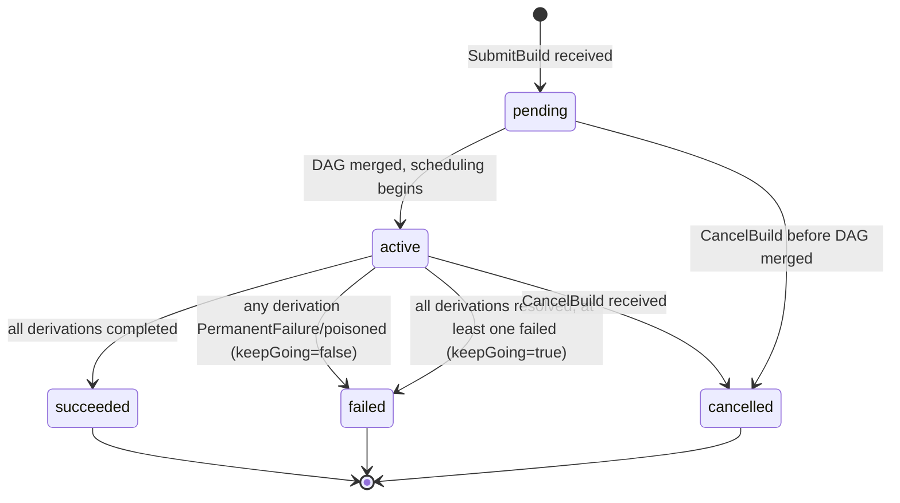
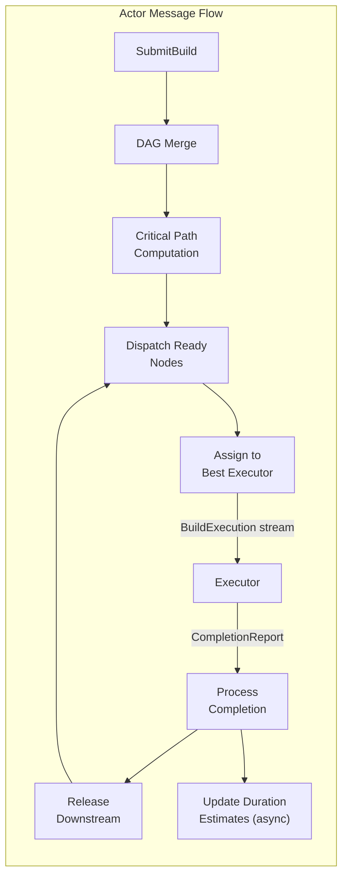

# rio-scheduler

Receives derivation build requests, analyzes the DAG, and publishes work to executors via a bidirectional streaming RPC.

## Responsibilities

- Parse derivation graphs from gateway requests
- Query rio-store for cache hits (already-built outputs)
- Compute remaining work graph (subtract cached nodes)
- Critical-path priority computation (bottom-up: priority = own\_duration + max(successor priorities)); recomputed incrementally on completion by walking ancestors with dirty-flag propagation
- Duration estimation from the SLA model's `T_min` (per-`(pname, system, tenant)` fit; see Duration Estimation)
- Resource-aware scheduling: match derivation `requiredSystemFeatures` and resource needs to executor capabilities (subset matching: all required features must be present on the executor)
- Auto-pin live build inputs: on dispatch, `pin_live_inputs` writes the derivation's input closure to the `scheduler_live_pins` table (used by rio-store's GC mark phase as a root seed); unpinned on completion
- Proxy `AdminService.TriggerGC` to rio-store, first collecting live-build output paths via `ActorCommand::GcRoots` and forwarding them as `extra_roots`
- Priority queue with inter-build priority (CI > interactive > scheduled) and intra-build priority (critical path)
- IFD prioritization: builds that block evaluation get maximum priority (detected by protocol sequencing --- `wopBuildDerivation` arriving before `wopBuildPathsWithResults` on the same session)
- CA early cutoff: per-edge tracking --- when a CA derivation output matches cached content, mark that edge as cutoff and skip downstream only when ALL input edges are resolved. Compare implemented (P0251); propagate is P0252
- Work reassignment: when an executor fails (stream closed, heartbeat timeout), reassign its in-flight derivations to another executor. _Slow-executor speculative reassignment (actual\_time > estimated\_time × 3) is not currently implemented._
- Poison derivation tracking: mark derivations that fail on 3+ different executors; auto-expire after 24h. See [Error Taxonomy](../errors.md) for details.

## Concurrency Model

r[sched.actor.single-owner]
The scheduler uses a **single-owner actor model** for the in-memory global DAG. A single Tokio task owns the DAG and processes all mutations from an `mpsc` channel:

- `SubmitBuild` → DAG merge command
- `ReportCompletion` → node completion + downstream release command
- `CancelBuild` → orphan derivations command
- Heartbeat → executor liveness + running_build reconcile
- CA early cutoff → edge cutoff + potential cancellation command

gRPC handler tasks send commands to the DAG actor and `await` responses. This eliminates lock contention, makes operation ordering deterministic, and simplifies reasoning about correctness. PostgreSQL writes are batched and performed asynchronously by the actor.

r[sched.actor.dispatch-decoupled]
`dispatch_ready` runs from state-change events (`MergeDag`, `ProcessCompletion`, `PrefetchComplete`) and from `Tick` when the `dispatch_dirty` flag is set. `Heartbeat` sets `dispatch_dirty` instead of dispatching inline --- at N executors / 10s heartbeat interval that is N/10 dispatch passes per second, and each pass costs one full-DAG batch-FOD scan plus a `ready_queue` drain. At 290 executors and a 27k-node DAG (I-163) the inline path generated ~5× actor capacity and pushed `actor_mailbox_depth` to 9.5k. Coalescing to once per Tick bounds the heartbeat-driven dispatch rate at 1/s regardless of fleet size.

r[sched.dispatch.became-idle-immediate]
A `Heartbeat` that transitions an executor's capacity 0→1 (fresh registration, `store_degraded` clear, `draining` clear, phantom drain) dispatches inline instead of deferring to `Tick`. This is the carve-out from `r[sched.actor.dispatch-decoupled]`: the 0→1 transition is at most once per executor per degrade/spawn cycle (not N/10 per second), and deferring it adds up to one full tick interval of idle time to every freshly-spawned ephemeral builder --- the controller spawned the pod *because* work is queued, so the slot is immediately useful. Steady-state heartbeats from already-idle or already-busy executors still only set `dispatch_dirty`. Inline dispatches from this carve-out are capped at `BECAME_IDLE_INLINE_CAP` (4) per Tick: leader-failover or fleet-wide degrade-clear makes every executor's heartbeat a 0→1 edge at once, which would otherwise reintroduce the I-163 storm via the back door; past the cap, further 0→1 heartbeats set `dispatch_dirty` and coalesce to the next Tick.

r[sched.admin.snapshot-cached]
`AdminService.ClusterStatus` reads a `watch::channel` snapshot that the actor publishes once per `Tick`, instead of round-tripping `ActorCommand::ClusterSnapshot` through the mailbox. The handler itself is ~37µs; queuing it behind a saturated mailbox (I-163: 9.5k commands) made it time out at exactly the moment the controller's reconcile loop and operators need a reading. The cached value is at most one Tick (~1s) stale.

## Scheduling Algorithm

**Implemented:** critical-path priority (BinaryHeap ReadyQueue), per-derivation SLA sizing (`solve_intent_for` → `(cores, mem, disk, deadline)` per `r[sched.admin.spawn-intents]`), PrefetchHint (full `approx_input_closure` before WorkAssignment), leader election via Kubernetes Lease gated on `RIO_LEASE_NAME`, `AdminService.ClusterStatus`/`DrainExecutor`, Pool CRD + one-shot Job reconciler. Interactive builds get a +1e9 priority boost (dwarfs any critical-path value).

```
1. Receive derivation DAG from gateway
2. Merge into global DAG (dedup by store path / derivation hash; see Multi-Build DAG Merging)
3. For each derivation in DAG:
   a. Query rio-store: is output already in CAS? (cache hit)
   b. For CA derivations: check content-indexed CAS for matching output
4. Compute remaining build graph (nodes without cached outputs)
5. If empty -> full cache hit, return results immediately
6. Compute critical path priorities (bottom-up traversal)
7. For each ready node (all deps satisfied):
   a. Solve per-derivation (cores, mem, disk, deadline) via the SLA model
      (solve_intent_for; ADR-023). The controller spawns one-shot pods sized
      to the same SpawnIntent.
   b. Hard-filter executors: required features present? executor idle (one build
      per pod)? system match? Candidates that fail are excluded entirely.
   c. Assign to the first eligible executor via the bidirectional BuildExecution stream.
      The WorkAssignment carries an HMAC-SHA256-signed assignment token (Claims:
      `executor_id`, `drv_hash`, `expected_outputs`, `is_ca`, `expiry_unix`). The store verifies
      the token on PutPath and rejects uploads for paths not in `expected_outputs`.
      See [Security: assignment tokens](../security.md#boundary-2-gatewayexecutor--internal-services-grpc).
8. As builds complete (reported via BuildExecution stream):
   a. Upload output to rio-store (executor does this before reporting)
   b. For CA derivations: check if output content matches any existing CAS entry
      - If match -> mark that specific edge as "cutoff"
      - For each downstream node, check if ALL input edges are in one of:
        (a) cached, (b) cutoff, (c) rebuilt but content-hash matches old
      - Only skip a downstream node if ALL its input edges meet these conditions
      - If a downstream node is already running when cutoff is detected: let it finish
        and discard the result (see Preemption below)
   c. Release newly-ready downstream nodes
   d. Record actual (cores, mem_peak, disk_peak, wall) into build_samples for SLA refit
   e. Recompute priorities incrementally: walk up ancestors only, using dirty-flag
      propagation -- only ancestors whose max-successor-priority changed need updating
9. On failure: classify error (see errors.md), apply retry policy, reassign or mark as failed
```

r[sched.merge.toctou-serial]
> **TOCTOU note on cache checks (steps 2--4):** The DAG merge and subsequent cache check MUST be performed inside the DAG actor (serialized), not by the gRPC handler before sending the merge command. A cache check performed by the gRPC handler races with concurrent merges --- another build may complete a shared derivation between the handler's cache check and the actor's merge, leading to duplicate work. By performing cache verification after merge inside the actor, the check reflects the latest state.

r[sched.completion.output-membership]
> **Completion report output membership:** `handle_completion` MUST drop any worker-supplied `BuiltOutput` whose `output_name` is not in the derivation's scheduler-trusted `output_names` (parsed from the `.drv` at DAG-merge time), and MUST drop duplicates by `output_name`. Builders are untrusted; without this filter a compromised worker reporting on its own assigned drv could write arbitrary worker-chosen paths to `path_tenants` (pinning them against GC) and stall the actor via the sequential `insert_realisation` loop. After filtering, `built_outputs.len() ≤ output_names.len()`. Dropped entries increment `rio_scheduler_undeclared_built_output_total`.

r[sched.completion.idempotent]
> **Completion report idempotency:** A `CompletionReport` for an already-completed derivation is accepted and ignored (no-op). The actor's state machine treats `completed → completed` as an idempotent transition. This handles duplicate reports caused by executor retries during scheduler failover, network retransmissions, or race conditions with CA early cutoff.

r[sched.tenant.resolve+2]
The scheduler's `submit_build` handler derives the tenant UUID primarily from the interceptor-attached `TenantClaims.sub` (see `r[sched.tenant.authz]`). When no claims are attached (dev mode, no JWT pubkey configured), it falls back to resolving `SubmitBuildRequest.tenant_name` — captured by the gateway from the server-side `authorized_keys` comment — via `SELECT tenant_id FROM tenants WHERE tenant_name = $1`. Unknown tenant name → `InvalidArgument`. Empty string → `None` (single-tenant mode, no PG lookup). This keeps the gateway PostgreSQL-free — preserving stateless N-replica HA.

r[sched.tenant.authz+2]
SchedulerService RPCs (`SubmitBuild`, `WatchBuild`, `QueryBuildStatus`, `CancelBuild`) MUST derive tenant identity from the interceptor-attached `TenantClaims.sub`, not from any proto body field. When a JWT pubkey is configured and no `TenantClaims` are attached (header absent — the interceptor is permissive-on-absent so co-hosted ExecutorService callers reach the port), the handler MUST reject with `UNAUTHENTICATED`. When `TenantClaims` ARE attached, `require_tenant` MUST additionally reject with `UNAUTHENTICATED` if `claims.jti` is present in `jwt_revoked` (see `r[gw.jwt.verify]`) — this is the scheduler-level revocation chokepoint and applies to all four RPCs, not only SubmitBuild. `WatchBuild`, `QueryBuildStatus`, and `CancelBuild` MUST additionally verify the target build's `tenant_id` equals `claims.sub` and reject with `PERMISSION_DENIED` on mismatch. `ResolveTenant` is exempt: the gateway calls it during SSH key auth before a JWT exists.

r[sched.store-client.reconnect]
The scheduler's gRPC channel to rio-store MUST use lazy connection (`Endpoint::connect_lazy`) with HTTP/2 keepalive so store pod rollouts do not require a scheduler restart. On `Unavailable`, the channel re-resolves DNS and reconnects transparently.

r[sched.gc.path-tenants-upsert]
On build completion, the scheduler upserts `(store_path_hash,
tenant_id)` rows into `path_tenants` for every output path × every
tenant whose build was interested in that derivation (dedup via
`interested_builds`). This is best-effort: upsert failure warns but
does not fail completion — GC may under-retain a path if the upsert
fails, but the build still succeeds. The upsert is `ON CONFLICT DO
NOTHING` (composite PK on `(store_path_hash, tenant_id)`); repeated
builds of the same path by the same tenant are idempotent.

r[sched.poison.ttl-persist]
`poisoned_at` is persisted to `derivations.poisoned_at TIMESTAMPTZ` when the poison threshold trips. Recovery loads poisoned rows via a separate `load_poisoned_derivations` query (since `TERMINAL_STATUSES` includes `"poisoned"` and `load_nonterminal_derivations` filters it out). The timestamp is converted back to `Instant` via PG-computed `EXTRACT(EPOCH FROM (now() - poisoned_at))`, so the 24h TTL check survives scheduler restart.

r[sched.retry.per-executor-budget]
`BuildResultStatus::InfrastructureFailure` does NOT count toward the
poison threshold. It routes through a separate
`handle_infrastructure_failure` handler: `reset_to_ready` + retry
WITHOUT inserting into `failed_builders`. Executor-local issues (FUSE
EIO, cgroup setup fail, OOM-kill of the build process) are not the
build's fault. `TransientFailure` (build ran, exited non-zero, might
succeed elsewhere) DOES count. Executor disconnect DOES count — a build
that crashes the daemon 3× is poisoned; false-positives from unrelated
executor deaths are cleared by `rio-cli poison clear`. Both knobs are
configurable via `scheduler.toml`: `threshold` (default 3, the former
`POISON_THRESHOLD` const), `require_distinct_workers` (default true —
HashSet semantics; false = any N failures poison, for single-executor
dev deployments). The retry backoff curve is likewise a `[retry]`
table. `failed_builders` persisted to PG; infrastructure retry count
is in-memory only.

r[sched.dispatch.fleet-exhaust+2]
When `find_executor` returns `None` and every *statically-eligible* **non-draining** registered worker (matching kind, `system`, and `required_features`) is already in `failed_builders`, the derivation is poisoned immediately rather than deferring. Draining workers MUST be excluded: under one-shot semantics (`r[sched.ephemeral.no-redispatch-after-completion]`), a just-failed worker is draining but still in the executor map at completion-time; counting it poisons a `poolSize=1` (or `required_features`-narrowed) derivation on the FIRST transient failure, bypassing `max_retries` and the poison threshold. Under one-shot the controller spawns fresh `executor_id`s ∉ `failed_builders`, so this check returns `false` in practice and poison-on-repeated-failure flows through `PoisonConfig::is_poisoned(threshold)`; the check remains as defense-in-depth for any future path where a worker fails without draining. The fleet filter MUST match the static-eligibility subset of `rejection_reason` (`r[sched.admin.inspect-dag]`); a narrower filter (e.g. kind-only) lets a drv defer forever in a multi-arch or feature-partitioned cluster with no INFO-level signal (the I-065 hang shape on the system/features axis).

```toml
# scheduler.toml — poison + retry knobs. All fields optional; absent
# keys fall through to the Default impl shown in comments.
[poison]
threshold = 3                      # failures before derivation is poisoned
require_distinct_workers = true    # HashSet: N DISTINCT executors must fail
                                   # (false = flat counter; single-executor dev)

[retry]
max_retries = 2                    # retries for transient failures
max_exempt_infra_retries = 50      # high-water terminal for cap-exempt infra
                                   # retries (CONCURRENT_PUTPATH, floor-promote)
backoff_base_secs = 5.0            # first-attempt backoff
backoff_multiplier = 2.0           # exponential growth
backoff_max_secs = 300.0           # clamp (inf would panic from_secs_f64)
jitter_fraction = 0.2              # ± fractional jitter on each backoff
```

r[sched.retry.exempt-infra-cap]
The `exempt_from_cap` infra-retry path (CONCURRENT_PUTPATH, `floor_outcome.promoted`) skips `infra_count++` and the `max_infra_retries` poison check by design — but MUST still terminate. A separate `exempt_infra_count` increments on every exempt attempt and poisons at `max_exempt_infra_retries` (default 50, well above I-127's 4-in-a-row benign ceiling). Without this terminal, a leaked store-side placeholder lock makes every honest worker report CONCURRENT_PUTPATH → infinite ephemeral-pod churn at `info!` level only with no scheduler-side counter advancing. The cap converts a silent livelock into an actionable poison; recovery cost is one `ClearPoison` after the underlying condition is fixed.

r[sched.admin.list-executors-leader-age]
`ListExecutorsResponse.leader_for_secs` is the seconds since this replica acquired leadership (`LeaderState::leader_for()`). Consumers MUST treat the executor list as potentially incomplete when `leader_for_secs` is small: on 2-replica failover the new leader's `self.executors` map starts empty and fills incrementally as workers reconnect over a 1--10s spread, so a non-empty partial list cannot prove absence. The controller's `orphan_reap_gate` fail-closes when `leader_for_secs < ORPHAN_REAP_GRACE` --- see `r[ctrl.ephemeral.reap-orphan-running]`.

r[sched.admin.list-executors]
`AdminService.ListExecutors` returns a point-in-time snapshot of all connected executors via an `ActorCommand::ListExecutors` (O(executors) scan, `send_unchecked` like `ClusterSnapshot` — dashboard needs a reading even under saturation). Each `ExecutorInfo` includes `executor_id`, `systems`, `supported_features`, `busy` (a build is in flight), `status` ("alive"/"draining"/"connecting"), `connected_since`, `last_heartbeat`, and `last_resources`. `Instant` fields are converted to wall-clock `SystemTime` by subtracting elapsed from `SystemTime::now()`. The optional `status_filter` matches "alive" (registered + not draining), "draining", or empty/unknown (show all).

r[sched.admin.list-builds]
`AdminService.ListBuilds` paginates via a direct PostgreSQL query with `LIMIT/OFFSET` (proto field `offset = 3`). Per-build derivation counts come from `LEFT JOIN build_derivations + derivations`; `cached_derivations` uses the heuristic "completed with no assignment row" (a cache-hit derivation transitions directly to Completed at merge time without dispatch). Optional `status_filter` matches the `builds.status` column. `total_count` is from a separate `COUNT(*)` query (unaffected by pagination). `ClusterStatus.store_size_bytes` is now populated from a 60s background task that polls `SUM(nar_size) FROM narinfo` — kept out of the handler's hot path since the controller polls it every reconcile tick.

r[sched.admin.clear-poison]
`AdminService.ClearPoison` resets both in-memory state (`reset_from_poison()`: Poisoned→Created, clear `failed_builders`, zero `retry_count`, null `poisoned_at`) and PostgreSQL (`db.clear_poison()`). Returns `cleared=true` only if both succeed. If PG fails after in-mem reset, returns `false` so the operator retries — next recovery would restore Poisoned, so in-mem/PG drift is self-correcting. Idempotent: calling on a non-poisoned or non-existent derivation returns `cleared=false` without error. The DAG is keyed on the full `.drv` store path; `rio-cli poison-clear` validates this client-side and rejects bare hashes (a silent no-match would look like "not poisoned" when it's actually "wrong key format").

r[admin.rpc.cancel-build]
`AdminService.CancelBuild` gates on `x-rio-service-token` (allowlist: `rio-cli`, `rio-controller`) and dispatches `ActorCommand::CancelBuild{caller_tenant: None}` --- operator override bypasses the tenant-ownership check that `SchedulerService.CancelBuild` applies. rio-cli holds a service-HMAC identity, not a tenant-JWT identity, so `SchedulerService.CancelBuild` is unreachable from the CLI in JWT mode (`r[sched.tenant.authz]`); this RPC is the CLI's path.

r[sched.admin.list-poisoned]
`AdminService.ListPoisoned` returns all currently-poisoned derivations from PostgreSQL (`status = 'poisoned'`). Each entry includes the full `.drv` store path (what `ClearPoison` takes), the list of executor IDs that failed building it, and the age in seconds (TTL is 24h). These are the ROOTS that cascade `DependencyFailed` — a single poisoned FOD can block hundreds of downstream derivations, which `rio-cli status` surfaces only as `[Failed] N/M drv` without naming the culprit.

r[sched.admin.list-tenants]
`AdminService.ListTenants` returns all rows from the `tenants` table. Each `TenantInfo` includes the UUID, name, GC retention settings, `created_at`, and a `has_cache_token` projection (boolean — does NOT leak the actual token value).

r[sched.admin.create-tenant]
`AdminService.CreateTenant` inserts a new tenant row. `tenant_name` is required (empty → `INVALID_ARGUMENT`). On name collision or cache_token collision, returns `ALREADY_EXISTS`. On success, returns the created `TenantInfo` including the generated UUID.

r[sched.admin.delete-tenant]
`AdminService.DeleteTenant` removes a tenant row by name. FK constraints handle the rest: `tenant_keys`/`tenant_upstreams`/`path_tenants`/`chunk_tenants` `ON DELETE CASCADE`; `builds.tenant_id`/`derivations.tenant_id` `ON DELETE SET NULL` (content-addressed, shared across tenants — they outlive the tenant). Unknown name → `NOT_FOUND`. Primary use case is `xtask k8s qa --scenarios` ephemeral-tenant cleanup; no soft-delete or audit trail.

r[sched.admin.spawn-intents]
`AdminService.GetSpawnIntents` returns one `SpawnIntent` per Ready derivation, optionally filtered server-side by `{kind, systems, features}`. `intent_id == drv_hash`; `(cores, mem_bytes, disk_bytes, deadline_secs)` are computed by `solve_intent_for` so the controller spawns and the scheduler dispatches the SAME shape. `queued_by_system` carries the unfiltered per-system Ready breakdown (sum == `ClusterStatus.queued_derivations`) for the ComponentScaler's predictive signal.

r[sched.dispatch.soft-features]
The scheduler MUST strip every feature listed in `soft_features` (scheduler.toml) from each derivation's `requiredSystemFeatures` at DAG-insertion time, before any spawn-snapshot or dispatch decision reads it. nixpkgs convention treats `big-parallel` and `benchmark` as capability hints --- any builder qualifies --- unlike `kvm` / `nixos-test` which are hardware gates. Without stripping, a `{big-parallel}`-only derivation passes the `r[sched.admin.spawn-intents.feature-filter]` subset check against the kvm pool (the only pool advertising `big-parallel`) and fails it against every featureless pool, so the controller spawns `.metal` for firefox/chromium while regular builders sit idle (I-204). Empty `soft_features` (the default) preserves pre-I-204 behavior.

r[sched.retry.promotion-exempt+3]
Any failure path that bumps `resource_floor` (`r[sched.sla.reactive-floor]`) and returns `promoted=true` MUST NOT increment `retry_count` and MUST NOT record into `failed_builders` / `failure_count`. Doubling is bounded by `Ceilings`; once a dimension reaches its ceiling, `bump_floor_or_count` returns `promoted=false` and the call-site increments `infra_count` instead, so `RetryPolicy.max_infra_retries` becomes a budget for failures AT the ceiling. `max_timeout_retries` is different (I-200, `r[sched.timeout.promote-on-exceed]`): EVERY timeout consumes budget regardless of promotion, so it bounds total timeout attempts, not just at-cap. I-213: with promotion consuming the budget, the kubelet-eviction → SIGKILL → disconnect path recorded each rung as a poison-threshold failure and poisoned firefox-unwrapped before reaching a viable size.

r[sched.admin.inspect-dag]
`AdminService.InspectBuildDag` returns the actor's in-memory snapshot of a build's derivations cross-referenced with the live executor stream pool. Each derivation row includes `rejections` — a per-executor list of `{executor_id, reason}` veto strings from `dispatch_ready()` (e.g. `at-capacity`, `stream-closed`, `feature-missing`, `system-mismatch`) — so a stuck-Ready node is directly diagnosable without log diving. `executor_has_stream=false` for an Assigned derivation means its assigned executor's gRPC bidi stream is gone from the actor's map — dispatch can never complete. PG may still show the executor as alive; only the actor knows the stream is dead.

r[sched.admin.debug-list-executors]
`AdminService.DebugListExecutors` snapshots the in-memory executor map (`has_stream`, `warm`, `kind` per entry) — what `dispatch_ready()` filters on, not what PG `last_seen` claims. This RPC is **exempt from the leader-guard** by design: a stuck or partitioned standby replica can be queried directly to compare its view against the leader's.

r[sched.gc.live-pins]
On dispatch, the scheduler writes the assigned derivation's input-closure paths to the `scheduler_live_pins` PG table; on completion (success or failure) it deletes those rows; a periodic stale-sweep clears rows older than the grace period to bound leakage from crashed schedulers. rio-store's GC mark CTE reads `scheduler_live_pins` directly as additional roots, so an in-flight build's inputs survive a concurrent sweep even if no narinfo references them yet. The complementary output side is `AdminQuery::GcRoots`, which returns `expected_output_paths ∪ output_paths` for all non-terminal derivations as extra mark-phase roots covering outputs the executor hasn't uploaded.

r[sched.heartbeat.adopt]
A heartbeat-reported running build the scheduler doesn't have on record for that executor is adopted into BOTH `executor.running_build` (so dispatch sees at-capacity) AND the DAG node (so dispatch_ready won't re-pop it). Expected after scheduler restart: recovery's reconcile may have reset the assignment to Ready while the executor still has it in-flight.

r[sched.heartbeat.phantom-drain+2]
If the scheduler-kept running build assigned to that executor is missing from the executor's heartbeat report across two consecutive heartbeats (past the ~10s race window), the scheduler drains the phantom assignment: the derivation is reset to Ready and re-queued. A derivation assigned to a different executor is never drained from this executor's heartbeat.

r[sched.breaker.cache-check+3]
The merge-time `FindMissingPaths` cache check goes through a circuit breaker that opens after 5 consecutive store-side failures and auto-closes after 100 s. While open, each `SubmitBuild` still attempts the cache check as a half-open probe; on probe failure the scheduler **rejects `SubmitBuild` with `UNAVAILABLE`** rather than queueing a 100%-miss DAG. A successful probe closes the breaker immediately and uses the result. Under threshold (failures 1–4): proceed as if the cache check missed. This fail-**closed** policy applies only to new submissions at merge time; the in-flight stale-completed re-verify path (`r[sched.merge.stale-completed-verify]`) remains fail-**open** so an already-admitted DAG is never retroactively rejected by a transient store outage.

r[sched.freeze-detector]
`dispatch_ready` WARNs once per minute when `kind_deferred[k] > 0 && registered_streams[k] == 0` holds for ≥60s, for each `ExecutorKind k` (Builder, Fetcher). The scheduler already surfaces the freeze via gauges, but a WARN lands in `kubectl logs` without a port-forward.

r[sched.dispatch.unroutable-system+2]
When a Ready derivation's `system` is advertised by zero registered executors of the matching kind, dispatch defers it (same as no-capacity) but additionally counts it under `rio_scheduler_unroutable_ready{system=…}` and WARNs once when the system first becomes unroutable. The WARN re-arms after the system has been observed routable. This distinguishes "no capacity right now" (autoscaler resolves) from "no pool exists" (operator action: add the system to a `Pool`'s `systems` list, e.g. `i686-linux` on an x86_64 pool per `r[builder.platform.i686]`). The `system` label is normalized: values not matching `[a-z0-9_-]{1,32}` are bucketed as `unknown` (the string is tenant-supplied via `drv.platform()`; without bucketing, label cardinality would be unbounded).

## Multi-Build DAG Merging

r[sched.merge.dedup]
The scheduler maintains a single global DAG across all concurrent build requests. When a new derivation DAG arrives from the gateway, it is merged into the global graph:

- **Input-addressed derivations**: deduplicated by store path
- **Content-addressed derivations**: deduplicated by modular derivation hash (as computed by `hashDerivationModulo` --- excludes output paths, depends only on the derivation's fixed attributes)

r[sched.merge.dep-failed-transitive]
When a newly-merged node transitively depends on a node already in a failure-terminal state (`Poisoned`/`DependencyFailed`/`Cancelled`), it is seeded directly to `DependencyFailed` --- at any depth, not just immediate children. Under `keepGoing=true` this is the only path that resolves such nodes; without it the build hangs Active.

r[sched.merge.shared-priority-max]
Each derivation node tracks a set of interested builds. Shared derivations are built once; all interested builds are notified on completion. **A shared derivation's priority is `max(priority of all interested builds)`, updated on merge.** When a new build raises a shared node's priority, the node's position in the priority queue is updated.

r[sched.merge.substitute-probe]
The merge-time cache check (`check_cached_outputs`) MUST forward the submitting session's JWT (`x-rio-tenant-token`) on its `FindMissingPaths` store call, and MUST treat paths in the response's `substitutable_paths` as cache hits. Without the JWT, the store's per-tenant upstream probe is skipped and `substitutable_paths` stays empty --- the scheduler then dispatches builds for paths the store could fetch.

r[sched.merge.substitute-probe-indeterminate]
The store's upstream HEAD probe MUST report paths it could not classify (every upstream returned 429 / 5xx / timed out, or the per-call deadline cut the pass short) in `FindMissingPathsResponse.indeterminate_paths`, distinct from confirmed-miss. The scheduler --- at BOTH the merge-time check and the dispatch-time `batch_probe_cached_ready` re-check --- MUST treat indeterminate the same as substitutable: route to the detached substitute fetch and let its failure path (`SubstituteComplete{ok=false}` → `substitute_tried`) fall through to build. Treating indeterminate as confirmed-miss dispatches builders for paths that ARE in cache.nixos.org whenever a fresh-wipe burst trips Fastly's edge rate-limit.

r[sched.merge.substitute-fetch]
Before marking a substitutable-probed derivation as completed, the scheduler MUST eagerly trigger the store's NAR fetch for each substitutable path by issuing `QueryPathInfo` with the session JWT. `FindMissingPaths`'s probe is HEAD-only; the builder's later FUSE `GetPath` calls carry no JWT (`&[]` metadata) so the store's `try_substitute_on_miss` short-circuits and the build fails with ENOENT on inputs the scheduler claimed were cached. Fetches MUST be issued concurrently with a bounded in-flight cap (a DAG can have hundreds of substitutable paths; unbounded fan-out saturates the store's S3 connection pool and causes false demotes), and each fetch bounded by the actor's gRPC timeout, since the call blocks the single-threaded actor event loop. A fetch that fails or returns NotFound demotes that path from the substitutable set --- the derivation falls through to normal dispatch instead of being marked completed against a phantom cache hit.

r[sched.merge.ca-fod-substitute]
The path-based lane of `check_cached_outputs` MUST cover every probe-set node with a non-empty `expected_output_paths` --- IA, fixed-CA FOD, or otherwise. The realisations-table lane is for floating-CA only (output path unknown until built; `expected_output_paths == [""]`). Partitioning by `ca_modular_hash` length is wrong: every FOD has a 32-byte modular hash, so a CA filter excludes them from the path-based lane and they never get checked for upstream substitutability --- a fixed-CA FOD whose output is in cache.nixos.org gets dispatched to a fetcher and hits a (potentially dead) origin URL.

r[sched.merge.substitute-topdown+4]
Before merging a submission's full DAG, the scheduler MUST first check whether the root derivations' outputs are already available (present in store or upstream-substitutable). If ALL roots are available, the submission MUST be pruned to roots-only before the merge --- the dependency subgraph is transitively unnecessary and never enters the global DAG. This short-circuits the common case where a requested package is already cached upstream: instead of eager-fetching hundreds of dependency NARs (stdenv bootstrap chain), only the roots enter the DAG. The roots' upstream fetch then proceeds via `r[sched.substitute.detached]` (no inline `QueryPathInfo` --- the closure walk for ghc-sized roots takes minutes and would stall the actor). Roots are nodes with no parent edge in the submission. On any uncertainty (store unreachable, partial root availability, floating-CA root), fall through to the full merge and the bottom-up `check_cached_outputs` --- the existing flow remains correct, just slower. The pruning is all-or-nothing at the root level. If the deferred fetch for a pruned root fails (`SubstituteComplete{ok=false}`), the scheduler MUST fail every interested build with a resubmit-directing error rather than dispatching the root as a build --- the dependency subgraph was dropped, so the worker cannot resolve `inputDrvs`.

r[sched.dispatch.fod-substitute+2]
The dispatch-time store-check (`batch_probe_cached_ready` and the per-derivation `ready_check_or_spawn` fallback) MUST probe upstream substitutability for every Ready input-addressed derivation, not just FODs and not just local presence. The merge-time probe (`r[sched.merge.substitute-probe]`) only covers derivations in `probe_set` (newly-inserted plus `existing_reprobe` statuses), so a derivation that was already in the DAG in a non-reprobe status reaches Ready without a merge-time verdict; dispatch-time is its remaining substitution opportunity. Per-tick Ready count is bounded by DAG width (the current eligible layer), not DAG size, so the dispatch-time batch stays under `DISPATCH_PROBE_BATCH_CAP`. Because the actor has no per-derivation JWT to forward at dispatch time, the scheduler MUST mint an `x-rio-service-token` (`ServiceClaims { caller: "rio-scheduler" }`) and set `x-rio-probe-tenant-id` to any interested build's tenant; the store MUST honour `x-rio-probe-tenant-id` only when the request carries a valid allowlisted service-token (an unauthenticated request cannot self-select a tenant). Substitutable paths MUST be fetched (`QueryPathInfo` with the same metadata) before the derivation is marked Completed --- builders' subsequent `GetPath` calls have no tenant context, so the lazy `try_substitute_on_miss` cannot fire there.

r[sched.substitute.eager-probe]
Every probeable node in a submission MUST receive a substitutability verdict at merge time: `find_missing_with_breaker` sends one `FindMissingPaths` for the full `probe_set` and the store-side `check_available` does not truncate (`r[store.substitute.probe-bounded+4]`). The merge-time call MUST use `MERGE_FMP_TIMEOUT` (90s, separate from the 30s `grpc_timeout`): with the store-side cap removed, a 153k-uncached probe at 128-wide and 30ms RTT runs ~36s. Dispatch-time `FindMissingPaths` and the topdown roots-only probe stay on `grpc_timeout` (their batches are small). `rio_store_check_available_duration_seconds` p99 informs whether 90s needs revisiting.

r[sched.merge.reconcile-order]
In `reconcile_merged_state`, all dep-state corrections (cache-hit→Completed, stale-Completed reset, reprobe-Poisoned→Substituting) MUST complete before any dependent-verdict computation (reprobe-unlocked Queued→Ready, `seed_initial_states`). A pending-substitute reprobe node MUST transition →Substituting before `seed_initial_states` reads `any_dep_terminally_failed` for its dependents.

r[sched.admin.snapshot-substituting]

`ClusterStatus` MUST report `substituting_derivations`. The snapshot match over
`DerivationStatus` MUST be exhaustive so future status additions are
compile-time caught, not silently-zero.

r[sched.substitute.detached+2]
The upstream-substitute fetch MUST run outside the actor event loop. Awaiting it inline blocks `MergeDag`/dispatch for the duration of the slowest closure walk --- a single ghc-sized NAR (1.9 GB) exceeds the 30s `grpc_timeout` and the 16-way concurrent fan-out blocked the actor for >100s in production. Instead: at each merge-time and dispatch-time substitution call site the scheduler MUST transition the derivation to `DerivationStatus::Substituting`, spawn a background task that walks the transitive reference closure (BFS over `info.references` from the output paths, each node a `QueryPathInfo` triggering store-side `try_substitute`) with a separate `SUBSTITUTE_FETCH_TIMEOUT` (minutes, not seconds), and post `ActorCommand::SubstituteComplete{drv_hash, ok}` back into the mailbox. The task posts `ok=true` ONLY if every closure node was found or substituted; any per-ref `NotFound` / non-transient error / retry-exhaust / `MAX_SUBSTITUTE_CLOSURE` cap → `ok=false`. The store substitutes ONE path per call (no recursion), so this BFS is the only place the runtime closure can be completed. `Substituting` is NOT terminal (`all_deps_completed` returns false → dependents stay gated); on `ok=true` the handler transitions `Substituting → Completed` (safe even if inputDrvs aren't yet Completed in the DAG --- the BFS fetched the full reference set); on `ok=false` it reverts to `Ready`/`Queued` for normal scheduling and sets `substitute_tried` so subsequent dispatch passes skip substitution and route to a worker (one-shot fall-through --- a `FindMissingPaths` HEAD probe that disagrees with `QueryPathInfo` GET would otherwise loop at Tick cadence and never reach `find_executor`). On scheduler restart, recovery MUST reset `Substituting` nodes via the same dep-walk as `Created`/`Queued` (the spawned task is gone). A cancelled build's orphan task is benign: its fetch still populates the store, the `SubstituteComplete` is dropped by the not-Substituting guard.

r[sched.substitute.fanout-bound]

`RIO_SUBSTITUTE_MAX_CONCURRENT` (default 256) bounds in-flight detached tokio
tasks for scheduler memory only. It MUST NOT be tuned as a store-protection
knob; per-replica admission is `r[store.substitute.admission]`.
`ResourceExhausted` from the store is transient and retried.

r[sched.admin.spawn-intents.probed-gate+2]
`compute_spawn_intents` MUST NOT emit a SpawnIntent for a Ready derivation whose `probed_generation == 0`, when a store client is configured AND the derivation's `expected_output_paths` are all known (`DerivationState::output_paths_probeable`). `handle_substitute_complete{ok=true}` promotes dependents Queued→Ready and (past the inline cap) defers their dispatch-time substitute probe to the next Tick; a `GetSpawnIntents` poll landing in that ≤1s window would otherwise spawn pods for derivations that the next probe finds substitutable, which `reap_stale_for_intents` then deletes 10s later. With `r[sched.substitute.eager-probe]` the merge-time probe covers the whole submission, so the layer-by-layer cascade is no longer the primary case; the gate still covers dependents promoted by a substituted intermediate that was NOT in the original probe_set. `queued_by_system` is intentionally NOT gated (it must match `ClusterSnapshot.queued_by_system`). With no store client (test-only), `batch_probe_cached_ready` early-returns without stamping; the gate is moot and disabled.

r[sched.dispatch.substitute-complete-inline]
`handle_substitute_complete{ok=true}` MUST call `dispatch_ready` inline under the `BECAME_IDLE_INLINE_CAP` budget so cascade-promoted dependents are probed in the same handler instead of waiting one Tick per layer. Past the cap it falls through to `dispatch_dirty=true`; `r[sched.admin.spawn-intents.probed-gate]` keeps that path correct (no spurious spawn), just one Tick slower. The cap is shared with the Heartbeat `became_idle` and `PrefetchComplete` carve-outs --- fresh-cluster substitution can post thousands of `SubstituteComplete` in a burst, and uncapped inline dispatch is the I-163 storm shape.

r[sched.substitute.leader-gate]
`SubstituteComplete` MUST be dropped on a standby replica (`!is_leader()`). The detached `substitute-fetch` task survives lease loss (`on_lose` only flips atomics) and posts to the now-standby's mailbox; the `ok=true` branch writes PG (`persist_status(Completed)`, `upsert_path_tenants`) and would split-brain `derivations.status` with the new leader's recovery. The new leader's `recover_from_pg` resets `Substituting` via the dep-walk and re-probes from there.

r[sched.dag.build-scoped-roots]
`find_roots(build_id)` MUST treat a derivation as a root for a given
build if no parent *interested in that build* depends on it. The global
`parents` map includes parents from all merged builds; a derivation
that is a root for build X may have a parent from build Y. Using the
unscoped parent set incorrectly marks X's root as a non-root, stalling
X's dispatch. The filter is
`parents(d).any(|p| p.interested_builds.contains(build_id))`.

## Duration Estimation

Build duration estimates feed into critical-path priority computation. The estimate is the SLA model's `T_min` (`DurationFit::t_min()`, ref-seconds at `min(p̄, c_opt)`) for the derivation's `(pname, system, tenant)` key, falling back to a flat 60-second default when the key is unfitted (cold start, or `pname` absent). `T_min` is monotone in work size, requires no solve, and is a single cache lookup — priority is a relative ordering, not a schedule.

## Preemption

r[sched.preempt.never-running]
Nix builds cannot be paused or resumed, so **running builds are never preempted or cancelled** --- including for CA early cutoff. When cutoff is detected for an already-running build, the build is allowed to complete and the result is simply discarded. This bounds wasted work to one build duration per affected executor.

**Exception**: the only case where a running build is killed is executor pod termination (scale-down, node failure). The preStop hook gives the build time to complete; if it cannot finish within the grace period, it is reassigned.

## CA Early Cutoff

r[sched.ca.detect]
The scheduler MUST distinguish content-addressed derivations from input-addressed at DAG merge time. The `is_ca` flag is set from `has_ca_floating_outputs() || is_fixed_output()` at gateway translate, propagated via proto `DerivationNode.is_content_addressed`, persisted on `DerivationState`.

r[sched.ca.cutoff-compare]
When a CA derivation completes successfully, the scheduler MUST compare the output `nar_hash` against the content index. A match means the output is byte-identical to a prior build — downstream builds depending only on this output can be skipped.

r[sched.ca.cutoff-propagate+2]
On hash match, the scheduler MUST transition downstream derivations whose only incomplete dependency was the matched CA output from `Queued` or `Ready` to `Skipped` without running them. `Ready` is allowed for order-independence vs `find_newly_ready` (the cascade may race a prior `Queued→Ready` promotion). The transition cascades recursively (depth-capped at 1000). Running derivations are NEVER killed — cutoff applies pre-dispatch only (see `r[sched.preempt.never-running]`).

r[sched.ca.resolve+3]
When a CA derivation's inputs are themselves CA (CA-depends-on-CA), the scheduler MUST rewrite `inputDrvs` placeholder paths to realized store paths before dispatch. For deferred input-addressed derivations (IA with floating-CA inputs — `("out","","","")` outputs), the scheduler MUST additionally compute each output's store path from the resolved derivation's hash (`makeOutputPath`) and write it into both the output spec and the build environment before dispatch. Each successful `(drv_hash, output_name) → output_path` lookup during resolution is inserted into the `realisation_deps` junction table as a side-effect — this table is rio's derived-build-trace cache (per [ADR-018](../decisions/018-ca-resolution.md)), populated by the scheduler at resolve time. It never crosses the wire; `wopRegisterDrvOutput`'s `dependentRealisations` field is always `{}` from current Nix.

Queue-level preemption is fully supported:
- High-priority derivations jump ahead of lower-priority queued (not yet running) work. Interactive builds receive an `INTERACTIVE_BOOST` of +1e9 to their priority score, which dominates any realistic critical-path sum while still preserving relative ordering **within** the interactive set.
- _Executor-slot reservation (priority lanes holding a fraction of executors for high-priority work) is not implemented. The boost heuristic plus autoscaling is the current mitigation for starvation._
- Autoscaling is the primary mitigation for all-executors-busy scenarios

## Derivation State Machine

r[sched.state.machine]
Each derivation node in the global DAG follows a strict state machine. All transitions are performed inside the DAG actor to ensure serialized access.

```mermaid
stateDiagram-v2
    [*] --> created : DAG merge adds node
    created --> completed : cache hit (output in store)
    created --> queued : build accepted
    queued --> ready : all dependencies complete
    ready --> assigned : executor selected
    assigned --> running : executor acknowledges
    running --> completed : build succeeded
    running --> failed : build error (retriable)
    running --> poisoned : poison threshold / max retries / permanent failure
    assigned --> ready : executor lost / heartbeat timeout
    failed --> ready : retry scheduled
    completed --> [*]
    poisoned --> created : 24h TTL expiry
    created --> dependency_failed : dep poisoned before queue
    queued --> dependency_failed : dep poisoned cascade
    ready --> dependency_failed : dep poisoned cascade
    dependency_failed --> [*]

    note right of queued : Blocked on >=1 dependency
    note right of ready : All deps satisfied,\nawaiting executor
    note right of assigned : Guard: executor has\nrequired features + resources
    note right of poisoned : Auto-expires after 24h\n(returns to created)
    note right of dependency_failed : Terminal; maps to\nNix BuildStatus=10
```

> **Note on the architecture diagram:** The mermaid flowchart in [architecture.md](../architecture.md) shows arrows FROM the scheduler TO executors for the `BuildExecution` stream. This reflects data flow direction (scheduler sends assignments). The gRPC connection direction is the reverse: executors are the gRPC client calling the scheduler's `ExecutorService.BuildExecution` RPC.

r[sched.state.transitions]
**Transition guards:**

| Transition | Guard / Condition |
|---|---|
| `created → completed` | Output already exists in rio-store (full cache hit) |
| `created → queued` | Build is accepted into the scheduler |
| `queued → ready` | All dependency derivations are in `completed` state |
| `ready → assigned` | An executor passes resource-fit check and is selected by the scoring algorithm |
| `assigned → running` | Executor sends acknowledgement on the `BuildExecution` stream |
| `running → completed` | Executor reports success (output uploaded by executor before reporting; scheduler does not re-verify at completion time --- but DOES re-verify at later merge time, see `completed → ready`) |
| `running → failed` | Executor reports a retriable error (`TransientFailure` / `InfrastructureFailure`); retry count < max_retries (default 2) **and** failed_builders count < poisonThreshold. `failed` is a non-terminal intermediate state --- it always transitions to `ready` after retry backoff (stored in `DerivationState.backoff_until`; `dispatch_ready` defers until `Instant::now() >= backoff_until`). |
| `running → poisoned` | Any of: **(a)** derivation has failed on `poisonThreshold` distinct executors (default: 3; poison tracking spans across builds, not just one build's retry attempts), **(b)** retry_count >= max_retries with failed_builders below threshold, **(c)** executor reports a permanent-class failure (`PermanentFailure`, `OutputRejected`, `CachedFailure`, `LogLimitExceeded`, `DependencyFailed`) --- poisoned immediately on first attempt, no retry |
| `assigned → ready` | Assigned executor is lost (heartbeat timeout, pod termination) |
| `failed → ready` | Derivation re-enters the ready queue. See `running → failed` above. |
| `created → dependency_failed` | A dependency reached `poisoned` before this node was queued |
| `queued → dependency_failed` | A dependency reached `poisoned` while this node was waiting |
| `ready → dependency_failed` | A dependency reached `poisoned` after this node became ready |
| `completed → ready` | A later build merges this node as a pre-existing dependency, but `FindMissingPaths` reports the output is gone from rio-store (GC under another tenant's retention). Re-dispatch; dependents stay `queued` until re-completion. |

r[sched.state.terminal-idempotent]
**Idempotency rules:**
- `completed → completed`: No-op (duplicate completion reports are accepted and ignored)
- `poisoned → poisoned`: No-op
- `dependency_failed → dependency_failed`: No-op
- Any transition from a terminal state (`completed`, `poisoned`) to a non-terminal state is rejected, with carve-outs: `poisoned` auto-expiry after 24h resets to `created`; `completed`/`skipped` → `ready`/`queued` when a merge-time output-existence check finds the output GC'd (`r[sched.merge.stale-completed-verify]`); `poisoned`/`dependency_failed`/`failed` → `queued`/`completed`/`substituting` when a merge-time re-probe finds the output present or substitutable (I-094; `failed` is non-terminal so technically not a carve-out — listed for symmetry with the reprobe lane)

r[sched.state.poisoned-ttl]
The `poisoned → created` transition is gated by a 24h TTL.

r[sched.merge.poisoned-resubmit-bounded+2]
When a build merges and finds a pre-existing `poisoned` node in the global DAG, the node resets for re-dispatch (same as `cancelled`/`failed`/`dependency_failed`) iff its `resubmit_cycles` is below `POISON_RESUBMIT_RETRY_LIMIT` (2 cycles). An explicit client re-submission is treated as retry intent — the operator presumably fixed the underlying cause — but bounded so a genuinely-broken derivation cannot loop forever. `resubmit_cycles` is incremented on each reset and persisted (`derivations.resubmit_cycles`), so the bound accumulates across re-submissions and survives scheduler restart. The reset gives the node a fresh per-cycle `retry_count = 0` (full `max_retries` budget). At or above the limit the node stays `poisoned` and the build fail-fasts (use the 24h TTL or `ClearPoison` admin RPC to override).

r[sched.merge.stale-completed-verify+3]
When a build merges and finds a pre-existing `completed` or `skipped` node in the global DAG, the scheduler batches a `FindMissingPaths` against rio-store with that node's `output_paths` before computing initial states for newly-inserted dependents. If any output is missing, the node resets to `ready` (or `queued` if a dependency was also reset --- "ready ⟹ all deps' outputs available" must hold), clearing `output_paths`, and `rio_scheduler_stale_completed_reset_total` increments. `skipped` is included because it carries real `output_paths` and unlocks dependents the same as `completed`. The reset MUST run before any dependent-advancement step that reads `all_deps_completed` (including the re-probe-unlocked Queued→Ready advance), and Ready parents of a reset node MUST be demoted to Queued. Newly-inserted dependents then correctly compute as `queued` rather than `ready`. The same store-existence check applies to newly-inserted CA nodes whose `realisations`-table lookup found a hit: the realized path is verified before the node counts as a cache hit (`rio_scheduler_stale_realisation_filtered_total`). Both checks are fail-open: store unreachable → skip verification, treat existing `completed` (or the realisation) as valid (the GC race is rare; blocking merge on store availability would be a worse regression).

r[sched.merge.stale-substitutable]
The stale-completed `FindMissingPaths` is sent with the build's tenant token so the store reports `substitutable_paths`. Outputs that are missing-but-substitutable are eagerly fetched (per `r[sched.merge.substitute-fetch]`) and the node stays `completed`; only outputs that are missing AND not successfully substituted reset to `ready`. Without this, post-GC re-submissions re-dispatch the entire subtree — including FOD sources whose origin URLs may be dead — for paths cache.nixos.org already has.

## Build State Machine

r[sched.build.state]
Each build request follows a separate state machine from individual derivations. Build status aggregates the status of its constituent derivations.



r[sched.event.derivation-terminal]
Every derivation transition to a terminal state (`Completed`, `Skipped`, `Poisoned`, `DependencyFailed`, `Cancelled`) emits exactly one `DerivationEvent` to each interested build's `WatchBuild` stream. Cached-equivalent transitions (`Skipped`, pre-existing `Completed`) emit `DerivationCached`; failure transitions (including cascade-propagated `DependencyFailed`) emit `DerivationFailed`.

r[sched.build.keep-going]
**Aggregation rules:**
- `keepGoing=false` (default): the build fails as soon as any derivation reaches `PermanentFailure` or `poisoned`. Remaining derivations are cancelled.
- `keepGoing=true`: the build continues executing independent derivations even after a failure. The build is `failed` only when all reachable derivations have completed or failed.
- A build is `succeeded` only if ALL derivations are `completed`.
- A build is `cancelled` only via explicit `CancelBuild` (client disconnect or API call).

## Leader Transition Protocol

The scheduler uses a leader-elected model for the in-memory global DAG. On leadership transitions:

1. **Assignment generation counter**: Incremented on each leader election (by the lease loop's acquire transition via `fetch_add` on the shared `Arc<AtomicU64>`). Each `WorkAssignment` carries this generation number. Executors compare it against the generation seen in `HeartbeatResponse` and reject stale-generation assignments.
2. **Recovery flag cleared**: The lease acquire transition clears `recovery_complete` and fires a `LeaderAcquired` command to the actor (fire-and-forget via `tokio::spawn` --- lease renewal MUST NOT block on recovery completing).

r[sched.lease.non-blocking-acquire]
LeaderAcquired send is fire-and-forget via `tokio::spawn` — blocking on
recovery would let the lease expire (>15s) → another replica acquires →
dual-leader.

r[sched.lease.standby-tick-noop]
On lease loss (or local self-fence) the lease loop sends `LeaderLost` to
the actor (symmetric with `LeaderAcquired`, same fire-and-forget spawn).
The actor clears in-memory builds/dag/events and zeros the leader-only
state gauges. `handle_tick` early-returns on `!is_leader` so an
ex-leader's PG-writing housekeeping (orphan-watcher cancel, build-timeout
fail, backstop reassign, poison-clear, derivations-gc) cannot race the
new leader.

3. **State reconstruction**: The actor's `LeaderAcquired` handler invokes state recovery (see State Recovery below), then sets `recovery_complete = true`. Dispatch is a no-op while `recovery_complete` is false.
4. **Executor reconnection**: Executors reconnect their `BuildExecution` streams to the new leader. Stale completion reports (carrying an old generation number) are verified against rio-store for output existence before acceptance.
5. **In-flight assignments**: Assignments from the old leader are verified via heartbeat. If an executor reports it is still running the assigned derivation, the new leader reuses the assignment with the new generation number.

## Synchronous vs. Async Writes

Not all state changes require synchronous PostgreSQL writes:

| Write Type | Examples | Behavior |
|-----------|---------|----------|
| **Synchronous** (before responding) | Derivation completion state, assignment state transitions, build terminal status | Must be durable before acknowledging to executor/gateway |
| **Async/batched** | `build_samples` inserts, SLA estimator refit, dashboard-facing status updates | Batched and flushed periodically (every 1-5s) |

On crash, async writes may be lost but are non-critical: EMA re-converges after a few builds, and status is rebuilt from ground truth (derivation/assignment tables) during state recovery.

## State Recovery

r[sched.recovery.fetch-max-seed]
Generation seeding uses `fetch_max` not `store`. The same `Arc<AtomicU64>`
is shared with the lease loop's `fetch_add(1)` on acquire — `store` would
clobber that increment.

r[sched.reconcile.leader-gate]
The post-recovery reconcile pass (`ReconcileAssignments`) MUST early-return when `is_leader()` is false. The 45s reconcile timer is fire-and-forget and `on_lose` does not cancel it or clear the in-memory DAG, so an ex-leader's timer would otherwise issue PG writes (`persist_status`, `increment_retry_count`, `poison_and_cascade`) against a stale DAG, overwriting the new leader's state. Same gating discipline as `dispatch_ready`.

r[sched.recovery.gate-dispatch]
On startup or leadership acquisition, the scheduler reconstructs its in-memory state from PostgreSQL. Recovery runs inside the DAG actor (via the `LeaderAcquired` command). Dispatch is **gated** on the `recovery_complete` flag --- `dispatch_ready` is a no-op until recovery finishes, preventing a partially-loaded DAG from issuing assignments.

r[sched.recovery.failed-dep-cascade]
Recovery loads only non-terminal derivations and edges between them; edges to `completed`/`skipped` children are dropped (those dependencies are satisfied). A recovered parent with a `poisoned`/`dependency_failed`/`cancelled` child --- the state left by a crash mid-`cascade_dependency_failure` --- MUST be transitioned directly to `DependencyFailed` and persisted, BEFORE the `compute_initial_states` recompute. Otherwise the dropped edge makes `all_deps_completed` true, the parent is wrongly promoted to Ready, and dispatched against a missing input. The set of such parents is loaded via a separate `derivation_edges JOIN derivations` query restricted to terminal-failure child statuses.

Recovery sequence:

1. Load all non-terminal builds from PostgreSQL (`builds` and `derivations` tables)
2. Reconstruct DAGs from the derivations table and their edges
3. **Identify nodes in "waiting" state whose dependencies are all complete, and transition them to "ready"** (handles the case where the previous scheduler crashed between completing a node and releasing downstream)
4. Discover executors from the `assignments` table and from Kubernetes pod list
5. Query each known executor for current state via Heartbeat
6. For derivations marked "assigned":
   - If the assigned executor reports completion → process the result
   - If the assigned executor is gone → check rio-store for the output (it may have been uploaded before the executor died). If found, mark complete. Otherwise, reassign.
7. Resume scheduling from the reconstructed state

Executors buffer completion reports with retry logic: if `ReportCompletion` fails (scheduler unreachable during failover), the executor retries with exponential backoff until the scheduler accepts it.

r[sched.recovery.poisoned-failed-count]
Recovered builds whose derivations include failure-terminal states (Poisoned, DependencyFailed, Cancelled) MUST count those derivations in `failed`, not omit them from the denominator. A build whose only non-success-terminal derivation was poisoned before the crash transitions to `Failed` after recovery, never `Succeeded`. Concretely: `load_poisoned_derivations` rows are inserted into the recovery-time `id_to_hash` map so the `build_derivations` join resolves them, so `build_summary` counts them, so `check_build_completion` sees `failed > 0`.

## Executor Registration Protocol

r[sched.executor.dual-register]
Executor registration is **two-step** --- there is no single registration RPC; instead, the scheduler infers registration from two separate interactions:

1. Executor opens a `BuildExecution` bidirectional stream to the scheduler (calling `ExecutorService.BuildExecution`).
2. Executor calls the separate `Heartbeat` unary RPC with its initial capabilities:
   - `executor_id` (unique, derived from pod UID)
   - `systems` (list, e.g., `[x86_64-linux]`; an executor may support multiple target systems via emulation)
   - `supported_features` (list of `requiredSystemFeatures` the executor supports)
3. When the scheduler receives the first `Heartbeat` from an `executor_id` that also has an open `BuildExecution` stream, it creates an in-memory executor entry with the reported capabilities and marks the executor as `alive`.
4. Scheduler begins sending `WorkAssignment` messages on the stream.

r[sched.dispatch.fod-to-fetcher]
Per [ADR-019](../decisions/019-builder-fetcher-split.md), `hard_filter()` rejects any derivation-executor pairing where `drv.is_fixed_output != (executor.kind == Fetcher)`. Fixed-output derivations route ONLY to fetcher-kind executors; non-FODs route ONLY to builder-kind executors. The `ExecutorKind` is reported via `HeartbeatRequest.kind` and stored on `ExecutorState`.

r[sched.dispatch.fod-builtin-any-arch]
A FOD with `system="builtin"` is eligible on any registered fetcher regardless of arch. Every executor appends `"builtin"` to its advertised `systems` unconditionally at startup (before the first heartbeat), so `hard_filter()`'s `system-mismatch` clause matches on the union. `best_executor()` scores across the flat `executors` map (keyed by `ExecutorId`, not pool), so a `builtin` FOD overflows to whichever arch's fetchers have capacity. Arch-specific FODs (`system="x86_64-linux"` inherited from stdenv) match only fetchers advertising that system.

FODs and non-FODs share the same `find_executor()` path: intent-match (ADR-023) first, else `best_executor()` over the kind-matching pool. The `kind=fetcher` hard-filter in `r[sched.dispatch.fod-to-fetcher]` is the absolute boundary --- if no fetcher is available the FOD queues; the scheduler NEVER sends a FOD to a builder under pressure. A queued FOD is preferable to a builder with internet access. The `rio_scheduler_queue_depth{kind}` gauge tracks queued derivations per kind.

r[sched.timeout.promote-on-exceed+2]
A `BuildResultStatus::TimedOut` completion MUST double `resource_floor.deadline_secs` (`r[sched.sla.reactive-floor]`) and reset the derivation to `Ready` for re-dispatch, NOT terminal-cancel. The next dispatch carries the doubled deadline --- "same inputs -> same timeout" no longer holds. Bounded by a separate `timeout_retry_count` against `RetryPolicy.max_timeout_retries`: a genuinely-infinite build still goes terminal (`Cancelled`, retriable on explicit resubmit) after exhausting promotions instead of walking forever. `timeout_retry_count` is in-memory only (recovery resets to 0, conservative) and separate from `retry_count` / `infra_retry_count` so timeouts neither consume the transient budget nor get masked by the infra time-window reset. I-200: before this, `TimedOut` went straight to `Cancelled` and the I-199/I-197 promotion only fired on the K8s-deadline-kill -> disconnect path, not on the executor-side `daemon_timeout_secs` -> clean `TimedOut` report path.

r[sched.reassign.no-promote-on-ephemeral-disconnect+4]
Reassigning a derivation after an executor disconnects MUST NOT bump `resource_floor`. Disconnect is ambiguous --- pod-kill, store-replica-restart, node failure, deadline kill are all NOT inherently sizing signals (live QA: cmake medium->large->xlarge from a pod-kill + store-replica-restart with zero builds run; floor is sticky per M_044). The disconnect path re-queues at the current floor and records `(executor_id -> drv_hash)` into a `recently_disconnected` map (60s TTL). The CONTROLLER is authoritative on termination reason via `AdminService.ReportExecutorTermination`: `OomKilled`/`EvictedDiskPressure`/`DeadlineExceeded` -> `bump_floor_or_count` (`r[sched.sla.reactive-floor]`); other reasons -> no-op. A disconnect AFTER `CompletionReport` for the running drv (`last_completed == running_build`) records NO `recently_disconnected` entry --- expected one-shot exit (I-188 race). Defense-in-depth with `r[sched.ephemeral.no-redispatch-after-completion]`: that closes the I-188 race at the source.

r[sched.termination.deadline-exceeded+2]
A `ReportExecutorTermination(DeadlineExceeded)` MUST double `resource_floor.deadline_secs` (or increment `timeout_retry_count` if already at the 24h cap, `r[sched.sla.reactive-floor]`) for the derivation that was running on the disconnected executor. The report carries the JOB name (the k8s Job controller deletes the Pod when `activeDeadlineSeconds` fires, so the controller observes the Job condition `Failed/DeadlineExceeded` instead, `r[ctrl.terminated.deadline-exceeded]`); the scheduler prefix-matches `recently_disconnected` keys (pod name = `{job}-{5char}`). This is defense-in-depth behind the worker-side `daemon_timeout` -> `BuildResultStatus::TimedOut` primary path (`r[sched.timeout.promote-on-exceed]`): with `r[ctrl.ephemeral.intent-deadline]` the scheduler-computed `SpawnIntent.deadline_secs` carries 5x headroom over the predicted p99 wall time, so this only fires when the worker is too wedged (FUSE deadlock, kernel hang) to time itself out. The disconnect path already re-queued, so this does NOT `reset_to_ready` --- it only promotes (so the next dispatch goes larger) and counts (so the ladder is bounded). At `max_timeout_retries` the floor is at ceiling; terminal `Cancelled` is owned by the worker-side `TimedOut` path.

r[sched.ephemeral.no-redispatch-after-completion]
When an executor completes a build and its `running_build` slot becomes empty, the scheduler MUST mark it `draining=true` immediately --- before the same actor turn's `dispatch_ready` runs. `has_capacity()` then rejects it. Closes the I-188 race at the source: every executor exits after its one build, so re-dispatching to its freed slot guarantees an Assigned-never-Running reassign.

r[sched.assign.resource-fit]
`hard_filter()` rejects any executor whose `memory_total_bytes < drv.sched.last_intent.mem_bytes` as a hard filter, same position as `has_capacity()`. `last_intent` is the dispatch-time `solve_intent_for()` output (mem clamped at `resource_floor`). An executor reporting `memory_total_bytes == 0` (cgroup `memory.max=max`, no k8s limit set --- [rio-builder/src/cgroup.rs](../../rio-builder/src/cgroup.rs) sends 0 for `None`) is treated as unlimited-fit. A derivation with `last_intent == None` (never dispatched: cold start / recovery) fits any executor. This rejects a derivation whose solved memory exceeds the worker's actual cgroup limit before assignment rather than OOM-killing mid-build.

r[sched.assign.warm-gate]
A newly-registered executor (step 3 above --- first heartbeat with open stream) receives an initial `PrefetchHint` before any `WorkAssignment`. The executor fetches the hinted paths into its FUSE cache and replies with `PrefetchComplete` on the `BuildExecution` stream. The scheduler's `ExecutorState.warm` flag starts `false` and flips `true` on receipt. `best_executor()` filters out `warm=false` executors from its candidate set --- but falls back to cold executors if no warm executor passes the hard filter (single-executor clusters and mass-scale-up must not deadlock). Empty scheduler queue at registration time → `warm` flips `true` immediately (nothing to prefetch for). Hint contents select up to 32 Ready derivations sorted by fan-in (interested-builds count) descending, union their input closures, sort by occurrence frequency descending, cap at 100 paths --- the selection is deterministic for a given queue state. The warm-gate is per-executor: a second executor registering while the first is still warming does not delay builds that the second (already warm) executor can take.

r[sched.executor.deregister-reassign]
**Deregistration:** An executor is removed from the scheduler's state when:
- The `BuildExecution` stream is closed (graceful shutdown or network failure)
- Heartbeat timeout: the actor's tick (configurable, default 10s) finds `last_heartbeat` older than `HEARTBEAT_TIMEOUT_SECS` (= `MAX_MISSED_HEARTBEATS × HEARTBEAT_INTERVAL_SECS` = 30s). Effective wall-clock timeout: ~30-40s depending on tick phase alignment.

On deregistration, all derivations in `assigned` state for that executor are transitioned back to `ready` for reassignment.

r[sched.backstop.timeout+3]
**Backstop timeout:** Separately from executor deregistration, `handle_tick` checks each `running` derivation's `running_since` timestamp. If elapsed time exceeds `max(est_duration × 3, daemon_timeout + 10min)` — where `est_duration` is reference-seconds denormalized to wall-clock via the slowest fleet `hw_factor` per `r[sched.sla.hw-ref-seconds]` — the scheduler sends a CancelSignal to the executor, marks the executor draining (its task is wedged; dispatch must not feed it new work that would sit Assigned forever), resets the derivation to `ready`, increments `failure_count`, and adds the executor to `failed_builders`. This catches the "executor is heartbeating but daemon is wedged" case where no stream-close or heartbeat-timeout fires; the accounting bounds the loop at the poison threshold. The `rio_scheduler_backstop_timeouts_total` counter tracks these events.

r[sched.timeout.per-build]
`BuildOptions.build_timeout` (proto field, seconds) is a wall-clock
limit on the *entire* build from submission to completion. In
`handle_tick`, any build with `submitted_at.elapsed() > build_timeout`
has its non-terminal derivations cancelled and transitions to
`Failed`, with `error_summary` set to `"build_timeout {N}s exceeded
(wall-clock since submission)"`. This is distinct from
`r[sched.backstop.timeout]` (per-derivation heuristic: est×3) and
distinct from the executor-side daemon floor (which also receives
`build_timeout` as a per-derivation `min_nonzero` — defense-in-depth,
NOT the primary semantics). Zero means no overall timeout.

**Reachability: gRPC-only.** `build_timeout > 0` is settable ONLY via
gRPC `SubmitBuildRequest.build_timeout` (rio-cli, direct API
consumers). `nix-build --option build-timeout N --store ssh-ng://`
is a silent no-op — Nix `SSHStore::setOptions()` is an empty override
(since 088ef8175, 2018), so `wopSetOptions` never reaches rio-gateway
(see `r[gw.opcode.set-options.propagation]`). VM integration tests
for this marker must submit via gRPC, not the ssh-ng CLI.

r[sched.backstop.orphan-watcher]
**Orphan-watcher sweep:** `handle_tick` checks each Active build's
`build_events` broadcast channel. If `receiver_count() == 0` (no
gateway SubmitBuild/WatchBuild stream attached) for longer than
`ORPHAN_BUILD_GRACE` (5 min), the build is auto-cancelled with reason
`"orphan_watcher_no_client"`. This is the scheduler-side backstop for
the cases the gateway's `r[gw.conn.cancel-on-disconnect]` path can't
cover: gateway crash mid-build (no process left to send CancelBuild),
gateway→scheduler timeout during the disconnect-cleanup loop, or any
future leak path. The grace timer resets if a watcher reattaches
before it elapses (gateway WatchBuild-reconnect retries for ~111s; 5
min covers it). The `rio_scheduler_orphan_builds_cancelled_total`
counter tracks these. Nonzero is expected on gateway restarts;
sustained nonzero with healthy gateways means the gateway-side cancel
is not firing.

## Backpressure

The scheduler applies backpressure at multiple layers to prevent overload:

**gRPC flow control:** The `BuildExecution` streams use the default HTTP/2 flow control window (64 KiB initial, dynamically adjusted). The scheduler does not send new `WorkAssignment` messages to an executor whose send window is exhausted, naturally rate-limiting dispatch to slow consumers.

r[sched.backpressure.hysteresis]
**Actor queue depth limit:** The DAG actor's `mpsc` channel has a fixed capacity (`ACTOR_CHANNEL_CAPACITY` = 10,000 messages; compile-time constant). If the queue depth exceeds 80% of capacity:
1. `CompletionReport` messages from executor `BuildExecution` streams block the stream-reader task on the actor channel send (completions must not be dropped — a lost completion would leave the derivation stuck `Running`).
2. `LogBatch` messages are dropped (non-blocking `try_send`) — the ring buffer already holds log lines and live-forward is a nice-to-have.
3. New `SubmitBuild` requests from the gateway receive gRPC `RESOURCE_EXHAUSTED` status.
4. The scheduler increments the `rio_scheduler_queue_backpressure` counter for alerting.

Normal processing resumes when the queue depth drops below 60% (hysteresis to prevent oscillation).

**Gateway timeout:** If a `SubmitBuild` request takes longer than 30 seconds to receive an initial acknowledgement from the DAG actor, the gateway handler returns gRPC `DEADLINE_EXCEEDED`. This timeout is enforced client-side in rio-gateway, not in the scheduler. The gateway may retry with exponential backoff. This prevents unbounded request queueing at the gateway layer.

## State Storage (PostgreSQL)

| Table | Contents |
|-------|----------|
| `builds` | Build requests, status, timing, tenant_id |
| `derivations` | Derivation metadata, scheduling state, tenant_id |
| `derivation_edges` | DAG edges (parent_id, child_id) as a separate join table for concurrent merge safety |
| `assignments` | Derivation -> executor mapping, status, assignment generation counter |
| `build_derivations` | Many-to-many mapping: which builds are interested in which derivations |
| `build_samples` | Per-completion telemetry rows feeding the ADR-023 SLA fit (ring-buffered per `(pname, system, tenant)`) |
| `build_logs` | S3 blob metadata per (build_id, drv_hash) — `s3_key`, `line_count`, `is_complete` for log-flush UPSERTs |
| `build_event_log` | Prost-encoded `BuildEvent` per (build_id, sequence) for gateway `since_sequence` replay across failover |
| `scheduler_live_pins` | Auto-pinned live-build input closures (`store_path_hash`, `drv_hash`). Written by `pin_live_inputs` at dispatch; unpinned on completion. Used by rio-store's GC mark phase as a root seed. |

r[sched.db.tx-commit-before-mutate]
In-memory `DerivationState.db_id` MUST NOT be set until the persisting transaction has committed. Edge resolution during `persist_merge_to_db` reads the transaction-local `id_map` (returned by `RETURNING`), not `self.dag` — decoupling the two eliminates the phantom-`db_id` class of bug where a rollback leaves in-memory state pointing at a `derivation_id` that never became durable.

r[sched.db.batch-unnest]
Batch INSERTs into `derivations` / `build_derivations` / `derivation_edges` MUST use `UNNEST` array parameters (one bind per column, any row count). `QueryBuilder::push_values` generates one bind parameter per column per row, which hits PostgreSQL's 65535-parameter wire-protocol limit at 7282 rows × 9 columns — below the ~30k-derivation size of a NixOS system closure.

r[sched.db.partial-index-literal]
Queries that filter by terminal status MUST interpolate the terminal-status list as a SQL literal (`NOT IN ('completed', ...)`), not bind it as a parameter (`<> ALL($1::text[])`). The partial index `derivations_status_idx` has a literal predicate; the planner can only prove a query's `WHERE` implies the index predicate at plan time, before bind values are known. A parameterized filter is opaque and forces a seq scan. The literal string and `DerivationStatus::is_terminal()` MUST stay in sync (drift-tested).

r[sched.db.derivations-gc+2]
Terminal `derivations` rows with no `build_derivations` link and no ACTIVE (`pending`/`acknowledged`) `assignments` row are deleted by a periodic Tick-driven sweep (batched `LIMIT 1000` per pass). The same statement deletes `derivation_edges` rows referencing any victim id (migration 028 dropped the FKs --- no cascade --- so without this the edges table grows unbounded at avg-fanout× the derivation churn rate). Recovery never re-reads terminal rows (`WHERE status NOT IN <terminal>`); once the owning build is deleted (cascades `build_derivations`), the derivation row is unreachable. Terminal `assignments` rows (closed by `r[sched.db.assignment-terminal-on-status]`) do not block: migration 034 made the FK `ON DELETE CASCADE`. Without the sweep, `dependency_failed` rows from large failed closures accumulate unboundedly --- I-169.2 observed 1.16M rows.

r[sched.db.assignment-terminal-on-status+2]
Every persist of a terminal `derivations.status` (via `update_derivation_status`, `update_derivation_status_batch`, or `persist_poisoned`) MUST also transition any active (`pending`/`acknowledged`) `assignments` row for that derivation to the mapped terminal status (`completed`/`failed`/`cancelled`) and stamp `completed_at`, **in a single transaction**. A crash between the two writes leaves the derivation terminal but the assignment `pending`, which is permanently un-GC-able (`r[sched.db.derivations-gc]` `NOT EXISTS` never matches; recovery's `load_nonterminal_derivations` filters it out so no orphan-reconcile path reaches it either). I-209/I-210: before this fold, only `handle_success_completion` closed the assignment row; every other terminal path (poison, cancel, cache-hit-at-merge, orphan recovery, FOD-from-store) left it `pending`, and `derivations` leaked --- 12,609 stuck rows on terminal derivations observed in production.

r[sched.db.assignment-stale-sweep]
On every recovery, `sweep_stale_assignments` closes any `pending`/`acknowledged` `assignments` row whose derivation is already terminal. Defense-in-depth backstop for `r[sched.db.assignment-terminal-on-status]`: repairs rows leaked by older binaries (pre-transaction-wrap) and any future caller that bypasses the transactional chokepoint. Mirrors `sweep_stale_live_pins`.

r[sched.db.clear-poison-batch]
`clear_poison` has a `clear_poison_batch(&[DrvHash])` variant using `WHERE drv_hash = ANY($1)`. The merge-time resubmit-reset path (`reset_on_resubmit`) clears poison for every node a resubmit flipped from terminal to fresh; per-hash sequential calls inside the single-threaded actor cost N round-trips on the dispatch hot path. The batch variant additionally increments `resubmit_cycles` (the scalar zeroes it: admin/TTL = full reset; resubmit = bound accumulates).


### Schema (pseudo-DDL)

```sql
CREATE TABLE builds (
    build_id        UUID PRIMARY KEY DEFAULT gen_random_uuid(),
    tenant_id       UUID REFERENCES tenants(tenant_id) ON DELETE SET NULL,  -- nullable; single-tenant mode leaves NULL
    status          TEXT NOT NULL CHECK (status IN ('pending', 'active', 'succeeded', 'failed', 'cancelled')),
    priority_class  TEXT NOT NULL DEFAULT 'scheduled' CHECK (priority_class IN ('ci', 'interactive', 'scheduled')),
    submitted_at    TIMESTAMPTZ NOT NULL DEFAULT now(),
    started_at      TIMESTAMPTZ,
    finished_at     TIMESTAMPTZ,
    error_summary   TEXT
);
CREATE INDEX builds_status_idx ON builds (status) WHERE status IN ('pending', 'active');

CREATE TABLE derivations (
    derivation_id       UUID PRIMARY KEY DEFAULT gen_random_uuid(),
    tenant_id           UUID REFERENCES tenants(tenant_id) ON DELETE SET NULL,  -- nullable; single-tenant mode leaves NULL
    drv_hash            TEXT NOT NULL,          -- input-addressed: store path; CA: modular derivation hash
    drv_path            TEXT NOT NULL,          -- full /nix/store/...-foo.drv path
    pname               TEXT,
    system              TEXT NOT NULL,
    status              TEXT NOT NULL CHECK (status IN ('created', 'queued', 'ready', 'assigned', 'running', 'completed', 'failed', 'poisoned', 'dependency_failed')),
    required_features   TEXT[] NOT NULL DEFAULT '{}',
    assigned_builder_id TEXT,
    -- assignment_gen lives on assignments table (as generation), not here
    retry_count         INT NOT NULL DEFAULT 0,
    created_at          TIMESTAMPTZ NOT NULL DEFAULT now(),
    updated_at          TIMESTAMPTZ NOT NULL DEFAULT now(),
    CONSTRAINT derivations_drv_hash_uq UNIQUE (drv_hash)
);
CREATE INDEX derivations_status_idx ON derivations (status) WHERE status NOT IN ('completed', 'poisoned', 'dependency_failed');
-- Partial index: most rows NULL in single-tenant mode (migration 009 Part A).
CREATE INDEX derivations_tenant_idx ON derivations (tenant_id) WHERE tenant_id IS NOT NULL;

CREATE TABLE derivation_edges (
    parent_id   UUID NOT NULL REFERENCES derivations (derivation_id),
    child_id    UUID NOT NULL REFERENCES derivations (derivation_id),
    PRIMARY KEY (parent_id, child_id)
);
CREATE INDEX derivation_edges_child_idx ON derivation_edges (child_id);

CREATE TABLE build_derivations (
    build_id        UUID NOT NULL REFERENCES builds (build_id),
    derivation_id   UUID NOT NULL REFERENCES derivations (derivation_id),
    PRIMARY KEY (build_id, derivation_id)
);
CREATE INDEX build_derivations_deriv_idx ON build_derivations (derivation_id);

CREATE TABLE assignments (
    assignment_id       UUID PRIMARY KEY DEFAULT gen_random_uuid(),
    derivation_id       UUID NOT NULL REFERENCES derivations (derivation_id),
    builder_id          TEXT NOT NULL,
    generation          BIGINT NOT NULL,        -- leader generation counter
    status              TEXT NOT NULL CHECK (status IN ('pending', 'acknowledged', 'completed', 'failed', 'cancelled')),
    assigned_at         TIMESTAMPTZ NOT NULL DEFAULT now(),
    completed_at        TIMESTAMPTZ
);
CREATE UNIQUE INDEX assignments_active_uq ON assignments (derivation_id) WHERE status IN ('pending', 'acknowledged');
CREATE INDEX assignments_builder_idx ON assignments (builder_id, status);
```

> **Auxiliary tables omitted from pseudo-DDL above:** `build_logs` (S3 blob metadata per derivation) and `build_event_log` (Prost-encoded BuildEvent per sequence for gateway replay). See `migrations/` (workspace root) for full schema.

## Leader Election

r[sched.lease.k8s-lease]
The scheduler uses a **Kubernetes Lease** (`coordination.k8s.io/v1`) for leader election, via an in-house implementation modeled on client-go's `leaderelection` package. A background task polls every 5 seconds against a 15-second lease TTL (3:1 renew ratio, per Kubernetes convention). On the acquire transition (standby → leader), the task increments the in-memory generation counter and sets `is_leader=true`; on the lose transition, it clears `is_leader`. The dispatch loop checks `is_leader` and no-ops while standby (DAGs are still merged so state is warm for takeover).

- **Configuration:** Enabled by setting `RIO_LEASE_NAME`. When unset (VM tests, single-scheduler deployments), the scheduler runs in non-K8s mode: `is_leader` defaults to `true` immediately and generation stays at 1. Namespace is read from `RIO_LEASE_NAMESPACE` or the in-cluster service-account mount; holder identity defaults to the pod's `HOSTNAME`.
- **Optimistic concurrency:** All lease mutations (acquire, renew, step-down) use `kube::Api::replace()` (HTTP PUT) with `metadata.resourceVersion` from the preceding GET. The apiserver rejects with 409 Conflict if the lease changed between GET and PUT --- exactly one of N racing writers succeeds. A 409 on renew is treated as an immediate lose transition (someone stole the lease since our GET); a 409 on steal means another standby raced and won.
- **Observed-record expiry:** A standby does not compare the lease's `renewTime` against its own wall clock (cross-node skew would make that unreliable). Instead, it records the lease's `metadata.resourceVersion` plus a local monotonic `Instant` when that rv was first seen. The apiserver bumps rv on every write, so a leader renewing every 5s produces a fresh rv every 5s. If rv stays unchanged for `lease_ttl` of local time, nobody has written --- steal. Only the standby's own `Instant` monotonicity matters; the `renewTime` value is never read.
- **Transient API errors:** On apiserver errors, the loop logs a warning and retries on the next tick without flipping `is_leader`. If errors persist past the lease TTL, the local self-fence (`r[sched.lease.self-fence]`) flips `is_leader=false` and another replica acquires --- correct behavior for a replica with broken K8s connectivity.
- **Split-brain window:** This is a polling loop, not a watch-based fence. During a true network partition where the leader cannot reach the apiserver but can still reach executors, both replicas may believe they are leader for up to `lease_ttl` (15s). This is **acceptable** because dispatch is idempotent: DAG merge dedups by `drv_hash`, and executors reject stale-generation assignments after seeing the new generation in `HeartbeatResponse`. Worst case: a derivation is dispatched twice, builds twice, produces the same deterministic output. Wasteful but correct.

r[sched.lease.self-fence]
If the lease loop believed it was leading but has not had a successful apiserver round-trip in over `LEASE_TTL` (15 s), it MUST flip `is_leader=false` locally (`maybe_self_fence`) and emit `rio_scheduler_lease_lost_total`. At that point any replica that *can* reach the apiserver has already stolen the lease via observed-record expiry; the only world where this replica is still rightful leader is one where no replica can reach the apiserver, in which case dispatch is pointless anyway. The self-fence does NOT attempt `step_down()` or `pod-deletion-cost` PATCH (the apiserver is unreachable). `last_successful_renew` is reset on every Standby/Conflict observation as well as on successful renew — the clock tracks "am I blind", not "am I leader".

r[sched.lease.standby-drops-writes]
A replica that has lost the lease MUST NOT write scheduler-owned PG state (`derivations`, `realisations`, `build_samples`, `build_event_log`). Open `BuildExecution` worker streams are generation-fenced at the gRPC reader: the reader captures the lease generation at stream-open and breaks the loop (closing the stream) before forwarding `ProcessCompletion` / `PrefetchComplete` if `is_leader=false` or the generation has changed — the worker reconnects to the new leader. `ProcessCompletion`, `ReportExecutorTermination`, `AckSpawnedIntents`, `ReconcileAssignments`, `SubstituteComplete`, and `Tick` are additionally gated at actor dispatch as defense-in-depth. `ExecutorConnected`/`Disconnected`/`Heartbeat`/`PrefetchComplete` arms stay ungated (they keep `self.executors` accurate for dashboard + reconnect-after-reacquire); their PG-touching sub-calls (`drain_phantoms`, `dispatch_ready`) are individually leader-gated. `ForwardLogBatch`/`ForwardPhase` are NOT gated (in-memory ring only).

r[sched.lease.generation-fence]
**Generation-based staleness detection is executor-side only.** On each lease acquisition, the new leader increments an in-memory `Arc<AtomicU64>` generation counter. Executors see the new generation in `HeartbeatResponse` and reject any `WorkAssignment` carrying an older generation. **No PostgreSQL-level write fencing exists.** A deposed leader's in-flight PG writes will succeed; the split-brain window is bounded by the Lease renew deadline (default 15s). Because the writes in question are idempotent upserts keyed by `drv_hash` and status transitions are monotone, brief dual-writer windows do not corrupt state.

> **Optional future hardening:** If stricter at-most-one-writer semantics are needed, add a `scheduler_meta` row with a `leader_generation` column and gate all synchronous writes with `WHERE leader_generation = $current_gen`. Not currently implemented --- the executor-side generation check plus idempotent PG schema is sufficient for correctness.

r[sched.lease.graceful-release]
On graceful shutdown (SIGTERM), if the lease loop was leading, it calls `step_down()` to clear `holderIdentity` before the process exits. This is an optimization, not a correctness requirement: without it, the next replica waits up to `lease_ttl` (15s) for observed-record expiry. With it, the next replica's `decide()` sees an empty holder and steals immediately on its next poll (~1s). The `step_down()` call is a resourceVersion-guarded PUT (409 → someone already stole, treated as success); `main()` awaits the lease-loop's `JoinHandle` after `serve_with_shutdown` returns, ensuring the PUT lands before process exit. If `step_down()` fails (apiserver unreachable), the loop logs a warning and observed-record expiry is the fallback.

r[sched.health.shared-reporter]
`health_service.clone()` SHARES reporter state across TLS and plaintext
ports. A fresh `health_reporter()` on the plaintext port would never be
set to NOT_SERVING → standby always appears Ready → cluster split.

r[sched.grpc.leader-guard]
Every gRPC handler (SchedulerService, ExecutorService, AdminService) checks `is_leader` at entry and returns `UNAVAILABLE` ("not leader") when false. This decouples K8s readiness from leadership: both pods are Ready (process up, gRPC listening), but only the leader serves RPCs. Clients with a health-aware balanced channel discover the leader via `grpc.health.v1/Check` (which reports NOT_SERVING on the standby) and route accordingly. A client that hits the standby anyway (race during failover, or a per-call connect via the ClusterIP Service) gets UNAVAILABLE, which by gRPC convention is retryable --- on the health-aware balancer, the retry goes to the leader.

r[sched.lease.deletion-cost]
On the acquire transition, the lease loop annotates its own Pod with `controller.kubernetes.io/pod-deletion-cost: "1"`; on the lose transition, it sets `"0"`. Kubernetes's ReplicaSet controller sorts pods by this annotation (ascending, lower = kill first) when picking which pod to evict during scale-down --- including the surge-reconcile phase of RollingUpdate. With cost=1 on the leader and cost=0 on the standby, `kubectl rollout restart` kills the standby first, new pod comes up, acquires (old leader step_down on SIGTERM), no double leadership churn. The PATCH is fire-and-forget (the lease loop must not block on it) and failure is non-fatal: without the annotation, K8s picks arbitrarily, which means 50% of rollouts churn leadership twice instead of once. Annoying but correct.

**Deployment strategy interaction:** Readiness is decoupled from leadership (`r[sched.grpc.leader-guard]`): both pods are Ready (TCP probe = process up), RollingUpdate works with `maxUnavailable: 1`, zero-downtime rollouts. Clients route via a health-aware balanced channel against the headless Service `rio-scheduler-headless` --- they DNS-resolve to pod IPs, probe `grpc.health.v1/Check` on each (NOT_SERVING on standby), and only insert the leader into the tonic p2c balancer. The ClusterIP Service `rio-scheduler` is kept for per-call connects (controller reconcilers, rio-cli) where a 50% chance of hitting UNAVAILABLE + retry is acceptable. Combined with `step_down()` and pod-deletion-cost, a rollout flips leadership exactly once: K8s kills the standby first (cost=0), new pod comes up as standby, K8s kills the old leader, old leader step_down releases the lease, new pod acquires within one poll (~1s), balanced-channel clients reroute within one probe tick (~3s). Executors reconnect in place --- running builds continue, no pod restarts.

> **VM test:** the 2-replica failover path is covered by [`nix/tests/scenarios/leader-election.nix`](../../../nix/tests/scenarios/leader-election.nix) (stable leadership, ungraceful-kill failover, build-survives-failover). Unit coverage for mechanics: `test_not_leader_rejects_all_rpcs` (leader-guard), `tick_follows_health_flip` (balance health probe), `relay_survives_target_swap` (executor relay buffering). End-to-end "build survives rollout" verified against EKS via the recipe in the zero-downtime-rollouts plan.

## Incremental Critical-Path Maintenance

r[sched.critical-path.incremental]
Critical-path priorities are maintained **incrementally**, not via full O(V+E) recomputation on every event:

- **On derivation completion:** Walk upward from the completed node to its ancestors, recalculating priorities only for nodes whose successor priorities changed. This is O(affected subgraph), which is typically much smaller than the full DAG.
- **On DAG merge:** New nodes are inserted with initial priorities computed bottom-up from the merge point. Existing nodes' priorities are updated only if the new subgraph connects to them with a higher-priority path.
- **Periodic full recomputation:** Every ~60 seconds (on the SLA-refit cadence), the DAG actor performs a full bottom-up priority sweep **inline** inside `handle_tick`, ensuring consistency even if incremental updates accumulate rounding errors or miss edge cases. No separate background task or message is involved --- the actor owns the DAG and mutates it directly.

This approach keeps per-event processing well under the 1ms budget needed for 1000+ ops/sec throughput.

## SLA hardware-class targeting (ADR-023 §13a)

r[sched.sla.hw-class.config]
`sla.hwClasses: {h → [{key,value}...]}` maps each hardware class to a
node-label conjunction. A change to `sla.referenceHwClass` MUST be
rejected at config-load unless `--allow-reference-change` is set
(ref-second normalization is anchored on it).

r[sched.sla.hw-class.k3-bench]
The builder supervisor runs a K=3 microbench (`alu`, `membw`
STREAM-triad, `ioseq` O_DIRECT) at init when the
`rio.build/hw-bench-needed=true` annotation is set; the result is
appended to `hw_perf_samples(hw_class, pod_id, factor jsonb,
submitting_tenant)`.

r[sched.sla.hw-class.alpha-als]
Per-pname mixture α∈Δ^{K-1} is fitted via bounded heuristic
alternation: NNLS on `wall·(α·factor[h])` ↔ simplex-LS on
`exp(-ε̂)≈α·factor[h]`, ≤5 rounds, terminating at ‖Δα‖₁<10⁻².

r[sched.sla.hw-class.admissible-set]
The admissible set is `A = {(h,cap): 𝔼[cost]^upper ≤ (1+τ)·𝔼^min}`
with Schmitt deadband `τ_enter=τ`, `τ_exit=1.3τ`. The emitted
allocation is `c* = max_A c*_{h,cap}`; A is then re-filtered by
type-fit at c*, cost-at-c* ≤ (1+τ)·𝔼^min, and capacity-ratio
`c*_{h,cap} ≥ c*/k` (default k=2). The argmax cell survives all three
checks so `A' ≠ ∅` provably.

r[sched.sla.hw-class.epsilon-explore+2]
With probability `sla.hwExploreEpsilon` per intent, the scheduler
pins `h_explore ~ Unif(H\A)` (or `H\{argmin_H price}` on cache-miss
or A=H), restricts the solve to `(h_explore,*)`, and emits
`A' ⊆ {h_explore}×{spot,od}`. The draw is OUTSIDE the memoization and
deterministic in `(drv_hash, inputs_gen)` — stable across controller
polls, re-rolled when `inputs_gen` changes. `inputs_gen` is derived
from the `(HwTable, CostTable)` solve-relevant projection at poll
time; no caller bumps. The cached A is never overwritten by an
exploration result.

r[sched.sla.hw-class.ice-mask]
ICE state is a read-time mask: the memo holds the full-H solve and is
never overwritten; each dispatch computes `A \ ice_masked`. Per-cell
exponential backoff is `60s → 120s → …` capped at `sla.maxLeadTime`,
reset on first success. ICE state is in-memory (lease-holder only) and
NOT in `inputs_gen`.

r[sched.sla.hw-class.anchor-slots]
The 32-slot ring buffer reserves one anchor slot per distinct
`cpu_limit`, holding the highest-weight sample at that value, never
recency-displaced; the anchor weight floor is
`w_anchor ≥ 0.5^vdist / n_anchors`.

r[sched.sla.hw-class.sample-weight-ordinal]
Sample weight is `w_i = 0.5^(ordinal_age/20) · 0.5^vdist` — ordinal
half-life of 20 samples, with no wall-clock arm.

r[sched.sla.hw-class.zq-inflation]
The quantile inflation factor is
`z_q = t_(q, max(3, min(n_eff, n_distinct_c) − n_par)) · √(1+1/Σw)`;
`Quantile()` uses `σ' = σ·z_q/Φ⁻¹(q)` (with the q=0.5 limit branch).

r[sched.sla.hw-class.lambda-gamma-poisson]
The per-class spot-interrupt rate estimate is
`λ̂[h] = (EMA(interrupts) + n_λ·λ_seed) / (EMA(exposure) + n_λ)` with
`n_λ = 1day · max(1, EMA_24h(node_count_{h,spot}))`.

r[sched.sla.forecast.one-layer]
`compute_spawn_intents` walks the Ready frontier AND a forecast
frontier of `Queued` derivations whose every incomplete dependency is
running with `ETA < max_{(h,cap)∈A} lead_time[h,cap]`. Each
`SpawnIntent` carries `(A, c*, M, D, eta)` with `eta=0` for Ready and
max-dep-ETA for forecast. Forecast lookahead is exactly one DAG layer.

r[sched.sla.forecast.tenant-ceiling]
Per-tenant Ready cores MUST be subtracted from the
`sla.maxForecastCoresPerTenant` budget before forecast intents are
admitted, so a tenant's wide layer-2 fanout cannot capture shared
`maxFleetCores` ahead of other tenants' Ready intents (§Threat-model
gap d).

r[sched.sla.threat.read-path-auth]
All read-path AdminService SLA RPCs (`SlaStatus` / `SlaExplain` /
`ExportSlaCorpus` / `ListSlaOverrides` / `ListTenants` /
`ListPoisoned`) MUST gate on `ensure_service_caller`, not only
`ensure_leader` (§Threat-model gap a).

r[sched.sla.threat.hw-median-of-medians]
`HwTable` aggregation MUST be median-of-medians: per-tenant median
(with 3·1.4826·MAD reject) then median across tenants.
`hw_perf_samples.submitting_tenant` is the grouping column;
`FLEET_MEDIAN_MIN_TENANTS = 5` so two colluding tenants cannot
capture the cross-tenant median (§Threat-model gap b).

r[sched.sla.threat.corpus-clamp+2]
`ImportSlaCorpus` / `sla.seedCorpus` MUST reject entries with
non-finite or out-of-range params: `ref_factor_vec` per-dim
`∈ [0.1,10]`, `Q ≥ 0`, `n_eff ≤ 32`, `S,P ∈ [0, buildTimeout_ref]`,
`a ∈ [0, ln(sla.maxMem)]`, `b ∈ [-2, 2]` (§Threat-model gap c).

## Key Files

- `rio-scheduler/src/actor/` — DAG actor (single-owner event loop, dispatch, retry, cleanup; split into mod/merge/completion/dispatch/executor/build submodules)
- `rio-scheduler/src/dag/` — DAG representation, merge, cycle detection, topological ops
- `rio-scheduler/src/state/` — State machines (DerivationStatus, BuildState), transition validation, RetryPolicy, newtypes (DrvHash, ExecutorId)
- `rio-scheduler/src/queue.rs` — Priority BinaryHeap ReadyQueue (OrderedFloat + lazy invalidation)
- `rio-scheduler/src/critical_path.rs` — Bottom-up priority: `est_duration + max(children's priority)`; incremental ancestor-walk on completion
- `rio-scheduler/src/assignment.rs` — Hard-filter executor selection (best_executor)
- `rio-scheduler/src/actor/floor.rs` — D4 reactive `resource_floor` doubling (`bump_floor_or_count`)
- `rio-scheduler/src/grpc/` — SchedulerService + ExecutorService gRPC implementations
- `rio-scheduler/src/db/` — PostgreSQL persistence (derivations, assignments, build_samples telemetry; split into 9 domain modules per P0411)
- `rio-scheduler/src/logs/` — LogBuffers ring buffer + S3 LogFlusher
- `rio-scheduler/src/lease/` — Kubernetes Lease leader-election loop (generation counter, is_leader flag, recovery_complete gate)
- `rio-scheduler/src/actor/recovery.rs` — State recovery: reload non-terminal builds/derivations from PG on LeaderAcquired
- `rio-scheduler/src/event_log.rs` — PostgreSQL-backed build_event_log writes for gateway `since_sequence` replay
- `rio-scheduler/src/admin/` — AdminService gRPC (ClusterStatus, DrainExecutor, GetBuildLogs, TriggerGC)

CA early cutoff is end-to-end: compare (`r[sched.ca.cutoff-compare]` — completion-time content-index lookup), propagate (`r[sched.ca.cutoff-propagate+2]` — `Queued`→`Skipped` cascade with `MAX_CASCADE_NODES=1000`), and resolve (`r[sched.ca.resolve]` — dispatch-time placeholder rewrite for CA-on-CA chains). The `Skipped` terminal state is distinct from `Completed` for metrics (`rio_scheduler_ca_cutoff_saves_total`, `rio_scheduler_ca_cutoff_seconds_saved`) and audit trail. Resolution uses the gateway-computed `ca_modular_hash` (plumbed via `DerivationNode.ca_modular_hash` post-BFS) to query the `realisations` table; each lookup is recorded in `realisation_deps` at completion time after the parent's own realisation lands (FK ordering).


