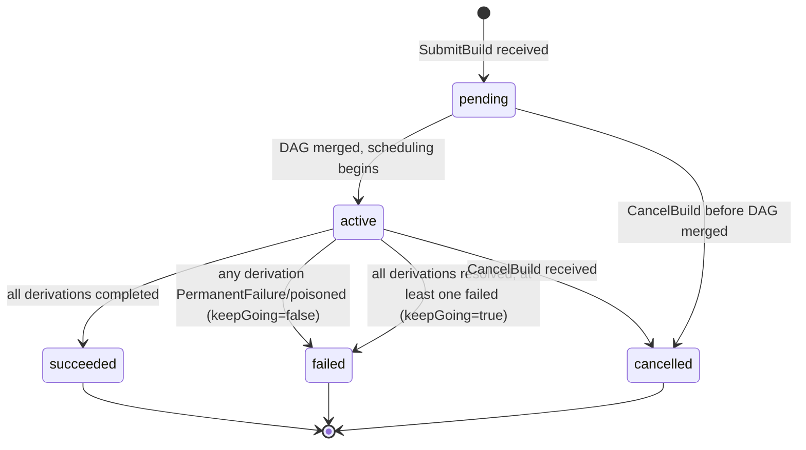

# rio-scheduler

Receives derivation build requests, analyzes the DAG, and publishes work to workers via a bidirectional streaming RPC.

## Responsibilities

- Parse derivation graphs from gateway requests
- Query rio-store for cache hits (already-built outputs)
- Compute remaining work graph (subtract cached nodes)
- Critical-path priority computation (bottom-up: priority = own\_duration + max(successor priorities)); recomputed incrementally on completion by walking ancestors with dirty-flag propagation
- Duration estimation from historical build data in PostgreSQL (EMA with alpha=0.3)
- Resource-aware scheduling: match derivation `requiredSystemFeatures` and resource needs to worker capabilities (subset matching: all required features must be present on the worker)
- Closure-locality affinity: score workers by normalized transfer cost, using bloom filter approximation from worker heartbeats
- Priority queue with inter-build priority (CI > interactive > scheduled) and intra-build priority (critical path)
- IFD prioritization: builds that block evaluation get maximum priority (detected by protocol sequencing --- `wopBuildDerivation` arriving before `wopBuildPathsWithResults` on the same session)
- CA early cutoff: per-edge tracking --- when a CA derivation output matches cached content, mark that edge as cutoff and skip downstream only when ALL input edges are resolved
- Work reassignment: when a worker fails or is slow (actual\_time > estimated\_time * 3), reassign to another worker (only if idle workers are available)
- Poison derivation tracking: mark derivations that fail on 3+ different workers; auto-expire after 24h. See [Error Taxonomy](../errors.md) for details.

## Concurrency Model

The scheduler uses a **single-owner actor model** for the in-memory global DAG. A single Tokio task owns the DAG and processes all mutations from an `mpsc` channel:

- `SubmitBuild` → DAG merge command
- `ReportCompletion` → node completion + downstream release command
- `CancelBuild` → orphan derivations command
- Heartbeat → worker liveness + running_builds merge (bloom filter processing deferred to Phase 2c)
- CA early cutoff → edge cutoff + potential cancellation command

gRPC handler tasks send commands to the DAG actor and `await` responses. This eliminates lock contention, makes operation ordering deterministic, and simplifies reasoning about correctness. PostgreSQL writes are batched and performed asynchronously by the actor.

## Scheduling Algorithm

> **Phase 2a simplification:** The full scheduling algorithm below is the Phase 2c+ target. Phase 2a implements a minimal FIFO queue with system/feature matching: ready derivations are dispatched to any worker with a matching `system` and available capacity. No critical path priority, no size-class routing, no locality scoring, no bloom filters. Interactive builds (`priority_class="interactive"`) push_front the ready queue for a simple two-tier priority.

```
1. Receive derivation DAG from gateway
2. Merge into global DAG (dedup by store path / derivation hash; see Multi-Build DAG Merging)
3. For each derivation in DAG:
   a. Query rio-store: is output already in CAS? (cache hit)
   b. For CA derivations: check content-indexed CAS for matching output
4. Compute remaining build graph (nodes without cached outputs)
5. If empty -> full cache hit, return results immediately
6. Compute critical path priorities (bottom-up traversal)
7. For each ready node (all deps satisfied):
   a. Estimate duration (existing EMA / fallback chain, see Duration Estimation)
   b. Classify into size class based on estimated duration vs WorkerPoolSet cutoffs
      (see Size-Class Routing below). If no WorkerPoolSet is configured, skip this step.
      If ema_peak_memory_bytes exceeds the target class's memory limit, bump to the next class.
   c. Score each worker (filtered to the target size class if applicable):
      - Resource fit (hard filter): does worker have required features, enough CPU/memory?
        Workers that fail this check are excluded entirely.
      - Transfer cost (normalized):
          raw_cost(drv, worker) = sum(nar_size(p) for p in closure(drv) - worker_cached_paths)
          normalized_cost = raw_cost / max(raw_cost across all candidate workers)
        Closure membership approximated via bloom filters in worker heartbeats (target FPR: 1%).
      - Load fraction: running_builds / max_builds (dimensionless, in [0, 1])
      - Combined score: normalized_cost * W_locality + load_fraction * W_load
        Lowest score wins. Both terms are in [0, 1], making weights directly comparable.
   d. Assign to the best-scoring worker via the bidirectional BuildExecution stream.
      The scheduler signs an HMAC-SHA256 assignment token containing (worker_id,
      derivation_hash, expected_output_paths, expiry) and includes it in the
      WorkAssignment. See [Security: assignment tokens](../security.md#boundary-2-gatewayworker--internal-services-grpc).
8. As builds complete (reported via BuildExecution stream):
   a. Upload output to rio-store (worker does this before reporting)
   b. For CA derivations: check if output content matches any existing CAS entry
      - If match -> mark that specific edge as "cutoff"
      - For each downstream node, check if ALL input edges are in one of:
        (a) cached, (b) cutoff, (c) rebuilt but content-hash matches old
      - Only skip a downstream node if ALL its input edges meet these conditions
      - If a downstream node is already running when cutoff is detected: let it finish
        and discard the result (see Preemption below)
   c. Release newly-ready downstream nodes
   d. Update duration estimates with actual build time (EMA, alpha=0.3)
   e. Recompute priorities incrementally: walk up ancestors only, using dirty-flag
      propagation -- only ancestors whose max-successor-priority changed need updating
9. On failure: classify error (see errors.md), apply retry policy, reassign or mark as failed
```

> **TOCTOU note on cache checks (steps 2--4):** The DAG merge and subsequent cache check MUST be performed inside the DAG actor (serialized), not by the gRPC handler before sending the merge command. A cache check performed by the gRPC handler races with concurrent merges --- another build may complete a shared derivation between the handler's cache check and the actor's merge, leading to duplicate work. By performing cache verification after merge inside the actor, the check reflects the latest state.

> **Completion report idempotency:** A `CompletionReport` for an already-completed derivation is accepted and ignored (no-op). The actor's state machine treats `completed → completed` as an idempotent transition. This handles duplicate reports caused by worker retries during scheduler failover, network retransmissions, or race conditions with CA early cutoff.

## Multi-Build DAG Merging

The scheduler maintains a single global DAG across all concurrent build requests. When a new derivation DAG arrives from the gateway, it is merged into the global graph:

- **Input-addressed derivations**: deduplicated by store path
- **Content-addressed derivations**: deduplicated by modular derivation hash (as computed by `hashDerivationModulo` --- excludes output paths, depends only on the derivation's fixed attributes)

Each derivation node tracks a set of interested builds. Shared derivations are built once; all interested builds are notified on completion. **A shared derivation's priority is `max(priority of all interested builds)`, updated on merge.** When a new build raises a shared node's priority, the node's position in the priority queue is updated.

## Duration Estimation

Build duration estimates feed into critical-path priority computation and scheduling decisions.

| Priority | Method |
|----------|--------|
| Primary | Historical build data from `build_history` table, matched by `pname + system` |
| Fallback 1 | Match by `pname`/`system` extracted from the `.drv` file for unknown derivations |
| Fallback 2 | Use closure size as a rough proxy |
| Default | Configurable constant (default: 30 seconds) |

After each build completes, the estimate is updated using an exponential moving average (alpha=0.3) of actual durations. Cold start: on a fresh deployment with no history, all derivations use Fallback 2 or Default. Critical-path scheduling quality improves as history accumulates (typically 5-10 builds per derivation for convergence).

The `build_history` table also tracks peak resource usage (memory, CPU, output size) via EMA, reported by workers in `CompletionReport`. These feed into size-class routing decisions (see below).

## Size-Class Routing

When a `WorkerPoolSet` CRD is configured, the scheduler routes derivations to right-sized worker pools based on estimated duration and resource needs. This is inspired by [SITA-E (Size Interval Task Assignment with Equal load)](https://dl.acm.org/doi/10.1145/506147.506154), adapted for non-preemptible Nix builds.

### Classification

Each derivation is classified into a size class by comparing its estimated duration against the `WorkerPoolSet` cutoffs:

```
class(drv) = smallest class i where estimated_duration(drv) <= cutoff_i
```

If `ema_peak_memory_bytes` for a derivation exceeds the target class's memory limit, the derivation is bumped to the next larger class regardless of duration (resource-aware class bumping).

If no `WorkerPoolSet` is configured, classification is skipped and all workers are candidates (backward compatible with single `WorkerPool` deployments).

### Misclassification Handling

Nix builds are non-preemptible --- a running build cannot be checkpointed or migrated. If a build classified as "small" exceeds 2x the class cutoff while still running, the scheduler:

1. Marks the derivation as **misclassified** in the `build_history` table
2. Applies a **penalty** to the EMA: sets `ema_duration_secs = actual_duration` (replaces the smoothed estimate with the observed value, ignoring the usual alpha blending)
3. Increments `misclassification_count` for the `(pname, system)` key
4. Lets the build complete on its current worker (killing wastes all prior work; deterministic builds produce the same output regardless of host)

Future instances of the same `(pname, system)` are routed to a larger class. After 3 consecutive misclassifications, the derivation's class is permanently bumped until a successful build on the higher class resets the counter.

### Adaptive Cutoff Learning (SITA-E)

A background task (`CutoffRebalancer`) periodically recomputes class cutoffs to equalize load across pools:

```
For each class i, load_i = fraction_i * mean_duration_i
where:
  fraction_i = fraction of derivations with duration in [cutoff_{i-1}, cutoff_i]
  mean_duration_i = mean actual duration of derivations in class i

SITA-E sets cutoffs such that load_1 ~= load_2 ~= ... ~= load_k
```

1. Every `recomputeInterval` (default: 1h), query `build_history` for the duration distribution over the last 7 days
2. Compute the empirical CDF of build durations
3. Find cutoffs that equalize load across classes
4. Blend new cutoffs with current: `c_new = alpha * c_computed + (1-alpha) * c_old` (default alpha=0.1)
5. Update `WorkerPoolSet` status with new cutoffs; log changes as structured events

**Cold start:** Operator-configured `durationCutoff` values from the CRD are used until sufficient history accumulates. **Stability guard:** Cutoffs only change if >= `minSamples` (default: 100) builds have been observed since the last adjustment and the computed cutoff differs by > 10%.

### Overflow Routing

When a size class's worker pool is fully occupied but another class has idle workers, the scheduler may route overflow derivations to the next larger class. This prevents queue starvation when the workload is temporarily skewed. Overflow routing is never applied downward (large builds are never routed to small workers).

## Preemption

Nix builds cannot be paused or resumed, so **running builds are never preempted or cancelled** --- including for CA early cutoff. When cutoff is detected for an already-running build, the build is allowed to complete and the result is simply discarded. This bounds wasted work to one build duration per affected worker.

**Exception**: the only case where a running build is killed is worker pod termination (scale-down, node failure). The preStop hook gives the build time to complete; if it cannot finish within the grace period, it is reassigned.

Queue-level preemption is fully supported:
- High-priority derivations jump ahead of lower-priority queued (not yet running) work
- Priority lanes: a configurable fraction of workers (default: 25%) is reserved for high-priority builds, preventing starvation
- Autoscaling is the primary mitigation for all-workers-busy scenarios

## Derivation State Machine

Each derivation node in the global DAG follows a strict state machine. All transitions are performed inside the DAG actor to ensure serialized access.

```mermaid
stateDiagram-v2
    [*] --> created : DAG merge adds node
    created --> completed : cache hit (output in store)
    created --> queued : build accepted
    queued --> ready : all dependencies complete
    ready --> assigned : worker selected
    assigned --> running : worker acknowledges
    running --> completed : build succeeded
    running --> failed : build error (retriable)
    running --> poisoned : failed on 3+ workers
    assigned --> ready : worker lost / heartbeat timeout
    failed --> ready : retry scheduled
    completed --> [*]
    poisoned --> created : 24h TTL expiry
    created --> dependency_failed : dep poisoned before queue
    queued --> dependency_failed : dep poisoned cascade
    ready --> dependency_failed : dep poisoned cascade
    dependency_failed --> [*]

    note right of queued : Blocked on >=1 dependency
    note right of ready : All deps satisfied,\nawaiting worker
    note right of assigned : Guard: worker has\nrequired features + resources
    note right of poisoned : Auto-expires after 24h\n(returns to created)
    note right of dependency_failed : Terminal; maps to\nNix BuildStatus=10
```

> **Note on the architecture diagram:** The mermaid flowchart in [architecture.md](../architecture.md) shows arrows FROM the scheduler TO workers for the `BuildExecution` stream. This reflects data flow direction (scheduler sends assignments). The gRPC connection direction is the reverse: workers are the gRPC client calling the scheduler's `WorkerService.BuildExecution` RPC.

**Transition guards:**

| Transition | Guard / Condition |
|---|---|
| `created → completed` | Output already exists in rio-store (full cache hit) |
| `created → queued` | Build is accepted into the scheduler |
| `queued → ready` | All dependency derivations are in `completed` state |
| `ready → assigned` | A worker passes resource-fit check and is selected by the scoring algorithm |
| `assigned → running` | Worker sends acknowledgement on the `BuildExecution` stream |
| `running → completed` | Worker reports success and output is verified in rio-store |
| `running → failed` | Worker reports a retriable error; retry count < max_retries (default 2) |
| `running → poisoned` | Derivation has failed on `poisonThreshold` distinct workers (default: 3); note that poison tracking spans across builds, not just one build's retry attempts |
| `assigned → ready` | Assigned worker is lost (heartbeat timeout, pod termination) |
| `failed → ready` | Retry delay elapsed; derivation re-enters the ready queue |
| `created → dependency_failed` | A dependency reached `poisoned` before this node was queued |
| `queued → dependency_failed` | A dependency reached `poisoned` while this node was waiting |
| `ready → dependency_failed` | A dependency reached `poisoned` after this node became ready |

**Idempotency rules:**
- `completed → completed`: No-op (duplicate completion reports are accepted and ignored)
- `poisoned → poisoned`: No-op
- `dependency_failed → dependency_failed`: No-op
- Any transition from a terminal state (`completed`, `poisoned`) to a non-terminal state is rejected, except `poisoned` auto-expiry after 24h which resets to `created`

## Build State Machine

Each build request follows a separate state machine from individual derivations. Build status aggregates the status of its constituent derivations.



**Aggregation rules:**
- `keepGoing=false` (default): the build fails as soon as any derivation reaches `PermanentFailure` or `poisoned`. Remaining derivations are cancelled.
- `keepGoing=true`: the build continues executing independent derivations even after a failure. The build is `failed` only when all reachable derivations have completed or failed.
- A build is `succeeded` only if ALL derivations are `completed`.
- A build is `cancelled` only via explicit `CancelBuild` (client disconnect or API call).

## Leader Transition Protocol

The scheduler uses a leader-elected model for the in-memory global DAG. On leadership transitions:

1. **Assignment generation counter**: Incremented on each leader election. Each `WorkAssignment` carries this generation number.
2. **State reconstruction**: New leader reconstructs state from PostgreSQL (see State Recovery below), then increments the generation counter.
3. **Worker reconnection**: Workers reconnect their `BuildExecution` streams to the new leader. Stale completion reports (carrying an old generation number) are verified against rio-store for output existence before acceptance.
4. **In-flight assignments**: Assignments from the old leader are verified via heartbeat. If a worker reports it is still running the assigned derivation, the new leader reuses the assignment with the new generation number.
5. **PostgreSQL write fencing**: On election, the new leader acquires a PostgreSQL advisory lock (`pg_advisory_lock(scheduler_lock_id)`) and increments `leader_generation` in the `scheduler_meta` row. All synchronous writes include `AND leader_generation = $current_gen` in the `WHERE` clause. If a stale leader's write affects zero rows, it detects it has been fenced and must stop processing. This guarantees at-most-one-writer semantics without relying solely on the distributed lock's availability.

## Synchronous vs. Async Writes

Not all state changes require synchronous PostgreSQL writes:

| Write Type | Examples | Behavior |
|-----------|---------|----------|
| **Synchronous** (before responding) | Derivation completion state, assignment state transitions, build terminal status | Must be durable before acknowledging to worker/gateway |
| **Async/batched** | `build_history` EMA updates, duration estimate refreshes, dashboard-facing status updates | Batched and flushed periodically (every 1-5s) |

On crash, async writes may be lost but are non-critical: EMA re-converges after a few builds, and status is rebuilt from ground truth (derivation/assignment tables) during state recovery.

## State Recovery

On startup, the scheduler reconstructs its in-memory state:

1. Load all non-terminal builds from PostgreSQL (`builds` and `derivations` tables)
2. Reconstruct DAGs from the derivations table and their edges
3. **Identify nodes in "waiting" state whose dependencies are all complete, and transition them to "ready"** (handles the case where the previous scheduler crashed between completing a node and releasing downstream)
4. Discover workers from the `assignments` table and from Kubernetes pod list
5. Query each known worker for current state via Heartbeat
6. For derivations marked "assigned":
   - If the assigned worker reports completion → process the result
   - If the assigned worker is gone → check rio-store for the output (it may have been uploaded before the worker died). If found, mark complete. Otherwise, reassign.
7. Resume scheduling from the reconstructed state

Workers buffer completion reports with retry logic: if `ReportCompletion` fails (scheduler unreachable during failover), the worker retries with exponential backoff until the scheduler accepts it.

## Worker Registration Protocol

Worker registration is **two-step** --- there is no single registration RPC; instead, the scheduler infers registration from two separate interactions:

1. Worker opens a `BuildExecution` bidirectional stream to the scheduler (calling `WorkerService.BuildExecution`).
2. Worker calls the separate `Heartbeat` unary RPC with its initial capabilities:
   - `worker_id` (unique, derived from pod UID)
   - `system` (e.g., `x86_64-linux`)
   - `supported_features` (list of `requiredSystemFeatures` the worker supports)
   - `max_builds` (concurrency limit)
   - `bloom_filter` (initial store path bloom filter for closure-locality scoring)
3. When the scheduler receives the first `Heartbeat` from a `worker_id` that also has an open `BuildExecution` stream, it creates an in-memory worker entry with the reported capabilities and marks the worker as `alive`.
4. Scheduler begins sending `WorkAssignment` messages on the stream.

**Deregistration:** A worker is removed from the scheduler's state when:
- The `BuildExecution` stream is closed (graceful shutdown or network failure)
- Three consecutive heartbeats are missed (heartbeat interval: 10s, timeout: 30s)

On deregistration, all derivations in `assigned` state for that worker are transitioned back to `ready` for reassignment.

## Backpressure

The scheduler applies backpressure at multiple layers to prevent overload:

**gRPC flow control:** The `BuildExecution` streams use the default HTTP/2 flow control window (64 KiB initial, dynamically adjusted). The scheduler does not send new `WorkAssignment` messages to a worker whose send window is exhausted, naturally rate-limiting dispatch to slow consumers.

**Actor queue depth limit:** The DAG actor's `mpsc` channel has a bounded capacity (default: 10,000 messages). If the queue depth exceeds 80% of capacity:
1. The scheduler stops reading from worker `BuildExecution` streams (applying TCP-level backpressure to workers).
2. New `SubmitBuild` requests from the gateway receive gRPC `RESOURCE_EXHAUSTED` status.
3. The scheduler emits a `scheduler.queue.backpressure` metric for alerting.

Normal processing resumes when the queue depth drops below 60% (hysteresis to prevent oscillation).

**Gateway timeout:** If a `SubmitBuild` request takes longer than 30 seconds to receive an initial acknowledgement from the DAG actor, the gateway handler returns gRPC `DEADLINE_EXCEEDED`. The gateway may retry with exponential backoff. This prevents unbounded request queueing at the gateway layer.

## State Storage (PostgreSQL)

| Table | Contents |
|-------|----------|
| `builds` | Build requests, status, timing, requestor, tenant_id |
| `derivations` | Derivation metadata, scheduling state, tenant_id |
| `derivation_edges` | DAG edges (parent_id, child_id) as a separate join table for concurrent merge safety |
| `assignments` | Derivation -> worker mapping, status, assignment generation counter |
| `build_derivations` | Many-to-many mapping: which builds are interested in which derivations |
| `build_history` | Running EMA per (pname, system) for duration estimation (not per-build rows) |

### Schema (pseudo-DDL)

```sql
CREATE TABLE builds (
    build_id        UUID PRIMARY KEY DEFAULT gen_random_uuid(),
    tenant_id       UUID,                   -- NOT NULL deferred to Phase 4 (multi-tenancy)
    requestor       TEXT NOT NULL,
    status          TEXT NOT NULL CHECK (status IN ('pending', 'active', 'succeeded', 'failed', 'cancelled')),
    priority_class  TEXT NOT NULL DEFAULT 'scheduled' CHECK (priority_class IN ('ci', 'interactive', 'scheduled')),
    submitted_at    TIMESTAMPTZ NOT NULL DEFAULT now(),
    started_at      TIMESTAMPTZ,
    finished_at     TIMESTAMPTZ,
    error_summary   TEXT,
    -- UNIQUE (tenant_id, build_id) deferred to Phase 4 with NOT NULL constraint
);
CREATE INDEX builds_status_idx ON builds (status) WHERE status IN ('pending', 'active');

CREATE TABLE derivations (
    derivation_id       UUID PRIMARY KEY DEFAULT gen_random_uuid(),
    tenant_id           UUID,                   -- NOT NULL deferred to Phase 4 (multi-tenancy)
    drv_hash            TEXT NOT NULL,          -- input-addressed: store path; CA: modular derivation hash
    drv_path            TEXT NOT NULL,          -- full /nix/store/...-foo.drv path
    pname               TEXT,
    system              TEXT NOT NULL,
    status              TEXT NOT NULL CHECK (status IN ('created', 'queued', 'ready', 'assigned', 'running', 'completed', 'failed', 'poisoned', 'dependency_failed')),
    required_features   TEXT[] NOT NULL DEFAULT '{}',
    assigned_worker_id  TEXT,
    -- assignment_gen lives on assignments table (as generation), not here
    retry_count         INT NOT NULL DEFAULT 0,
    created_at          TIMESTAMPTZ NOT NULL DEFAULT now(),
    updated_at          TIMESTAMPTZ NOT NULL DEFAULT now(),
    CONSTRAINT derivations_drv_hash_uq UNIQUE (drv_hash)
);
CREATE INDEX derivations_status_idx ON derivations (status) WHERE status NOT IN ('completed', 'poisoned', 'dependency_failed');
CREATE INDEX derivations_tenant_idx ON derivations (tenant_id);

CREATE TABLE derivation_edges (
    parent_id   UUID NOT NULL REFERENCES derivations (derivation_id),
    child_id    UUID NOT NULL REFERENCES derivations (derivation_id),
    is_cutoff   BOOLEAN NOT NULL DEFAULT FALSE,
    PRIMARY KEY (parent_id, child_id)
);
CREATE INDEX derivation_edges_child_idx ON derivation_edges (child_id);

CREATE TABLE build_derivations (
    build_id        UUID NOT NULL REFERENCES builds (build_id),
    derivation_id   UUID NOT NULL REFERENCES derivations (derivation_id),
    PRIMARY KEY (build_id, derivation_id)
);
CREATE INDEX build_derivations_deriv_idx ON build_derivations (derivation_id);

CREATE TABLE assignments (
    assignment_id       UUID PRIMARY KEY DEFAULT gen_random_uuid(),
    derivation_id       UUID NOT NULL REFERENCES derivations (derivation_id),
    worker_id           TEXT NOT NULL,
    generation          BIGINT NOT NULL,        -- leader generation counter
    status              TEXT NOT NULL CHECK (status IN ('pending', 'acknowledged', 'completed', 'failed', 'cancelled')),
    assigned_at         TIMESTAMPTZ NOT NULL DEFAULT now(),
    completed_at        TIMESTAMPTZ
);
CREATE UNIQUE INDEX assignments_active_uq ON assignments (derivation_id) WHERE status IN ('pending', 'acknowledged');
CREATE INDEX assignments_worker_idx ON assignments (worker_id, status);

CREATE TABLE build_history (
    pname               TEXT NOT NULL,
    system              TEXT NOT NULL,
    ema_duration_secs   DOUBLE PRECISION NOT NULL,
    sample_count        INT NOT NULL DEFAULT 0,
    last_updated        TIMESTAMPTZ NOT NULL DEFAULT now(),
    PRIMARY KEY (pname, system)
);
```

## Leader Election

The scheduler uses **PostgreSQL advisory locks** for leader election, while the controller uses Kubernetes Lease. This asymmetry is intentional:

- **Why PG advisory locks for the scheduler:** The scheduler's state recovery depends on PostgreSQL --- on startup, the new leader reconstructs in-memory DAGs from the `builds`, `derivations`, `derivation_edges`, and `assignments` tables. Coupling leader election to PG availability ensures the leader always has access to its state backend. If PG is down, the scheduler cannot function regardless of who holds the leader lock.
- **Why K8s Lease for the controller:** The controller only interacts with the Kubernetes API (CRDs, StatefulSets, Services). It has no PostgreSQL dependency, so a K8s-native leader election mechanism is simpler and more appropriate.
- **Generation counter for write fencing:** Each leader election increments a generation counter stored in a PG row. All state-modifying SQL statements include `WHERE leader_generation = $current_generation`. A stale leader (whose PG connection was silently dropped) will have its writes rejected by the generation check, preventing split-brain corruption.

**Operational caveats:**

- **PgBouncer compatibility:** Transaction-mode connection pooling is **incompatible** with PG advisory locks (which are session-scoped). The leader election connection must use session-mode pooling or a direct connection to PostgreSQL. Other scheduler connections can use transaction-mode PgBouncer.
- **TCP keepalive tuning:** The PG connection used for the advisory lock should have aggressive TCP keepalive settings (e.g., `keepalives_idle=30, keepalives_interval=10, keepalives_count=3`) to detect connection loss within ~60 seconds.
- **Lock release on connection drop:** When the leader's PG connection drops (pod crash, network partition), the advisory lock is released automatically by PostgreSQL, allowing a standby to acquire it.

## Incremental Critical-Path Maintenance

Critical-path priorities are maintained **incrementally**, not via full O(V+E) recomputation on every event:

- **On derivation completion:** Walk upward from the completed node to its ancestors, recalculating priorities only for nodes whose successor priorities changed. This is O(affected subgraph), which is typically much smaller than the full DAG.
- **On DAG merge:** New nodes are inserted with initial priorities computed bottom-up from the merge point. Existing nodes' priorities are updated only if the new subgraph connects to them with a higher-priority path.
- **Periodic full recomputation:** Every 60 seconds, a background Tokio task snapshots the DAG and performs a full bottom-up priority sweep. The result is sent to the DAG actor as a single `UpdatePriorities` message, ensuring consistency even if incremental updates accumulate rounding errors or miss edge cases.

This approach keeps per-event processing well under the 1ms budget needed for 1000+ ops/sec throughput.

## Key Files (Phase 2a)

- `rio-scheduler/src/actor.rs` — DAG actor (single-owner event loop, dispatch, retry, cleanup)
- `rio-scheduler/src/dag.rs` — DAG representation, merge, cycle detection, topological ops
- `rio-scheduler/src/state.rs` — State machines (DerivationStatus, BuildState), transition validation, RetryPolicy
- `rio-scheduler/src/queue.rs` — FIFO ready queue (VecDeque; priority queue deferred to Phase 2c)
- `rio-scheduler/src/grpc.rs` — SchedulerService + WorkerService gRPC implementations
- `rio-scheduler/src/db.rs` — PostgreSQL persistence layer

## Planned Files (Phase 2c+)

- `rio-scheduler/src/critical_path.rs` — Critical path priority computation
- `rio-scheduler/src/assignment.rs` — Worker scoring (locality, load)
- `rio-scheduler/src/early_cutoff.rs` — CA early cutoff detection
- `rio-scheduler/src/estimator.rs` — Duration estimation from history
- `rio-scheduler/src/poison.rs` — Cross-build poison derivation tracking


