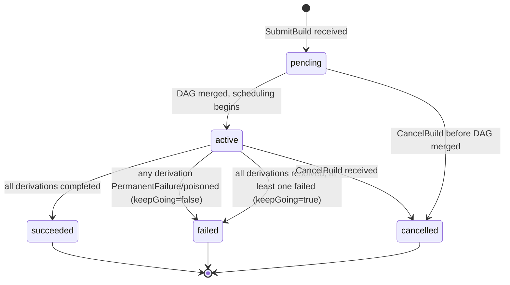

# rio-scheduler

Receives derivation build requests, analyzes the DAG, and publishes work to workers via a bidirectional streaming RPC.

## Responsibilities

- Parse derivation graphs from gateway requests
- Query rio-store for cache hits (already-built outputs)
- Compute remaining work graph (subtract cached nodes)
- Critical-path priority computation (bottom-up: priority = own\_duration + max(successor priorities)); recomputed incrementally on completion by walking ancestors with dirty-flag propagation
- Duration estimation from historical build data in PostgreSQL (EMA with alpha=0.3)
- Resource-aware scheduling: match derivation `requiredSystemFeatures` and resource needs to worker capabilities (subset matching: all required features must be present on the worker)
- Auto-pin live build inputs: on dispatch, `pin_live_inputs` writes the derivation's input closure to the `scheduler_live_pins` table (used by rio-store's GC mark phase as a root seed); unpinned on completion
- Proxy `AdminService.TriggerGC` to rio-store, first collecting live-build output paths via `ActorCommand::GcRoots` and forwarding them as `extra_roots`
- Priority queue with inter-build priority (CI > interactive > scheduled) and intra-build priority (critical path)
- IFD prioritization: builds that block evaluation get maximum priority (detected by protocol sequencing --- `wopBuildDerivation` arriving before `wopBuildPathsWithResults` on the same session)
- CA early cutoff: per-edge tracking --- when a CA derivation output matches cached content, mark that edge as cutoff and skip downstream only when ALL input edges are resolved. Compare implemented (P0251); propagate is P0252
- Work reassignment: when a worker fails (stream closed, heartbeat timeout), reassign its in-flight derivations to another worker. _Slow-worker speculative reassignment (actual\_time > estimated\_time × 3) is not currently implemented._
- Poison derivation tracking: mark derivations that fail on 3+ different workers; auto-expire after 24h. See [Error Taxonomy](../errors.md) for details.

## Concurrency Model

r[sched.actor.single-owner]
The scheduler uses a **single-owner actor model** for the in-memory global DAG. A single Tokio task owns the DAG and processes all mutations from an `mpsc` channel:

- `SubmitBuild` → DAG merge command
- `ReportCompletion` → node completion + downstream release command
- `CancelBuild` → orphan derivations command
- Heartbeat → worker liveness + running_builds merge + size_class
- CA early cutoff → edge cutoff + potential cancellation command

gRPC handler tasks send commands to the DAG actor and `await` responses. This eliminates lock contention, makes operation ordering deterministic, and simplifies reasoning about correctness. PostgreSQL writes are batched and performed asynchronously by the actor.

r[sched.actor.dispatch-decoupled]
`dispatch_ready` runs from state-change events (`MergeDag`, `ProcessCompletion`, `PrefetchComplete`) and from `Tick` when the `dispatch_dirty` flag is set. `Heartbeat` sets `dispatch_dirty` instead of dispatching inline --- at N workers / 10s heartbeat interval that is N/10 dispatch passes per second, and each pass costs one full-DAG batch-FOD scan plus a `ready_queue` drain. At 290 workers and a 27k-node DAG (I-163) the inline path generated ~5× actor capacity and pushed `actor_mailbox_depth` to 9.5k. Coalescing to once per Tick bounds the heartbeat-driven dispatch rate at 1/s regardless of fleet size.

r[sched.dispatch.became-idle-immediate]
A `Heartbeat` that transitions an executor's capacity 0→1 (fresh registration, `store_degraded` clear, `draining` clear, phantom drain) dispatches inline instead of deferring to `Tick`. This is the carve-out from `r[sched.actor.dispatch-decoupled]`: the 0→1 transition is at most once per executor per degrade/spawn cycle (not N/10 per second), and deferring it adds up to one full tick interval of idle time to every freshly-spawned ephemeral builder --- the controller spawned the pod *because* work is queued, so the slot is immediately useful. Steady-state heartbeats from already-idle or already-busy executors still only set `dispatch_dirty`.

r[sched.admin.snapshot-cached]
`AdminService.ClusterStatus` reads a `watch::channel` snapshot that the actor publishes once per `Tick`, instead of round-tripping `ActorCommand::ClusterSnapshot` through the mailbox. The handler itself is ~37µs; queuing it behind a saturated mailbox (I-163: 9.5k commands) made it time out at exactly the moment the controller's reconcile loop and operators need a reading. The cached value is at most one Tick (~1s) stale.

## Scheduling Algorithm

**Implemented:** critical-path priority (BinaryHeap ReadyQueue), size-class routing with memory-bump and overflow, build-history Estimator with fallback chain, PrefetchHint (full `approx_input_closure` before WorkAssignment), leader election via Kubernetes Lease gated on `RIO_LEASE_NAME`, `AdminService.ClusterStatus`/`DrainWorker`, WorkerPoolSet CRD + child-pool reconciler, CutoffRebalancer (SITA-E adaptive cutoffs from `build_samples`). Interactive builds get a +1e9 priority boost (dwarfs any critical-path value).

```
1. Receive derivation DAG from gateway
2. Merge into global DAG (dedup by store path / derivation hash; see Multi-Build DAG Merging)
3. For each derivation in DAG:
   a. Query rio-store: is output already in CAS? (cache hit)
   b. For CA derivations: check content-indexed CAS for matching output
4. Compute remaining build graph (nodes without cached outputs)
5. If empty -> full cache hit, return results immediately
6. Compute critical path priorities (bottom-up traversal)
7. For each ready node (all deps satisfied):
   a. Estimate duration (existing EMA / fallback chain, see Duration Estimation)
   b. Classify into size class based on estimated duration vs configured cutoffs
      (see Size-Class Routing below). If no size classes are configured, skip this step.
      If ema_peak_memory_bytes exceeds the target class's memory limit, bump to the next class.
   c. Filter workers to the target size class if applicable:
      - Resource fit (hard filter): does worker have required features, enough CPU/memory?
        Workers that fail this check are excluded entirely.
        The hard filter also excludes busy workers (one build per pod); among
        idle candidates that pass, dispatch falls through to first-fit.
   d. Assign to the first eligible worker via the bidirectional BuildExecution stream.
      The WorkAssignment carries an HMAC-SHA256-signed assignment token (Claims:
      `worker_id`, `drv_hash`, `expected_outputs`, `expiry_unix`). The store verifies
      the token on PutPath and rejects uploads for paths not in `expected_outputs`.
      See [Security: assignment tokens](../security.md#boundary-2-gatewayworker--internal-services-grpc).
8. As builds complete (reported via BuildExecution stream):
   a. Upload output to rio-store (worker does this before reporting)
   b. For CA derivations: check if output content matches any existing CAS entry
      - If match -> mark that specific edge as "cutoff"
      - For each downstream node, check if ALL input edges are in one of:
        (a) cached, (b) cutoff, (c) rebuilt but content-hash matches old
      - Only skip a downstream node if ALL its input edges meet these conditions
      - If a downstream node is already running when cutoff is detected: let it finish
        and discard the result (see Preemption below)
   c. Release newly-ready downstream nodes
   d. Update duration estimates with actual build time (EMA, alpha=0.3)
   e. Recompute priorities incrementally: walk up ancestors only, using dirty-flag
      propagation -- only ancestors whose max-successor-priority changed need updating
9. On failure: classify error (see errors.md), apply retry policy, reassign or mark as failed
```

r[sched.merge.toctou-serial]
> **TOCTOU note on cache checks (steps 2--4):** The DAG merge and subsequent cache check MUST be performed inside the DAG actor (serialized), not by the gRPC handler before sending the merge command. A cache check performed by the gRPC handler races with concurrent merges --- another build may complete a shared derivation between the handler's cache check and the actor's merge, leading to duplicate work. By performing cache verification after merge inside the actor, the check reflects the latest state.

r[sched.completion.idempotent]
> **Completion report idempotency:** A `CompletionReport` for an already-completed derivation is accepted and ignored (no-op). The actor's state machine treats `completed → completed` as an idempotent transition. This handles duplicate reports caused by worker retries during scheduler failover, network retransmissions, or race conditions with CA early cutoff.

r[sched.tenant.resolve]
The gateway sends the tenant name in `SubmitBuildRequest.tenant_name` — captured from the server-side `authorized_keys` entry's comment field. The scheduler's `submit_build` handler resolves this to a UUID via `SELECT tenant_id FROM tenants WHERE tenant_name = $1`. Unknown tenant name → `InvalidArgument`. Empty string → `None` (single-tenant mode, no PG lookup). This keeps the gateway PostgreSQL-free — preserving stateless N-replica HA.

r[sched.store-client.reconnect]
The scheduler's gRPC channel to rio-store MUST use lazy connection (`Endpoint::connect_lazy`) with HTTP/2 keepalive so store pod rollouts do not require a scheduler restart. On `Unavailable`, the channel re-resolves DNS and reconnects transparently.

r[sched.gc.path-tenants-upsert]
On build completion, the scheduler upserts `(store_path_hash,
tenant_id)` rows into `path_tenants` for every output path × every
tenant whose build was interested in that derivation (dedup via
`interested_builds`). This is best-effort: upsert failure warns but
does not fail completion — GC may under-retain a path if the upsert
fails, but the build still succeeds. The upsert is `ON CONFLICT DO
NOTHING` (composite PK on `(store_path_hash, tenant_id)`); repeated
builds of the same path by the same tenant are idempotent.

r[sched.poison.ttl-persist]
`poisoned_at` is persisted to `derivations.poisoned_at TIMESTAMPTZ` when the poison threshold trips. Recovery loads poisoned rows via a separate `load_poisoned_derivations` query (since `TERMINAL_STATUSES` includes `"poisoned"` and `load_nonterminal_derivations` filters it out). The timestamp is converted back to `Instant` via PG-computed `EXTRACT(EPOCH FROM (now() - poisoned_at))`, so the 24h TTL check survives scheduler restart.

r[sched.retry.per-worker-budget]
`BuildResultStatus::InfrastructureFailure` does NOT count toward the
poison threshold. It routes through a separate
`handle_infrastructure_failure` handler: `reset_to_ready` + retry
WITHOUT inserting into `failed_workers`. Worker-local issues (FUSE
EIO, cgroup setup fail, OOM-kill of the build process) are not the
build's fault. `TransientFailure` (build ran, exited non-zero, might
succeed elsewhere) DOES count. Worker disconnect DOES count — a build
that crashes the daemon 3× is poisoned; false-positives from unrelated
worker deaths are cleared by `rio-cli poison clear`. Both knobs are
configurable via `scheduler.toml`: `threshold` (default 3, the former
`POISON_THRESHOLD` const), `require_distinct_workers` (default true —
HashSet semantics; false = any N failures poison, for single-worker
dev deployments). The retry backoff curve is likewise a `[retry]`
table. `failed_workers` persisted to PG; infrastructure retry count
is in-memory only.

```toml
# scheduler.toml — poison + retry knobs. All fields optional; absent
# keys fall through to the Default impl shown in comments.
[poison]
threshold = 3                      # failures before derivation is poisoned
require_distinct_workers = true    # HashSet: N DISTINCT workers must fail
                                   # (false = flat counter; single-worker dev)

[retry]
max_retries = 2                    # retries for transient failures
backoff_base_secs = 5.0            # first-attempt backoff
backoff_multiplier = 2.0           # exponential growth
backoff_max_secs = 300.0           # clamp (inf would panic from_secs_f64)
jitter_fraction = 0.2              # ± fractional jitter on each backoff
```

r[sched.admin.list-workers]
`AdminService.ListWorkers` returns a point-in-time snapshot of all connected workers via an `ActorCommand::ListWorkers` (O(workers) scan, `send_unchecked` like `ClusterSnapshot` — dashboard needs a reading even under saturation). Each `WorkerInfo` includes `worker_id`, `systems`, `supported_features`, `running_builds` (0 or 1), `status` ("alive"/"draining"/"connecting"), `connected_since`, `last_heartbeat`, and `last_resources`. `Instant` fields are converted to wall-clock `SystemTime` by subtracting elapsed from `SystemTime::now()`. The optional `status_filter` matches "alive" (registered + not draining), "draining", or empty/unknown (show all).

r[sched.admin.list-builds]
`AdminService.ListBuilds` paginates via a direct PostgreSQL query with `LIMIT/OFFSET` (proto field `offset = 3`). Per-build derivation counts come from `LEFT JOIN build_derivations + derivations`; `cached_derivations` uses the heuristic "completed with no assignment row" (a cache-hit derivation transitions directly to Completed at merge time without dispatch). Optional `status_filter` matches the `builds.status` column. `total_count` is from a separate `COUNT(*)` query (unaffected by pagination). `ClusterStatus.store_size_bytes` is now populated from a 60s background task that polls `SUM(nar_size) FROM narinfo` — kept out of the handler's hot path since the controller polls it every reconcile tick.

r[sched.admin.clear-poison]
`AdminService.ClearPoison` resets both in-memory state (`reset_from_poison()`: Poisoned→Created, clear `failed_workers`, zero `retry_count`, null `poisoned_at`) and PostgreSQL (`db.clear_poison()`). Returns `cleared=true` only if both succeed. If PG fails after in-mem reset, returns `false` so the operator retries — next recovery would restore Poisoned, so in-mem/PG drift is self-correcting. Idempotent: calling on a non-poisoned or non-existent derivation returns `cleared=false` without error. The DAG is keyed on the full `.drv` store path; `rio-cli poison-clear` validates this client-side and rejects bare hashes (a silent no-match would look like "not poisoned" when it's actually "wrong key format").

r[sched.admin.list-poisoned]
`AdminService.ListPoisoned` returns all currently-poisoned derivations from PostgreSQL (`status = 'poisoned'`). Each entry includes the full `.drv` store path (what `ClearPoison` takes), the list of worker IDs that failed building it, and the age in seconds (TTL is 24h). These are the ROOTS that cascade `DependencyFailed` — a single poisoned FOD can block hundreds of downstream derivations, which `rio-cli status` surfaces only as `[Failed] N/M drv` without naming the culprit.

r[sched.admin.list-tenants]
`AdminService.ListTenants` returns all rows from the `tenants` table. Each `TenantInfo` includes the UUID, name, GC retention settings, `created_at`, and a `has_cache_token` projection (boolean — does NOT leak the actual token value).

r[sched.admin.create-tenant]
`AdminService.CreateTenant` inserts a new tenant row. `tenant_name` is required (empty → `INVALID_ARGUMENT`). On name collision or cache_token collision, returns `ALREADY_EXISTS`. On success, returns the created `TenantInfo` including the generated UUID.

r[sched.admin.sizeclass-status]
`AdminService.GetSizeClassStatus` returns per-class status: configured vs effective cutoffs (the rebalancer may have recomputed), queued/running counts, sample counts in the rebalancer's lookback window. HUB for the WPS reconciler's status patch, CLI cutoffs table, and CLI WPS describe. Returns empty `classes` list when size-class routing is disabled (no `[[size_classes]]` entries in scheduler.toml).

r[sched.sizeclass.feature-filter+2]
When `GetSizeClassStatusRequest.filter_features` is set, the per-class `queued` / `queued_by_system` counts MUST only include Ready derivations whose `requiredSystemFeatures` is a subset of `pool_features` --- i.e., derivations a worker advertising exactly `pool_features` would pass `hard_filter`'s feature check for. Feature-gated pools (`pool_features ≠ ∅`) MUST exclude derivations with empty `requiredSystemFeatures` --- those are owned by the featureless pool. The subset check alone (∅ ⊆ anything) would over-count (I-181). The controller sets this per-pool so a feature-gated ephemeral pool (e.g., `features:["kvm"]`) spawns for derivations that need its features, and a featureless pool stops spawning for feature-gated work it can never build (I-176). Unset (default) = unfiltered, preserving CLI / pre-I-176 controller behavior.

r[sched.dispatch.soft-features]
The scheduler MUST strip every feature listed in `soft_features` (scheduler.toml) from each derivation's `requiredSystemFeatures` at DAG-insertion time, before any spawn-snapshot or dispatch decision reads it. nixpkgs convention treats `big-parallel` and `benchmark` as capability hints --- any builder qualifies --- unlike `kvm` / `nixos-test` which are hardware gates. Without stripping, a `{big-parallel}`-only derivation passes the `r[sched.sizeclass.feature-filter+2]` subset check against the kvm pool (the only pool advertising `big-parallel`) and fails it against every featureless pool, so the controller spawns `.metal` for firefox/chromium while regular builders sit idle (I-204). Empty `soft_features` (the default) preserves pre-I-204 behavior.

r[sched.sizeclass.snapshot-honors-floor]
The size-class snapshot MUST bucket each Ready derivation by `max(classify(), size_class_floor)` --- the same clamp `find_executor_with_overflow` applies at dispatch (`r[sched.builder.size-class-reactive]`). The EMA classifier is success-only, so a derivation reactively promoted tiny→small (I-177) still classifies as tiny; without this clamp the snapshot reports `tiny.queued=1`, the controller spawns a tiny builder, dispatch rejects it (floor>tiny), the builder idles to `activeDeadlineSeconds`, disconnects, I-173 bumps the floor again --- spawn loop (I-187). A `size_class_floor` not in the current config (stale after a config change) degrades to no-clamp, matching dispatch's `cutoff_for() = None` fallback.

r[sched.admin.capacity-manifest]
`AdminService.GetCapacityManifest` returns per-derivation resource estimates for queued-ready derivations (DAG nodes with all deps built, waiting only on worker availability). Polled by the controller's manifest reconciler under `BuilderPool.spec.sizing=Manifest` mode (ADR-020). Pull model --- sibling to `ClusterStatus`, not a push RPC.

r[sched.admin.capacity-manifest.bucket]
Estimates are `EMA × headroom_multiplier`, rounded UP to 4GiB memory buckets and 2000-millicore CPU buckets. Bucketing at the scheduler (not the controller) means all consumers see identical buckets --- two derivations that should share a pod don't diverge from floating-point rounding applied in different places. Cold-start derivations (no `build_history` sample) are omitted; the controller uses its operator-configured floor.

## Multi-Build DAG Merging

r[sched.merge.dedup]
The scheduler maintains a single global DAG across all concurrent build requests. When a new derivation DAG arrives from the gateway, it is merged into the global graph:

- **Input-addressed derivations**: deduplicated by store path
- **Content-addressed derivations**: deduplicated by modular derivation hash (as computed by `hashDerivationModulo` --- excludes output paths, depends only on the derivation's fixed attributes)

r[sched.merge.shared-priority-max]
Each derivation node tracks a set of interested builds. Shared derivations are built once; all interested builds are notified on completion. **A shared derivation's priority is `max(priority of all interested builds)`, updated on merge.** When a new build raises a shared node's priority, the node's position in the priority queue is updated.

r[sched.merge.substitute-probe]
The merge-time cache check (`check_cached_outputs`) MUST forward the submitting session's JWT (`x-rio-tenant-token`) on its `FindMissingPaths` store call, and MUST treat paths in the response's `substitutable_paths` as cache hits. Without the JWT, the store's per-tenant upstream probe is skipped and `substitutable_paths` stays empty --- the scheduler then dispatches builds for paths the store could fetch.

r[sched.merge.substitute-fetch]
Before marking a substitutable-probed derivation as completed, the scheduler MUST eagerly trigger the store's NAR fetch for each substitutable path by issuing `QueryPathInfo` with the session JWT. `FindMissingPaths`'s probe is HEAD-only; the builder's later FUSE `GetPath` calls carry no JWT (`&[]` metadata) so the store's `try_substitute_on_miss` short-circuits and the build fails with ENOENT on inputs the scheduler claimed were cached. Fetches MUST be issued concurrently with a bounded in-flight cap (a DAG can have hundreds of substitutable paths; unbounded fan-out saturates the store's S3 connection pool and causes false demotes), and each fetch bounded by the actor's gRPC timeout, since the call blocks the single-threaded actor event loop. A fetch that fails or returns NotFound demotes that path from the substitutable set --- the derivation falls through to normal dispatch instead of being marked completed against a phantom cache hit.

r[sched.merge.ca-fod-substitute]
The path-based lane of `check_cached_outputs` MUST cover every probe-set node with a non-empty `expected_output_paths` --- IA, fixed-CA FOD, or otherwise. The realisations-table lane is for floating-CA only (output path unknown until built; `expected_output_paths == [""]`). Partitioning by `ca_modular_hash` length is wrong: every FOD has a 32-byte modular hash, so a CA filter excludes them from the path-based lane and they never get checked for upstream substitutability --- a fixed-CA FOD whose output is in cache.nixos.org gets dispatched to a fetcher and hits a (potentially dead) origin URL.

r[sched.merge.substitute-topdown]
Before merging a submission's full DAG, the scheduler MUST first check whether the root derivations' outputs are already available (present in store or upstream-substitutable). If ALL roots are available, the submission MUST be pruned to roots-only before the merge --- the dependency subgraph is transitively unnecessary and never enters the global DAG. This short-circuits the common case where a requested package is already cached upstream: instead of eager-fetching hundreds of dependency NARs (stdenv bootstrap chain), fetch only the root outputs and complete. Roots are nodes with no parent edge in the submission. On any uncertainty (store unreachable, partial root availability, floating-CA root), fall through to the full merge and the bottom-up `check_cached_outputs` --- the existing flow remains correct, just slower. A root fetch that fails demotes that root and aborts the short-circuit (full DAG merged); the pruning is all-or-nothing at the root level.

r[sched.dag.build-scoped-roots]
`find_roots(build_id)` MUST treat a derivation as a root for a given
build if no parent *interested in that build* depends on it. The global
`parents` map includes parents from all merged builds; a derivation
that is a root for build X may have a parent from build Y. Using the
unscoped parent set incorrectly marks X's root as a non-root, stalling
X's dispatch. The filter is
`parents(d).any(|p| p.interested_builds.contains(build_id))`.

## Duration Estimation

r[sched.estimate.fallback-chain]
Build duration estimates feed into critical-path priority computation and scheduling decisions.

| Priority | Method |
|----------|--------|
| 1 | Exact `(pname, system)` match in the `build_history` table (EMA) |
| 2 | Cross-system `pname` match: mean of all `build_history` rows with the same `pname` (any system) |
| 3 | Closure-size proxy: `input_srcs_nar_size / 10 MB/s`, floored at 5s |
| 4 | Default constant: 30 seconds |

Fallbacks 1–2 require a `pname` (extracted from the derivation's `env.pname` attr, or `None` for raw/FOD derivations without it). When `pname` is absent, the chain skips directly to fallback 3.

r[sched.estimate.ema-alpha]
After each build completes, the estimate is updated using an exponential moving average (alpha=0.3) of actual durations. Cold start: on a fresh deployment with no history, all derivations use fallback 3 (closure-size proxy) or 4 (default). Critical-path scheduling quality improves as history accumulates (typically 5-10 builds per derivation for convergence).

The `build_history` table also tracks peak resource usage (memory, CPU, output size) via EMA, reported by workers in `CompletionReport`. These feed into size-class routing decisions (see below).

## Size-Class Routing

> **Current configuration source:** size classes are configured via static TOML (`[[size_classes]]` tables in `scheduler.toml`). Workers declare their class in the heartbeat. The `WorkerPoolSet` CRD declares the class set and manages one child `WorkerPool` per class; the CutoffRebalancer (below) adjusts cutoffs adaptively from `build_samples`.

When size classes are configured, the scheduler routes derivations to right-sized worker pools based on estimated duration and resource needs. This is inspired by [SITA-E (Size Interval Task Assignment with Equal load)](https://dl.acm.org/doi/10.1145/506147.506154), adapted for non-preemptible Nix builds.

### Classification

r[sched.classify.smallest-covering]
Each derivation is classified into a size class by comparing its estimated duration against the configured cutoffs:

```
class(drv) = smallest class i where estimated_duration(drv) <= cutoff_i
```

r[sched.classify.mem-bump]
If `ema_peak_memory_bytes` for a derivation exceeds the target class's memory limit, the derivation is bumped to the next larger class regardless of duration (resource-aware class bumping).

r[sched.classify.cpu-bump]
If `ema_peak_cpu_cores` for a derivation exceeds the target class's `cpu_limit_cores`, the derivation is bumped to the next larger class regardless of duration (resource-aware class bumping, mirroring mem-bump).

If no size classes are configured (empty `[[size_classes]]`), classification is skipped and all workers are candidates (backward compatible with single `WorkerPool` deployments).

### Misclassification Handling

r[sched.classify.penalty-overwrite]
Nix builds are non-preemptible --- a running build cannot be checkpointed or migrated. If a **completed** build's actual duration exceeds 2x its assigned-class cutoff, the scheduler (in the success-completion handler):

1. Marks the derivation as **misclassified** in the `build_history` table
2. Applies a **penalty** to the EMA: sets `ema_duration_secs = actual_duration` (replaces the smoothed estimate with the observed value, ignoring the usual alpha blending)
3. Increments `misclassification_count` for the `(pname, system)` key

Penalty-overwrite detection happens post-completion; proactive EMA updates (`r[sched.classify.proactive-ema]`) may fire mid-run from worker Progress reports.

Future instances of the same `(pname, system)` are routed to a larger class by virtue of the penalty-overwritten EMA: the next `classify()` call reads the updated `ema_duration_secs` and selects the appropriate cutoff. The `misclassification_count` column is incremented but not read by the classifier --- it is input to the `CutoffRebalancer` for detecting systematically-wrong cutoffs. Penalty-overwrite alone drives per-derivation routing correction; the rebalancer handles aggregate drift.

r[sched.classify.proactive-ema]
When a worker reports `memory_used_bytes > 0` in a `Progress` update, the scheduler proactively updates `ema_peak_memory` for the running derivation's `(pname, system)` key. This gives the classifier fresher data for subsequent submissions of the same package even before the current build completes --- useful for long-running builds where waiting for completion (or OOM) delays class-correction by hours. The proactive update uses penalty-overwrite semantics (not blending --- a blend would need multiple mid-build samples to converge, defeating "proactive"). Self-correcting: if the peak was a spike, the completion's normal EMA blend pulls it back down. Recorded via `rio_scheduler_ema_proactive_updates_total`.

### Adaptive Cutoff Learning (SITA-E)

r[sched.rebalancer.sita-e]
The scheduler periodically recomputes size-class cutoffs from raw `build_samples` (configurable `lookback_days`, default 7). The algorithm: sort samples by duration, compute cumulative sum, bisect at `total/N * i` for each class boundary — this yields cutoffs where `sum(duration)` is equal across classes (SITA-E: Size Interval Task Assignment with Equal load). New cutoffs are EMA-smoothed against previous (`ema_alpha`, default 0.3, ~3 iterations to converge) to prevent oscillation. Rebalancing is gated on `min_samples` (default 500). All three parameters default to `min_samples=500, ema_alpha=0.3, lookback_days=7`.

> **TODO:** config-load wiring via `scheduler.toml [rebalancer]`.

 Cutoffs are applied via `Arc<RwLock<Vec<SizeClassConfig>>>`.

A background task (`CutoffRebalancer`) periodically recomputes class cutoffs to equalize load across pools:

```
For each class i, load_i = fraction_i * mean_duration_i
where:
  fraction_i = fraction of derivations with duration in [cutoff_{i-1}, cutoff_i]
  mean_duration_i = mean actual duration of derivations in class i

SITA-E sets cutoffs such that load_1 ~= load_2 ~= ... ~= load_k
```

1. Every `recomputeInterval` (default: 1h), query `build_history` for the duration distribution over the last 7 days
2. Compute the empirical CDF of build durations
3. Find cutoffs that equalize load across classes
4. Blend new cutoffs with current: `c_new = alpha * c_computed + (1-alpha) * c_old` (default alpha=0.1)
5. Update `WorkerPoolSet` status with new cutoffs; log changes as structured events

**Cold start:** Operator-configured `durationCutoff` values from the CRD are used until sufficient history accumulates. **Stability guard:** Cutoffs only change if >= `minSamples` (default: 100) builds have been observed since the last adjustment and the computed cutoff differs by > 10%.

### Overflow Routing

r[sched.overflow.up-only]
When a size class's worker pool is fully occupied but another class has idle workers, the scheduler may route overflow derivations to the next larger class. This prevents queue starvation when the workload is temporarily skewed. Overflow routing is never applied downward (large builds are never routed to small workers).

## Preemption

r[sched.preempt.never-running]
Nix builds cannot be paused or resumed, so **running builds are never preempted or cancelled** --- including for CA early cutoff. When cutoff is detected for an already-running build, the build is allowed to complete and the result is simply discarded. This bounds wasted work to one build duration per affected worker.

**Exception**: the only case where a running build is killed is worker pod termination (scale-down, node failure). The preStop hook gives the build time to complete; if it cannot finish within the grace period, it is reassigned.

## CA Early Cutoff

r[sched.ca.detect]
The scheduler MUST distinguish content-addressed derivations from input-addressed at DAG merge time. The `is_ca` flag is set from `has_ca_floating_outputs() || is_fixed_output()` at gateway translate, propagated via proto `DerivationNode.is_content_addressed`, persisted on `DerivationState`.

r[sched.ca.cutoff-compare]
When a CA derivation completes successfully, the scheduler MUST compare the output `nar_hash` against the content index. A match means the output is byte-identical to a prior build — downstream builds depending only on this output can be skipped.

r[sched.ca.cutoff-propagate]
On hash match, the scheduler MUST transition downstream derivations whose only incomplete dependency was the matched CA output from `Queued` to `Skipped` without running them. The transition cascades recursively (depth-capped at 1000). Running derivations are NEVER killed — cutoff applies to `Queued` only (see `r[sched.preempt.never-running]`).

r[sched.ca.resolve+2]
When a CA derivation's inputs are themselves CA (CA-depends-on-CA), the scheduler MUST rewrite `inputDrvs` placeholder paths to realized store paths before dispatch. Each successful `(drv_hash, output_name) → output_path` lookup during resolution is inserted into the `realisation_deps` junction table as a side-effect — this table is rio's derived-build-trace cache (per [ADR-018](../decisions/018-ca-resolution.md)), populated by the scheduler at resolve time. It never crosses the wire; `wopRegisterDrvOutput`'s `dependentRealisations` field is always `{}` from current Nix.

Queue-level preemption is fully supported:
- High-priority derivations jump ahead of lower-priority queued (not yet running) work. Interactive builds receive an `INTERACTIVE_BOOST` of +1e9 to their priority score, which dominates any realistic critical-path sum while still preserving relative ordering **within** the interactive set.
- _Worker-slot reservation (priority lanes holding a fraction of workers for high-priority work) is not implemented. The boost heuristic plus autoscaling is the current mitigation for starvation._
- Autoscaling is the primary mitigation for all-workers-busy scenarios

## Derivation State Machine

r[sched.state.machine]
Each derivation node in the global DAG follows a strict state machine. All transitions are performed inside the DAG actor to ensure serialized access.

```mermaid
stateDiagram-v2
    [*] --> created : DAG merge adds node
    created --> completed : cache hit (output in store)
    created --> queued : build accepted
    queued --> ready : all dependencies complete
    ready --> assigned : worker selected
    assigned --> running : worker acknowledges
    running --> completed : build succeeded
    running --> failed : build error (retriable)
    running --> poisoned : poison threshold / max retries / permanent failure
    assigned --> ready : worker lost / heartbeat timeout
    failed --> ready : retry scheduled
    completed --> [*]
    poisoned --> created : 24h TTL expiry
    created --> dependency_failed : dep poisoned before queue
    queued --> dependency_failed : dep poisoned cascade
    ready --> dependency_failed : dep poisoned cascade
    dependency_failed --> [*]

    note right of queued : Blocked on >=1 dependency
    note right of ready : All deps satisfied,\nawaiting worker
    note right of assigned : Guard: worker has\nrequired features + resources
    note right of poisoned : Auto-expires after 24h\n(returns to created)
    note right of dependency_failed : Terminal; maps to\nNix BuildStatus=10
```

> **Note on the architecture diagram:** The mermaid flowchart in [architecture.md](../architecture.md) shows arrows FROM the scheduler TO workers for the `BuildExecution` stream. This reflects data flow direction (scheduler sends assignments). The gRPC connection direction is the reverse: workers are the gRPC client calling the scheduler's `WorkerService.BuildExecution` RPC.

r[sched.state.transitions]
**Transition guards:**

| Transition | Guard / Condition |
|---|---|
| `created → completed` | Output already exists in rio-store (full cache hit) |
| `created → queued` | Build is accepted into the scheduler |
| `queued → ready` | All dependency derivations are in `completed` state |
| `ready → assigned` | A worker passes resource-fit check and is selected by the scoring algorithm |
| `assigned → running` | Worker sends acknowledgement on the `BuildExecution` stream |
| `running → completed` | Worker reports success (output uploaded by worker before reporting; scheduler does not re-verify at completion time --- but DOES re-verify at later merge time, see `completed → ready`) |
| `running → failed` | Worker reports a retriable error (`TransientFailure` / `InfrastructureFailure`); retry count < max_retries (default 2) **and** failed_workers count < poisonThreshold. `failed` is a non-terminal intermediate state --- it always transitions to `ready` after retry backoff (stored in `DerivationState.backoff_until`; `dispatch_ready` defers until `Instant::now() >= backoff_until`). |
| `running → poisoned` | Any of: **(a)** derivation has failed on `poisonThreshold` distinct workers (default: 3; poison tracking spans across builds, not just one build's retry attempts), **(b)** retry_count >= max_retries with failed_workers below threshold, **(c)** worker reports a permanent-class failure (`PermanentFailure`, `OutputRejected`, `CachedFailure`, `LogLimitExceeded`, `DependencyFailed`) --- poisoned immediately on first attempt, no retry |
| `assigned → ready` | Assigned worker is lost (heartbeat timeout, pod termination) |
| `failed → ready` | Derivation re-enters the ready queue. See `running → failed` above. |
| `created → dependency_failed` | A dependency reached `poisoned` before this node was queued |
| `queued → dependency_failed` | A dependency reached `poisoned` while this node was waiting |
| `ready → dependency_failed` | A dependency reached `poisoned` after this node became ready |
| `completed → ready` | A later build merges this node as a pre-existing dependency, but `FindMissingPaths` reports the output is gone from rio-store (GC under another tenant's retention). Re-dispatch; dependents stay `queued` until re-completion. |

r[sched.state.terminal-idempotent]
**Idempotency rules:**
- `completed → completed`: No-op (duplicate completion reports are accepted and ignored)
- `poisoned → poisoned`: No-op
- `dependency_failed → dependency_failed`: No-op
- Any transition from a terminal state (`completed`, `poisoned`) to a non-terminal state is rejected, with two carve-outs: `poisoned` auto-expiry after 24h resets to `created`; `completed` → `ready` when a merge-time output-existence check finds the output GC'd (`r[sched.merge.stale-completed-verify]`)

r[sched.state.poisoned-ttl]
The `poisoned → created` transition is gated by a 24h TTL.

r[sched.merge.poisoned-resubmit-bounded]
When a build merges and finds a pre-existing `poisoned` node in the global DAG, the node resets for re-dispatch (same as `cancelled`/`failed`/`dependency_failed`) iff its `retry_count` is below `POISON_RESUBMIT_RETRY_LIMIT` (6). An explicit client re-submission is treated as retry intent — the operator presumably fixed the underlying cause — but bounded so a genuinely-broken derivation cannot loop forever. `retry_count` is carried over across the reset so the bound accumulates across re-submissions. At or above the limit the node stays `poisoned` and the build fail-fasts (use the 24h TTL or `ClearPoison` admin RPC to override).

r[sched.merge.stale-completed-verify]
When a build merges and finds a pre-existing `completed` node in the global DAG, the scheduler batches a `FindMissingPaths` against rio-store with that node's `output_paths` before computing initial states for newly-inserted dependents. If any output is missing, the node resets to `ready` (clearing `output_paths`), is pushed to the dispatch queue, and `rio_scheduler_stale_completed_reset_total` increments. Newly-inserted dependents then correctly compute as `queued` rather than `ready`. The same store-existence check applies to newly-inserted CA nodes whose `realisations`-table lookup found a hit: the realized path is verified before the node counts as a cache hit (`rio_scheduler_stale_realisation_filtered_total`). Both checks are fail-open: store unreachable → skip verification, treat existing `completed` (or the realisation) as valid (the GC race is rare; blocking merge on store availability would be a worse regression).

r[sched.merge.stale-substitutable]
The stale-completed `FindMissingPaths` is sent with the build's tenant token so the store reports `substitutable_paths`. Outputs that are missing-but-substitutable are eagerly fetched (per `r[sched.merge.substitute-fetch]`) and the node stays `completed`; only outputs that are missing AND not successfully substituted reset to `ready`. Without this, post-GC re-submissions re-dispatch the entire subtree — including FOD sources whose origin URLs may be dead — for paths cache.nixos.org already has.

## Build State Machine

r[sched.build.state]
Each build request follows a separate state machine from individual derivations. Build status aggregates the status of its constituent derivations.



r[sched.build.keep-going]
**Aggregation rules:**
- `keepGoing=false` (default): the build fails as soon as any derivation reaches `PermanentFailure` or `poisoned`. Remaining derivations are cancelled.
- `keepGoing=true`: the build continues executing independent derivations even after a failure. The build is `failed` only when all reachable derivations have completed or failed.
- A build is `succeeded` only if ALL derivations are `completed`.
- A build is `cancelled` only via explicit `CancelBuild` (client disconnect or API call).

## Leader Transition Protocol

The scheduler uses a leader-elected model for the in-memory global DAG. On leadership transitions:

1. **Assignment generation counter**: Incremented on each leader election (by the lease loop's acquire transition via `fetch_add` on the shared `Arc<AtomicU64>`). Each `WorkAssignment` carries this generation number. Workers compare it against the generation seen in `HeartbeatResponse` and reject stale-generation assignments.
2. **Recovery flag cleared**: The lease acquire transition clears `recovery_complete` and fires a `LeaderAcquired` command to the actor (fire-and-forget via `tokio::spawn` --- lease renewal MUST NOT block on recovery completing).

r[sched.lease.non-blocking-acquire]
LeaderAcquired send is fire-and-forget via `tokio::spawn` — blocking on
recovery would let the lease expire (>15s) → another replica acquires →
dual-leader.

3. **State reconstruction**: The actor's `LeaderAcquired` handler invokes state recovery (see State Recovery below), then sets `recovery_complete = true`. Dispatch is a no-op while `recovery_complete` is false.
4. **Worker reconnection**: Workers reconnect their `BuildExecution` streams to the new leader. Stale completion reports (carrying an old generation number) are verified against rio-store for output existence before acceptance.
5. **In-flight assignments**: Assignments from the old leader are verified via heartbeat. If a worker reports it is still running the assigned derivation, the new leader reuses the assignment with the new generation number.

## Synchronous vs. Async Writes

Not all state changes require synchronous PostgreSQL writes:

| Write Type | Examples | Behavior |
|-----------|---------|----------|
| **Synchronous** (before responding) | Derivation completion state, assignment state transitions, build terminal status | Must be durable before acknowledging to worker/gateway |
| **Async/batched** | `build_history` EMA updates, duration estimate refreshes, dashboard-facing status updates | Batched and flushed periodically (every 1-5s) |

On crash, async writes may be lost but are non-critical: EMA re-converges after a few builds, and status is rebuilt from ground truth (derivation/assignment tables) during state recovery.

## State Recovery

r[sched.recovery.fetch-max-seed]
Generation seeding uses `fetch_max` not `store`. The same `Arc<AtomicU64>`
is shared with the lease loop's `fetch_add(1)` on acquire — `store` would
clobber that increment.

r[sched.recovery.gate-dispatch]
On startup or leadership acquisition, the scheduler reconstructs its in-memory state from PostgreSQL. Recovery runs inside the DAG actor (via the `LeaderAcquired` command). Dispatch is **gated** on the `recovery_complete` flag --- `dispatch_ready` is a no-op until recovery finishes, preventing a partially-loaded DAG from issuing assignments.

Recovery sequence:

1. Load all non-terminal builds from PostgreSQL (`builds` and `derivations` tables)
2. Reconstruct DAGs from the derivations table and their edges
3. **Identify nodes in "waiting" state whose dependencies are all complete, and transition them to "ready"** (handles the case where the previous scheduler crashed between completing a node and releasing downstream)
4. Discover workers from the `assignments` table and from Kubernetes pod list
5. Query each known worker for current state via Heartbeat
6. For derivations marked "assigned":
   - If the assigned worker reports completion → process the result
   - If the assigned worker is gone → check rio-store for the output (it may have been uploaded before the worker died). If found, mark complete. Otherwise, reassign.
7. Resume scheduling from the reconstructed state

Workers buffer completion reports with retry logic: if `ReportCompletion` fails (scheduler unreachable during failover), the worker retries with exponential backoff until the scheduler accepts it.

r[sched.recovery.poisoned-failed-count]
Recovered builds whose derivations include failure-terminal states (Poisoned, DependencyFailed, Cancelled) MUST count those derivations in `failed`, not omit them from the denominator. A build whose only non-success-terminal derivation was poisoned before the crash transitions to `Failed` after recovery, never `Succeeded`. Concretely: `load_poisoned_derivations` rows are inserted into the recovery-time `id_to_hash` map so the `build_derivations` join resolves them, so `build_summary` counts them, so `check_build_completion` sees `failed > 0`.

## Worker Registration Protocol

r[sched.worker.dual-register]
Worker registration is **two-step** --- there is no single registration RPC; instead, the scheduler infers registration from two separate interactions:

1. Worker opens a `BuildExecution` bidirectional stream to the scheduler (calling `WorkerService.BuildExecution`).
2. Worker calls the separate `Heartbeat` unary RPC with its initial capabilities:
   - `worker_id` (unique, derived from pod UID)
   - `systems` (list, e.g., `[x86_64-linux]`; a worker may support multiple target systems via emulation)
   - `supported_features` (list of `requiredSystemFeatures` the worker supports)
3. When the scheduler receives the first `Heartbeat` from a `worker_id` that also has an open `BuildExecution` stream, it creates an in-memory worker entry with the reported capabilities and marks the worker as `alive`.
4. Scheduler begins sending `WorkAssignment` messages on the stream.

r[sched.dispatch.fod-to-fetcher]
Per [ADR-019](../decisions/019-builder-fetcher-split.md), `hard_filter()` rejects any derivation-executor pairing where `drv.is_fixed_output != (executor.kind == Fetcher)`. Fixed-output derivations route ONLY to fetcher-kind executors; non-FODs route ONLY to builder-kind executors. The `ExecutorKind` is reported via `HeartbeatRequest.kind` and stored on `ExecutorState`.

r[sched.dispatch.fod-builtin-any-arch]
A FOD with `system="builtin"` is eligible on any registered fetcher regardless of arch. Every executor appends `"builtin"` to its advertised `systems` unconditionally at startup (before the first heartbeat), so `hard_filter()`'s `system-mismatch` clause matches on the union. `best_executor()` scores across the flat `workers` map (keyed by `ExecutorId`, not pool), so a `builtin` FOD overflows to whichever arch's fetchers have capacity. Arch-specific FODs (`system="x86_64-linux"` inherited from stdenv) match only fetchers advertising that system.

r[sched.dispatch.no-fod-fallback]
`find_executor_with_overflow()` for `drv.is_fixed_output` walks the configured fetcher size classes only (`[[fetcher_size_classes]]`, smallest→largest, starting at `size_class_floor`); it never enters the builder `[[size_classes]]` overflow chain. If no fetcher of any class is available the FOD queues; the scheduler NEVER sends a FOD to a builder under pressure. A queued FOD is preferable to a builder with internet access. The `rio_scheduler_fod_queue_depth` gauge tracks queued FODs.

r[sched.fod.size-class-reactive]
FODs have no a-priori size signal (excluded from `build_samples`; `outputHash` carries no size information), so routing is reactive: `DerivationState.size_class_floor` starts `None` (= smallest configured fetcher class) and `record_failure_and_check_poison` promotes it to the next-larger class on every recorded failure. Promotion happens on ANY transient failure (executor disconnect, explicit `TransientFailure`), not just confirmed OOM --- there is no clean OOM signal at the scheduler (pod death surfaces as a stream-close), and over-promoting is cheap because FODs rarely retry. Clamps at the largest class. The `rio_scheduler_size_class_promotions_total{kind="fod",from,to}` counter tracks promotions; frequent firing for a given pname is the operator signal to raise the default tiny class's memory limit.

r[sched.fod.floor-survives-merge]
`size_class_floor` MUST survive a re-merge of the same `drv_hash` after the node has left memory. The merge upsert (`batch_upsert_derivations`) returns the existing row's `size_class_floor` and `persist_merge_to_db` hydrates it onto the freshly-constructed `DerivationState` for `newly_inserted` nodes. Without this, a FOD promoted to class N by a prior run's failures re-enters at `floor=None` (`try_from_node` default) on the next build, the FetcherPool snapshot buckets it to `fetcher_size_classes[0]`, and the controller re-spawns the smallest fetcher every run --- a multi-GB source loops on 2Gi-storage `tiny` indefinitely (I-208).

r[sched.builder.size-class-reactive]
Non-FOD derivations are size-classed proactively from `build_history` EMAs (`classify()`), but the EMA only ingests SUCCESSFUL completions --- a derivation that OOMs on its estimated class produces no sample, so the next dispatch re-estimates the same too-small class and re-OOMs until poison. `DerivationState.size_class_floor` is therefore promoted reactively for non-FODs too: any transient failure on class N bumps the floor to class N+1 (next-larger by `cutoff_secs`), and `find_executor_with_overflow()`'s non-FOD branch starts its overflow chain at `max(classify(), size_class_floor)`. Clamps at the largest class. The `rio_scheduler_size_class_promotions_total{kind="builder",from,to}` counter tracks promotions.

r[sched.timeout.promote-on-exceed]
A `BuildResultStatus::TimedOut` completion MUST promote `size_class_floor` to the next-larger class (same `promote_size_class_floor` path as `r[sched.builder.size-class-reactive]`) and reset the derivation to `Ready` for re-dispatch, NOT terminal-cancel. With per-class `activeDeadlineSeconds` (`r[ctrl.ephemeral.per-class-deadline]`) the next dispatch lands on a larger class with a proportionally longer deadline --- "same inputs -> same timeout" no longer holds. Bounded by a separate `timeout_retry_count` against `RetryPolicy.max_timeout_retries` (default = number of size-class steps a build can climb): a genuinely-infinite build still goes terminal (`Cancelled`, retriable on explicit resubmit) after exhausting promotions instead of walking the ladder forever. `timeout_retry_count` is in-memory only (recovery resets to 0, conservative) and separate from `retry_count` / `infra_retry_count` so timeouts neither consume the transient budget nor get masked by the infra time-window reset. I-200: before this, `TimedOut` went straight to `Cancelled` and the I-199/I-197 promotion only fired on the K8s-deadline-kill -> disconnect path, not on the worker-side `daemon_timeout_secs` -> clean `TimedOut` report path.

r[sched.reassign.no-promote-on-ephemeral-disconnect+2]
Reassigning a derivation after an executor disconnects MUST NOT promote `size_class_floor` **when the executor already sent a `CompletionReport` for that derivation** (`ExecutorState.last_completed == running_build`). That disconnect is the expected one-shot Job exit --- not a size-adequacy signal. A disconnect WITHOUT a prior completion for the running derivation (`last_completed != running_build`, typically `None`) MUST promote: the pod was OOMKilled mid-build, which is exactly the size-adequacy signal `r[sched.builder.size-class-reactive]` / `r[sched.fod.size-class-reactive]` reacts to. I-188: a builder that completes its one build then disconnects races `dispatch_ready` --- the dependent gets `Assigned` to the just-freed slot, the builder exits, `reassign_derivations` fires; promoting on every disconnect walked the chain up the size ladder one class per derivation. I-197: the I-188 blanket suppress over-corrected --- a `tiny` builder OOMKilled on openssl looped at the same class for hours with `size_class_floor` empty. The gate is `last_completed == drv`, not `DerivationStatus::Running` --- status stays `Assigned` for the build's whole lifetime (Running is set only at completion via `ensure_running()`), so a `was_running` gate would never fire in production. Defense-in-depth with `r[sched.ephemeral.no-redispatch-after-completion]`: that closes the race at the source (no re-dispatch); this catches any other disconnect path.

r[sched.ephemeral.no-redispatch-after-completion]
When an executor completes a build and its `running_build` slot becomes empty, the scheduler MUST mark it `draining=true` immediately --- before the same actor turn's `dispatch_ready` runs. `has_capacity()` then rejects it. Closes the I-188 race at the source: every executor exits after its one build, so re-dispatching to its freed slot guarantees an Assigned-never-Running reassign.

r[sched.assign.resource-fit]
Under manifest mode ([ADR-020](../decisions/020-per-derivation-capacity-manifest.md) §5), `hard_filter()` rejects any worker whose `memory_total_bytes < drv.est_memory_bytes` as a hard filter preceding transfer-cost scoring, same position as `has_capacity()`. A worker reporting `memory_total_bytes == 0` (cgroup `memory.max=max`, no k8s limit set --- [rio-builder/src/cgroup.rs](../../rio-builder/src/cgroup.rs) sends 0 for `None`) is treated as unlimited-fit. A derivation with `est_memory_bytes == None` (cold start: no `build_history` row, no `pname`, or no memory sample) fits any worker. Overflow routing is natural: a 16Gi derivation may be placed on a 64Gi worker if that worker is the best transfer-cost fit among those that pass the hard filter. The size-class string match remains gated on `target_class.is_some()` (Static mode); manifest-mode pods don't carry `size_class`, so the string match passes them through and resource-fit does the work.

r[sched.assign.warm-gate]
A newly-registered worker (step 3 above --- first heartbeat with open stream) receives an initial `PrefetchHint` before any `WorkAssignment`. The worker fetches the hinted paths into its FUSE cache and replies with `PrefetchComplete` on the `BuildExecution` stream. The scheduler's `WorkerState.warm` flag starts `false` and flips `true` on receipt. `best_worker()` filters out `warm=false` workers from its candidate set --- but falls back to cold workers if no warm worker passes the hard filter (single-worker clusters and mass-scale-up must not deadlock). Empty scheduler queue at registration time → `warm` flips `true` immediately (nothing to prefetch for). Hint contents select up to 32 Ready derivations sorted by fan-in (interested-builds count) descending, union their input closures, sort by occurrence frequency descending, cap at 100 paths --- the selection is deterministic for a given queue state. The warm-gate is per-worker: a second worker registering while the first is still warming does not delay builds that the second (already warm) worker can take.

r[sched.worker.deregister-reassign]
**Deregistration:** A worker is removed from the scheduler's state when:
- The `BuildExecution` stream is closed (graceful shutdown or network failure)
- Heartbeat timeout: the actor's tick (configurable, default 10s) finds `last_heartbeat` older than 30s **and** this has been observed on 3 consecutive ticks (effective wall-clock timeout: ~50–60s depending on tick phase alignment)

On deregistration, all derivations in `assigned` state for that worker are transitioned back to `ready` for reassignment.

r[sched.backstop.timeout]
**Backstop timeout:** Separately from worker deregistration, `handle_tick` checks each `running` derivation's `running_since` timestamp. If elapsed time exceeds `max(est_duration × 3, daemon_timeout + 10min)`, the scheduler sends a CancelSignal to the worker, resets the derivation to `ready`, increments `retry_count`, and adds the worker to `failed_workers`. This catches the "worker is heartbeating but daemon is wedged" case where no stream-close or heartbeat-timeout fires. The `rio_scheduler_backstop_timeouts_total` counter tracks these events.

r[sched.timeout.per-build]
`BuildOptions.build_timeout` (proto field, seconds) is a wall-clock
limit on the *entire* build from submission to completion. In
`handle_tick`, any build with `submitted_at.elapsed() > build_timeout`
has its non-terminal derivations cancelled and transitions to
`Failed`, with `error_summary` set to `"build_timeout {N}s exceeded
(wall-clock since submission)"`. This is distinct from
`r[sched.backstop.timeout]` (per-derivation heuristic: est×3) and
distinct from the worker-side daemon floor (which also receives
`build_timeout` as a per-derivation `min_nonzero` — defense-in-depth,
NOT the primary semantics). Zero means no overall timeout.

**Reachability: gRPC-only.** `build_timeout > 0` is settable ONLY via
gRPC `SubmitBuildRequest.build_timeout` (rio-cli, direct API
consumers). `nix-build --option build-timeout N --store ssh-ng://`
is a silent no-op — Nix `SSHStore::setOptions()` is an empty override
(since 088ef8175, 2018), so `wopSetOptions` never reaches rio-gateway
(see `r[gw.opcode.set-options.propagation]`). VM integration tests
for this marker must submit via gRPC, not the ssh-ng CLI.

r[sched.backstop.orphan-watcher]
**Orphan-watcher sweep:** `handle_tick` checks each Active build's
`build_events` broadcast channel. If `receiver_count() == 0` (no
gateway SubmitBuild/WatchBuild stream attached) for longer than
`ORPHAN_BUILD_GRACE` (5 min), the build is auto-cancelled with reason
`"orphan_watcher_no_client"`. This is the scheduler-side backstop for
the cases the gateway's `r[gw.conn.cancel-on-disconnect]` path can't
cover: gateway crash mid-build (no process left to send CancelBuild),
gateway→scheduler timeout during the disconnect-cleanup loop, or any
future leak path. The grace timer resets if a watcher reattaches
before it elapses (gateway WatchBuild-reconnect retries for ~111s; 5
min covers it). The `rio_scheduler_orphan_builds_cancelled_total`
counter tracks these. Nonzero is expected on gateway restarts;
sustained nonzero with healthy gateways means the gateway-side cancel
is not firing.

## Backpressure

The scheduler applies backpressure at multiple layers to prevent overload:

**gRPC flow control:** The `BuildExecution` streams use the default HTTP/2 flow control window (64 KiB initial, dynamically adjusted). The scheduler does not send new `WorkAssignment` messages to a worker whose send window is exhausted, naturally rate-limiting dispatch to slow consumers.

r[sched.backpressure.hysteresis]
**Actor queue depth limit:** The DAG actor's `mpsc` channel has a fixed capacity (`ACTOR_CHANNEL_CAPACITY` = 10,000 messages; compile-time constant). If the queue depth exceeds 80% of capacity:
1. `CompletionReport` messages from worker `BuildExecution` streams block the stream-reader task on the actor channel send (completions must not be dropped — a lost completion would leave the derivation stuck `Running`).
2. `LogBatch` and `ProgressUpdate` messages are dropped (non-blocking `try_send`) — the ring buffer already holds log lines and live-forward is a nice-to-have; progress is dashboard-only.
3. New `SubmitBuild` requests from the gateway receive gRPC `RESOURCE_EXHAUSTED` status.
4. The scheduler increments the `rio_scheduler_queue_backpressure` counter for alerting.

Normal processing resumes when the queue depth drops below 60% (hysteresis to prevent oscillation).

**Gateway timeout:** If a `SubmitBuild` request takes longer than 30 seconds to receive an initial acknowledgement from the DAG actor, the gateway handler returns gRPC `DEADLINE_EXCEEDED`. This timeout is enforced client-side in rio-gateway, not in the scheduler. The gateway may retry with exponential backoff. This prevents unbounded request queueing at the gateway layer.

## State Storage (PostgreSQL)

| Table | Contents |
|-------|----------|
| `builds` | Build requests, status, timing, requestor, tenant_id |
| `derivations` | Derivation metadata, scheduling state, tenant_id |
| `derivation_edges` | DAG edges (parent_id, child_id) as a separate join table for concurrent merge safety |
| `assignments` | Derivation -> worker mapping, status, assignment generation counter |
| `build_derivations` | Many-to-many mapping: which builds are interested in which derivations |
| `build_history` | Running EMA per (pname, system) for duration estimation (not per-build rows) |
| `build_logs` | S3 blob metadata per (build_id, drv_hash) — `s3_key`, `line_count`, `is_complete` for log-flush UPSERTs |
| `build_event_log` | Prost-encoded `BuildEvent` per (build_id, sequence) for gateway `since_sequence` replay across failover |
| `scheduler_live_pins` | Auto-pinned live-build input closures (`store_path_hash`, `drv_hash`). Written by `pin_live_inputs` at dispatch; unpinned on completion. Used by rio-store's GC mark phase as a root seed. |

r[sched.db.tx-commit-before-mutate]
In-memory `DerivationState.db_id` MUST NOT be set until the persisting transaction has committed. Edge resolution during `persist_merge_to_db` reads the transaction-local `id_map` (returned by `RETURNING`), not `self.dag` — decoupling the two eliminates the phantom-`db_id` class of bug where a rollback leaves in-memory state pointing at a `derivation_id` that never became durable.

r[sched.db.batch-unnest]
Batch INSERTs into `derivations` / `build_derivations` / `derivation_edges` MUST use `UNNEST` array parameters (one bind per column, any row count). `QueryBuilder::push_values` generates one bind parameter per column per row, which hits PostgreSQL's 65535-parameter wire-protocol limit at 7282 rows × 9 columns — below the ~30k-derivation size of a NixOS system closure.

r[sched.db.partial-index-literal]
Queries that filter by terminal status MUST interpolate the terminal-status list as a SQL literal (`NOT IN ('completed', ...)`), not bind it as a parameter (`<> ALL($1::text[])`). The partial index `derivations_status_idx` has a literal predicate; the planner can only prove a query's `WHERE` implies the index predicate at plan time, before bind values are known. A parameterized filter is opaque and forces a seq scan. The literal string and `DerivationStatus::is_terminal()` MUST stay in sync (drift-tested).

r[sched.db.derivations-gc]
Terminal `derivations` rows with no `build_derivations` link and no `assignments` row are deleted by a periodic Tick-driven sweep (batched `LIMIT 1000` per pass). Recovery never re-reads terminal rows (`WHERE status NOT IN <terminal>`); once the owning build is deleted (cascades `build_derivations`), the derivation row is unreachable. Without the sweep, `dependency_failed` rows from large failed closures accumulate unboundedly --- I-169.2 observed 1.16M rows.

r[sched.db.clear-poison-batch]
`clear_poison` has a `clear_poison_batch(&[DrvHash])` variant using `WHERE drv_hash = ANY($1)`. The merge-time resubmit-reset path (`reset_on_resubmit`) clears poison for every node a resubmit flipped from terminal to fresh; per-hash sequential calls inside the single-threaded actor cost N round-trips on the dispatch hot path.


### Schema (pseudo-DDL)

```sql
CREATE TABLE builds (
    build_id        UUID PRIMARY KEY DEFAULT gen_random_uuid(),
    tenant_id       UUID REFERENCES tenants(tenant_id) ON DELETE SET NULL,  -- nullable; single-tenant mode leaves NULL
    requestor       TEXT NOT NULL,
    status          TEXT NOT NULL CHECK (status IN ('pending', 'active', 'succeeded', 'failed', 'cancelled')),
    priority_class  TEXT NOT NULL DEFAULT 'scheduled' CHECK (priority_class IN ('ci', 'interactive', 'scheduled')),
    submitted_at    TIMESTAMPTZ NOT NULL DEFAULT now(),
    started_at      TIMESTAMPTZ,
    finished_at     TIMESTAMPTZ,
    error_summary   TEXT
);
CREATE INDEX builds_status_idx ON builds (status) WHERE status IN ('pending', 'active');

CREATE TABLE derivations (
    derivation_id       UUID PRIMARY KEY DEFAULT gen_random_uuid(),
    tenant_id           UUID REFERENCES tenants(tenant_id) ON DELETE SET NULL,  -- nullable; single-tenant mode leaves NULL
    drv_hash            TEXT NOT NULL,          -- input-addressed: store path; CA: modular derivation hash
    drv_path            TEXT NOT NULL,          -- full /nix/store/...-foo.drv path
    pname               TEXT,
    system              TEXT NOT NULL,
    status              TEXT NOT NULL CHECK (status IN ('created', 'queued', 'ready', 'assigned', 'running', 'completed', 'failed', 'poisoned', 'dependency_failed')),
    required_features   TEXT[] NOT NULL DEFAULT '{}',
    assigned_worker_id  TEXT,
    -- assignment_gen lives on assignments table (as generation), not here
    retry_count         INT NOT NULL DEFAULT 0,
    created_at          TIMESTAMPTZ NOT NULL DEFAULT now(),
    updated_at          TIMESTAMPTZ NOT NULL DEFAULT now(),
    CONSTRAINT derivations_drv_hash_uq UNIQUE (drv_hash)
);
CREATE INDEX derivations_status_idx ON derivations (status) WHERE status NOT IN ('completed', 'poisoned', 'dependency_failed');
-- Partial index: most rows NULL in single-tenant mode (migration 009 Part A).
CREATE INDEX derivations_tenant_idx ON derivations (tenant_id) WHERE tenant_id IS NOT NULL;

CREATE TABLE derivation_edges (
    parent_id   UUID NOT NULL REFERENCES derivations (derivation_id),
    child_id    UUID NOT NULL REFERENCES derivations (derivation_id),
    PRIMARY KEY (parent_id, child_id)
);
CREATE INDEX derivation_edges_child_idx ON derivation_edges (child_id);

CREATE TABLE build_derivations (
    build_id        UUID NOT NULL REFERENCES builds (build_id),
    derivation_id   UUID NOT NULL REFERENCES derivations (derivation_id),
    PRIMARY KEY (build_id, derivation_id)
);
CREATE INDEX build_derivations_deriv_idx ON build_derivations (derivation_id);

CREATE TABLE assignments (
    assignment_id       UUID PRIMARY KEY DEFAULT gen_random_uuid(),
    derivation_id       UUID NOT NULL REFERENCES derivations (derivation_id),
    worker_id           TEXT NOT NULL,
    generation          BIGINT NOT NULL,        -- leader generation counter
    status              TEXT NOT NULL CHECK (status IN ('pending', 'acknowledged', 'completed', 'failed', 'cancelled')),
    assigned_at         TIMESTAMPTZ NOT NULL DEFAULT now(),
    completed_at        TIMESTAMPTZ
);
CREATE UNIQUE INDEX assignments_active_uq ON assignments (derivation_id) WHERE status IN ('pending', 'acknowledged');
CREATE INDEX assignments_worker_idx ON assignments (worker_id, status);

CREATE TABLE build_history (
    pname                   TEXT NOT NULL,
    system                  TEXT NOT NULL,
    ema_duration_secs       DOUBLE PRECISION NOT NULL,
    sample_count            INT NOT NULL DEFAULT 0,
    last_updated            TIMESTAMPTZ NOT NULL DEFAULT now(),
    ema_peak_memory_bytes   DOUBLE PRECISION,       -- nullable: worker may not report cgroup memory.peak
    ema_peak_cpu_cores      DOUBLE PRECISION,       -- nullable: polled worker-side from cgroup cpu.stat
    ema_output_size_bytes   DOUBLE PRECISION,       -- nullable: NAR size of built outputs
    size_class              TEXT,                   -- currently unused (DerivationState.assigned_size_class populated in-memory but not persisted)
    misclassification_count INTEGER NOT NULL DEFAULT 0,  -- CutoffRebalancer drift signal
    PRIMARY KEY (pname, system)
);
```

> **Auxiliary tables omitted from pseudo-DDL above:** `build_logs` (S3 blob metadata per derivation) and `build_event_log` (Prost-encoded BuildEvent per sequence for gateway replay). See `migrations/` (workspace root) for full schema.

## Leader Election

r[sched.lease.k8s-lease]
The scheduler uses a **Kubernetes Lease** (`coordination.k8s.io/v1`) for leader election, via an in-house implementation modeled on client-go's `leaderelection` package. A background task polls every 5 seconds against a 15-second lease TTL (3:1 renew ratio, per Kubernetes convention). On the acquire transition (standby → leader), the task increments the in-memory generation counter and sets `is_leader=true`; on the lose transition, it clears `is_leader`. The dispatch loop checks `is_leader` and no-ops while standby (DAGs are still merged so state is warm for takeover).

- **Configuration:** Enabled by setting `RIO_LEASE_NAME`. When unset (VM tests, single-scheduler deployments), the scheduler runs in non-K8s mode: `is_leader` defaults to `true` immediately and generation stays at 1. Namespace is read from `RIO_LEASE_NAMESPACE` or the in-cluster service-account mount; holder identity defaults to the pod's `HOSTNAME`.
- **Optimistic concurrency:** All lease mutations (acquire, renew, step-down) use `kube::Api::replace()` (HTTP PUT) with `metadata.resourceVersion` from the preceding GET. The apiserver rejects with 409 Conflict if the lease changed between GET and PUT --- exactly one of N racing writers succeeds. A 409 on renew is treated as an immediate lose transition (someone stole the lease since our GET); a 409 on steal means another standby raced and won.
- **Observed-record expiry:** A standby does not compare the lease's `renewTime` against its own wall clock (cross-node skew would make that unreliable). Instead, it records the lease's `metadata.resourceVersion` plus a local monotonic `Instant` when that rv was first seen. The apiserver bumps rv on every write, so a leader renewing every 5s produces a fresh rv every 5s. If rv stays unchanged for `lease_ttl` of local time, nobody has written --- steal. Only the standby's own `Instant` monotonicity matters; the `renewTime` value is never read.
- **Transient API errors:** On apiserver errors, the loop logs a warning and retries on the next tick without flipping `is_leader`. If errors persist past the lease TTL, the lease expires naturally and another replica acquires --- correct behavior for a replica with broken K8s connectivity.
- **Split-brain window:** This is a polling loop, not a watch-based fence. During a true network partition where the leader cannot reach the apiserver but can still reach workers, both replicas may believe they are leader for up to `lease_ttl` (15s). This is **acceptable** because dispatch is idempotent: DAG merge dedups by `drv_hash`, and workers reject stale-generation assignments after seeing the new generation in `HeartbeatResponse`. Worst case: a derivation is dispatched twice, builds twice, produces the same deterministic output. Wasteful but correct.

r[sched.lease.generation-fence]
**Generation-based staleness detection is worker-side only.** On each lease acquisition, the new leader increments an in-memory `Arc<AtomicU64>` generation counter. Workers see the new generation in `HeartbeatResponse` and reject any `WorkAssignment` carrying an older generation. **No PostgreSQL-level write fencing exists.** A deposed leader's in-flight PG writes will succeed; the split-brain window is bounded by the Lease renew deadline (default 15s). Because the writes in question are idempotent upserts keyed by `drv_hash` and status transitions are monotone, brief dual-writer windows do not corrupt state.

> **Optional future hardening:** If stricter at-most-one-writer semantics are needed, add a `scheduler_meta` row with a `leader_generation` column and gate all synchronous writes with `WHERE leader_generation = $current_gen`. Not currently implemented --- the worker-side generation check plus idempotent PG schema is sufficient for correctness.

r[sched.lease.graceful-release]
On graceful shutdown (SIGTERM), if the lease loop was leading, it calls `step_down()` to clear `holderIdentity` before the process exits. This is an optimization, not a correctness requirement: without it, the next replica waits up to `lease_ttl` (15s) for observed-record expiry. With it, the next replica's `decide()` sees an empty holder and steals immediately on its next poll (~1s). The `step_down()` call is a resourceVersion-guarded PUT (409 → someone already stole, treated as success); `main()` awaits the lease-loop's `JoinHandle` after `serve_with_shutdown` returns, ensuring the PUT lands before process exit. If `step_down()` fails (apiserver unreachable), the loop logs a warning and observed-record expiry is the fallback.

r[sched.health.shared-reporter]
`health_service.clone()` SHARES reporter state across TLS and plaintext
ports. A fresh `health_reporter()` on the plaintext port would never be
set to NOT_SERVING → standby always appears Ready → cluster split.

r[sched.grpc.leader-guard]
Every gRPC handler (SchedulerService, WorkerService, AdminService) checks `is_leader` at entry and returns `UNAVAILABLE` ("not leader") when false. This decouples K8s readiness from leadership: both pods are Ready (process up, gRPC listening), but only the leader serves RPCs. Clients with a health-aware balanced channel discover the leader via `grpc.health.v1/Check` (which reports NOT_SERVING on the standby) and route accordingly. A client that hits the standby anyway (race during failover, or a per-call connect via the ClusterIP Service) gets UNAVAILABLE, which by gRPC convention is retryable --- on the health-aware balancer, the retry goes to the leader.

r[sched.lease.deletion-cost]
On the acquire transition, the lease loop annotates its own Pod with `controller.kubernetes.io/pod-deletion-cost: "1"`; on the lose transition, it sets `"0"`. Kubernetes's ReplicaSet controller sorts pods by this annotation (ascending, lower = kill first) when picking which pod to evict during scale-down --- including the surge-reconcile phase of RollingUpdate. With cost=1 on the leader and cost=0 on the standby, `kubectl rollout restart` kills the standby first, new pod comes up, acquires (old leader step_down on SIGTERM), no double leadership churn. The PATCH is fire-and-forget (the lease loop must not block on it) and failure is non-fatal: without the annotation, K8s picks arbitrarily, which means 50% of rollouts churn leadership twice instead of once. Annoying but correct.

**Deployment strategy interaction:** Readiness is decoupled from leadership (`r[sched.grpc.leader-guard]`): both pods are Ready (TCP probe = process up), RollingUpdate works with `maxUnavailable: 1`, zero-downtime rollouts. Clients route via a health-aware balanced channel against the headless Service `rio-scheduler-headless` --- they DNS-resolve to pod IPs, probe `grpc.health.v1/Check` on each (NOT_SERVING on standby), and only insert the leader into the tonic p2c balancer. The ClusterIP Service `rio-scheduler` is kept for per-call connects (controller reconcilers, rio-cli) where a 50% chance of hitting UNAVAILABLE + retry is acceptable. Combined with `step_down()` and pod-deletion-cost, a rollout flips leadership exactly once: K8s kills the standby first (cost=0), new pod comes up as standby, K8s kills the old leader, old leader step_down releases the lease, new pod acquires within one poll (~1s), balanced-channel clients reroute within one probe tick (~3s). Workers reconnect in place --- running builds continue, no pod restarts.

> **VM test:** the 2-replica failover path is covered by [`nix/tests/scenarios/leader-election.nix`](../../../nix/tests/scenarios/leader-election.nix) (stable leadership, ungraceful-kill failover, build-survives-failover). Unit coverage for mechanics: `test_not_leader_rejects_all_rpcs` (leader-guard), `tick_follows_health_flip` (balance health probe), `relay_survives_target_swap` (worker relay buffering). End-to-end "build survives rollout" verified against EKS via the recipe in the zero-downtime-rollouts plan.

## Incremental Critical-Path Maintenance

r[sched.critical-path.incremental]
Critical-path priorities are maintained **incrementally**, not via full O(V+E) recomputation on every event:

- **On derivation completion:** Walk upward from the completed node to its ancestors, recalculating priorities only for nodes whose successor priorities changed. This is O(affected subgraph), which is typically much smaller than the full DAG.
- **On DAG merge:** New nodes are inserted with initial priorities computed bottom-up from the merge point. Existing nodes' priorities are updated only if the new subgraph connects to them with a higher-priority path.
- **Periodic full recomputation:** Every ~60 seconds (on the estimator-refresh cadence), the DAG actor performs a full bottom-up priority sweep **inline** inside `handle_tick`, ensuring consistency even if incremental updates accumulate rounding errors or miss edge cases. No separate background task or message is involved --- the actor owns the DAG and mutates it directly.

This approach keeps per-event processing well under the 1ms budget needed for 1000+ ops/sec throughput.

## Key Files

- `rio-scheduler/src/actor/` — DAG actor (single-owner event loop, dispatch, retry, cleanup; split into mod/merge/completion/dispatch/worker/build submodules)
- `rio-scheduler/src/dag/` — DAG representation, merge, cycle detection, topological ops
- `rio-scheduler/src/state/` — State machines (DerivationStatus, BuildState), transition validation, RetryPolicy, newtypes (DrvHash, WorkerId)
- `rio-scheduler/src/queue.rs` — Priority BinaryHeap ReadyQueue (OrderedFloat + lazy invalidation)
- `rio-scheduler/src/critical_path.rs` — Bottom-up priority: `est_duration + max(children's priority)`; incremental ancestor-walk on completion
- `rio-scheduler/src/assignment.rs` — Hard-filter worker selection + size-class classify()
- `rio-scheduler/src/estimator.rs` — Duration + peak-memory from build_history; fallback chain (exact → pname-cross-system → closure-size proxy → 30s default)
- `rio-scheduler/src/grpc/` — SchedulerService + WorkerService gRPC implementations
- `rio-scheduler/src/db/` — PostgreSQL persistence (derivations, assignments, build_history EMA; split into 9 domain modules per P0411)
- `rio-scheduler/src/logs/` — LogBuffers ring buffer + S3 LogFlusher
- `rio-scheduler/src/lease/` — Kubernetes Lease leader-election loop (generation counter, is_leader flag, recovery_complete gate)
- `rio-scheduler/src/actor/recovery.rs` — State recovery: reload non-terminal builds/derivations from PG on LeaderAcquired
- `rio-scheduler/src/event_log.rs` — PostgreSQL-backed build_event_log writes for gateway `since_sequence` replay
- `rio-scheduler/src/admin/` — AdminService gRPC (ClusterStatus, DrainWorker, GetBuildLogs, TriggerGC)
- `rio-scheduler/src/rebalancer.rs` — CutoffRebalancer (SITA-E adaptive cutoff adjustment from `build_samples`)

CA early cutoff is end-to-end: compare (`r[sched.ca.cutoff-compare]` — completion-time content-index lookup), propagate (`r[sched.ca.cutoff-propagate]` — `Queued`→`Skipped` cascade with `MAX_CASCADE_NODES=1000`), and resolve (`r[sched.ca.resolve]` — dispatch-time placeholder rewrite for CA-on-CA chains). The `Skipped` terminal state is distinct from `Completed` for metrics (`rio_scheduler_ca_cutoff_saves_total`, `rio_scheduler_ca_cutoff_seconds_saved`) and audit trail. Resolution uses the gateway-computed `ca_modular_hash` (plumbed via `DerivationNode.ca_modular_hash` post-BFS) to query the `realisations` table; each lookup is recorded in `realisation_deps` at completion time after the parent's own realisation lands (FK ordering).


