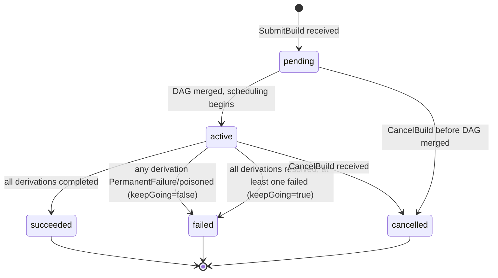

# rio-scheduler

Receives derivation build requests, analyzes the DAG, and publishes work to workers via a bidirectional streaming RPC.

## Responsibilities

- Parse derivation graphs from gateway requests
- Query rio-store for cache hits (already-built outputs)
- Compute remaining work graph (subtract cached nodes)
- Critical-path priority computation (bottom-up: priority = own\_duration + max(successor priorities)); recomputed incrementally on completion by walking ancestors with dirty-flag propagation
- Duration estimation from historical build data in PostgreSQL (EMA with alpha=0.3)
- Resource-aware scheduling: match derivation `requiredSystemFeatures` and resource needs to worker capabilities (subset matching: all required features must be present on the worker)
- Auto-pin live build inputs: on dispatch, `pin_live_inputs` writes the derivation's input closure to the `scheduler_live_pins` table (used by rio-store's GC mark phase as a root seed); unpinned on completion
- Proxy `AdminService.TriggerGC` to rio-store, first collecting live-build output paths via `ActorCommand::GcRoots` and forwarding them as `extra_roots`
- Closure-locality affinity: score workers by normalized transfer cost, using bloom filter approximation from worker heartbeats
- Priority queue with inter-build priority (CI > interactive > scheduled) and intra-build priority (critical path)
- IFD prioritization: builds that block evaluation get maximum priority (detected by protocol sequencing --- `wopBuildDerivation` arriving before `wopBuildPathsWithResults` on the same session)
- CA early cutoff _(Phase 5+, not yet implemented)_: per-edge tracking --- when a CA derivation output matches cached content, mark that edge as cutoff and skip downstream only when ALL input edges are resolved
- Work reassignment: when a worker fails (stream closed, heartbeat timeout), reassign its in-flight derivations to another worker. _Slow-worker speculative reassignment (actual\_time > estimated\_time × 3) is deferred — see Phase 4._
- Poison derivation tracking: mark derivations that fail on 3+ different workers; auto-expire after 24h. See [Error Taxonomy](../errors.md) for details.

## Concurrency Model

r[sched.actor.single-owner]
The scheduler uses a **single-owner actor model** for the in-memory global DAG. A single Tokio task owns the DAG and processes all mutations from an `mpsc` channel:

- `SubmitBuild` → DAG merge command
- `ReportCompletion` → node completion + downstream release command
- `CancelBuild` → orphan derivations command
- Heartbeat → worker liveness + running_builds merge + bloom filter + size_class
- CA early cutoff → edge cutoff + potential cancellation command

gRPC handler tasks send commands to the DAG actor and `await` responses. This eliminates lock contention, makes operation ordering deterministic, and simplifies reasoning about correctness. PostgreSQL writes are batched and performed asynchronously by the actor.

## Scheduling Algorithm

The scheduling algorithm below is implemented as of Phase 2c: critical-path priority (BinaryHeap ReadyQueue), size-class routing with memory-bump and overflow, bloom-filter locality scoring, build-history Estimator with fallback chain. Interactive builds get a +1e9 priority boost (dwarfs any critical-path value) rather than the Phase 2a `push_front`. **CutoffRebalancer (adaptive cutoffs) and WorkerPoolSet CRD are deferred to Phase 4** (see [phases/phase4.md](../phases/phase4.md)) — size-class cutoffs are operator-configured static values. Phase 3a added: PrefetchHint (scheduler sends `approx_input_closure` bloom-filtered before WorkAssignment), leader election via Kubernetes Lease gated on `RIO_LEASE_NAME` (leader generation bumped on each acquire, stored in `Arc<AtomicU64>`), `AdminService.ClusterStatus`/`DrainWorker` for the controller.

```
1. Receive derivation DAG from gateway
2. Merge into global DAG (dedup by store path / derivation hash; see Multi-Build DAG Merging)
3. For each derivation in DAG:
   a. Query rio-store: is output already in CAS? (cache hit)
   b. For CA derivations: check content-indexed CAS for matching output
4. Compute remaining build graph (nodes without cached outputs)
5. If empty -> full cache hit, return results immediately
6. Compute critical path priorities (bottom-up traversal)
7. For each ready node (all deps satisfied):
   a. Estimate duration (existing EMA / fallback chain, see Duration Estimation)
   b. Classify into size class based on estimated duration vs configured cutoffs
      (see Size-Class Routing below). If no size classes are configured, skip this step.
      If ema_peak_memory_bytes exceeds the target class's memory limit, bump to the next class.
   c. Score each worker (filtered to the target size class if applicable):
      - Resource fit (hard filter): does worker have required features, enough CPU/memory?
        Workers that fail this check are excluded entirely.
      - Transfer cost (normalized):
          raw_cost(drv, worker) = |closure(drv) - worker_cached_paths|  (path count, not nar_size sum)
          normalized_cost = raw_cost / max(raw_cost across all candidate workers)
        Closure membership approximated via bloom filters in worker heartbeats (target FPR: 1%).
        Path count is used as a proxy for transfer size; nar_size-weighted scoring is a possible future refinement.
      - Load fraction: running_builds / max_builds (dimensionless, in [0, 1])
      - Combined score: normalized_cost * W_locality + load_fraction * W_load
        Lowest score wins. Both terms are in [0, 1], making weights directly comparable.
   d. Assign to the best-scoring worker via the bidirectional BuildExecution stream.
      The WorkAssignment carries an HMAC-SHA256-signed assignment token (Claims:
      `worker_id`, `drv_hash`, `expected_outputs`, `expiry_unix`). The store verifies
      the token on PutPath and rejects uploads for paths not in `expected_outputs`.
      See [Security: assignment tokens](../security.md#boundary-2-gatewayworker--internal-services-grpc).
8. As builds complete (reported via BuildExecution stream):
   a. Upload output to rio-store (worker does this before reporting)
   b. For CA derivations: check if output content matches any existing CAS entry
      - If match -> mark that specific edge as "cutoff"
      - For each downstream node, check if ALL input edges are in one of:
        (a) cached, (b) cutoff, (c) rebuilt but content-hash matches old
      - Only skip a downstream node if ALL its input edges meet these conditions
      - If a downstream node is already running when cutoff is detected: let it finish
        and discard the result (see Preemption below)
   c. Release newly-ready downstream nodes
   d. Update duration estimates with actual build time (EMA, alpha=0.3)
   e. Recompute priorities incrementally: walk up ancestors only, using dirty-flag
      propagation -- only ancestors whose max-successor-priority changed need updating
9. On failure: classify error (see errors.md), apply retry policy, reassign or mark as failed
```

r[sched.merge.toctou-serial]
> **TOCTOU note on cache checks (steps 2--4):** The DAG merge and subsequent cache check MUST be performed inside the DAG actor (serialized), not by the gRPC handler before sending the merge command. A cache check performed by the gRPC handler races with concurrent merges --- another build may complete a shared derivation between the handler's cache check and the actor's merge, leading to duplicate work. By performing cache verification after merge inside the actor, the check reflects the latest state.

r[sched.completion.idempotent]
> **Completion report idempotency:** A `CompletionReport` for an already-completed derivation is accepted and ignored (no-op). The actor's state machine treats `completed → completed` as an idempotent transition. This handles duplicate reports caused by worker retries during scheduler failover, network retransmissions, or race conditions with CA early cutoff.

r[sched.tenant.resolve]

The gateway sends the tenant **name** (not a UUID) in `SubmitBuildRequest.tenant_id` — captured from the server-side `authorized_keys` entry's comment field. The scheduler's `submit_build` handler resolves this to a UUID via `SELECT tenant_id FROM tenants WHERE tenant_name = $1`. Unknown tenant name → `InvalidArgument`. Empty string → `None` (single-tenant mode, no PG lookup). This keeps the gateway PostgreSQL-free — preserving stateless N-replica HA.

r[sched.poison.ttl-persist]

`poisoned_at` is persisted to `derivations.poisoned_at TIMESTAMPTZ` when the poison threshold trips. Recovery loads poisoned rows via a separate `load_poisoned_derivations` query (since `TERMINAL_STATUSES` includes `"poisoned"` and `load_nonterminal_derivations` filters it out). The timestamp is converted back to `Instant` via PG-computed `EXTRACT(EPOCH FROM (now() - poisoned_at))`, so the 24h TTL check survives scheduler restart.

r[sched.admin.clear-poison]

`AdminService.ClearPoison` resets both in-memory state (`reset_from_poison()`: Poisoned→Created, clear `failed_workers`, zero `retry_count`, null `poisoned_at`) and PostgreSQL (`db.clear_poison()`). Returns `cleared=true` only if both succeed. If PG fails after in-mem reset, returns `false` so the operator retries — next recovery would restore Poisoned, so in-mem/PG drift is self-correcting. Idempotent: calling on a non-poisoned or non-existent derivation returns `cleared=false` without error.

## Multi-Build DAG Merging

r[sched.merge.dedup]
The scheduler maintains a single global DAG across all concurrent build requests. When a new derivation DAG arrives from the gateway, it is merged into the global graph:

- **Input-addressed derivations**: deduplicated by store path
- **Content-addressed derivations**: deduplicated by modular derivation hash (as computed by `hashDerivationModulo` --- excludes output paths, depends only on the derivation's fixed attributes)

r[sched.merge.shared-priority-max]
Each derivation node tracks a set of interested builds. Shared derivations are built once; all interested builds are notified on completion. **A shared derivation's priority is `max(priority of all interested builds)`, updated on merge.** When a new build raises a shared node's priority, the node's position in the priority queue is updated.

## Duration Estimation

r[sched.estimate.fallback-chain]
Build duration estimates feed into critical-path priority computation and scheduling decisions.

| Priority | Method |
|----------|--------|
| 1 | Exact `(pname, system)` match in the `build_history` table (EMA) |
| 2 | Cross-system `pname` match: mean of all `build_history` rows with the same `pname` (any system) |
| 3 | Closure-size proxy: `input_srcs_nar_size / 10 MB/s`, floored at 5s |
| 4 | Default constant: 30 seconds |

Fallbacks 1–2 require a `pname` (extracted from the derivation's `env.pname` attr, or `None` for raw/FOD derivations without it). When `pname` is absent, the chain skips directly to fallback 3.

r[sched.estimate.ema-alpha]
After each build completes, the estimate is updated using an exponential moving average (alpha=0.3) of actual durations. Cold start: on a fresh deployment with no history, all derivations use fallback 3 (closure-size proxy) or 4 (default). Critical-path scheduling quality improves as history accumulates (typically 5-10 builds per derivation for convergence).

The `build_history` table also tracks peak resource usage (memory, CPU, output size) via EMA, reported by workers in `CompletionReport`. These feed into size-class routing decisions (see below).

## Size-Class Routing

> **Current configuration source:** size classes are configured via static TOML (`[[size_classes]]` tables in `scheduler.toml`). Workers declare their class in the heartbeat. `WorkerPoolSet` CRD integration is deferred to Phase 4 — for now, cutoffs are operator-maintained static values.

When size classes are configured, the scheduler routes derivations to right-sized worker pools based on estimated duration and resource needs. This is inspired by [SITA-E (Size Interval Task Assignment with Equal load)](https://dl.acm.org/doi/10.1145/506147.506154), adapted for non-preemptible Nix builds.

### Classification

r[sched.classify.smallest-covering]
Each derivation is classified into a size class by comparing its estimated duration against the configured cutoffs:

```
class(drv) = smallest class i where estimated_duration(drv) <= cutoff_i
```

r[sched.classify.mem-bump]
If `ema_peak_memory_bytes` for a derivation exceeds the target class's memory limit, the derivation is bumped to the next larger class regardless of duration (resource-aware class bumping).

If no size classes are configured (empty `[[size_classes]]`), classification is skipped and all workers are candidates (backward compatible with single `WorkerPool` deployments).

### Misclassification Handling

r[sched.classify.penalty-overwrite]
Nix builds are non-preemptible --- a running build cannot be checkpointed or migrated. If a **completed** build's actual duration exceeds 2x its assigned-class cutoff, the scheduler (in the success-completion handler):

1. Marks the derivation as **misclassified** in the `build_history` table
2. Applies a **penalty** to the EMA: sets `ema_duration_secs = actual_duration` (replaces the smoothed estimate with the observed value, ignoring the usual alpha blending)
3. Increments `misclassification_count` for the `(pname, system)` key

Detection happens post-completion, not mid-run --- by the time the check fires, the build has already finished on its original worker.

Future instances of the same `(pname, system)` are routed to a larger class by virtue of the penalty-overwritten EMA: the next `classify()` call reads the updated `ema_duration_secs` and selects the appropriate cutoff. The `misclassification_count` column is currently incremented but not read by the classifier --- it is reserved for the Phase 4 `CutoffRebalancer` to detect systematically-wrong cutoffs. Penalty-overwrite alone drives current routing correction.

### Adaptive Cutoff Learning (SITA-E)

> **Phase 4 deferral:** The `CutoffRebalancer` and adaptive learning are not yet implemented. Cutoffs are static TOML config. The algorithm below is the target design.

A background task (`CutoffRebalancer`) periodically recomputes class cutoffs to equalize load across pools:

```
For each class i, load_i = fraction_i * mean_duration_i
where:
  fraction_i = fraction of derivations with duration in [cutoff_{i-1}, cutoff_i]
  mean_duration_i = mean actual duration of derivations in class i

SITA-E sets cutoffs such that load_1 ~= load_2 ~= ... ~= load_k
```

1. Every `recomputeInterval` (default: 1h), query `build_history` for the duration distribution over the last 7 days
2. Compute the empirical CDF of build durations
3. Find cutoffs that equalize load across classes
4. Blend new cutoffs with current: `c_new = alpha * c_computed + (1-alpha) * c_old` (default alpha=0.1)
5. Update `WorkerPoolSet` status with new cutoffs; log changes as structured events

**Cold start:** Operator-configured `durationCutoff` values from the CRD are used until sufficient history accumulates. **Stability guard:** Cutoffs only change if >= `minSamples` (default: 100) builds have been observed since the last adjustment and the computed cutoff differs by > 10%.

### Overflow Routing

r[sched.overflow.up-only]
When a size class's worker pool is fully occupied but another class has idle workers, the scheduler may route overflow derivations to the next larger class. This prevents queue starvation when the workload is temporarily skewed. Overflow routing is never applied downward (large builds are never routed to small workers).

## Preemption

r[sched.preempt.never-running]
Nix builds cannot be paused or resumed, so **running builds are never preempted or cancelled** --- including for CA early cutoff. When cutoff is detected for an already-running build, the build is allowed to complete and the result is simply discarded. This bounds wasted work to one build duration per affected worker.

**Exception**: the only case where a running build is killed is worker pod termination (scale-down, node failure). The preStop hook gives the build time to complete; if it cannot finish within the grace period, it is reassigned.

Queue-level preemption is fully supported:
- High-priority derivations jump ahead of lower-priority queued (not yet running) work. Interactive builds receive an `INTERACTIVE_BOOST` of +1e9 to their priority score, which dominates any realistic critical-path sum while still preserving relative ordering **within** the interactive set.
- _Worker-slot reservation (priority lanes holding a fraction of workers for high-priority work) is not implemented. The boost heuristic plus autoscaling is the current mitigation for starvation._
- Autoscaling is the primary mitigation for all-workers-busy scenarios

## Derivation State Machine

r[sched.state.machine]
Each derivation node in the global DAG follows a strict state machine. All transitions are performed inside the DAG actor to ensure serialized access.

```mermaid
stateDiagram-v2
    [*] --> created : DAG merge adds node
    created --> completed : cache hit (output in store)
    created --> queued : build accepted
    queued --> ready : all dependencies complete
    ready --> assigned : worker selected
    assigned --> running : worker acknowledges
    running --> completed : build succeeded
    running --> failed : build error (retriable)
    running --> poisoned : poison threshold / max retries / permanent failure
    assigned --> ready : worker lost / heartbeat timeout
    failed --> ready : retry scheduled
    completed --> [*]
    poisoned --> created : 24h TTL expiry
    created --> dependency_failed : dep poisoned before queue
    queued --> dependency_failed : dep poisoned cascade
    ready --> dependency_failed : dep poisoned cascade
    dependency_failed --> [*]

    note right of queued : Blocked on >=1 dependency
    note right of ready : All deps satisfied,\nawaiting worker
    note right of assigned : Guard: worker has\nrequired features + resources
    note right of poisoned : Auto-expires after 24h\n(returns to created)
    note right of dependency_failed : Terminal; maps to\nNix BuildStatus=10
```

> **Note on the architecture diagram:** The mermaid flowchart in [architecture.md](../architecture.md) shows arrows FROM the scheduler TO workers for the `BuildExecution` stream. This reflects data flow direction (scheduler sends assignments). The gRPC connection direction is the reverse: workers are the gRPC client calling the scheduler's `WorkerService.BuildExecution` RPC.

r[sched.state.transitions]
**Transition guards:**

| Transition | Guard / Condition |
|---|---|
| `created → completed` | Output already exists in rio-store (full cache hit) |
| `created → queued` | Build is accepted into the scheduler |
| `queued → ready` | All dependency derivations are in `completed` state |
| `ready → assigned` | A worker passes resource-fit check and is selected by the scoring algorithm |
| `assigned → running` | Worker sends acknowledgement on the `BuildExecution` stream |
| `running → completed` | Worker reports success (output uploaded by worker before reporting; scheduler does not re-verify against rio-store) |
| `running → failed` | Worker reports a retriable error (`TransientFailure` / `InfrastructureFailure`); retry count < max_retries (default 2) **and** failed_workers count < poisonThreshold. `failed` is a non-terminal intermediate state --- it always transitions to `ready` after retry backoff (stored in `DerivationState.backoff_until`; `dispatch_ready` defers until `Instant::now() >= backoff_until`). |
| `running → poisoned` | Any of: **(a)** derivation has failed on `poisonThreshold` distinct workers (default: 3; poison tracking spans across builds, not just one build's retry attempts), **(b)** retry_count >= max_retries with failed_workers below threshold, **(c)** worker reports a permanent-class failure (`PermanentFailure`, `OutputRejected`, `CachedFailure`, `LogLimitExceeded`, `DependencyFailed`) --- poisoned immediately on first attempt, no retry |
| `assigned → ready` | Assigned worker is lost (heartbeat timeout, pod termination) |
| `failed → ready` | Derivation re-enters the ready queue. See `running → failed` above. |
| `created → dependency_failed` | A dependency reached `poisoned` before this node was queued |
| `queued → dependency_failed` | A dependency reached `poisoned` while this node was waiting |
| `ready → dependency_failed` | A dependency reached `poisoned` after this node became ready |

r[sched.state.terminal-idempotent]
**Idempotency rules:**
- `completed → completed`: No-op (duplicate completion reports are accepted and ignored)
- `poisoned → poisoned`: No-op
- `dependency_failed → dependency_failed`: No-op
- Any transition from a terminal state (`completed`, `poisoned`) to a non-terminal state is rejected, except `poisoned` auto-expiry after 24h which resets to `created`

r[sched.state.poisoned-ttl]
The `poisoned → created` transition is the only non-terminal escape from a terminal state, gated by a 24h TTL.

## Build State Machine

r[sched.build.state]
Each build request follows a separate state machine from individual derivations. Build status aggregates the status of its constituent derivations.



r[sched.build.keep-going]
**Aggregation rules:**
- `keepGoing=false` (default): the build fails as soon as any derivation reaches `PermanentFailure` or `poisoned`. Remaining derivations are cancelled.
- `keepGoing=true`: the build continues executing independent derivations even after a failure. The build is `failed` only when all reachable derivations have completed or failed.
- A build is `succeeded` only if ALL derivations are `completed`.
- A build is `cancelled` only via explicit `CancelBuild` (client disconnect or API call).

## Leader Transition Protocol

The scheduler uses a leader-elected model for the in-memory global DAG. On leadership transitions:

1. **Assignment generation counter**: Incremented on each leader election (by the lease loop's acquire transition via `fetch_add` on the shared `Arc<AtomicU64>`). Each `WorkAssignment` carries this generation number. Workers compare it against the generation seen in `HeartbeatResponse` and reject stale-generation assignments.
2. **Recovery flag cleared**: The lease acquire transition clears `recovery_complete` and fires a `LeaderAcquired` command to the actor (fire-and-forget via `tokio::spawn` --- lease renewal MUST NOT block on recovery completing).
3. **State reconstruction**: The actor's `LeaderAcquired` handler invokes state recovery (see State Recovery below), then sets `recovery_complete = true`. Dispatch is a no-op while `recovery_complete` is false.
4. **Worker reconnection**: Workers reconnect their `BuildExecution` streams to the new leader. Stale completion reports (carrying an old generation number) are verified against rio-store for output existence before acceptance.
5. **In-flight assignments**: Assignments from the old leader are verified via heartbeat. If a worker reports it is still running the assigned derivation, the new leader reuses the assignment with the new generation number.

## Synchronous vs. Async Writes

Not all state changes require synchronous PostgreSQL writes:

| Write Type | Examples | Behavior |
|-----------|---------|----------|
| **Synchronous** (before responding) | Derivation completion state, assignment state transitions, build terminal status | Must be durable before acknowledging to worker/gateway |
| **Async/batched** | `build_history` EMA updates, duration estimate refreshes, dashboard-facing status updates | Batched and flushed periodically (every 1-5s) |

On crash, async writes may be lost but are non-critical: EMA re-converges after a few builds, and status is rebuilt from ground truth (derivation/assignment tables) during state recovery.

## State Recovery

r[sched.recovery.gate-dispatch]
On startup or leadership acquisition, the scheduler reconstructs its in-memory state from PostgreSQL. Recovery runs inside the DAG actor (via the `LeaderAcquired` command). Dispatch is **gated** on the `recovery_complete` flag --- `dispatch_ready` is a no-op until recovery finishes, preventing a partially-loaded DAG from issuing assignments.

Recovery sequence:

1. Load all non-terminal builds from PostgreSQL (`builds` and `derivations` tables)
2. Reconstruct DAGs from the derivations table and their edges
3. **Identify nodes in "waiting" state whose dependencies are all complete, and transition them to "ready"** (handles the case where the previous scheduler crashed between completing a node and releasing downstream)
4. Discover workers from the `assignments` table and from Kubernetes pod list
5. Query each known worker for current state via Heartbeat
6. For derivations marked "assigned":
   - If the assigned worker reports completion → process the result
   - If the assigned worker is gone → check rio-store for the output (it may have been uploaded before the worker died). If found, mark complete. Otherwise, reassign.
7. Resume scheduling from the reconstructed state

Workers buffer completion reports with retry logic: if `ReportCompletion` fails (scheduler unreachable during failover), the worker retries with exponential backoff until the scheduler accepts it.

## Worker Registration Protocol

r[sched.worker.dual-register]
Worker registration is **two-step** --- there is no single registration RPC; instead, the scheduler infers registration from two separate interactions:

1. Worker opens a `BuildExecution` bidirectional stream to the scheduler (calling `WorkerService.BuildExecution`).
2. Worker calls the separate `Heartbeat` unary RPC with its initial capabilities:
   - `worker_id` (unique, derived from pod UID)
   - `systems` (list, e.g., `[x86_64-linux]`; a worker may support multiple target systems via emulation)
   - `supported_features` (list of `requiredSystemFeatures` the worker supports)
   - `max_builds` (concurrency limit)
   - `local_paths` (initial store path bloom filter for closure-locality scoring)
3. When the scheduler receives the first `Heartbeat` from a `worker_id` that also has an open `BuildExecution` stream, it creates an in-memory worker entry with the reported capabilities and marks the worker as `alive`.
4. Scheduler begins sending `WorkAssignment` messages on the stream.

r[sched.worker.deregister-reassign]
**Deregistration:** A worker is removed from the scheduler's state when:
- The `BuildExecution` stream is closed (graceful shutdown or network failure)
- Heartbeat timeout: the actor's tick (configurable, default 10s) finds `last_heartbeat` older than 30s **and** this has been observed on 3 consecutive ticks (effective wall-clock timeout: ~50–60s depending on tick phase alignment)

On deregistration, all derivations in `assigned` state for that worker are transitioned back to `ready` for reassignment.

r[sched.backstop.timeout]
**Backstop timeout:** Separately from worker deregistration, `handle_tick` checks each `running` derivation's `running_since` timestamp. If elapsed time exceeds `max(est_duration × 3, daemon_timeout + 10min)`, the scheduler sends a CancelSignal to the worker, resets the derivation to `ready`, increments `retry_count`, and adds the worker to `failed_workers`. This catches the "worker is heartbeating but daemon is wedged" case where no stream-close or heartbeat-timeout fires. The `rio_scheduler_backstop_timeouts_total` counter tracks these events.

## Backpressure

The scheduler applies backpressure at multiple layers to prevent overload:

**gRPC flow control:** The `BuildExecution` streams use the default HTTP/2 flow control window (64 KiB initial, dynamically adjusted). The scheduler does not send new `WorkAssignment` messages to a worker whose send window is exhausted, naturally rate-limiting dispatch to slow consumers.

r[sched.backpressure.hysteresis]
**Actor queue depth limit:** The DAG actor's `mpsc` channel has a fixed capacity (`ACTOR_CHANNEL_CAPACITY` = 10,000 messages; compile-time constant). If the queue depth exceeds 80% of capacity:
1. `CompletionReport` messages from worker `BuildExecution` streams block the stream-reader task on the actor channel send (completions must not be dropped — a lost completion would leave the derivation stuck `Running`).
2. `LogBatch` and `ProgressUpdate` messages are dropped (non-blocking `try_send`) — the ring buffer already holds log lines and live-forward is a nice-to-have; progress is dashboard-only.
3. New `SubmitBuild` requests from the gateway receive gRPC `RESOURCE_EXHAUSTED` status.
4. The scheduler increments the `rio_scheduler_queue_backpressure` counter for alerting.

Normal processing resumes when the queue depth drops below 60% (hysteresis to prevent oscillation).

**Gateway timeout:** If a `SubmitBuild` request takes longer than 30 seconds to receive an initial acknowledgement from the DAG actor, the gateway handler returns gRPC `DEADLINE_EXCEEDED`. This timeout is enforced client-side in rio-gateway, not in the scheduler. The gateway may retry with exponential backoff. This prevents unbounded request queueing at the gateway layer.

## State Storage (PostgreSQL)

| Table | Contents |
|-------|----------|
| `builds` | Build requests, status, timing, requestor, tenant_id |
| `derivations` | Derivation metadata, scheduling state, tenant_id |
| `derivation_edges` | DAG edges (parent_id, child_id) as a separate join table for concurrent merge safety |
| `assignments` | Derivation -> worker mapping, status, assignment generation counter |
| `build_derivations` | Many-to-many mapping: which builds are interested in which derivations |
| `build_history` | Running EMA per (pname, system) for duration estimation (not per-build rows) |
| `build_logs` | S3 blob metadata per (build_id, drv_hash) — `s3_key`, `line_count`, `is_complete` for log-flush UPSERTs |
| `build_event_log` | Prost-encoded `BuildEvent` per (build_id, sequence) for gateway `since_sequence` replay across failover |
| `scheduler_live_pins` | Auto-pinned live-build input closures (`store_path_hash`, `drv_hash`). Written by `pin_live_inputs` at dispatch; unpinned on completion. Used by rio-store's GC mark phase as a root seed. |

### Schema (pseudo-DDL)

```sql
CREATE TABLE builds (
    build_id        UUID PRIMARY KEY DEFAULT gen_random_uuid(),
    tenant_id       UUID,                   -- NOT NULL deferred to Phase 4 (multi-tenancy)
    requestor       TEXT NOT NULL,
    status          TEXT NOT NULL CHECK (status IN ('pending', 'active', 'succeeded', 'failed', 'cancelled')),
    priority_class  TEXT NOT NULL DEFAULT 'scheduled' CHECK (priority_class IN ('ci', 'interactive', 'scheduled')),
    submitted_at    TIMESTAMPTZ NOT NULL DEFAULT now(),
    started_at      TIMESTAMPTZ,
    finished_at     TIMESTAMPTZ,
    error_summary   TEXT,
    -- UNIQUE (tenant_id, build_id) deferred to Phase 4 with NOT NULL constraint
);
CREATE INDEX builds_status_idx ON builds (status) WHERE status IN ('pending', 'active');

CREATE TABLE derivations (
    derivation_id       UUID PRIMARY KEY DEFAULT gen_random_uuid(),
    tenant_id           UUID,                   -- NOT NULL deferred to Phase 4 (multi-tenancy)
    drv_hash            TEXT NOT NULL,          -- input-addressed: store path; CA: modular derivation hash
    drv_path            TEXT NOT NULL,          -- full /nix/store/...-foo.drv path
    pname               TEXT,
    system              TEXT NOT NULL,
    status              TEXT NOT NULL CHECK (status IN ('created', 'queued', 'ready', 'assigned', 'running', 'completed', 'failed', 'poisoned', 'dependency_failed')),
    required_features   TEXT[] NOT NULL DEFAULT '{}',
    assigned_worker_id  TEXT,
    -- assignment_gen lives on assignments table (as generation), not here
    retry_count         INT NOT NULL DEFAULT 0,
    created_at          TIMESTAMPTZ NOT NULL DEFAULT now(),
    updated_at          TIMESTAMPTZ NOT NULL DEFAULT now(),
    CONSTRAINT derivations_drv_hash_uq UNIQUE (drv_hash)
);
CREATE INDEX derivations_status_idx ON derivations (status) WHERE status NOT IN ('completed', 'poisoned', 'dependency_failed');
-- Partial index: most rows NULL in single-tenant mode (migration 009 Part A).
CREATE INDEX derivations_tenant_idx ON derivations (tenant_id) WHERE tenant_id IS NOT NULL;

CREATE TABLE derivation_edges (
    parent_id   UUID NOT NULL REFERENCES derivations (derivation_id),
    child_id    UUID NOT NULL REFERENCES derivations (derivation_id),
    is_cutoff   BOOLEAN NOT NULL DEFAULT FALSE,
    PRIMARY KEY (parent_id, child_id)
);
CREATE INDEX derivation_edges_child_idx ON derivation_edges (child_id);

CREATE TABLE build_derivations (
    build_id        UUID NOT NULL REFERENCES builds (build_id),
    derivation_id   UUID NOT NULL REFERENCES derivations (derivation_id),
    PRIMARY KEY (build_id, derivation_id)
);
CREATE INDEX build_derivations_deriv_idx ON build_derivations (derivation_id);

CREATE TABLE assignments (
    assignment_id       UUID PRIMARY KEY DEFAULT gen_random_uuid(),
    derivation_id       UUID NOT NULL REFERENCES derivations (derivation_id),
    worker_id           TEXT NOT NULL,
    generation          BIGINT NOT NULL,        -- leader generation counter
    status              TEXT NOT NULL CHECK (status IN ('pending', 'acknowledged', 'completed', 'failed', 'cancelled')),
    assigned_at         TIMESTAMPTZ NOT NULL DEFAULT now(),
    completed_at        TIMESTAMPTZ
);
CREATE UNIQUE INDEX assignments_active_uq ON assignments (derivation_id) WHERE status IN ('pending', 'acknowledged');
CREATE INDEX assignments_worker_idx ON assignments (worker_id, status);

CREATE TABLE build_history (
    pname                   TEXT NOT NULL,
    system                  TEXT NOT NULL,
    ema_duration_secs       DOUBLE PRECISION NOT NULL,
    sample_count            INT NOT NULL DEFAULT 0,
    last_updated            TIMESTAMPTZ NOT NULL DEFAULT now(),
    ema_peak_memory_bytes   DOUBLE PRECISION,       -- nullable: worker may not report cgroup memory.peak
    ema_peak_cpu_cores      DOUBLE PRECISION,       -- nullable: polled worker-side from cgroup cpu.stat
    ema_output_size_bytes   DOUBLE PRECISION,       -- nullable: NAR size of built outputs
    size_class              TEXT,                   -- currently unused (DerivationState.assigned_size_class populated in-memory but not persisted)
    misclassification_count INTEGER NOT NULL DEFAULT 0,  -- Phase 4 CutoffRebalancer input; currently write-only
    PRIMARY KEY (pname, system)
);
```

> **Auxiliary tables omitted from pseudo-DDL above:** `build_logs` (S3 blob metadata per derivation) and `build_event_log` (Prost-encoded BuildEvent per sequence for gateway replay). See `migrations/` (workspace root) for full schema.

## Leader Election

r[sched.lease.k8s-lease]
The scheduler uses a **Kubernetes Lease** (`coordination.k8s.io/v1`) for leader election, via the `kube-leader-election` crate. A background task polls `try_acquire_or_renew` every 5 seconds against a 15-second lease TTL (3:1 renew ratio, per Kubernetes convention). On the acquire transition (standby → leader), the task increments the in-memory generation counter and sets `is_leader=true`; on the lose transition, it clears `is_leader`. The dispatch loop checks `is_leader` and no-ops while standby (DAGs are still merged so state is warm for takeover).

- **Configuration:** Enabled by setting `RIO_LEASE_NAME`. When unset (VM tests, single-scheduler deployments), the scheduler runs in non-K8s mode: `is_leader` defaults to `true` immediately and generation stays at 1. Namespace is read from `RIO_LEASE_NAMESPACE` or the in-cluster service-account mount; holder identity defaults to the pod's `HOSTNAME`.
- **Transient API errors:** On apiserver errors, the loop logs a warning and retries on the next tick without flipping `is_leader`. If errors persist past the lease TTL, the lease expires naturally and another replica acquires --- correct behavior for a replica with broken K8s connectivity.
- **Split-brain window:** `kube-leader-election` is a polling loop, not a watch-based fence. During a network partition, both replicas may believe they are leader for up to `lease_ttl` (15s). This is **acceptable** because dispatch is idempotent: DAG merge dedups by `drv_hash`, and workers reject stale-generation assignments after seeing the new generation in `HeartbeatResponse`. Worst case: a derivation is dispatched twice, builds twice, produces the same deterministic output. Wasteful but correct.

r[sched.lease.generation-fence]
**Generation-based staleness detection is worker-side only.** On each lease acquisition, the new leader increments an in-memory `Arc<AtomicU64>` generation counter. Workers see the new generation in `HeartbeatResponse` and reject any `WorkAssignment` carrying an older generation. **No PostgreSQL-level write fencing exists.** A deposed leader's in-flight PG writes will succeed; the split-brain window is bounded by the Lease renew deadline (default 15s). Because the writes in question are idempotent upserts keyed by `drv_hash` and status transitions are monotone, brief dual-writer windows do not corrupt state.

> **Optional hardening (Phase 4+):** If stricter at-most-one-writer semantics are needed, add a `scheduler_meta` row with a `leader_generation` column and gate all synchronous writes with `WHERE leader_generation = $current_gen`. Not currently implemented --- the worker-side generation check plus idempotent PG schema is sufficient for correctness.

## Incremental Critical-Path Maintenance

r[sched.critical-path.incremental]
Critical-path priorities are maintained **incrementally**, not via full O(V+E) recomputation on every event:

- **On derivation completion:** Walk upward from the completed node to its ancestors, recalculating priorities only for nodes whose successor priorities changed. This is O(affected subgraph), which is typically much smaller than the full DAG.
- **On DAG merge:** New nodes are inserted with initial priorities computed bottom-up from the merge point. Existing nodes' priorities are updated only if the new subgraph connects to them with a higher-priority path.
- **Periodic full recomputation:** Every ~60 seconds (on the estimator-refresh cadence), the DAG actor performs a full bottom-up priority sweep **inline** inside `handle_tick`, ensuring consistency even if incremental updates accumulate rounding errors or miss edge cases. No separate background task or message is involved --- the actor owns the DAG and mutates it directly.

This approach keeps per-event processing well under the 1ms budget needed for 1000+ ops/sec throughput.

## Key Files

- `rio-scheduler/src/actor/` — DAG actor (single-owner event loop, dispatch, retry, cleanup; split into mod/merge/completion/dispatch/worker/build submodules)
- `rio-scheduler/src/dag/` — DAG representation, merge, cycle detection, topological ops
- `rio-scheduler/src/state/` — State machines (DerivationStatus, BuildState), transition validation, RetryPolicy, newtypes (DrvHash, WorkerId)
- `rio-scheduler/src/queue.rs` — Priority BinaryHeap ReadyQueue (OrderedFloat + lazy invalidation)
- `rio-scheduler/src/critical_path.rs` — Bottom-up priority: `est_duration + max(children's priority)`; incremental ancestor-walk on completion
- `rio-scheduler/src/assignment.rs` — Worker scoring (bloom locality + load fraction) + size-class classify()
- `rio-scheduler/src/estimator.rs` — Duration + peak-memory from build_history; fallback chain (exact → pname-cross-system → closure-size proxy → 30s default)
- `rio-scheduler/src/grpc/` — SchedulerService + WorkerService gRPC implementations
- `rio-scheduler/src/db.rs` — PostgreSQL persistence (derivations, assignments, build_history EMA)
- `rio-scheduler/src/logs/` — LogBuffers ring buffer + S3 LogFlusher
- `rio-scheduler/src/lease.rs` — Kubernetes Lease leader-election loop (generation counter, is_leader flag, recovery_complete gate)
- `rio-scheduler/src/actor/recovery.rs` — State recovery: reload non-terminal builds/derivations from PG on LeaderAcquired
- `rio-scheduler/src/event_log.rs` — PostgreSQL-backed build_event_log writes for gateway `since_sequence` replay
- `rio-scheduler/src/admin/` — AdminService gRPC (ClusterStatus, DrainWorker, GetBuildLogs, TriggerGC)

## Planned Files (Phase 4/5)

- `rio-scheduler/src/early_cutoff.rs` — CA early cutoff detection (per-edge DAG tracking)
- `rio-scheduler/src/poison.rs` — Persistent (PG-backed) poison derivation tracking. Current `failed_workers` HashSet is in-memory and lost on scheduler restart.
- CutoffRebalancer — adaptive size-class cutoff adjustment from misclassification_count


