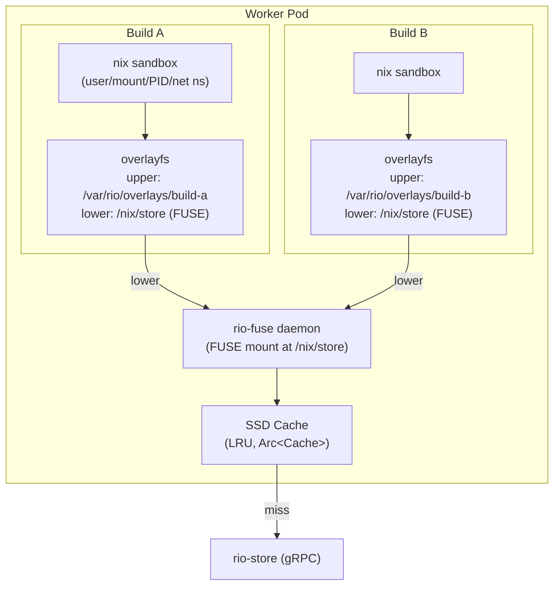

# rio-worker

Long-running process in a StatefulSet pod that executes individual derivations.

## Responsibilities

- Receive build assignments from scheduler via gRPC
- Run the FUSE store daemon (`rio-fuse`) that mounts `/nix/store` with lazy on-demand fetching from rio-store
- Manage per-build overlay filesystem: FUSE mount as lower layer, local SSD as upper layer
- Execute build: invoke `nix-daemon --stdio` locally for sandboxed build execution
- Stream build logs back to scheduler via gRPC bidirectional streaming
- After build: upload output NAR to rio-store (chunked), report completion
- Heartbeat / health checking to scheduler
- Resource usage reporting (CPU, memory, disk, build duration)

## FUSE Store (`rio-fuse`)

Each worker runs a FUSE filesystem that presents `/nix/store` to the build environment. The FUSE daemon communicates with rio-store via gRPC to lazily fetch store path content on demand.

```
                         Worker Pod
┌──────────────────────────────────────────────────────────┐
│                                                          │
│  rio-fuse (FUSE daemon)                                  │
│  ├── Mounts /nix/store                                   │
│  ├── On file access: fetches from rio-store via gRPC     │
│  ├── Local SSD cache (LRU eviction)                      │
│  ├── Immutable content → no cache invalidation needed    │
│  └── Accepts prefetch hints from scheduler               │
│                                                          │
│  ┌──────────────────┐  ┌──────────────────┐             │
│  │    Build A        │  │    Build B        │             │
│  │  overlayfs        │  │  overlayfs        │             │
│  │  ┌──────────────┐ │  │  ┌──────────────┐ │             │
│  │  │ Upper (SSD)  │ │  │  │ Upper (SSD)  │ │             │
│  │  │ - outputs    │ │  │  │ - outputs    │ │             │
│  │  │ - db.sqlite  │ │  │  │ - db.sqlite  │ │             │
│  │  ├──────────────┤ │  │  ├──────────────┤ │             │
│  │  │ Lower        │ │  │  │ Lower        │ │             │
│  │  │ (FUSE mount) │ │  │  │ (FUSE mount) │ │             │
│  │  └──────────────┘ │  │  └──────────────┘ │             │
│  │  nix sandbox      │  │  nix sandbox      │             │
│  └──────────────────┘  └──────────────────┘             │
└──────────────────────────────────────────────────────────┘
```

### Why FUSE Instead of a Shared PV

- **Overlay-over-NFS is unsupported**: The Linux kernel does not guarantee overlayfs correctness over NFS/EFS. FUSE mounts appear as local filesystems and work correctly with overlayfs.
- **No shared infrastructure**: Each worker manages its own cache independently. No RWX PersistentVolume, no NFS/EFS/CephFS provisioning, no StoreSync reconciler.
- **Lazy loading**: Only paths actually accessed during a build are fetched. A nixpkgs closure is tens of GB, but a typical build accesses a small fraction.
- **Perfect caching**: Store paths are immutable and content-addressed. Once cached, data never needs invalidation or re-fetching. The SSD cache is purely additive with LRU eviction under disk pressure.
- **Predictive prefetch**: The scheduler sends prefetch hints via the build execution stream before assigning work. The FUSE daemon warms its cache with the build's input closure paths before the build starts.

### FUSE Cache

- **Backend**: Local SSD (`emptyDir` or a dedicated PVC)
- **Eviction**: LRU by last-access time when cache exceeds configured size limit
- **Granularity**: Whole store paths (not individual chunks). The FUSE daemon reassembles NARs from chunks via rio-store and materializes them as directory trees on disk.
- **Metadata**: A lightweight SQLite index tracks cached paths, sizes, and access timestamps for eviction decisions
- **Cache warming**: On startup, the cache is cold. The first build on a new worker fetches all inputs from rio-store. Subsequent builds benefit from cached common paths (glibc, coreutils, etc.)

### FUSE Implementation

The FUSE daemon is implemented using the `fuser` crate and runs as part of the worker process (not a sidecar). It handles:

- `lookup`: Check if a store path exists by querying rio-store's `QueryPathInfo`
- `getattr`: Return file metadata from cached path info
- `read`/`readlink`/`readdir`: Serve content from local SSD cache, fetching from rio-store on cache miss
- `open`: Trigger background prefetch of the entire store path on first access

### FUSE Design Notes

The target architecture splits the FUSE daemon into submodules: `fuse/mod.rs` (daemon lifecycle, mount management), `fuse/lookup.rs` (path existence and metadata queries), `fuse/read.rs` (file content serving), and `fuse/cache.rs` (LRU cache management). The FUSE daemon handles concurrent access from multiple overlays via `Arc<Cache>` with a read-mostly access pattern --- store paths are immutable, so concurrent reads require no synchronization beyond the cache index.

**Fallback architecture:** If the FUSE+overlay spike (Phase 1b) fails, the fallback is a bind-mount approach with `nix-store --realise` pre-materialization. All input store paths are fully materialized on the worker's local disk before the build starts and bind-mounted into the sandbox. This trades lazy loading for simplicity and eliminates the FUSE dependency, at the cost of higher pre-build latency (full closure materialization instead of on-demand fetching).



## Worker Nix Configuration

Worker pods must ship a minimal `nix.conf` mounted via ConfigMap:

```ini
# Prevent build hook recursion --- workers ARE the builders
builders =
# All substitution handled by rio-store; don't try external substituters
substitute = false
# Enable sandbox for build purity
sandbox = true
# Hard-fail if sandbox setup fails (never fall back to unsandboxed builds)
sandbox-fallback = false
# Prevent derivations from accessing paths outside the Nix store during eval
restrict-eval = true
# No experimental features needed for build execution
experimental-features =
```

> **Security note**: `__noChroot` derivations (which disable the sandbox) are rejected at the gateway level before they ever reach a worker. See [Derivation Validation](../security.md#derivation-validation).

This configuration ensures workers only build derivations locally and never attempt to delegate or substitute externally.

> **Recursive Nix is not supported.** Derivations that invoke Nix internally (`__recursive` / `recursive-nix` experimental feature) will fail because `substitute = false`, `builders =`, and `experimental-features =` prevent the inner Nix from fetching dependencies or delegating builds. This is an explicit non-goal for the initial release. Supporting recursive Nix would require the worker to act as both a builder and a store client for the inner Nix instance, significantly complicating the worker architecture.

## rio-nix Client Protocol

Workers invoke `nix-daemon --stdio` and must speak the Nix worker protocol as a *client*. The `rio-nix` crate implements both server-side (gateway: responds to opcodes from Nix clients) and client-side (worker: sends `wopBuildDerivation` to the local daemon and receives `BuildResult`) protocol handling.

## Overlay Store Architecture

Each active build gets its own overlayfs mount with a separate upper directory and work directory. A synthetic Nix store SQLite database is placed in each overlay's upper layer so that Nix recognizes the input paths.

After build completes:

1. Read new paths from upper layer
2. Chunk and upload to rio-store (CAS), presenting the scheduler-issued assignment token for authorization (see [Security: assignment tokens](../security.md#boundary-2-gatewayworker--internal-services-grpc))
3. Register path metadata (narinfo, references)
4. Discard upper layer

### Multi-Output Derivation Upload

Derivations may produce multiple outputs (e.g., `out`, `dev`, `lib`). After a build completes:

1. **Detect outputs**: Scan the overlay upper layer for all new store paths. A multi-output derivation produces one path per output (e.g., `/nix/store/abc...-hello`, `/nix/store/def...-hello-dev`).
2. **NAR each output**: Serialize each output path independently into a NAR archive.
3. **Chunk**: Split each NAR into content-addressed chunks (matching rio-store's chunk size).
4. **Upload**: Upload chunks to rio-store in parallel across outputs. Deduplicate against existing chunks (CAS).
5. **Register**: Register each output path's narinfo (NAR hash, NAR size, references, signatures) with rio-store. All outputs from the same derivation are registered atomically.

**Upload failure handling:** If the upload to rio-store fails (S3 unavailable, network timeout), the worker retries the upload with exponential backoff (up to 3 attempts). If all upload retries are exhausted, the worker reports an `InfrastructureFailure` to the scheduler. The scheduler may reassign the derivation to a different worker, which must rebuild from scratch --- there is no mechanism to transfer the completed output from the original worker's local overlay. This is a known limitation; the completed output on the original worker is lost when the overlay is discarded.

## Store Database Management

Nix requires a functional store database (SQLite at `/nix/var/nix/db/db.sqlite`) to operate. It refuses to build derivations whose inputs are not registered in the local database, even if the paths physically exist on disk.

For each build, the worker synthesizes a minimal SQLite database in the overlay upper layer:

1. Query rio-store's PostgreSQL for path metadata of the build's input closure (deriver, NAR hash, NAR size, references, sigs, ca).
2. Generate the database via direct SQLite writes into the overlay's upper layer at `var/nix/db/db.sqlite`. Use a single transaction with `PRAGMA journal_mode=WAL` and `PRAGMA synchronous=OFF` for maximum speed (the DB is ephemeral).
3. The database must include the `ValidPaths`, `Refs`, and `DerivationOutputs` tables with proper indexes (`IndexValidPathsPath`, `IndexValidPathsHash`). The `SchemaVersion` in the `Config` table must match the Nix version running in the worker (target: Nix 2.20+ schema).
4. The database contains only path registrations for that specific build's input closure --- not the entire store.
5. After the build completes, the synthetic database is discarded along with the rest of the overlay upper layer.

Performance: direct SQLite writes handle 1000+ paths in <50ms. The bottleneck is the PostgreSQL metadata query, not the SQLite generation.

### Synthetic DB Risks

- **Schema version coupling**: Nix store DB schema (currently version 10) is an internal API with no stability guarantees. Pin to a specific Nix version and test schema compatibility on upgrade.
- **`Realisations` table**: Required for Phase 5 CA support. Add the table structure proactively but leave empty until CA early cutoff is activated.
- **`registrationTime`**: Set to 0 for input paths (not locally built). Only outputs built on this worker get a real timestamp.
- **`ultimate`**: Always 0 for input paths (they were not built on this worker). Set to 1 only for locally built outputs.
- **Journal mode**: Create with `journal_mode=WAL` (matching Nix's expectation) instead of `journal_mode=OFF`. While the DB is ephemeral, Nix may check the journal mode on open.

## Concurrent Build Isolation

The overlay is per-build, not per-worker. Each active build on a worker gets its own independent overlayfs mount with separate upper and work directories. This means:

- Multiple builds run concurrently on the same worker without filesystem interference.
- Maximum concurrent builds per worker is configured via the `WorkerPool` CRD (`maxConcurrentBuilds` field).
- The Nix sandbox provides additional process-level isolation (user, mount, PID, and network namespaces) between concurrent builds on the same worker.
- Each build's upper layer is independent, so output paths from one build never leak into another.
- Even if the Nix sandbox is compromised, the per-build overlay upper layer ensures rogue writes are isolated and discarded.

## Fixed-Output Derivation (FOD) Handling

Fixed-output derivations (FODs) have a known output hash declared in `outputHash`. They require special handling:

1. **Detection**: A derivation is a FOD if its `outputHash` attribute is non-empty.
2. **Network access**: Unlike regular derivations, FODs are allowed network access inside the sandbox. The worker configures the Nix sandbox to skip network namespace isolation for FODs.
3. **Output verification**: After the build completes, the worker computes the hash of the output and verifies it matches the declared `outputHash`. A mismatch is a build failure.
4. **Caching**: FODs are cached by their output hash, not their derivation hash. Two FODs with different `src` attributes but the same `outputHash` share the same cached output.

## Namespace Ordering

Both overlayfs and the Nix sandbox use mount namespaces. The correct ordering is:

1. Worker sets up the FUSE mount at `/nix/store` (in the worker's mount namespace)
2. Worker creates per-build overlayfs mount (FUSE as lower, SSD as upper)
3. Worker forks `nix-daemon --stdio` --- the overlay is inherited by the child
4. Nix sandbox does `unshare(CLONE_NEWNS)` to create a new mount namespace
5. Inside the sandbox, Nix bind-mounts specific paths from the overlay into the build chroot
6. Nix calls `pivot_root` to enter the chroot

The worker must NOT drop `CAP_SYS_ADMIN` between overlay setup and Nix invocation, as both operations require it.

## Security Context

Workers require elevated privileges for FUSE mounts, overlayfs mounts, and the Nix sandbox (user/mount/PID/network namespaces).

**Required capabilities:** `CAP_SYS_ADMIN` + `CAP_SYS_CHROOT`. Do NOT use `privileged: true` --- it disables seccomp profiles entirely.

**Custom seccomp profile** (default-deny allowlist, extending the Docker default profile):
- **Allow:** `mount`, `umount2` (overlayfs and FUSE), `unshare`, `clone` with namespace flags (Nix sandbox), `pivot_root` (Nix sandbox)
- **Explicitly block** (in addition to Docker default blocks): `ptrace`, `bpf`, `kexec_load`, `reboot`, `syslog`, `setns` (prevent namespace entry/escape), `keyctl` (prevent kernel keyring manipulation)

> **Important:** This is a default-deny allowlist, NOT a blocklist. Any syscall not in the Docker default set or the additions above is denied. This prevents `CAP_SYS_ADMIN`-enabled syscall-based escapes.

**Recommended cluster configuration:**
- Dedicated node pool with taint `rio.build/worker=true:NoSchedule` to isolate worker pods from other workloads.
- `automountServiceAccountToken: false` --- workers communicate with the scheduler via gRPC, not the Kubernetes API.
- NetworkPolicy restricting egress to rio-scheduler and rio-store only (gRPC ports). No access to the Kubernetes API server or cloud metadata service (`169.254.169.254`).
- IMDSv2 with hop limit = 1 on worker nodes (defense-in-depth against metadata access from privileged pods).

## Device Access

Workers require access to `/dev/fuse` for the FUSE filesystem. Mount it as a `hostPath` volume:

```yaml
volumes:
  - name: dev-fuse
    hostPath:
      path: /dev/fuse
      type: CharDevice
containers:
  - name: worker
    volumeMounts:
      - name: dev-fuse
        mountPath: /dev/fuse
```

Without `/dev/fuse`, the FUSE daemon cannot create the store mount and the worker will fail to start.

## FUSE Passthrough Mode (Linux 6.9+)

Linux 6.9 introduced FUSE passthrough mode (`FUSE_PASSTHROUGH`), which allows the FUSE daemon to hand off file descriptors to backing files. For cached store paths on local SSD, passthrough mode bypasses the kernel-userspace context switch entirely, providing near-native I/O performance.

This is relevant to rio-fuse because the warm-cache path (store paths already fetched to local SSD) is the most performance-critical. With passthrough:
- Reads from cached paths go directly to the SSD-backed file via the kernel, no userspace FUSE daemon involvement
- Only cache-miss reads require the full FUSE round-trip to rio-store via gRPC
- The performance concern from [Challenge #13](../challenges.md) ("FUSE overhead must be < 2x direct reads") may be reduced to near-native for warm builds

**Status:** Phase 4+ optimization. The initial implementation (Phase 1a-3) uses standard FUSE without passthrough. The Phase 1a benchmark should measure both standard FUSE and passthrough (if the kernel supports it) to inform future optimization decisions.

> **Note:** The `fuser` crate may need patches or a fork to support the `FUSE_PASSTHROUGH` flag. Check upstream support before planning this optimization.

## Nix Version Pinning

The synthetic SQLite store database generated per-build in the overlay upper layer is coupled to Nix's internal DB schema (version 10). This schema (`ValidPaths`, `Refs`, `DerivationOutputs` tables) is an internal API with no stability guarantees from the Nix project.

**Requirements:**
- Pin the Nix version in the worker container image (e.g., `nix_2_24` from nixpkgs)
- CI must test synthetic DB generation against the pinned Nix version (Phase 3a validation checklist)
- Nix version upgrades should be treated as potentially breaking changes: test the synthetic DB against the new version before rolling out
- Document the pinned Nix version and the expected schema version in the worker configuration

## Future: Privilege Splitting

The current design holds `CAP_SYS_ADMIN` throughout build execution because both overlayfs setup and the Nix sandbox require it. A sandbox escape gives the attacker full `CAP_SYS_ADMIN` capabilities.

A future improvement would split the worker into two processes:

1. **Privileged setup process** (`rio-worker-setup`): Runs with `CAP_SYS_ADMIN`. Creates the overlayfs mount, generates the synthetic SQLite DB, and prepares the build environment. After setup, it forks the unprivileged supervisor and exits (or drops capabilities).

2. **Unprivileged build supervisor** (`rio-worker-supervisor`): Runs WITHOUT `CAP_SYS_ADMIN`. Invokes `nix-daemon --stdio` within the pre-configured overlay (which is already mounted). Streams logs, monitors the build process, and uploads outputs via gRPC. The Nix sandbox itself uses `CLONE_NEWUSER` which does not require `CAP_SYS_ADMIN` when user namespaces are enabled (requires `sysctl kernel.unprivileged_userns_clone=1`).

**Open question:** Can `nix-daemon --stdio` operate without `CAP_SYS_ADMIN` if the mount namespace is already set up? The answer depends on whether the Nix sandbox uses `mount()` directly (requires capability) or only `unshare(CLONE_NEWNS)` + `pivot_root()` (may work with user namespaces). This requires empirical testing against the target Nix version.

**Status:** Deferred. Will be investigated when the basic worker architecture is stable (post Phase 3).

## Key Files

- `rio-worker/src/executor.rs` --- Build execution (invokes nix within overlay)
- `rio-worker/src/overlay.rs` --- overlayfs setup and teardown
- `rio-worker/src/fuse/mod.rs` --- FUSE daemon lifecycle and mount management
- `rio-worker/src/fuse/lookup.rs` --- Path existence and metadata queries
- `rio-worker/src/fuse/read.rs` --- File content serving and prefetch
- `rio-worker/src/fuse/cache.rs` --- LRU cache management (SSD-backed)
- `rio-worker/src/upload.rs` --- Chunk and upload build outputs
- `rio-worker/src/log_stream.rs` --- Build log streaming via gRPC
- `rio-worker/src/resource.rs` --- CPU/memory/disk accounting
