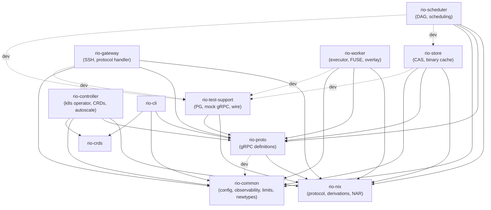

# Crate Structure

## Workspace Layout (12 crates)

```
rio-build/
├── Cargo.toml           # Workspace root
├── rio-common/          # Shared utilities (no rio-* deps — leaf)
├── rio-nix/             # Nix protocol types and wire format (no rio-* deps — leaf)
├── rio-proto/           # Protobuf/gRPC definitions
├── rio-crds/            # Kubernetes CRD types (WorkerPool, WorkerPoolSet — derive-macro structs)
├── rio-test-support/    # Test harness (ephemeral PG, mock gRPC, wire helpers)
├── rio-gateway/         # SSH server + Nix worker protocol frontend
├── rio-scheduler/       # DAG-aware build scheduler
├── rio-store/           # NAR content-addressable store
├── rio-worker/          # Build executor + FUSE store
├── rio-controller/      # Kubernetes operator (reconciler, autoscaler)
├── rio-cli/             # Operator CLI (AdminService client)
├── rio-bench/           # Criterion benches
└── rio-dashboard/       # Svelte 5 SPA — NOT a Rust crate; built by nix/dashboard.nix (pnpm+Vite)
```

`rio-dashboard/` is a workspace sibling but NOT a Cargo workspace member. It has
its own `package.json`/`pnpm-lock.yaml` and is built by `nix/dashboard.nix` via
`fetchPnpmDeps` + Vite. TypeScript stubs are generated in-sandbox from
`rio-proto/proto/*.proto` via `buf generate` (protobuf-es v2), so the dashboard
derivation is invalidated on `.proto` changes but not on Rust-only commits.

## Dependency Graph



Solid edges are prod dependencies; dashed are `[dev-dependencies]` only.

Notable edges:

- **`rio-proto → rio-nix`**: `ValidatedPathInfo` wraps `StorePath` from rio-nix. No cycle — rio-nix has no rio-* deps.
- **`rio-proto → rio-common` (dev-only)**: contract tests check `rio-common::limits` against proto-side `check_bound` enforcement.
- **`rio-scheduler → rio-nix` (prod)**: `Derivation` parsing for closure resolution and `StorePath` validation in the merge path.
- **`rio-scheduler → rio-store` (dev-only)**: integration tests spin up a real `StoreServiceServer` from `rio-store::grpc`.
- **`DrvHash` / `WorkerId` live in `rio-common::newtype`**: Arc<str>-backed string newtypes shared by scheduler, worker, and proto translation. Placing them in rio-common avoids a `proto → common → proto` cycle.

## Module Structure

### rio-common — Shared utilities

```
src/
├── lib.rs
├── bloom.rs           # Self-describing BloomFilter (blake3-based)
├── config.rs          # figment-based config layering helpers
├── grpc.rs            # gRPC timeouts, message-size constants
├── hmac.rs            # HMAC-SHA256 for PutPath metadata integrity
├── jwt.rs             # JWT encode/decode primitives (ed25519)
├── jwt_interceptor.rs # tonic interceptor for JWT verify + Claims extraction
├── limits.rs          # MAX_NAR_SIZE, MAX_COLLECTION_COUNT, etc.
├── newtype.rs         # string_newtype! macro; DrvHash, WorkerId
├── observability.rs   # Tracing init, describe!() metric registration
├── server.rs          # tonic server builder helpers (drain, graceful-shutdown)
├── signal.rs          # SIGTERM/SIGINT → CancellationToken
├── task.rs            # spawn_monitored task wrapper
├── tenant.rs          # NormalizedName tenant ID newtype
└── tls.rs             # mTLS config load + tonic channel TLS
```

### rio-nix — Nix protocol and data types

```
src/
├── lib.rs
├── derivation/
│   ├── mod.rs         # Derivation struct + output types
│   ├── aterm.rs       # ATerm parser/serializer (.drv files)
│   └── hash.rs        # Derivation hash modulo computation
├── protocol/
│   ├── mod.rs
│   ├── opcodes.rs     # WorkerOp enum
│   ├── handshake.rs   # Version negotiation, magic bytes
│   ├── wire/
│   │   ├── mod.rs     # Primitives: u64, bytes, strings, collections
│   │   └── framed.rs  # Framed stream reader/writer
│   ├── stderr.rs      # STDERR_* framing (NEXT/LAST/ERROR/RESULT/WRITE)
│   ├── build.rs       # BasicDerivation + BuildResult wire types
│   ├── client.rs      # Client-side protocol (drives nix-daemon --stdio)
│   └── derived_path.rs # DerivedPath string parser
├── store_path.rs      # StorePath + nixbase32
├── nar.rs             # NAR streaming read/write/extract
├── narinfo.rs         # NarInfo parse/serialize + fingerprint()
├── refscan.rs         # Reference scanner: Aho-Corasick over nixbase32 store-path hashes
└── hash.rs            # NixHash (SHA-256, SHA-512, BLAKE2)
```

Fuzz targets for the parsers live in `rio-nix/fuzz/` (separate workspace, own `Cargo.lock`). A second fuzz workspace at `rio-store/fuzz/` covers the manifest parser. Both are excluded from the main workspace — when a fuzzed crate's deps change, run `cd <crate>/fuzz && cargo update -p <crate>` to sync the independent lockfile.

### rio-proto — gRPC definitions

```
proto/
├── types.proto        # Shared: PathInfo, Heartbeat, common enums
├── dag.proto          # DerivationNode, DerivationEdge, DerivationEvent (P0376 domain split)
├── build_types.proto  # BuildEvent, BuildResult, BuildProgress (P0376 domain split)
├── admin_types.proto  # Admin-specific request/response types (P0376 domain split)
├── store.proto        # StoreService + ChunkService
├── scheduler.proto    # SchedulerService
├── worker.proto       # WorkerService
└── admin.proto        # AdminService (dashboard/CLI)
src/
├── lib.rs             # tonic::include_proto! + domain re-export modules
├── client/
│   ├── mod.rs         # connect_{store,scheduler,worker,admin}, get_path_nar, collect_nar_stream,
│   │                  #   chunk_nar_for_put (lazy PutPath stream), query_path_info_opt (NotFound→None)
│   └── balance.rs     # Client-side health-probe balancer (scheduler leader discovery)
├── interceptor.rs     # W3C traceparent inject/extract for tonic
└── validated.rs       # ValidatedPathInfo (proto → domain type validation)
```

### rio-gateway — Nix protocol frontend

```
src/
├── lib.rs
├── main.rs
├── server.rs          # russh SSH server
├── session.rs         # Per-client session state
├── quota.rs           # Per-tenant store-quota check (pre-SubmitBuild reject)
├── ratelimit.rs       # Per-tenant connection/opcode rate limiter (token-bucket)
├── translate.rs       # Nix protocol ↔ gRPC translation helpers
└── handler/
    ├── mod.rs         # Opcode dispatch loop
    ├── grpc.rs        # gRPC client wrappers (timeout + retry)
    ├── build.rs       # wopBuildPaths/wopBuildDerivation/wopBuildPathsWithResults
    ├── opcodes_read.rs  # Read-only opcodes (QueryPathInfo, NarFromPath, ...)
    └── opcodes_write.rs # Write opcodes (AddToStoreNar, AddMultipleToStore, ...)
```

### rio-scheduler — DAG scheduler

```
src/
├── lib.rs
├── main.rs
├── actor/             # Single-threaded actor owning all mutable state
│   ├── mod.rs         # Actor struct, spawn, push_ready helper
│   ├── command.rs     # ActorCommand message enum + reply types
│   ├── handle.rs      # ActorHandle: mpsc sender wrapper + is_alive/backpressure checks
│   ├── breaker.rs     # Circuit-breaker for store RPCs (open/half-open/closed)
│   ├── build.rs       # SubmitBuild / CancelBuild handlers
│   ├── merge.rs       # DAG merge: cache-check, dedupe, transitions
│   ├── dispatch.rs    # Ready-queue drain → worker assignment
│   ├── completion.rs  # CompletionReport handler + EMA update + cascade
│   ├── recovery.rs    # Post-LeaderAcquired state reload + ReconcileAssignments
│   ├── worker.rs      # Heartbeat merge + worker liveness
│   └── tests/         # Per-handler unit tests (split from old coverage.rs)
│       ├── mod.rs
│       ├── helpers.rs     # MockStore, make_test_node, scripted events
│       ├── wiring.rs      # Actor spawn + channel plumbing
│       ├── build.rs       # SubmitBuild/CancelBuild
│       ├── merge.rs       # DAG merge + dedupe + cache-check
│       ├── dispatch.rs    # Ready-queue drain + assignment
│       ├── completion.rs  # CompletionReport + cascade
│       ├── recovery.rs    # State reload + reconcile
│       ├── worker.rs      # Heartbeat + liveness
│       ├── keep_going.rs  # keep_going=true/false cascade behavior
│       ├── fault.rs       # Store errors, circuit breaker, poison
│       ├── misc.rs        # Small cross-cutting tests
│       └── integration.rs # Multi-handler scenarios
├── state/
│   ├── mod.rs         # PriorityClass, re-exports
│   ├── newtypes.rs    # Scheduler-local newtypes
│   ├── derivation.rs  # DerivationState, DerivationStatus transitions
│   ├── build.rs       # BuildInfo, BuildState transitions
│   └── worker.rs      # WorkerInfo, heartbeat timeout tracking
├── dag/
│   ├── mod.rs         # Dag: node/edge storage, reverse-deps walk
│   └── tests.rs
├── grpc/
│   ├── mod.rs         # gRPC service wiring → actor message send
│   ├── actor_guards.rs    # Leader-guard + actor-alive request interceptors
│   ├── scheduler_service.rs # SchedulerService impl (SubmitBuild, WatchBuild, CancelBuild)
│   ├── worker_service.rs    # WorkerService impl (BuildExecution stream, Heartbeat)
│   └── tests/         # bridge, guards, stream, submit
├── logs/
│   ├── mod.rs         # LogBuffers: DashMap ring buffers per derivation
│   └── flush.rs       # LogFlusher: S3 gzip PUT on completion
├── admin/
│   ├── mod.rs         # AdminService impl dispatch
│   ├── builds.rs      # ListBuilds / GetBuild / CancelBuild
│   ├── gc.rs          # TriggerGC / GCStatus
│   ├── graph.rs       # GetBuildGraph (induced-subgraph walk, node cap)
│   ├── logs.rs        # GetBuildLogs (ring buffer + S3 replay)
│   ├── sizeclass.rs   # GetCutoffs / SetCutoffs
│   ├── tenants.rs     # ListTenants / tenant quota inspect
│   ├── workers.rs     # ListWorkers / DrainWorker / ClusterStatus
│   └── tests/         # per-handler admin tests
├── ca/
│   ├── mod.rs         # CA early-cutoff: output-hash compare against content index
│   └── resolve.rs     # CA derivation resolution (inputDrvs placeholder → realized path rewrite)
├── db/
│   ├── mod.rs         # PG pool + transaction helpers
│   ├── assignments.rs # derivation→worker assignment rows
│   ├── batch.rs       # Batched multi-row INSERT helpers
│   ├── builds.rs      # builds table CRUD + terminal transitions
│   ├── derivations.rs # derivations table CRUD + status transitions
│   ├── history.rs     # build_history EMA UPSERT (duration + peak-mem)
│   ├── live_pins.rs   # GC live-pin rows (non-terminal build outputs)
│   ├── recovery.rs    # Non-terminal state reload queries
│   ├── tenants.rs     # tenant rows + quota columns
│   └── tests/         # per-module PG integration tests
├── lease/
│   ├── mod.rs         # LeaseState enum + leader-guard helpers
│   └── election.rs    # Kubernetes Lease-based leader election (HOSTNAME-driven identity)
├── assignment.rs      # Worker scoring (bloom locality + load) + size-class classify()
├── critical_path.rs   # Bottom-up priority computation + incremental update
├── estimator.rs       # Duration/memory estimates from build_history
├── event_log.rs       # BuildEvent ring buffer + PG replay for WatchBuild since_sequence
├── rebalancer.rs      # SITA-E adaptive size-class cutoff recompute (hourly pass)
└── queue.rs           # ReadyQueue: BinaryHeap with lazy invalidation
```

### rio-store — Content-addressable store

```
src/
├── lib.rs
├── main.rs
├── backend/
│   ├── mod.rs         # ChunkBackend trait + InMemory test impl
│   └── chunk.rs       # S3-compatible chunk backend
├── grpc/
│   ├── mod.rs         # StoreService + ChunkService skeleton
│   ├── admin.rs       # Store AdminService (GCStatus, TriggerGC, tenant-key mgmt)
│   ├── put_path.rs    # PutPath streaming handler
│   ├── put_path_batch.rs # PutPathBatch (multi-NAR streaming, shared tx)
│   ├── get_path.rs    # GetPath streaming handler
│   └── chunk.rs       # GetChunk / FindMissingChunks
├── gc/
│   ├── mod.rs         # GC orchestrator + two-phase mark/sweep entry
│   ├── mark.rs        # Mark phase: reachability walk from live pins + tenant roots
│   ├── sweep.rs       # Sweep phase: narinfo DELETE + chunk refcount decrement
│   ├── drain.rs       # pending_s3_deletes drain task (batched S3 DeleteObjects)
│   ├── orphan.rs      # sweep_orphan_chunks: grace-TTL reap of refcount=0 chunks
│   └── tenant.rs      # Per-tenant retention policy + tenant-scoped mark
├── cas.rs             # moka chunk cache + singleflight + BLAKE3 verify
├── chunker.rs         # FastCDC content-defined chunking
├── manifest.rs        # Chunk-list serialize/deserialize
├── metadata/          # narinfo + manifests PG tables
│   ├── mod.rs         # MetadataStore struct + transaction helpers
│   ├── inline.rs      # Small-NAR inline storage (no chunk manifest)
│   ├── chunked.rs     # Large-NAR chunked storage (manifest-backed)
│   ├── queries.rs     # Shared SELECT/UPDATE helpers + narinfo_cols! macro
│   └── tenant_keys.rs # Per-tenant signing-key rows (load + rotate)
├── migrations.rs      # Per-migration M_NNN doc-consts (rationale/history — SQL files are frozen)
├── content_index.rs   # content_hash → store_path (CA early cutoff)
├── realisations.rs    # CA realisation storage (Register/Query)
├── signing.rs         # ed25519 narinfo signing
├── validate.rs        # ValidatedPathInfo checks (hash, refs, size)
└── cache_server/
    ├── mod.rs         # axum binary-cache HTTP (narinfo + nar.zst)
    └── auth.rs        # Per-tenant Bearer-token auth + narinfo filter
```

### rio-worker — Build executor

```
src/
├── lib.rs
├── main.rs
├── config.rs          # figment-layered Config: CLI/env/worker.toml + comma_vec deserialize helper
├── health.rs          # gRPC health service: set_not_serving on drain (k8s readinessProbe hook)
├── cgroup.rs          # cgroup v2 per-build subtree setup + memory.peak/cpu.stat readers
├── runtime.rs         # Worker runtime loop: poll scheduler → execute → report
├── executor/
│   ├── mod.rs         # execute_build: overlay → daemon → upload → report
│   ├── daemon/
│   │   ├── mod.rs     # run_daemon_build: timeout-wrapped driver + kill_on_drop
│   │   ├── spawn.rs   # spawn_daemon_in_namespace: bind-mount overlay, set cgroup, exec nix-daemon --stdio
│   │   └── stderr_loop.rs # STDERR_RESULT drain: BuildLogLine → LogBatcher
│   └── inputs.rs      # Input resolution: fetch_drv_from_store, resolve_inputs
├── fuse/
│   ├── mod.rs         # Filesystem impl + mount_fuse_background
│   ├── inode.rs       # Inode allocator + path↔ino maps
│   ├── fetch.rs       # GetPath → NAR extract → cache insert
│   ├── circuit.rs     # Fetch circuit breaker (std::sync only — no tokio in FUSE callbacks)
│   ├── ops.rs         # fuser trait impls (getattr, readdir, open)
│   ├── lookup.rs      # lookup() + ensure_cached (materialize on demand)
│   ├── read.rs        # read() with passthrough fd
│   └── cache.rs       # SQLite-backed SSD cache with LRU eviction
├── overlay.rs         # overlayfs setup/teardown (host store + FUSE lower)
├── synth_db.rs        # Synthetic nix.sqlite for sandboxed nix-daemon
├── upload.rs          # HashingChannelWriter: stream NAR → PutPath
└── log_stream.rs      # LogBatcher: 64-line/100ms batch + rate/size limits
```

### rio-controller — Kubernetes operator

```
src/
├── lib.rs
├── main.rs            # rustls CryptoProvider::install_default() + controller watch loop
├── bin/
│   └── crdgen.rs      # Emit WorkerPool/WorkerPoolSet CRD YAML (serde_yml, write-only)
├── error.rs           # ControllerError + finalizer::Error<Self> boxed recursion
├── fixtures.rs        # Test fixtures: fake kube::Client via tower-test mock::pair()
├── scaling/
│   ├── mod.rs         # Autoscaler entry: queue-depth poll + STS replica patch
│   ├── standalone.rs  # Single-WorkerPool autoscaler (separate field-manager, skip deletionTimestamp)
│   ├── per_class.rs   # WorkerPoolSet per-class autoscaler (y-join across child pools)
│   └── tests.rs
└── reconcilers/
    ├── mod.rs         # Controller::new() + error_policy + requeue intervals
    ├── gc_schedule.rs # GC cron interval loop (not a CRD reconciler) → store TriggerGC RPC
    ├── workerpool/
    │   ├── mod.rs     # WorkerPool reconcile: ensure STS/SVC/CM + drain finalizer
    │   ├── builders.rs # STS/Service/ConfigMap object builders (labels, volumes, envFrom)
    │   ├── disruption.rs # PodDisruptionBudget builder + minAvailable computation
    │   ├── ephemeral.rs  # Ephemeral-volume sizing + StorageClass selection
    │   └── tests/     # apply, builders, disruption
    └── workerpoolset/
        ├── mod.rs     # WorkerPoolSet reconcile: child WorkerPool fan-out + status aggregate
        └── builders.rs # Child-WorkerPool spec builders (per-class overrides)
```

### rio-test-support — Test harness

```
src/
├── lib.rs             # TestDb re-export, TestResult alias
├── pg.rs              # Ephemeral PostgreSQL (initdb + postgres via PG_BIN)
├── wire.rs            # wire_bytes! macro, handshake/setOptions/stderr helpers
├── grpc.rs            # MockStore, MockScheduler, server spawn helpers
├── kube_mock.rs       # Fake kube::Client via tower-test mock::pair() + apiserver response helpers
├── metrics.rs         # In-process metrics recorder + snapshot-for-assert
├── metrics_grep.rs    # Parse Prometheus text-format for VM-test metric assertions
└── fixtures.rs        # test_store_path, test_drv_path, NAR builders
```

### rio-crds — Kubernetes CRD types

```
src/
├── lib.rs             # schema_with=any_object for k8s-openapi fields (avoid {} schema)
├── workerpool.rs      # WorkerPool CRD spec/status + #[derive(CustomResource, KubeSchema)]
└── workerpoolset.rs   # WorkerPoolSet CRD spec/status (per-class child-pool fan-out)
```

### rio-cli — Operator CLI

```
src/
├── main.rs            # clap CLI entry + AdminService client wiring
├── cutoffs.rs         # `rio cutoffs get/set` — size-class cutoff inspect/override
└── wps.rs             # `rio wps status/scale` — WorkerPoolSet per-class status + manual scale
```
