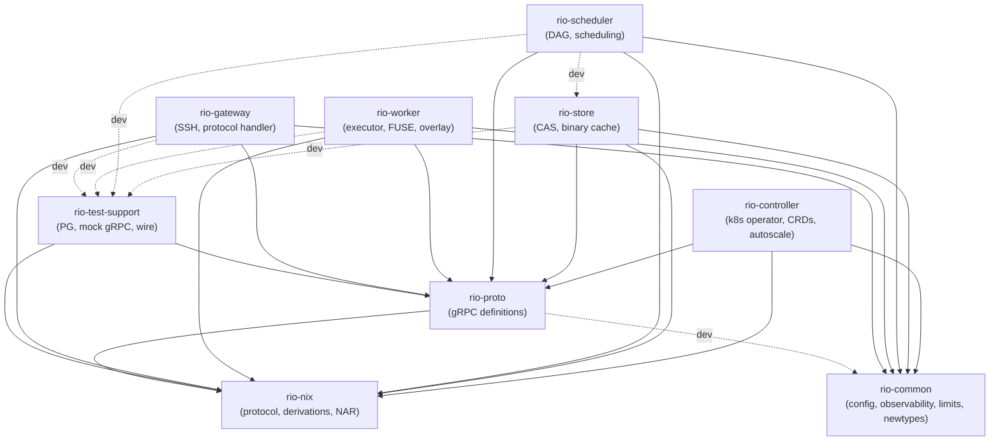

# Crate Structure

## Workspace Layout (9 crates)

```
rio-build/
├── Cargo.toml           # Workspace root
├── rio-common/          # Shared utilities (no rio-* deps — leaf)
├── rio-nix/             # Nix protocol types and wire format (no rio-* deps — leaf)
├── rio-proto/           # Protobuf/gRPC definitions
├── rio-test-support/    # Test harness (ephemeral PG, mock gRPC, wire helpers)
├── rio-gateway/         # SSH server + Nix worker protocol frontend
├── rio-scheduler/       # DAG-aware build scheduler
├── rio-store/           # NAR content-addressable store
├── rio-worker/          # Build executor + FUSE store
└── rio-controller/      # Kubernetes operator (WorkerPool CRD, reconciler, autoscaler)
```

Not yet built (future phases):

- **rio-cli/** — Phase 4 operator CLI
- **rio-dashboard/** — TypeScript SPA, not a Rust crate

## Dependency Graph



Solid edges are prod dependencies; dashed are `[dev-dependencies]` only.

Notable edges:

- **`rio-proto → rio-nix`**: `ValidatedPathInfo` wraps `StorePath` from rio-nix. No cycle — rio-nix has no rio-* deps.
- **`rio-proto → rio-common` (dev-only)**: contract tests check `rio-common::limits` against proto-side `check_bound` enforcement.
- **`rio-scheduler → rio-nix` (prod)**: `Derivation` parsing for closure resolution and `StorePath` validation in the merge path.
- **`rio-scheduler → rio-store` (dev-only)**: integration tests spin up a real `StoreServiceServer` from `rio-store::grpc`.
- **`DrvHash` / `WorkerId` live in `rio-common::newtype`**: Arc<str>-backed string newtypes shared by scheduler, worker, and proto translation. Placing them in rio-common avoids a `proto → common → proto` cycle.

## Module Structure

### rio-common — Shared utilities

```
src/
├── lib.rs
├── bloom.rs           # Self-describing BloomFilter (blake3-based)
├── config.rs          # figment-based config layering helpers
├── grpc.rs            # gRPC timeouts, message-size constants
├── limits.rs          # MAX_NAR_SIZE, MAX_COLLECTION_COUNT, etc.
├── newtype.rs         # string_newtype! macro; DrvHash, WorkerId
├── observability.rs   # Tracing init, describe!() metric registration
└── task.rs            # spawn_monitored task wrapper
```

### rio-nix — Nix protocol and data types

```
src/
├── lib.rs
├── derivation/
│   ├── mod.rs         # Derivation struct + output types
│   ├── aterm.rs       # ATerm parser/serializer (.drv files)
│   └── hash.rs        # Derivation hash modulo computation
├── protocol/
│   ├── mod.rs
│   ├── opcodes.rs     # WorkerOp enum
│   ├── handshake.rs   # Version negotiation, magic bytes
│   ├── wire/
│   │   ├── mod.rs     # Primitives: u64, bytes, strings, collections
│   │   └── framed.rs  # Framed stream reader/writer
│   ├── stderr.rs      # STDERR_* framing (NEXT/LAST/ERROR/RESULT/WRITE)
│   ├── build.rs       # BasicDerivation + BuildResult wire types
│   ├── client.rs      # Client-side protocol (drives nix-daemon --stdio)
│   └── derived_path.rs # DerivedPath string parser
├── store_path.rs      # StorePath + nixbase32
├── nar.rs             # NAR streaming read/write/extract
├── narinfo.rs         # NarInfo parse/serialize + fingerprint()
└── hash.rs            # NixHash (SHA-256, SHA-512, BLAKE2)
```

Fuzz targets for the parsers live in `rio-nix/fuzz/` (separate workspace, own `Cargo.lock`). A second fuzz workspace at `rio-store/fuzz/` covers the manifest parser. Both are excluded from the main workspace — when a fuzzed crate's deps change, run `cd <crate>/fuzz && cargo update -p <crate>` to sync the independent lockfile.

### rio-proto — gRPC definitions

```
proto/
├── types.proto        # Shared: PathInfo, DerivationNode, BuildEvent, Heartbeat
├── store.proto        # StoreService + ChunkService
├── scheduler.proto    # SchedulerService
├── worker.proto       # WorkerService
└── admin.proto        # AdminService (dashboard/CLI)
src/
├── lib.rs             # tonic::include_proto! + client re-exports
├── client.rs          # connect_{store,scheduler,worker,admin}, get_path_nar, collect_nar_stream,
│                      #   chunk_nar_for_put (lazy PutPath stream), query_path_info_opt (NotFound→None)
├── interceptor.rs     # W3C traceparent inject/extract for tonic
└── validated.rs       # ValidatedPathInfo (proto → domain type validation)
```

### rio-gateway — Nix protocol frontend

```
src/
├── lib.rs
├── main.rs
├── server.rs          # russh SSH server
├── session.rs         # Per-client session state
├── translate.rs       # Nix protocol ↔ gRPC translation helpers
└── handler/
    ├── mod.rs         # Opcode dispatch loop
    ├── grpc.rs        # gRPC client wrappers (timeout + retry)
    ├── build.rs       # wopBuildPaths/wopBuildDerivation/wopBuildPathsWithResults
    ├── opcodes_read.rs  # Read-only opcodes (QueryPathInfo, NarFromPath, ...)
    └── opcodes_write.rs # Write opcodes (AddToStoreNar, AddMultipleToStore, ...)
```

### rio-scheduler — DAG scheduler

```
src/
├── lib.rs
├── main.rs
├── actor/             # Single-threaded actor owning all mutable state
│   ├── mod.rs         # Actor struct, spawn, push_ready helper
│   ├── command.rs     # ActorCommand message enum + reply types
│   ├── handle.rs      # ActorHandle: mpsc sender wrapper + is_alive/backpressure checks
│   ├── breaker.rs     # Circuit-breaker for store RPCs (open/half-open/closed)
│   ├── build.rs       # SubmitBuild / CancelBuild handlers
│   ├── merge.rs       # DAG merge: cache-check, dedupe, transitions
│   ├── dispatch.rs    # Ready-queue drain → worker assignment
│   ├── completion.rs  # CompletionReport handler + EMA update + cascade
│   ├── worker.rs      # Heartbeat merge + worker liveness
│   └── tests/         # Per-handler unit tests (split from old coverage.rs)
│       ├── mod.rs
│       ├── helpers.rs     # MockStore, make_test_node, scripted events
│       ├── wiring.rs      # Actor spawn + channel plumbing
│       ├── build.rs       # SubmitBuild/CancelBuild
│       ├── merge.rs       # DAG merge + dedupe + cache-check
│       ├── dispatch.rs    # Ready-queue drain + assignment
│       ├── completion.rs  # CompletionReport + cascade
│       ├── worker.rs      # Heartbeat + liveness
│       ├── keep_going.rs  # keep_going=true/false cascade behavior
│       ├── fault.rs       # Store errors, circuit breaker, poison
│       └── integration.rs # Multi-handler scenarios
├── state/
│   ├── mod.rs         # PriorityClass, re-exports
│   ├── newtypes.rs    # Scheduler-local newtypes
│   ├── derivation.rs  # DerivationState, DerivationStatus transitions
│   ├── build.rs       # BuildInfo, BuildState transitions
│   └── worker.rs      # WorkerInfo, heartbeat timeout tracking
├── dag/
│   ├── mod.rs         # Dag: node/edge storage, reverse-deps walk
│   └── tests.rs
├── grpc/
│   ├── mod.rs         # gRPC service impl → actor message send
│   └── tests.rs
├── logs/
│   ├── mod.rs         # LogBuffers: DashMap ring buffers per derivation
│   └── flush.rs       # LogFlusher: S3 gzip PUT on completion
├── admin/
│   ├── mod.rs         # AdminService impl: ClusterStatus/ListWorkers/ListBuilds/GetBuildLogs/DrainWorker
│   └── tests.rs
├── assignment.rs      # Worker scoring (bloom locality + load) + size-class classify()
├── critical_path.rs   # Bottom-up priority computation + incremental update
├── db.rs              # build_history EMA UPSERT + PG helpers
├── estimator.rs       # Duration/memory estimates from build_history
├── event_log.rs       # BuildEvent ring buffer + PG replay for WatchBuild since_sequence
├── lease.rs           # Kubernetes Lease-based leader election (HOSTNAME-driven identity)
└── queue.rs           # ReadyQueue: BinaryHeap with lazy invalidation
```

### rio-store — Content-addressable store

```
src/
├── lib.rs
├── main.rs
├── backend/
│   ├── mod.rs         # ChunkBackend trait + InMemory test impl
│   └── chunk.rs       # S3-compatible chunk backend
├── grpc/
│   ├── mod.rs         # StoreService + ChunkService skeleton
│   ├── put_path.rs    # PutPath streaming handler
│   ├── get_path.rs    # GetPath streaming handler
│   └── chunk.rs       # GetChunk / FindMissingChunks
├── cas.rs             # moka chunk cache + singleflight + BLAKE3 verify
├── chunker.rs         # FastCDC content-defined chunking
├── manifest.rs        # Chunk-list serialize/deserialize
├── metadata/          # narinfo + manifests PG tables
│   ├── mod.rs         # MetadataStore struct + transaction helpers
│   ├── inline.rs      # Small-NAR inline storage (no chunk manifest)
│   ├── chunked.rs     # Large-NAR chunked storage (manifest-backed)
│   └── queries.rs     # Shared SELECT/UPDATE helpers + narinfo_cols! macro
├── content_index.rs   # content_hash → store_path (CA early cutoff)
├── realisations.rs    # CA realisation storage (Register/Query)
├── signing.rs         # ed25519 narinfo signing
├── validate.rs        # ValidatedPathInfo checks (hash, refs, size)
└── cache_server.rs    # axum binary-cache HTTP (narinfo + nar.zst)
```

### rio-worker — Build executor

```
src/
├── lib.rs
├── main.rs
├── config.rs          # figment-layered Config: CLI/env/worker.toml + comma_vec deserialize helper
├── health.rs          # gRPC health service: set_not_serving on drain (k8s readinessProbe hook)
├── cgroup.rs          # cgroup v2 per-build subtree setup + memory.peak/cpu.stat readers
├── runtime.rs         # Worker runtime loop: poll scheduler → execute → report
├── executor/
│   ├── mod.rs         # execute_build: overlay → daemon → upload → report
│   ├── daemon/
│   │   ├── mod.rs     # run_daemon_build: timeout-wrapped driver + kill_on_drop
│   │   ├── spawn.rs   # spawn_daemon_in_namespace: bind-mount overlay, set cgroup, exec nix-daemon --stdio
│   │   └── stderr_loop.rs # STDERR_RESULT drain: BuildLogLine → LogBatcher
│   └── inputs.rs      # Input resolution: fetch_drv_from_store, resolve_inputs
├── fuse/
│   ├── mod.rs         # Filesystem impl + mount_fuse_background
│   ├── inode.rs       # Inode allocator + path↔ino maps
│   ├── fetch.rs       # GetPath → NAR extract → cache insert
│   ├── ops.rs         # fuser trait impls (getattr, readdir, open)
│   ├── lookup.rs      # lookup() + ensure_cached (materialize on demand)
│   ├── read.rs        # read() with passthrough fd
│   └── cache.rs       # SQLite-backed SSD cache with LRU eviction
├── overlay.rs         # overlayfs setup/teardown (host store + FUSE lower)
├── synth_db.rs        # Synthetic nix.sqlite for sandboxed nix-daemon
├── upload.rs          # HashingChannelWriter: stream NAR → PutPath
└── log_stream.rs      # LogBatcher: 64-line/100ms batch + rate/size limits
```

### rio-controller — Kubernetes operator

```
src/
├── lib.rs
├── main.rs            # rustls CryptoProvider::install_default() + controller watch loop
├── bin/
│   └── crdgen.rs      # Emit WorkerPool CRD YAML (serde_yml, write-only)
├── error.rs           # ControllerError + finalizer::Error<Self> boxed recursion
├── fixtures.rs        # Test fixtures: fake kube::Client via tower-test mock::pair()
├── scaling.rs         # Autoscaler: queue-depth poll + STS replica patch (separate field-manager, skip deletionTimestamp)
├── crds/
│   ├── mod.rs         # schema_with=any_object for k8s-openapi fields (avoid {} schema)
│   └── workerpool.rs  # WorkerPool CRD spec/status + #[derive(CustomResource, KubeSchema)]
└── reconcilers/
    ├── mod.rs         # Controller::new() + error_policy + requeue intervals
    └── workerpool/
        ├── mod.rs     # WorkerPool reconcile: ensure STS/SVC/CM + drain finalizer
        ├── builders.rs # STS/Service/ConfigMap object builders (labels, volumes, envFrom)
        └── tests.rs
```

### rio-test-support — Test harness

```
src/
├── lib.rs             # TestDb re-export, TestResult alias
├── pg.rs              # Ephemeral PostgreSQL (initdb + postgres via PG_BIN)
├── wire.rs            # wire_bytes! macro, handshake/setOptions/stderr helpers
├── grpc.rs            # MockStore, MockScheduler, server spawn helpers
└── fixtures.rs        # test_store_path, test_drv_path, NAR builders
```
