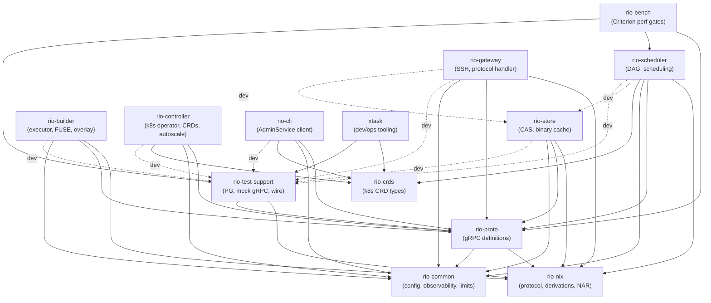

# Crate Structure

## Workspace Layout (14 crates)

```
rio-build/
├── Cargo.toml           # Workspace root
├── rio-common/          # Shared utilities (no rio-* deps — leaf)
├── rio-nix/             # Nix protocol types and wire format (no rio-* deps — leaf)
├── rio-proto/           # Protobuf/gRPC definitions
├── rio-crds/            # Kubernetes CRD types (BuilderPool, BuilderPoolSet, FetcherPool, ComponentScaler)
├── rio-test-support/    # Test harness (ephemeral PG, mock gRPC, wire helpers)
├── rio-gateway/         # SSH server + Nix worker protocol frontend
├── rio-scheduler/       # DAG-aware build scheduler
├── rio-store/           # NAR content-addressable store
├── rio-builder/         # Build executor + FUSE store
├── rio-controller/      # Kubernetes operator (reconciler, autoscaler)
├── rio-cli/             # Operator CLI (AdminService client)
├── rio-bench/           # Criterion benches (perf regression gates)
├── xtask/               # Dev/ops tooling (k8s up/down, AMI build, codegen)
├── workspace-hack/      # cargo-hakari unification crate (no source, dep-only)
└── rio-dashboard/       # Svelte 5 SPA — NOT a Rust crate; built by nix/dashboard.nix (pnpm+Vite)
```

`rio-dashboard/` is a workspace sibling but NOT a Cargo workspace member. It has
its own `package.json`/`pnpm-lock.yaml` and is built by `nix/dashboard.nix` via
`fetchPnpmDeps` + Vite. TypeScript stubs are generated in-sandbox from
`rio-proto/proto/*.proto` via `buf generate` (protobuf-es v2), so the dashboard
derivation is invalidated on `.proto` changes but not on Rust-only commits.

## Dependency Graph



Solid edges are prod dependencies; dashed are `[dev-dependencies]` only.

Notable edges:

- **`rio-proto → rio-nix`**: `ValidatedPathInfo` wraps `StorePath` from rio-nix. No cycle — rio-nix has no rio-* deps.
- **`rio-proto → rio-common`**: `connect_channel`/`connect_with_retry` use `rio_common::backoff` and `rio_common::grpc` constants. Contract tests also check `rio_common::limits` against proto-side `check_bound` enforcement.
- **`rio-scheduler → rio-nix` (prod)**: `Derivation` parsing for closure resolution and `StorePath` validation in the merge path.
- **`rio-scheduler → rio-crds` (prod)**: lease-election reads `BuilderPoolSet` to seed size-class config at startup.
- **`rio-scheduler → rio-store` (dev-only)**: integration tests spin up a real `StoreServiceServer` from `rio-store::grpc`.
- **`rio-gateway → rio-store` (dev-only)**: golden-daemon tests assert against a real `StoreServiceServer` (with `test-utils` feature) instead of `MockStore`.

## Module Structure

### rio-common — Shared utilities

```
src/
├── lib.rs
├── backoff.rs         # Exponential backoff with jitter + shutdown-aware retry loop
├── config.rs          # figment-based config layering helpers
├── grpc.rs            # gRPC timeouts, message-size constants
├── hmac.rs            # HMAC-SHA256 for PutPath metadata integrity
├── jwt.rs             # JWT encode/decode primitives (ed25519)
├── jwt_interceptor.rs # tonic interceptor for JWT verify + Claims extraction
├── limits.rs          # MAX_NAR_SIZE, MAX_COLLECTION_COUNT, etc.
├── observability.rs   # Tracing init, describe!() metric registration
├── server.rs          # bootstrap(): 6-step cold-start prologue (crypto, tracing, config, signal, metrics);
│                      #   tonic server builder helpers (drain, graceful-shutdown)
├── signal.rs          # SIGTERM/SIGINT → CancellationToken
├── task.rs            # spawn_monitored task wrapper
├── tenant.rs          # NormalizedName tenant ID newtype
└── tls.rs             # mTLS config load + tonic channel TLS
```

### rio-nix — Nix protocol and data types

```
src/
├── lib.rs
├── derivation/
│   ├── mod.rs         # Derivation struct + output types
│   ├── aterm.rs       # ATerm parser/serializer (.drv files)
│   └── hash.rs        # Derivation hash modulo computation
├── protocol/
│   ├── mod.rs
│   ├── opcodes.rs     # WorkerOp enum
│   ├── handshake.rs   # Version negotiation, magic bytes
│   ├── wire/
│   │   ├── mod.rs     # Primitives: u64, bytes, strings, collections
│   │   └── framed.rs  # Framed stream reader/writer
│   ├── stderr.rs      # STDERR_* framing (NEXT/LAST/ERROR/RESULT/WRITE)
│   ├── build.rs       # BasicDerivation + BuildResult wire types
│   ├── client.rs      # Client-side protocol (drives nix-daemon --stdio)
│   └── derived_path.rs # DerivedPath string parser
├── store_path.rs      # StorePath + nixbase32
├── nar.rs             # NAR streaming read/write/extract
├── narinfo.rs         # NarInfo parse/serialize + fingerprint()
├── refscan.rs         # Reference scanner: Aho-Corasick over nixbase32 store-path hashes
└── hash.rs            # NixHash (SHA-256, SHA-512, SHA-1)
```

Fuzz targets for the parsers live in `rio-nix/fuzz/` (separate workspace, own `Cargo.lock`). A second fuzz workspace at `rio-store/fuzz/` covers the manifest parser. Both are excluded from the main workspace — when a fuzzed crate's deps change, run `cd <crate>/fuzz && cargo update -p <crate>` to sync the independent lockfile.

### rio-proto — gRPC definitions

```
proto/
├── types.proto        # Shared: PathInfo, Heartbeat, common enums
├── dag.proto          # DerivationNode, DerivationEdge, DerivationEvent (package rio.types)
├── build_types.proto  # BuildEvent, BuildResult, BuildProgress (package rio.types)
├── admin_types.proto  # Admin-specific request/response types (package rio.types)
├── store.proto        # StoreService + ChunkService
├── scheduler.proto    # SchedulerService
├── builder.proto       # BuilderService
└── admin.proto        # AdminService (dashboard/CLI)
src/
├── lib.rs             # tonic::include_proto! + flat re-exports (types, services, TENANT_TOKEN_HEADER)
├── client/
│   ├── mod.rs         # ProtoClient trait + connect_{store,scheduler,executor,admin} one-liners,
│   │                  #   connect_single<C> / connect<C>(UpstreamAddrs) — generic over balanced/single,
│   │                  #   connect_store_lazy, get_path_nar, collect_nar_stream, chunk_nar_for_put,
│   │                  #   query_path_info_opt (NotFound→None), client_handshake
│   ├── balance.rs     # Client-side health-probe balancer (scheduler leader discovery)
│   └── retry.rs       # Shutdown-aware connect retry with exponential backoff (cold-start loop)
├── interceptor.rs     # W3C traceparent inject/extract for tonic
└── validated.rs       # ValidatedPathInfo (proto → domain type validation)
```

### rio-gateway — Nix protocol frontend

```
src/
├── lib.rs
├── main.rs
├── server/
│   ├── mod.rs         # russh SSH server: accept loop + connection handler
│   ├── keys.rs        # SSH host-key + authorized_keys load + hot-reload watcher
│   └── session_jwt.rs # Per-SSH-session JWT mint + refresh
├── session.rs         # Per-client session state
├── quota.rs           # Per-tenant store-quota check (pre-SubmitBuild reject)
├── ratelimit.rs       # Per-tenant connection/opcode rate limiter (token-bucket)
├── translate.rs       # Nix protocol ↔ gRPC translation helpers
└── handler/
    ├── mod.rs         # Opcode dispatch loop
    ├── grpc.rs        # gRPC client wrappers (timeout + retry)
    ├── build.rs       # wopBuildPaths/wopBuildDerivation/wopBuildPathsWithResults
    ├── opcodes_read.rs  # Read-only opcodes (QueryPathInfo, NarFromPath, ...)
    └── opcodes_write.rs # Write opcodes (AddToStoreNar, AddMultipleToStore, ...)
```

### rio-scheduler — DAG scheduler

```
src/
├── lib.rs
├── main.rs
├── actor/             # Single-threaded actor owning all mutable state
│   ├── mod.rs         # Actor struct, spawn, push_ready helper
│   ├── command.rs     # ActorCommand enum (split into AdminQuery/DebugCmd sub-enums) + reply types
│   ├── config.rs      # DagActorConfig / DagActorPlumbing: grouped construction inputs
│   ├── handle.rs      # ActorHandle: mpsc sender wrapper + is_alive/backpressure checks
│   ├── breaker.rs     # Circuit-breaker for store RPCs (open/half-open/closed)
│   ├── build.rs       # SubmitBuild / CancelBuild handlers
│   ├── merge.rs       # DAG merge: cache-check, dedupe, transitions
│   ├── dispatch.rs    # Ready-queue drain → executor assignment
│   ├── completion.rs  # CompletionReport handler + EMA update + cascade
│   ├── recovery.rs    # Post-LeaderAcquired state reload + ReconcileAssignments
│   ├── executor.rs    # Heartbeat merge + executor liveness
│   ├── snapshot.rs    # Read-only &self snapshot/inspect handlers (back AdminService RPCs)
│   ├── debug.rs       # cfg(test) debug handlers + DAG injection helpers
│   └── tests/         # Per-handler unit tests (split from old coverage.rs)
│       ├── mod.rs
│       ├── helpers.rs     # MockStore, make_test_node, scripted events
│       ├── wiring.rs      # Actor spawn + channel plumbing
│       ├── build.rs       # SubmitBuild/CancelBuild
│       ├── merge.rs       # DAG merge + dedupe + cache-check
│       ├── dispatch.rs    # Ready-queue drain + assignment
│       ├── completion.rs  # CompletionReport + cascade
│       ├── recovery.rs    # State reload + reconcile
│       ├── executor.rs    # Heartbeat + liveness
│       ├── keep_going.rs  # keep_going=true/false cascade behavior
│       ├── fault.rs       # Store errors, circuit breaker, poison
│       ├── misc.rs        # Small cross-cutting tests
│       └── integration.rs # Multi-handler scenarios
├── state/
│   ├── mod.rs         # PriorityClass, re-exports
│   ├── newtypes.rs    # DrvHash, ExecutorId (Arc<str>-backed; scheduler-internal — NOT shared with proto/builder)
│   ├── derivation.rs  # DerivationState (RetryState/CaState/SchedHint sub-structs), DerivationStatus transitions
│   ├── build.rs       # BuildInfo, BuildState transitions
│   └── executor.rs    # ExecutorInfo, heartbeat timeout tracking
├── dag/
│   ├── mod.rs         # Dag: node/edge storage, reverse-deps walk
│   └── tests.rs
├── grpc/
│   ├── mod.rs         # gRPC service wiring → actor message send
│   ├── actor_guards.rs    # Leader-guard + actor-alive request interceptors
│   ├── scheduler_service.rs # SchedulerService impl (SubmitBuild, WatchBuild, CancelBuild)
│   ├── executor_service.rs  # ExecutorService impl (BuildExecution stream, Heartbeat)
│   └── tests/         # bridge, guards, stream, submit
├── logs/
│   ├── mod.rs         # LogBuffers: DashMap ring buffers per derivation
│   └── flush.rs       # LogFlusher: S3 gzip PUT on completion
├── admin/
│   ├── mod.rs         # AdminService impl dispatch
│   ├── builds.rs      # ListBuilds / GetBuild / CancelBuild
│   ├── estimator.rs   # GetEstimatorStats: per-drv-name EMA snapshot dump
│   ├── gc.rs          # TriggerGC / GCStatus
│   ├── graph.rs       # GetBuildGraph (induced-subgraph walk, node cap)
│   ├── logs.rs        # GetBuildLogs (ring buffer + S3 replay)
│   ├── manifest.rs    # GetCapacityManifest: per-ready-derivation bucketed resource manifest
│   ├── sizeclass.rs   # GetCutoffs / SetCutoffs
│   ├── tenants.rs     # ListTenants / tenant quota inspect
│   ├── executors.rs   # ListExecutors / DrainExecutor / ClusterStatus
│   └── tests/         # per-handler admin tests
├── ca/
│   ├── mod.rs         # CA early-cutoff: output-hash compare against content index
│   └── resolve.rs     # CA derivation resolution (inputDrvs placeholder → realized path rewrite)
├── db/
│   ├── mod.rs         # PG pool + transaction helpers
│   ├── assignments.rs # derivation→executor assignment rows
│   ├── batch.rs       # Batched multi-row INSERT helpers
│   ├── builds.rs      # builds table CRUD + terminal transitions
│   ├── derivations.rs # derivations table CRUD + status transitions
│   ├── history.rs     # build_history EMA UPSERT (duration + peak-mem)
│   ├── live_pins.rs   # GC live-pin rows (non-terminal build outputs)
│   ├── recovery.rs    # Non-terminal state reload queries
│   ├── tenants.rs     # tenant rows + quota columns
│   └── tests/         # per-module PG integration tests
├── lease/
│   ├── mod.rs         # LeaseState enum + leader-guard helpers
│   └── election.rs    # Kubernetes Lease-based leader election (HOSTNAME-driven identity)
├── assignment.rs      # Executor selection (hard-filter, first-match) + size-class classify()
├── critical_path.rs   # Bottom-up priority computation + incremental update
├── estimator.rs       # Duration/memory estimates from build_history
├── event_log.rs       # BuildEvent ring buffer + PG replay for WatchBuild since_sequence
├── rebalancer.rs      # SITA-E adaptive size-class cutoff recompute (hourly pass)
└── queue.rs           # ReadyQueue: BinaryHeap with lazy invalidation
```

### rio-store — Content-addressable store

```
src/
├── lib.rs
├── main.rs
├── backend/
│   ├── mod.rs         # ChunkBackend trait + InMemory test impl
│   └── chunk.rs       # S3-compatible chunk backend
├── grpc/
│   ├── mod.rs         # StoreService + ChunkService skeleton
│   ├── admin.rs       # Store AdminService (GCStatus, TriggerGC, tenant-key mgmt, upstream CRUD)
│   ├── put_path/
│   │   ├── mod.rs     # PutPath streaming handler
│   │   └── common.rs  # Shared PutPath/PutPathBatch write-ahead state machine steps
│   ├── put_path_batch.rs # PutPathBatch (multi-NAR streaming, shared tx)
│   ├── get_path.rs    # GetPath streaming handler
│   ├── queries.rs     # Read-side RPCs (QueryPathInfo, FindMissingPaths, AddSignatures, realisations, TenantQuota)
│   ├── sign.rs        # narinfo signing + cross-tenant signature-visibility gate
│   └── chunk.rs       # GetChunk / FindMissingChunks
├── gc/
│   ├── mod.rs         # GC orchestrator + two-phase mark/sweep entry
│   ├── mark.rs        # Mark phase: reachability walk from live pins + tenant roots
│   ├── sweep.rs       # Sweep phase: narinfo DELETE + chunk refcount decrement
│   ├── drain.rs       # pending_s3_deletes drain task (batched S3 DeleteObjects)
│   ├── orphan.rs      # Orphan scanner: reap stale 'uploading' manifests (crashed mid-PutPath)
│   └── tenant.rs      # Per-tenant store accounting + quota lookup (TenantQuota RPC)
├── cas.rs             # moka chunk cache + singleflight + BLAKE3 verify
├── chunker.rs         # FastCDC content-defined chunking
├── manifest.rs        # Chunk-list serialize/deserialize
├── metadata/          # narinfo + manifests PG tables
│   ├── mod.rs         # MetadataStore struct + transaction helpers
│   ├── inline.rs      # Small-NAR inline storage (no chunk manifest)
│   ├── chunked.rs     # Large-NAR chunked storage (manifest-backed)
│   ├── queries.rs     # Shared SELECT/UPDATE helpers + narinfo_cols! macro
│   ├── tenant_keys.rs # Per-tenant signing-key rows (load + rotate)
│   ├── cluster_key_history.rs # Prior cluster signing keys (unretired pubkeys for cache_server signature filter)
│   └── upstreams.rs   # Per-tenant upstream binary-cache config (tenant_upstreams table)
├── migrations.rs      # Per-migration M_NNN doc-consts (rationale/history — SQL files are frozen)
├── realisations.rs    # CA realisation storage (Register/Query)
├── substitute.rs      # Upstream binary-cache substitution: block-and-fetch narinfo+NAR, ingest via CAS path
├── signing.rs         # ed25519 narinfo signing
├── test_helpers.rs    # Shared test-only seeding helpers (seed_* builders, #[cfg(test)])
├── validate.rs        # ValidatedPathInfo checks (hash, refs, size)
└── cache_server/
    ├── mod.rs         # axum binary-cache HTTP (narinfo + nar.zst)
    └── auth.rs        # Per-tenant Bearer-token auth + narinfo filter
```

### rio-builder — Build executor

```
src/
├── lib.rs
├── main.rs
├── config.rs          # figment-layered Config: CLI/env/builder.toml + comma_vec deserialize helper
├── health.rs          # HTTP /healthz + /readyz via axum (builder has no gRPC server — it's a client)
├── cgroup.rs          # cgroup v2 per-build subtree setup + memory.peak/cpu.stat readers
├── runtime.rs         # Builder runtime loop: poll scheduler → execute → report
├── executor/
│   ├── mod.rs         # execute_build: overlay → daemon → upload → report
│   ├── daemon/
│   │   ├── mod.rs     # run_daemon_build: timeout-wrapped driver + kill_on_drop
│   │   ├── spawn.rs   # spawn_daemon_in_namespace: bind-mount overlay, set cgroup, exec nix-daemon --stdio
│   │   └── stderr_loop.rs # STDERR_RESULT drain: BuildLogLine → LogBatcher
│   └── inputs.rs      # Input resolution: fetch_drv_from_store, resolve_inputs
├── fuse/
│   ├── mod.rs         # Filesystem impl + mount_fuse_background
│   ├── inode.rs       # Inode allocator + path↔ino maps
│   ├── fetch/
│   │   ├── mod.rs     # Fetch + materialize store paths into local cache (GetPath → NAR extract)
│   │   ├── client.rs  # StoreClients: gRPC client bundle + transport selection for FUSE fetches
│   │   └── tests.rs
│   ├── circuit.rs     # Fetch circuit breaker (std::sync only — no tokio in FUSE callbacks)
│   ├── ops.rs         # Filesystem trait impl: lookup/getattr/open/readlink/readdir + slow-path fallbacks
│   ├── lookup.rs      # FUSE attribute helpers (stat_to_attr, TTL constants) — handlers live in ops.rs
│   ├── read.rs        # File content serving: read/readlink/readdir + prefetch (pread-based)
│   └── cache.rs       # SQLite-backed SSD cache with LRU eviction
├── overlay.rs         # overlayfs setup/teardown (host store + FUSE lower)
├── synth_db.rs        # Synthetic nix.sqlite for sandboxed nix-daemon
├── upload.rs          # HashingChannelWriter: stream NAR → PutPath
└── log_stream.rs      # LogBatcher: 64-line/100ms batch + rate/size limits
```

### rio-controller — Kubernetes operator

```
src/
├── lib.rs
├── main.rs            # rustls CryptoProvider::install_default() + controller watch loop
├── bin/
│   └── crdgen.rs      # Emit BuilderPool/BuilderPoolSet/FetcherPool/ComponentScaler CRD YAML
├── error.rs           # ControllerError + finalizer::Error<Self> boxed recursion
├── fixtures.rs        # Test fixtures: fake kube::Client via tower-test mock::pair()
├── scaling/
│   ├── mod.rs
│   ├── component.rs   # ComponentScaler: predictive Σ(queued+running) → Deployment /scale patch
│   └── tests.rs
└── reconcilers/
    ├── mod.rs         # Controller::new() + error_policy + requeue intervals
    ├── gc_schedule.rs # GC cron interval loop (not a CRD reconciler) → store TriggerGC RPC
    ├── common/
    │   ├── mod.rs     # Shared reconcile helpers (SSA apply, ownerRef, labels)
    │   ├── job.rs     # Job-mode reconciler plumbing: spawn_count, reap_excess_pending, reap_orphan_running
    │   └── pod.rs     # Pod-spec builders shared by builder/fetcher (security context, volumes)
    ├── builderpool/
    │   ├── mod.rs     # BuilderPool reconcile: spawn/reap Jobs + drain finalizer
    │   ├── builders.rs   # Job/ConfigMap object builders (labels, volumes, envFrom)
    │   ├── disruption.rs # DisruptionTarget Pod watcher → DrainExecutor{force:true}
    │   ├── ephemeral.rs  # Static-sizing Job spawn/reap (queue-depth poll, excess-Pending reap)
    │   ├── manifest.rs   # Manifest-sizing Job spawn (per-derivation ResourceRequirements buckets)
    │   └── tests/
    ├── builderpoolset/
    │   ├── mod.rs     # BuilderPoolSet reconcile: child BuilderPool fan-out + status aggregate
    │   └── builders.rs # Child-BuilderPool spec builders (poolTemplate + per-class overrides)
    ├── componentscaler/
    │   └── mod.rs     # ComponentScaler reconcile: learnedRatio EMA + /scale patch
    └── fetcherpool/
        ├── mod.rs     # FetcherPool reconcile: per-class Job spawn (FOD-only executors)
        └── ephemeral.rs # Per-class spawn count from GetSizeClassStatus.fod_classes
```

### rio-test-support — Test harness

```
src/
├── lib.rs             # TestDb re-export, TestResult alias, init_test_logging
├── config.rs          # figment::Jail standing-guard test macros (jail_roundtrip!, jail_defaults!)
├── pg.rs              # Ephemeral PostgreSQL (initdb + postgres via PG_BIN)
├── wire.rs            # wire_bytes!/wire_send! macros, handshake/setOptions/stderr helpers
├── grpc/
│   ├── mod.rs         # Re-exports
│   ├── store.rs       # In-memory StoreService + ChunkService mock + fault knobs
│   ├── scheduler.rs   # Configurable SchedulerService mock (scripted streams, error injection)
│   ├── admin.rs       # Minimal AdminService mock for CLI smoke tests (build.rs-generated stubs)
│   └── spawn.rs       # In-process tonic server spawn helpers (incl. layered + duplex)
├── kube_mock.rs       # Fake kube::Client via tower-test mock::pair() + scenario verifier
├── metrics.rs         # Test-only metrics::Recorder impls + metrics_suite! assertion helpers
├── metrics_grep.rs    # include!()-ed by build.rs: greps src/ for metrics::*! literals + obs.md table
└── fixtures.rs        # test_store_path, rand_store_hash, NAR/PathInfo/DAG builders, seed_store_output
```

`rio-test-support` is a `[dependencies]` (not dev-dep) of `xtask` and `rio-bench` — `xtask regen sqlx` reuses `PgServer::bootstrap`; `rio-bench` reuses `TestDb` + `spawn_grpc_server` + fixtures. All other crates depend on it under `[dev-dependencies]` only.

r[ts.mock.admin]
`MockAdmin` returns `Default::default()` for every unary `AdminService` RPC. The per-RPC stub bodies are generated by `rio-test-support/build.rs` from `admin.proto` into `mock_admin_default_methods!()` — adding a new unary admin RPC requires zero hand-written Rust. Streaming RPCs and the two call-recording unaries (`ClearPoison`, `CreateTenant`) are listed in `MANUAL_METHODS` and implemented by hand in `grpc/admin.rs`.

r[ts.mock.store-chunk]
`MockStore` implements both `StoreService` AND `ChunkService` against a single in-memory state, mirroring the real store which serves both on one port. `spawn_mock_store` registers both service servers on the same router; tests that never touch chunk RPCs are unaffected.

r[ts.mock.store-faults]
`MockStoreFaults` carries the full fault-injection knob set: `fail_next_puts`/`abort_next_puts` (decrement-and-fail), `fail_find_missing`/`fail_query_path_info`/`fail_get_path` (toggle), `get_path_garbage` (non-NAR bytes), `get_path_gate`/`get_path_gate_armed` (Notify hold-then-release for concurrency tests), `get_path_chunk_delay_ms` (per-chunk delay for progress-timeout tests), and `get_chunk_unimplemented` (dataplane2 fallback). Call recorders live in `MockStoreCalls`.

r[ts.mock.store-put-validate]
`MockStore::put_path` mirrors the real store's stream validation: rejects non-empty `metadata.nar_hash` (hash-upfront removed pre-phase3a), independently SHA-256-hashes NAR chunks and verifies against the trailer, and rejects a stream that closes without a trailer. This keeps mock-passing tests honest against `rio-store`.

r[ts.mock.scheduler-outcome]
`MockSchedulerOutcome` configures the `MockScheduler`'s `SubmitBuild` stream: `submit_error` (immediate failure), `send_completed`/`close_stream_early` (simple flag mode), `scripted_events` (verbatim event list with auto-filled `build_id`/`sequence`), `error_after_n` (inject `Err(Status)` mid-stream), `scripted_event_interval` (per-event sleep for disconnect-race tests), `watch_scripted_events` (WatchBuild replay honoring `since_sequence`), and `watch_fail_count` (decrement-and-Unavailable). `SubmitBuild` sets `BUILD_ID_HEADER` in initial metadata; `WatchBuild` does NOT (the gateway already has the build_id when it calls WatchBuild).

r[ts.spawn.layered]
`spawn_grpc_server` accepts a prebuilt `Router` and binds it to an ephemeral `127.0.0.1` port. `spawn_grpc_server_layered` is the generic variant for routers carrying tower layers (`Server::builder().layer(...)` changes the `Router<L>` type parameter). `spawn_mock_store`/`spawn_mock_store_with_client` compose StoreService + ChunkService; `spawn_mock_store_inproc` uses a tokio duplex transport (no real TCP) for `start_paused = true` tests where kernel-side accept would race tokio's auto-advance.

r[ts.kube.verifier-guard]
`ApiServerVerifier::run` returns a `VerifierGuard` drop-bomb: dropping it without calling `.verified().await` panics. `Scenario::ok` and `Scenario::k8s_error` are the two response shorthands; `k8s_error` emits the `metav1.Status` envelope that `kube::Error::Api` deserializes from. `Scenario.body_contains` optionally asserts on request-body substrings.

r[ts.fixtures.builders]
`fixtures` provides `rand_store_hash()` (32 random nixbase32 chars, distinct per call — use when scheduler dedup must NOT short-circuit), `make_derivation_node`/`make_edge` (DAG builders keyed on a tag), `make_nar`/`make_large_nar`/`make_path_info_for_nar` (NAR + ValidatedPathInfo builders), `pseudo_random_bytes` (FastCDC-friendly deterministic content), and `seed_store_output` (writes a file under `{tmp}/nix/store/{basename}` for builder upload/FOD tests).

r[ts.metrics.asserts]
`metrics_suite!` expands to the three-test `metrics_registered.rs` body. The bodies call `assert_spec_metrics_described` (spec→describe), `assert_emitted_metrics_described` (emit→describe, with a min-count regex-health guard), and `assert_histograms_have_buckets` (describe→bucket, against `HISTOGRAM_BUCKET_MAP`). `CountingRecorder`/`GaugeValues` are the runtime recorder impls for behavioral assertions.

### rio-crds — Kubernetes CRD types

```
src/
├── lib.rs             # schema_with=any_object for k8s-openapi fields (avoid {} schema)
├── common.rs          # Shared CRD substructures (#[serde(flatten)] into BuilderPool/FetcherPool)
├── builderpool.rs     # BuilderPool CRD spec/status + #[derive(CustomResource, KubeSchema)]
├── builderpoolset.rs  # BuilderPoolSet CRD spec/status (per-class child-pool fan-out)
├── fetcherpool.rs     # FetcherPool CRD spec/status (FOD-only executors, open egress)
└── componentscaler.rs # ComponentScaler CRD spec/status (predictive Deployment /scale)
```

### rio-cli — Operator CLI

```
src/
├── main.rs            # clap CLI entry + AdminService client wiring
├── cutoffs.rs         # `rio cutoffs` — size-class cutoff table (GetSizeClassStatus)
├── derivations.rs     # `rio derivations` — actor in-memory DAG snapshot for a build
├── estimator.rs       # `rio estimator` — per-drv-name EMA dump (GetEstimatorStats)
├── gc.rs              # `rio gc` — trigger store GC sweep (AdminService.TriggerGC, server-streaming)
├── logs.rs            # `rio logs` — stream build logs for a derivation (GetBuildLogs)
├── status.rs          # `rio status` — cluster summary + executor/build rollup
├── upstream.rs        # `rio upstream list|add|remove` — per-tenant upstream cache CRUD (StoreAdminService)
├── verify_chunks.rs   # `rio verify-chunks` — PG↔backend chunk consistency audit (StoreAdminService.VerifyChunks)
├── workers.rs         # `rio workers` — ListExecutors table + per-executor drain; --actor/--diff for in-mem state
└── wps.rs             # `rio bps get|describe` — BuilderPoolSet inspection (kube-rs, not gRPC)
```
