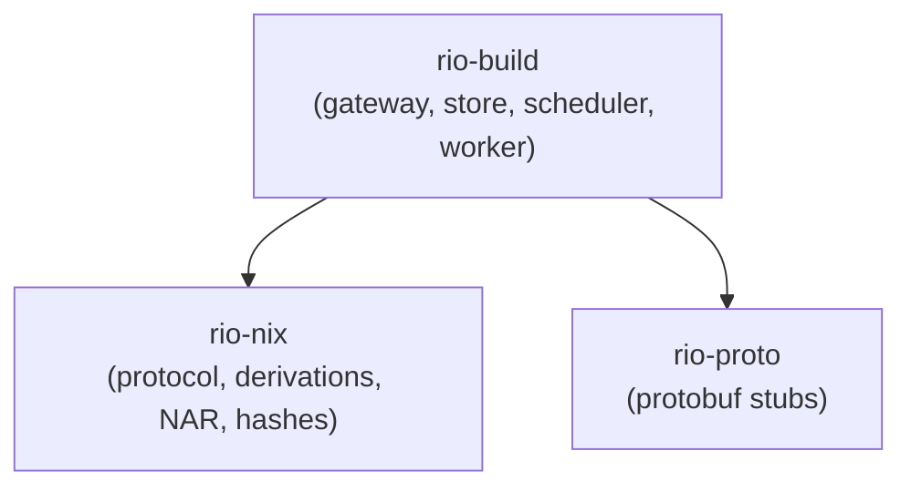
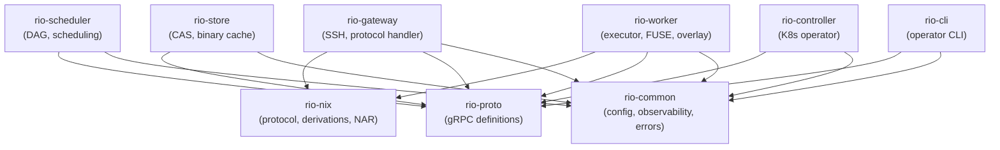

# Crate Structure

## Phase 1: Starting Point (3 crates)

Start with the minimum viable workspace. Resist premature splitting --- module boundaries within a crate are cheap to change; crate boundaries are expensive.

```
rio-build/
├── Cargo.toml           # Workspace root
├── rio-nix/             # Nix protocol types (independent, stable API)
│   └── src/
│       ├── protocol/    # Wire format, handshake, STDERR, opcodes
│       ├── derivation.rs
│       ├── store_path.rs
│       ├── nar.rs
│       ├── narinfo.rs
│       └── hash.rs
├── rio-build/           # Everything else (gateway, store, scheduler as modules)
│   └── src/
│       ├── main.rs
│       ├── gateway/     # SSH server, protocol handler
│       ├── store/       # CAS, metadata, backends
│       ├── scheduler/   # DAG, assignment, state (when needed in Phase 2)
│       └── worker/      # Executor, overlay (when needed in Phase 2)
└── rio-proto/           # Protobuf definitions (stub in Phase 1a, substantive content in Phase 2a)
    └── proto/
```

### Phase 1 Dependency Graph



## Phase 2+: Split as Boundaries Stabilize

Extract modules into separate crates only when their API boundaries are validated through use:

- **rio-store/** --- when the store API is stable and used by multiple consumers
- **rio-scheduler/** --- when the scheduler interface is defined and testable in isolation
- **rio-worker/** --- when the worker protocol is finalized
- **rio-gateway/** --- when gateway is separable from store
- **rio-controller/** --- Phase 3 (Kubernetes operator)
- **rio-cli/** --- Phase 4
- **rio-common/** --- when shared utilities accumulate across crates

## Target Architecture (9 crates + dashboard)

The full target structure once all boundaries are validated:

```
rio-build/
├── Cargo.toml                     # Workspace root
│
├── rio-proto/                     # Protobuf definitions + generated code
│   ├── proto/
│   │   ├── store.proto            # StoreService, ChunkService
│   │   ├── scheduler.proto        # SchedulerService
│   │   ├── worker.proto            # WorkerService
│   │   ├── types.proto             # Shared message types (BuildEvent, HeartbeatRequest, etc.)
│   │   └── admin.proto            # AdminService
│   ├── build.rs                   # tonic-build code generation
│   ├── src/lib.rs
│   └── Cargo.toml                 # deps: tonic, prost, prost-types
│
├── rio-nix/                       # Nix protocol and data types
│   ├── src/
│   │   ├── lib.rs
│   │   ├── protocol/
│   │   │   ├── mod.rs
│   │   │   ├── opcodes.rs         # Worker protocol opcode enum + dispatch
│   │   │   ├── handshake.rs       # Version negotiation, magic bytes
│   │   │   ├── wire.rs            # Length-prefix framing, padded strings, framed streams
│   │   │   ├── stderr.rs          # STDERR streaming loop
│   │   │   ├── build.rs           # BasicDerivation + BuildResult wire types
│   │   │   ├── client.rs          # Client-side protocol for local nix-daemon
│   │   │   └── derived_path.rs    # DerivedPath string parser
│   │   ├── derivation.rs          # .drv ATerm format parser
│   │   ├── store_path.rs          # Store path types, nixbase32
│   │   ├── nar.rs                 # NAR streaming read/write
│   │   └── hash.rs                # Nix hash types
│   └── Cargo.toml                 # No external Nix deps
│
├── rio-store/                     # Chunked content-addressable store
│   ├── src/
│   │   ├── lib.rs
│   │   ├── cas.rs                 # Core CAS logic
│   │   ├── chunker.rs             # FastCDC content-defined chunking
│   │   ├── manifest.rs            # Chunk manifest
│   │   ├── metadata.rs            # PathInfo, narinfo (PostgreSQL)
│   │   ├── content_index.rs       # Content hash -> store path (CA cutoff)
│   │   ├── backend/
│   │   │   ├── mod.rs             # ChunkBackend trait
│   │   │   ├── s3.rs              # S3-compatible chunk storage
│   │   │   ├── filesystem.rs      # Local filesystem backend
│   │   │   └── memory.rs          # In-memory (testing)
│   │   ├── cache_server.rs         # Binary cache HTTP server (axum)
│   │   ├── gc.rs                  # Garbage collection
│   │   └── signing.rs             # ed25519 NAR signing/verification
│   └── Cargo.toml
│
├── rio-scheduler/                 # DAG scheduler
│   ├── src/
│   │   ├── lib.rs
│   │   ├── dag.rs                 # DAG representation
│   │   ├── critical_path.rs       # Critical path computation
│   │   ├── assignment.rs          # Worker scoring and assignment
│   │   ├── queue.rs               # Priority queue with preemption
│   │   ├── state.rs               # Scheduler state (PostgreSQL)
│   │   ├── early_cutoff.rs        # CA early cutoff
│   │   ├── estimator.rs           # Build duration estimation
│   │   └── poison.rs              # Poison derivation tracking
│   └── Cargo.toml
│
├── rio-gateway/                   # Nix protocol frontend
│   ├── src/
│   │   ├── lib.rs
│   │   ├── server.rs              # SSH server (russh)
│   │   ├── session.rs             # Per-client session state
│   │   ├── handler.rs             # Opcode dispatch
│   │   └── translate.rs           # Nix protocol <-> gRPC
│   └── Cargo.toml
│
├── rio-worker/                    # Build executor
│   ├── src/
│   │   ├── lib.rs
│   │   ├── executor.rs            # Build execution
│   │   ├── overlay.rs             # overlayfs management
│   │   ├── fuse/                  # FUSE filesystem daemon (rio-fuse)
│   │   │   ├── mod.rs
│   │   │   ├── lookup.rs          # Path lookup and existence checks
│   │   │   ├── read.rs            # File read operations
│   │   │   └── cache.rs           # Local SSD cache management (LRU)
│   │   ├── store_sync.rs          # Fetch missing paths
│   │   ├── upload.rs              # Chunk and upload outputs
│   │   ├── log_stream.rs          # Build log streaming
│   │   └── resource.rs            # Resource accounting (Phase 2b)
│   └── Cargo.toml
│
├── rio-controller/                # Kubernetes operator
│   ├── src/
│   │   ├── lib.rs
│   │   ├── main.rs
│   │   ├── crds/                  # CRD type definitions
│   │   ├── reconcilers/           # Reconciliation loops
│   │   └── scaling.rs             # Autoscaling logic
│   └── Cargo.toml
│
├── rio-cli/                       # CLI tool
│   ├── src/main.rs
│   └── Cargo.toml
│
├── rio-common/                    # Shared utilities
│   ├── src/
│   │   ├── lib.rs
│   │   ├── config.rs              # Configuration types
│   │   ├── observability.rs       # Tracing, metrics, logging
│   │   └── error.rs               # Common error types
│   └── Cargo.toml
│
└── rio-dashboard/                 # Web dashboard (TypeScript, not a Rust crate)
    ├── package.json               # Node/Bun project
    ├── src/                       # React SPA source
    ├── Dockerfile                 # Builds static assets + nginx
    └── vite.config.ts
```

### Target Dependency Graph


