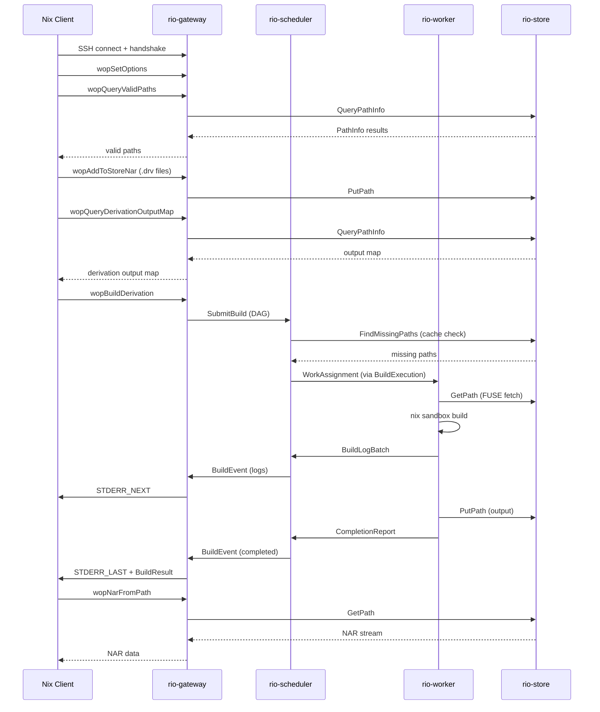
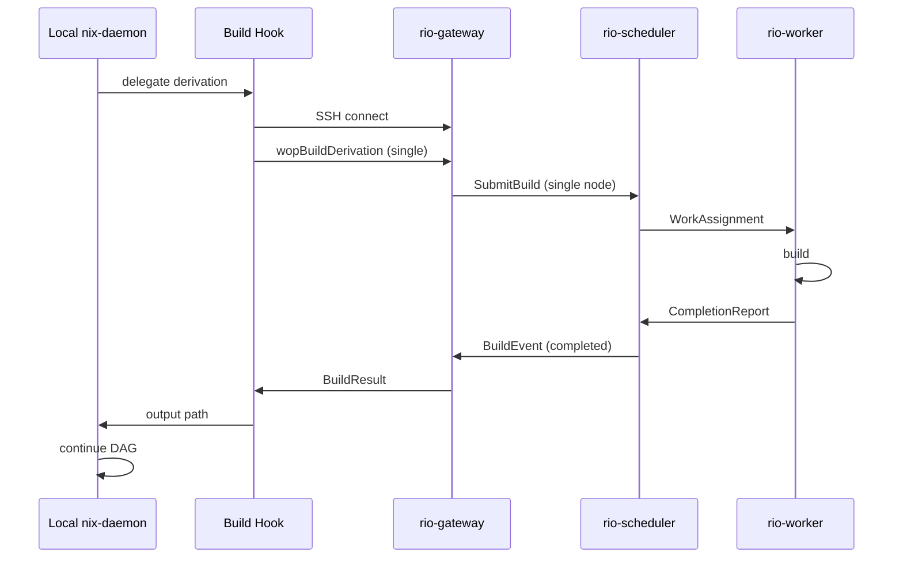
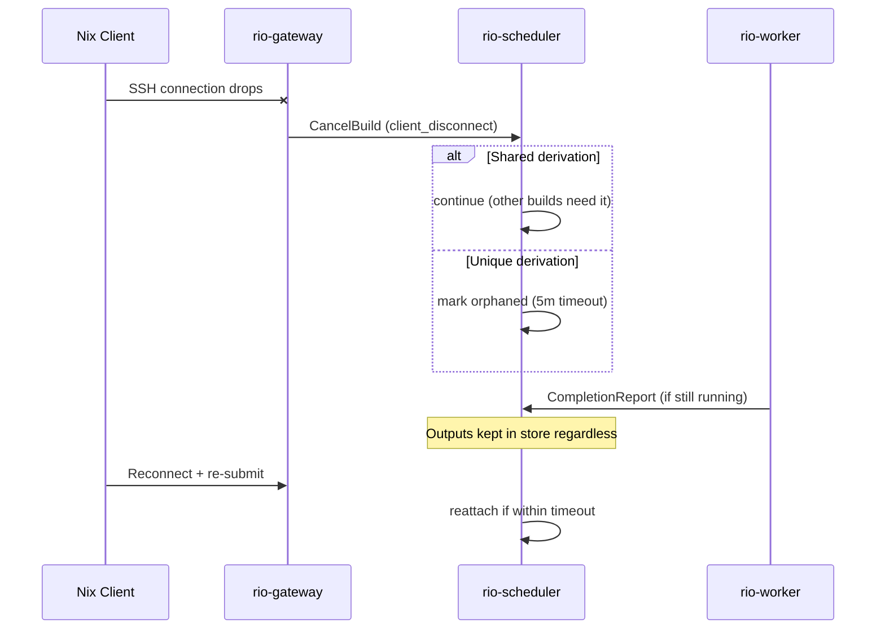

# Data Flows

## Remote Store: `nix build --store ssh-ng://rio .#package`

```
1. User runs: nix build --store ssh-ng://rio .#package
2. Nix evaluates the flake locally -> produces derivation DAG (.drv files)
3. Nix opens SSH connection to rio-gateway
4. Worker protocol handshake (magic bytes, version negotiation)
5. Nix sends wopSetOptions (build configuration)
6. Nix sends wopQueryValidPaths --- "which outputs do you have?"
7. rio-gateway queries rio-store -> returns valid paths
8. Nix sends wopAddToStoreNar for each missing .drv file and input source
   -> rio-gateway stores in rio-store
   (for protocol >= 1.32, sources are batched via wopAddMultipleToStore
    rather than individual wopAddToStoreNar calls)
8a. Nix sends wopQueryDerivationOutputMap for each derivation
    -> Modern Nix clients (>= 2.4) call this unconditionally for all
       derivation types (input-addressed and CA). rio-gateway resolves
       via rio-store and returns the output name -> store path mapping.
9. Nix sends wopBuildDerivation (or wopBuildPathsWithResults) for top-level
   -> wopBuildDerivation sends an inline BasicDerivation (WITHOUT inputDrvs)
   -> rio-gateway reconstructs the full DAG by parsing the .drv files
      uploaded in step 8 (each .drv contains inputDrvs references forming
      the DAG edges)
   -> forwards to rio-scheduler via gRPC SubmitBuild
10. rio-scheduler:
    a. Queries rio-store for cache hits (already-built outputs)
    b. For CA derivations: content-indexed lookup for early cutoff
    c. Computes remaining build graph
    d. Computes critical-path priorities
    e. Dispatches ready derivations to workers
11. For each dispatched derivation:
    a. Worker's FUSE daemon checks local SSD cache for input paths (fast path)
    b. Cache miss: FUSE daemon fetches from rio-store via gRPC, caches on SSD
    c. Worker executes build in nix sandbox (overlay-merged /nix/store)
    d. Worker streams build logs to scheduler via bidirectional
       BuildExecution stream (log lines batched for efficiency)
       Scheduler relays logs to gateway via BuildEvent stream (from SubmitBuild)
       Gateway converts to STDERR_NEXT messages for the Nix client
    e. Worker chunks output NAR via FastCDC, uploads to rio-store
    f. Worker reports completion to scheduler
    g. Scheduler checks CA early cutoff: does output match existing content?
       - If yes: skip downstream rebuilds, return cached outputs
       - If no: store new content, release downstream nodes
12. When top-level derivation completes:
    a. Scheduler notifies gateway
    b. Gateway sends STDERR_LAST + BuildResult to Nix client
    c. Client requests wopNarFromPath for outputs
       -> NAR data is streamed via STDERR_WRITE messages inside the
          STDERR loop, not as a direct payload after STDERR_LAST.
    d. Gateway streams NAR (reassembled from chunks) back to client
```

See [rio-gateway](./components/gateway.md) for protocol opcode details, [rio-scheduler](./components/scheduler.md) for the scheduling algorithm, and [rio-store](./components/store.md) for the chunked CAS.



## Remote Builder: `nix build --builders 'ssh-ng://rio ...'`

```
1. User runs: nix build .#package (with rio configured as a builder)
2. Nix evaluates locally, starts building the DAG
3. For each derivation, local nix-daemon invokes the build hook
4. Build hook connects to rio-gateway via ssh-ng
5. Build hook sends the .drv path, system, and features
6. rio-gateway receives single-derivation build request
   -> creates a mini build plan in rio-scheduler
7. rio-scheduler assigns to a worker (same algorithm but single-derivation)
8. Worker builds, uploads output to rio-store
9. rio-gateway returns output to build hook
10. Build hook copies output back to local store
11. Local daemon continues with next derivation
```

> **Key difference:** in build hook mode, the local daemon drives the DAG traversal. rio only sees one derivation at a time. Less optimal scheduling, but fully compatible with any existing Nix setup.

> **Note on --builders mode:** In `--builders` mode, the local nix-daemon (not the build hook program directly) connects to rio-gateway via ssh-ng. What rio-gateway sees is a normal ssh-ng session with a specific operation pattern. The build hook is a local daemon concept; rio-gateway doesn't distinguish build hook vs direct client connections.



## Client Disconnection

```
1. Client SSH connection drops (network failure, ctrl-c, etc.)
2. rio-gateway detects SSH channel close
3. Gateway sends CancelBuild to scheduler with reason="client_disconnect"
4. Scheduler policy:
   a. For derivations shared with other active builds: continue building
   b. For derivations unique to this build: mark as orphaned
   c. Orphaned derivations timeout after configurable period (default: 5 minutes)
   d. If client reconnects and re-submits before timeout, work is reattached
5. Workers building orphaned derivations: allowed to complete current build
   (wasted work is bounded by one derivation per worker)
6. Completed outputs remain in rio-store regardless of client state
```



## Scheduler Failover

```
1. Scheduler leader pod dies (crash, node failure, rolling update)
2. New scheduler pod acquires the Kubernetes Lease for leader election
3. New leader reconstructs in-memory state from PostgreSQL (see scheduler.md)
4. Workers detect stream break, reconnect BuildExecution streams to new leader
5. For gateway connections with active SubmitBuild streams:
   a. The SubmitBuild response stream (BuildEvent) breaks with a gRPC error
   b. Gateway must call WatchBuild(build_id, since_sequence) on the new leader
      to resume the BuildEvent stream from where it left off
   c. The gateway maintains a per-session mapping of (SSH channel -> build_id)
      so it can re-subscribe after failover
   d. If the gateway itself also restarted, see Client Disconnection above
      (client reconnects and re-submits; scheduler reattaches)
6. Log events between the old leader's crash and the WatchBuild reconnection
   may be lost unless log persistence is configured (see observability.md)
```

## Import-From-Derivation (IFD)

IFD occurs when Nix evaluation depends on a build result. The flow is:

```
1. Client begins evaluation, discovers it needs to build a derivation
   before it can continue evaluation
2. Client opens a separate SSH channel (the primary channel is blocked
   in evaluation) and sends wopBuildDerivation for the IFD derivation
3. rio-gateway receives a single-derivation build request on the new channel
   -> rio-gateway forwards to rio-scheduler as a SubmitBuild with
      priority_class = "interactive" (IFD builds are evaluation-blocking)
4. rio-scheduler detects IFD priority: the scheduler assigns maximum
   priority to this derivation (above all queued non-IFD work)
5. Worker builds the derivation, uploads output
6. rio-gateway returns BuildResult to the client on the IFD channel
7. Client retrieves the output via wopNarFromPath on the IFD channel
8. Client resumes evaluation using the IFD output
9. Client may submit the full DAG (including the IFD derivation) on the
   primary channel --- the IFD derivation is already cached (instant hit)
```

> **Detection heuristic:** The scheduler detects IFD builds because they arrive as individual `wopBuildDerivation` calls on a separate SSH channel, typically before the full DAG is submitted on another channel. The gateway can annotate the `SubmitBuildRequest` with `is_ifd_hint = true` based on the session context (single derivation, no prior `wopQueryValidPaths` on this channel).
