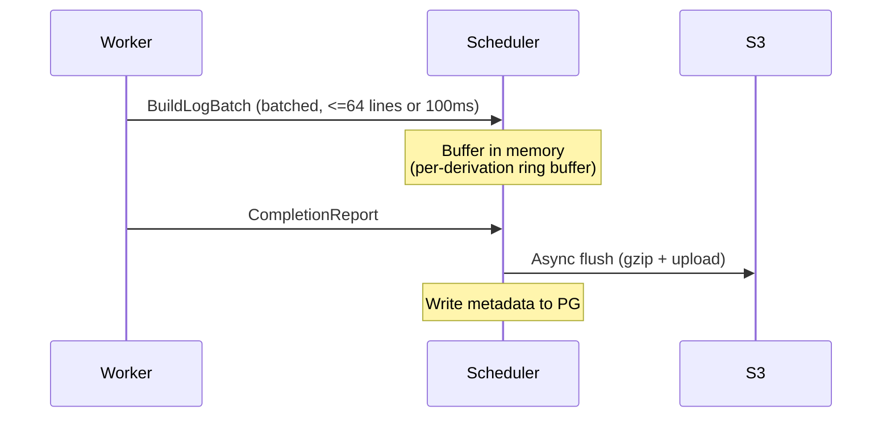

# Observability

rio-build provides three pillars of observability: logs, metrics, and traces.

## Build Log Storage

Build logs are stored durably for post-build analysis and the [dashboard](./components/dashboard.md) log viewer.

### Storage Format

Build logs are stored in S3 as gzipped blobs:

```
logs/{build_id}/{derivation_hash}.log.gz
```

Metadata (byte offsets, timestamps, line counts) is stored in PostgreSQL for efficient seeking and pagination.

### Log Lifecycle



1. Workers stream log lines to the scheduler via `BuildLogBatch` messages in the `BuildExecution` stream. Lines are batched (up to 64 lines or 100ms, whichever comes first) for efficiency.
2. The scheduler buffers logs in an in-memory ring buffer per active derivation.
3. On derivation completion, the scheduler asynchronously flushes the buffer to S3 as a gzipped blob and writes metadata (byte offsets, timestamps) to PostgreSQL.

> **Periodic flush:** Logs are also flushed to S3 periodically (every 30s) during active builds, not only on completion. This bounds log loss to at most 30s of output if the scheduler fails over.

> **Log durability tradeoff:** The 30-second flush interval is a deliberate tradeoff between write amplification and data loss. Flushing more frequently increases S3 PUT costs and scheduler CPU usage; flushing less frequently increases the window of log loss on crash. For most builds, 30s of lost logs is acceptable --- the build itself will be retried and new logs will be generated. For long-running builds where the final 30s of output is critical for debugging, consider a future enhancement: workers could write a local log file as a write-ahead log (WAL) that survives scheduler restarts, with the scheduler draining the WAL on recovery. This is a Phase 4+ consideration.
4. The `AdminService.GetBuildLogs` RPC reads from the in-memory buffer for active builds and from S3 for completed builds.

### Log Serving

| Build State | Log Source |
|-------------|-----------|
| Active (building) | In-memory ring buffer on scheduler |
| Completed | S3 blob (gzipped), seekable via PG metadata |
| Failed | S3 blob (flushed on failure as well) |

## Metrics

Each component exposes a Prometheus-compatible `/metrics` endpoint via `metrics-exporter-prometheus`.

### Gateway Metrics

| Metric | Type | Description |
|--------|------|-------------|
| `rio_gateway_connections_total` | Counter | Total SSH connections |
| `rio_gateway_connections_active` | Gauge | Currently active connections |
| `rio_gateway_opcodes_total` | Counter | Protocol opcodes handled (labeled by opcode) |
| `rio_gateway_opcode_duration_seconds` | Histogram | Per-opcode latency |
| `rio_gateway_handshakes_total` | Counter | Protocol handshakes completed (labeled by result: success/rejected/failure) |
| `rio_gateway_channels_active` | Gauge | Currently active SSH channels |
| `rio_gateway_errors_total` | Counter | Protocol errors (labeled by type) |

> **Note on `rio_gateway_connections_total`:** Incremented on TCP connection (`result=new`), then again on auth outcome (`result=accepted` or `result=rejected`). A single successful connection generates two increments. Use `result=accepted` + `result=rejected` for connection success/failure rates.

### Scheduler Metrics

| Metric | Type | Description |
|--------|------|-------------|
| `rio_scheduler_builds_total` | Counter | Total builds at terminal state (labeled by `outcome`: `success`/`failure`/`cancelled`) |
| `rio_scheduler_builds_active` | Gauge | Currently active builds |
| `rio_scheduler_derivations_queued` | Gauge | Derivations waiting for assignment |
| `rio_scheduler_derivations_running` | Gauge | Derivations currently building |
| `rio_scheduler_assignment_latency_seconds` | Histogram | Time from ready to assigned |
| `rio_scheduler_build_duration_seconds` | Histogram | Total build duration |
| `rio_scheduler_cache_hits_total` | Counter | Derivations served from cache (labeled by `source`: `scheduler`=TOCTOU check, `existing`=pre-existing completed) |
| `rio_scheduler_cache_check_failures_total` | Counter | Scheduler cache check (store FindMissingPaths) failures. Alert if rate > 0 sustained: indicates store connectivity issue, every submission treated as 100% cache miss. |
| `rio_scheduler_queue_backpressure` | Counter | Backpressure activations (queue reached 80% capacity) |
| `rio_scheduler_workers_active` | Gauge | Fully-registered workers (stream + heartbeat) |
| `rio_scheduler_assignments_total` | Counter | Total derivation->worker assignments |
| `rio_scheduler_cleanup_dropped_total` | Counter | Terminal-build cleanup commands dropped due to channel backpressure. Alert if rate > 0 sustained: indicates memory leak under load. |
| `rio_scheduler_transition_rejected_total` | Counter | State-machine transition rejections in the actor (labeled by `to` target state). Alert if rate > 0: these are defense-in-depth guards that should never fire; any non-zero rate indicates a race or logic bug. |
| `rio_scheduler_critical_path_accuracy` *(Phase 2c+)* | Histogram | Predicted vs. actual completion ratio |
| `rio_scheduler_size_class_assignments_total` *(Phase 2c+)* | Counter | Assignments per size class (labeled by class name) |
| `rio_scheduler_misclassifications_total` *(Phase 2c+)* | Counter | Builds that exceeded 2x their class cutoff duration |
| `rio_scheduler_cutoff_seconds` *(Phase 2c+)* | Gauge | Current duration cutoff per class boundary (labeled by class) |
| `rio_scheduler_class_load_fraction` *(Phase 2c+)* | Gauge | Load fraction per size class (should be ~equal when SITA-E is active) |
| `rio_scheduler_class_queue_depth` *(Phase 2c+)* | Gauge | Queue depth per size class |

### Store Metrics

| Metric | Type | Description |
|--------|------|-------------|
| `rio_store_put_path_total` | Counter | Total PutPath operations |
| `rio_store_put_path_duration_seconds` | Histogram | PutPath latency |
| `rio_store_integrity_failures_total` | Counter | GetPath content integrity check failures (bitrot/corruption) |
| `rio_store_chunks_total` *(Phase 2c+)* | Gauge | Total chunks in storage |
| `rio_store_chunk_dedup_ratio` *(Phase 2c+)* | Gauge | Chunk deduplication ratio |
| `rio_store_s3_requests_total` | Counter | S3 API calls (labeled by operation) |
| `rio_store_cache_hit_ratio` *(Phase 2c+)* | Gauge | In-process LRU cache hit ratio |

### Worker Metrics

| Metric | Type | Description |
|--------|------|-------------|
| `rio_worker_builds_total` | Counter | Total builds executed (labeled by `outcome`: `success`/`failure`) |
| `rio_worker_builds_active` | Gauge | Currently running builds on this worker |
| `rio_worker_uploads_total` | Counter | Output uploads (labeled by `status`) |
| `rio_worker_build_duration_seconds` | Histogram | Per-derivation build time |
| `rio_worker_fuse_cache_size_bytes` | Gauge | FUSE SSD cache usage |
| `rio_worker_fuse_cache_hits_total` | Counter | FUSE cache hits |
| `rio_worker_fuse_cache_misses_total` | Counter | FUSE cache misses |
| `rio_worker_fuse_fetch_duration_seconds` | Histogram | Store path fetch latency |
| `rio_worker_overlay_teardown_failures_total` | Counter | Overlay unmount failures (leaked mount). Alert if rate > 0: indicates resource leak on worker. |

> **Note on ratio metrics:** Metrics like `rio_store_cache_hit_ratio` and `rio_worker_fuse_cache_hit_ratio` are shown for local dashboards but should not be relied upon for aggregation across instances. For aggregatable cache metrics, use counter pairs (e.g., `rio_store_cache_hits_total` + `rio_store_cache_misses_total`) and compute ratios at query time. Gauge ratios lose meaning when averaged across instances.

### Controller Metrics

| Metric | Type | Description |
|--------|------|-------------|
| `rio_controller_reconcile_duration_seconds` | Histogram | Reconcile loop latency (labeled by reconciler) |
| `rio_controller_reconcile_errors_total` | Counter | Reconcile errors (labeled by reconciler) |
| `rio_controller_workerpool_replicas` | Gauge | WorkerPool replica count (labeled desired vs actual) |
| `rio_controller_scaling_decisions_total` | Counter | Scaling decisions (labeled by direction: up/down) |
| `rio_controller_gc_runs_total` | Counter | GC runs (labeled by result: success/failure) |

## Distributed Tracing

rio-build uses OpenTelemetry for distributed tracing with trace context propagation via gRPC metadata.

### Trace Structure

A typical build trace spans multiple components:

```
Build (gateway)
├── SubmitBuild (gateway → scheduler)
│   ├── DAG Merge (scheduler)
│   ├── Cache Check (scheduler → store)
│   └── Schedule (scheduler)
│       ├── Assign derivation-A (scheduler → worker-0)
│       │   ├── Fetch inputs (worker-0 → store)
│       │   ├── Build (worker-0, nix sandbox)
│       │   └── Upload output (worker-0 → store)
│       └── Assign derivation-B (scheduler → worker-1)
│           ├── Fetch inputs (worker-1 → store)
│           ├── Build (worker-1, nix sandbox)
│           └── Upload output (worker-1 → store)
└── Return result (gateway → client)
```

### Configuration

| Parameter | Description |
|-----------|-------------|
| `otel_endpoint` | OTLP collector endpoint (e.g., `http://otel-collector:4317`) |
| `otel_service_name` | Component name (auto-set per component) |
| `otel_sample_rate` | Trace sampling rate (default: 1.0 in dev, 0.1 in prod) |

### Trace Propagation

Trace context is propagated via gRPC metadata using the W3C `traceparent` header format. The `tracing-opentelemetry` crate handles context injection and extraction automatically for tonic interceptors.

## SLOs, SLIs, and Alerting

### Service Level Indicators (SLIs)

| SLI | Source Metric(s) |
|-----|------------------|
| Gateway connection success rate | `rio_gateway_connections_total` minus connection errors / total |
| Scheduler build completion rate | `rio_scheduler_builds_total` outcome=success / total |
| Store PutPath success rate | `rio_store_put_path_total` minus errors / total |
| Worker build success rate | `rio_worker_builds_total` outcome=success / total |

### Service Level Objectives (SLOs)

| SLO | Target |
|-----|--------|
| Non-PermanentFailure builds complete within 2x estimated duration | 99.9% |
| PutPath success on first attempt | 99.99% |
| Cache-hit latency (p99) | < 1s |

### Alerting

- **Error budget burn rate:** Alert when the error budget consumption rate exceeds 14.4x the allowed rate over 1h (fast burn) or 6x over 6h (slow burn), following the multi-window multi-burn-rate approach.
- **Saturation alerts:** PostgreSQL connection pool utilization > 80%, S3 rate limiting (429 responses), worker queue depth exceeding 2x worker count.
- **Absence alerts:** No worker heartbeat received for > 3x `heartbeat_interval` (default 30s). Indicates a worker has silently died or lost network connectivity.

## Structured Logging

All components emit structured JSON logs via `tracing-subscriber` with the following required fields per log line:

| Field | Type | Description |
|-------|------|-------------|
| `timestamp` | RFC 3339 | Event time |
| `level` | string | Log level (TRACE, DEBUG, INFO, WARN, ERROR) |
| `component` | string | Emitting component (gateway, scheduler, store, worker, controller) |
| `trace_id` | string | OpenTelemetry trace ID (if within a traced span) |
| `span_id` | string | OpenTelemetry span ID |
| `build_id` | string | Build request ID (if applicable) |
| `derivation_hash` | string | Derivation hash (if applicable) |
| `tenant_id` | string | Tenant identifier |
| `worker_id` | string | Worker instance ID (worker component only) |
| `message` | string | Human-readable log message |

Optional fields may be added per component as `tracing` span fields. All fields use snake_case. Missing context fields (e.g., `build_id` outside a build context) are omitted rather than set to empty strings.

## Dashboard Data Sources

The [rio-dashboard](./components/dashboard.md) consumes data from two sources:

| Data | Source | Protocol |
|------|--------|----------|
| Builds, workers, logs | `AdminService` | gRPC-Web |
| Metrics, graphs | Prometheus | HTTP (direct or via Grafana) |

The dashboard does NOT query PostgreSQL or S3 directly.
