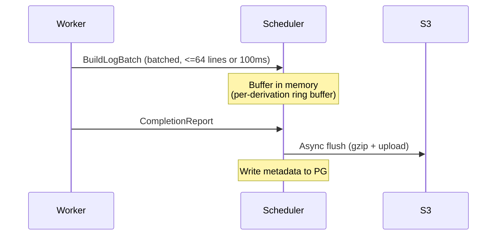

# Observability

rio-build provides three pillars of observability: logs, metrics, and traces.

## Build Log Storage

Build logs are stored durably for post-build analysis and the [dashboard](./components/dashboard.md) log viewer.

### Storage Format

Build logs are stored in S3 as gzipped blobs:

```
logs/{build_id}/{derivation_hash}.log.gz
```

Metadata (byte offsets, timestamps, line counts) is stored in PostgreSQL for efficient seeking and pagination.

### Log Lifecycle

r[obs.log.batch-64-100ms]
Log lines are batched (up to 64 lines or 100ms, whichever first) in `BuildLogBatch` messages.

r[obs.log.periodic-flush]
The scheduler flushes buffers to S3 periodically (every 30s) during active builds, not only on completion --- bounds log loss to at most 30s on failover.



1. Workers stream log lines to the scheduler via `BuildLogBatch` messages in the `BuildExecution` stream. Lines are batched (up to 64 lines or 100ms, whichever comes first) for efficiency.
2. The scheduler buffers logs in an in-memory ring buffer per active derivation.
3. On derivation completion, the scheduler asynchronously flushes the buffer to S3 as a gzipped blob and writes metadata (byte offsets, timestamps) to PostgreSQL.

> **Periodic flush:** Logs are also flushed to S3 periodically (every 30s) during active builds, not only on completion. This bounds log loss to at most 30s of output if the scheduler fails over.

> **Log durability tradeoff:** The 30-second flush interval is a deliberate tradeoff between write amplification and data loss. Flushing more frequently increases S3 PUT costs and scheduler CPU usage; flushing less frequently increases the window of log loss on crash. For most builds, 30s of lost logs is acceptable --- the build itself will be retried and new logs will be generated. For long-running builds where the final 30s of output is critical for debugging, consider a future enhancement: workers could write a local log file as a write-ahead log (WAL) that survives scheduler restarts, with the scheduler draining the WAL on recovery. Not currently planned.
4. The `AdminService.GetBuildLogs` RPC reads from the in-memory buffer for active builds and from S3 for completed builds.

### Log Serving

| Build State | Log Source |
|-------------|-----------|
| Active (building) | In-memory ring buffer on scheduler |
| Completed | S3 blob (gzipped), seekable via PG metadata |
| Failed | S3 blob (flushed on failure as well) |

## Metrics

Each component exposes a Prometheus-compatible `/metrics` endpoint via `metrics-exporter-prometheus`.

### Gateway Metrics

r[obs.metric.gateway]
| Metric | Type | Description |
|--------|------|-------------|
| `rio_gateway_connections_total` | Counter | Total SSH connections |
| `rio_gateway_connections_active` | Gauge | Currently active connections |
| `rio_gateway_opcodes_total` | Counter | Protocol opcodes handled (labeled by opcode) |
| `rio_gateway_opcode_duration_seconds` | Histogram | Per-opcode latency |
| `rio_gateway_handshakes_total` | Counter | Protocol handshakes completed (labeled by result: success/rejected/failure) |
| `rio_gateway_channels_active` | Gauge | Currently active SSH channels |
| `rio_gateway_errors_total` | Counter | Protocol errors (labeled by type) |
| `rio_gateway_bytes_total` | Counter | Bytes forwarded to/from SSH client (labeled by `direction`: `rx`/`tx`) |
| `rio_gateway_quota_rejections_total` | Counter | SubmitBuild rejected because tenant is over store quota (labeled by `tenant`) |
| `rio_gateway_auth_degraded_total` | Counter | SSH auth accepted but tenant identity degraded to single-tenant mode due to a malformed `authorized_keys` comment (labeled by `reason`: `interior_whitespace`). Alerts on misconfigured multi-tenant keys silently falling back to single-tenant. |
| `rio_gateway_jwt_mint_degraded_total` | Counter | JWT mint failed but `jwt.required=false`, so the request degraded to the `tenant_name` fallback. Alert if rate > 0 sustained: mint failures indicate signing-key misconfig or clock skew; downstream services lose cryptographic tenant proof. |
| `rio_gateway_jwt_refreshed_total` | Counter | Session JWT re-minted on a long-lived SSH connection because the cached token was near expiry (`r[gw.jwt.refresh-on-expiry]`). Expected to be nonzero under `ControlMaster` mux'd workloads; not an error. |
| `rio_gateway_jwt_refresh_failed_total` | Counter | Session JWT re-mint failed; the stale token was kept and downstream will reject with `ExpiredSignature`. Alert if > 0: re-mint uses the same key that minted the original, so failure indicates a corrupt signing key. |
| `rio_gateway_putpath_aborted_retries_total` | Counter | `PutPath` retries on store `Code::Aborted` (labeled by `attempt`: `1`..`8`). `attempt=8` means the retry budget was exhausted and the error surfaced to the client. Alert if `attempt=8` rate > 0: GC mark is outlasting both the store-side and gateway-side retry windows (I-168). |

> **Note on `rio_gateway_connections_total`:** Incremented on first SSH auth attempt (`result=new`), then again on auth outcome (`result=accepted`, `result=rejected`, or `result=rejected_jwt`). TCP probes that close before sending SSH bytes (NLB/kubelet health checks) do not increment — russh's `new_client()` fires on TCP accept, so the counter is deferred to the first `auth_*` callback. A single successful connection still generates two increments; use `result=accepted` + `result=rejected` + `result=rejected_jwt` for success/failure rates. `rejected_jwt` fires when SSH auth succeeds but the JWT mint fails with `jwt.required=true` — indicates signing-key misconfig or clock skew; distinct from `rejected` (SSH auth failure) so dashboards can alert on JWT-rejection spikes separately.

### Scheduler Metrics

r[obs.metric.scheduler]
| Metric | Type | Description |
|--------|------|-------------|
| `rio_scheduler_builds_total` | Counter | Total builds at terminal state (labeled by `outcome`: `success`/`failure`/`cancelled`) |
| `rio_scheduler_builds_active` | Gauge | Currently active builds |
| `rio_scheduler_derivations_queued` | Gauge | Derivations waiting for assignment |
| `rio_scheduler_derivations_running` | Gauge | Derivations currently building |
| `rio_scheduler_actor_cmd_seconds` | Histogram | Per-`ActorCommand` handling latency (labeled by `cmd`). The DAG actor is single-threaded — a slow command head-of-line blocks every queued RPC. Alert on p99 > 1s sustained. |
| `rio_scheduler_assignment_latency_seconds` | Histogram | Time from ready to assigned |
| `rio_scheduler_build_duration_seconds` | Histogram | Total build duration |
| `rio_scheduler_cache_hits_total` | Counter | Derivations served from cache (labeled by `source`: `scheduler`=TOCTOU check, `existing`=pre-existing completed) |
| `rio_scheduler_cache_check_failures_total` | Counter | Scheduler cache check (store FindMissingPaths) failures. Alert if rate > 0 sustained: indicates store connectivity issue, every submission treated as 100% cache miss. |
| `rio_scheduler_substitute_fetch_failures_total` | Counter | Substitutable-path eager fetches (QueryPathInfo) that failed. Path demoted to cache-miss; derivation falls through to normal dispatch. Alert if rate > 0 sustained: upstream reported path available but fetch failed --- upstream lying or transient network. |
| `rio_scheduler_queue_backpressure` | Counter | Backpressure activations (queue reached 80% capacity) |
| `rio_scheduler_workers_active` | Gauge | Fully-registered workers (stream + heartbeat) |
| `rio_scheduler_assignments_total` | Counter | Total derivation->worker assignments |
| `rio_scheduler_cleanup_dropped_total` | Counter | Terminal-build cleanup commands dropped due to channel backpressure. Alert if rate > 0 sustained: indicates memory leak under load. |
| `rio_scheduler_transition_rejected_total` | Counter | State-machine transition rejections in the actor (labeled by `to` target state). Alert if rate > 0: these are defense-in-depth guards that should never fire; any non-zero rate indicates a race or logic bug. |
| `rio_scheduler_log_lines_forwarded_total` | Counter | Log lines forwarded via `BuildEvent::Log` (worker → scheduler → actor → gateway broadcast). Direct signal that the log pipeline's internal plumbing is live. |
| `rio_scheduler_log_flush_total` | Counter | Successful S3 log flushes (labeled by `kind`: `final`/`periodic`). |
| `rio_scheduler_log_flush_failures_total` | Counter | Failed S3 log flushes (labeled by `phase`: `s3`/`pg`). Alert if rate > 0 sustained: build logs are being lost. |
| `rio_scheduler_log_flush_dropped_total` | Counter | Final-flush requests dropped due to flusher channel backpressure. Periodic tick will snapshot instead. |
| `rio_scheduler_log_forward_dropped_total` | Counter | Live log forwards dropped due to actor channel backpressure. Lines remain in the ring buffer (serveable via AdminService) but the gateway misses the live stream. Sustained non-zero → actor is saturated. |
| `rio_scheduler_critical_path_accuracy` | Histogram | Predicted vs. actual completion ratio (actual/estimated; 1.0 = perfect, >1.0 = underestimate) |
| `rio_scheduler_size_class_assignments_total` | Counter | Assignments per size class (labeled by class name) |
| `rio_scheduler_misclassifications_total` | Counter | Fires when `actual_duration > 2× assigned_cutoff`. Penalty trigger — also overwrites the EMA (`r[sched.classify.penalty-overwrite]`). |
| `rio_scheduler_size_class_promotions_total` | Counter | `size_class_floor` promotions on transient failure (labeled `kind`=`fod`\|`builder`, `from`, `to`; `r[sched.fod.size-class-reactive]` / `r[sched.builder.size-class-reactive]`). Frequent firing for one pname = raise the default tiny class's memory limit. |
| `rio_scheduler_fod_size_class_promotions_total` | Counter | DEPRECATED alias of `rio_scheduler_size_class_promotions_total{kind="fod"}`. |
| `rio_scheduler_ema_proactive_updates_total` | Counter | Fires when a mid-build `ProgressUpdate` cgroup `memory.peak` sample exceeds the current `ema_peak_memory_bytes`. Same penalty-overwrite semantics as `misclassifications_total` but BEFORE completion — next submit of that `(pname, system)` is right-sized without waiting for an OOM→retry cycle. |
| `rio_scheduler_class_drift_total` | Counter | Fires when `classify(actual) ≠ assigned_class` (labeled by `assigned_class`, `actual_class`). Cutoff-drift signal — decoupled from penalty logic. A build can trigger drift without penalty (actual barely over cutoff, under 2×). |
| `rio_scheduler_cutoff_seconds` | Gauge | Duration cutoff per class (labeled by class; initialized from config, re-emitted hourly after each rebalancer pass — see `r[sched.rebalancer.sita-e]`) |
| `rio_scheduler_class_queue_depth` | Gauge | Deferred derivations per target class (snapshot per dispatch pass) |
| `rio_scheduler_cache_check_circuit_open_total` | Counter | Circuit-breaker open transitions (store unreachable for 5 consecutive cache checks). Alert if rate > 0: scheduler falling back to rejecting SubmitBuild. |
| `rio_scheduler_prefetch_hints_sent_total` | Counter | PrefetchHint messages sent (one per assignment with paths to warm). Missing from a dispatch = leaf drv or bloom filter says worker already has everything. |
| `rio_scheduler_prefetch_paths_sent_total` | Counter | Total paths in sent PrefetchHints. Divide by `hints_sent` for avg paths-per-hint. High avg = workers cold (poor locality) or bloom stale. |
| `rio_scheduler_warm_gate_fallback_total` | Counter | `best_worker()` fell back to cold workers because no warm worker passed the hard filter. Expected nonzero on single-worker clusters and mass scale-up; sustained high rate = workers never warming (prefetch broken or bloom stale). |
| `rio_scheduler_warm_prefetch_paths` | Histogram | Paths fetched per initial warm-gate PrefetchHint (from the worker's PrefetchComplete ACK). `0` = worker already warm (cache hit on everything); high = fresh worker cold-fetched everything. |
| `rio_scheduler_event_persist_dropped_total` | Counter | BuildEvents dropped from PG persister (channel backpressure). Broadcast still live; only mid-backlog reconnect loses it. Alert if rate > 0 sustained. |
| `rio_scheduler_lease_acquired_total` | Counter | Kubernetes Lease acquire transitions (standby → leader). *Internal — primary use is VM test observability.* |
| `rio_scheduler_lease_lost_total` | Counter | Kubernetes Lease loss transitions (leader → standby). *Internal — non-zero on a single-replica deployment is a bug.* |
| `rio_scheduler_recovery_total` | Counter | State recovery runs (on LeaderAcquired). Labeled by `outcome`: `success`/`failure`. |
| `rio_scheduler_recovery_duration_seconds` | Histogram | Time to reload non-terminal builds/derivations from PostgreSQL. |
| `rio_scheduler_reconcile_dropped_total` | Counter | Post-recovery `ReconcileAssignments` command dropped because the actor channel was full. Assigned-but-worker-gone derivations leak until the next recovery pass. Rare (channel is 1024-deep); alert if > 0. |
| `rio_scheduler_backstop_timeouts_total` | Counter | Running derivations reset to Ready by the backstop timeout (running_since > max(est_duration×3, daemon_timeout+10m)). Non-zero indicates wedged workers. |
| `rio_scheduler_build_timeouts_total` | Counter | Builds failed by per-build wall-clock timeout (`BuildOptions.build_timeout` seconds since submission). Distinct from `backstop_timeouts_total` (per-derivation heuristic). |
| `rio_scheduler_worker_disconnects_total` | Counter | BuildExecution stream closures (worker gone). Triggers reassignment. |
| `rio_scheduler_cancel_signals_total` | Counter | CancelSignal messages sent to workers (explicit CancelBuild, backstop timeout, per-build timeout, or finalizer drain). |
| `rio_scheduler_cancel_signal_dropped_total` | Counter | CancelSignal `try_send` drops (worker stream full/closed under backpressure). Best-effort: the transition to Cancelled is scheduler-authoritative regardless; the worker's next heartbeat reconcile cleans it up. Alert if rate > 0 sustained. |
| `rio_scheduler_estimator_refresh_total` | Counter | Build-history estimator refresh ticks (60s cadence). *Internal — VM test sync signal.* |
| `rio_scheduler_derivations_gc_deleted_total` | Counter | Orphan-terminal `derivations` rows deleted by the periodic Tick sweep (I-169.2). Nonzero rate is normal; a sustained 1000/tick saturation means the backlog hasn't drained yet. |
| `rio_scheduler_build_graph_edges` | Histogram | Edge count per `GetBuildGraph` response. Bounded by the induced subgraph over the node-cap (≤5000 nodes); a high p99 (>10k) means unusually dense DAGs. Suggested buckets: `[100, 500, 1000, 5000, 10000, 20000]`. |
| `rio_scheduler_class_load_fraction` | Gauge | Load fraction per size class (adaptive rebalancer input) |
| `rio_scheduler_ca_hash_compares_total` | Counter | CA cutoff-compare output-hash lookups against the content index on completion (labeled by `outcome`: `match`/`miss`/`skipped_after_miss`/`malformed`/`error`). High match ratio → CA derivations rebuilding identical content. `skipped_after_miss` counts outputs NOT looked up because an earlier output in the same derivation missed (short-circuit); the compare loop breaks early since the AND-fold result is already false. `malformed` = worker sent an empty output path; `error` = PG lookup failed or timed out (alert if rate>0). |
| `rio_scheduler_ca_cutoff_saves_total` | Counter | Derivations skipped via CA early-cutoff (Queued→Skipped transitions). Each increment is one build that did NOT run because a CA dep's output matched the content index. |
| `rio_scheduler_ca_cutoff_seconds_saved` | Counter | Sum of `est_duration` of skipped derivations. Lower-bound estimate of wall-clock saved (est_duration is the Estimator's EMA; a never-run derivation has the fallback, not actual). Divide by `saves_total` for avg-seconds-per-save. |
| `rio_scheduler_actor_mailbox_depth` | Gauge | `ActorCommand` mpsc queue depth, sampled once per dequeued command. The actor is single-threaded — depth growth means commands arrive faster than the loop retires them. Pair with `actor_cmd_seconds` to localize a wedge: high depth + one slow `cmd` label = head-of-line block; high depth + uniformly fast cmds = sustained burst. |
| `rio_scheduler_dispatch_wait_seconds` | Histogram | Time from a derivation entering Ready to being Assigned. Same measurement as `assignment_latency_seconds` (both fed from `DerivationState.ready_at`); this is the dashboard-facing name. With ephemeral builders, dominated by node-provision (~60–180s on EKS). |
| `rio_scheduler_broadcast_lagged_total` | Counter | BuildEvent broadcast events skipped by lagging subscribers (sum of `RecvError::Lagged(n)` across all bridge tasks). Non-zero under sustained event burst — large DAG initial dispatch, or many concurrent drvs emitting Log lines, and the gateway can't drain the 1024-slot ring fast enough. The bridge continues post-lag (I-144); the gap is recoverable via S3 logs / WatchBuild reconnect. |
| `rio_scheduler_ca_cutoff_depth_cap_hits_total` | Counter | CA cutoff cascade walks that hit `MAX_CASCADE_NODES` (1000). Non-zero → cascades truncated; pathological DAG shape or cap too low. |

r[obs.metric.scheduler-leader-gate]
Scheduler state gauges (`_builds_active`, `_derivations_queued`, `_derivations_running`, `_workers_active`, `_class_queue_depth`) are published **only by the leader**. The standby's actor is warm (DAGs merge for fast takeover per `r[sched.lease.k8s-lease]`) but workers do not connect to it (leader-guarded gRPC per `r[sched.grpc.leader-guard]`), so its counts are stale or zero. With `replicas>1`, publishing from both would create duplicate Prometheus series with identical labels; a naked gauge query returns both, and stat-panel reducers pick one nondeterministically. Counters and histograms are unaffected --- the standby's dispatch loop no-ops, so its counters stay at zero naturally, and `sum(rate(...))` is the idiomatic query form anyway.

### Store Metrics

r[obs.metric.store]
| Metric | Type | Description |
|--------|------|-------------|
| `rio_store_put_path_total` | Counter | Total PutPath operations |
| `rio_store_putpath_retries_total` | Counter | PutPath retriable rejections (labeled by `reason`: `serialization`/`deadlock`/`placeholder_missing`/`connection`/`resource_exhausted`/`concurrent_upload`). Client retries on `aborted`/`unavailable`. Sustained high `deadlock`/`connection` rate = PG-side problem. GC no longer blocks PutPath (I-192). |
| `rio_store_put_path_duration_seconds` | Histogram | PutPath latency |
| `rio_store_integrity_failures_total` | Counter | GetPath content integrity check failures (bitrot/corruption) |
| `rio_store_chunks_total` | Gauge | Total chunks in storage (piggybacked on FindMissingChunks) |
| `rio_store_chunk_dedup_ratio` | Gauge | Per-upload dedup ratio (1.0 - missing/total after chunking) |
| `rio_store_s3_requests_total` | Counter | S3 API calls (labeled by operation) |
| `rio_store_chunk_cache_hits_total` | Counter | moka chunk cache hits (for cross-instance aggregation) |
| `rio_store_chunk_cache_misses_total` | Counter | moka chunk cache misses |
| `rio_store_hmac_rejected_total` | Counter | PutPath calls rejected by HMAC verifier (bad signature, expired, path not in `expected_outputs`). Alert if rate > 0: indicates misconfiguration or compromise attempt. |
| `rio_store_hmac_bypass_total` | Counter | PutPath calls that skipped HMAC verification via mTLS CN bypass (labeled by `cn`). Expected `cn="rio-gateway"` only. |
| `rio_store_gc_sweep_paths_remaining` | Gauge | Paths not yet processed by the in-progress GC sweep. Ticks down per batch commit (100 paths); `0` between sweeps. Long-tail at non-zero = sweep stalled or PG slow. |
| `rio_store_gc_path_resurrected_total` | Counter | Paths skipped by GC sweep because a reference appeared between mark and sweep (sweep's per-path reference re-check caught it). |
| `rio_store_gc_chunk_resurrected_total` | Counter | S3 deletes skipped by the drain task because chunk refcount re-check found the chunk back in use (TOCTOU guard via `pending_s3_deletes.blake3_hash`). |
| `rio_store_gc_path_swept_total` | Counter | Paths deleted by GC sweep (`narinfo` DELETE + CASCADE). Monotonic over store lifetime; `rate()` ≈ GC throughput. Not incremented on dry-run. |
| `rio_store_gc_s3_key_enqueued_total` | Counter | S3 keys enqueued to `pending_s3_deletes` by GC sweep (chunks that hit refcount=0). Gap vs `rio_store_s3_deletes_pending` gauge decreasing = drain keeping up. |
| `rio_store_gc_chunk_orphan_swept_total` | Counter | Standalone chunks reaped by `sweep_orphan_chunks` after the grace-TTL expired (PutChunk at refcount=0, no subsequent PutPath claimed them). Nonzero indicates workers crashing mid-upload; sustained high suggests a client-side chunker bug. |
| `rio_store_gc_empty_refs_pct` | Gauge | Percent of sweep-eligible paths with zero references at GC time. High values trigger the "suspicious GC sweep" error log (threshold configurable); sustained high = upstream ref-scanner likely broken. |
| `rio_store_sign_empty_refs_total` | Counter | SignPath requests for non-CA paths with zero references. Suspicious for non-leaf derivations — GC cannot protect dependencies without the ref graph. Check worker ref-scanner if sustained. |
| `rio_store_s3_deletes_pending` | Gauge | Rows in `pending_s3_deletes` with `attempts < 10`. Normal operation: near-zero. |
| `rio_store_s3_deletes_stuck` | Gauge | Rows in `pending_s3_deletes` with `attempts >= 10` (max retries exhausted). Alert if > 0: manual investigation needed. |
| `rio_store_put_path_bytes_total` | Counter | Bytes accepted via PutPath (nar_size on success) |
| `rio_store_get_path_bytes_total` | Counter | Bytes served via GetPath (nar_size on stream start) |
| `rio_store_substitute_probe_cache_hits_total` | Counter | `check_available` HEAD-probe cache hits (positive or negative cached result; no upstream HEAD made for this path). |
| `rio_store_substitute_probe_cache_misses_total` | Counter | `check_available` HEAD-probe cache misses (path was uncached; an upstream HEAD was issued — or the batch hit the 4096-uncached cap). |
| `rio_store_substitute_stale_reclaimed_total` | Counter | Stale `'uploading'` placeholders reclaimed on the substitution hot path (crashed prior fetch left the placeholder; `try_substitute` deleted + re-inserted rather than waiting for the 15-minute orphan sweep). Nonzero is expected under network churn; sustained high suggests upstream instability or aggressive pod rollouts. |
| `rio_store_pg_pool_utilization` | Gauge | PG connection-pool utilization: `(size - num_idle) / max_connections`. Updated on each `StoreAdminService.GetLoad` call (ComponentScaler 10s tick). Sustained > 0.8 = under-provisioned store replicas (I-105 cliff approaching); the ComponentScaler reacts at 0.8 with an immediate +1 and ratio decay. |

r[obs.metric.store-pg-pool]
`rio_store_pg_pool_utilization` is the **observed** load signal the ComponentScaler calibrates its learned `builders_per_replica` ratio against. PG pool exhaustion is a cliff (I-105: acquire times → 11s → builder FUSE blocks → circuit trip → all builds fail), not a ramp; the predictive signal (`Σ(queued+running)` builders) scales the store *ahead* of the burst, and this gauge corrects the ratio when the prediction drifts.

### Builder Metrics

> Per [ADR-019](./decisions/019-builder-fetcher-split.md) §Observability, the former `rio_worker_*` metrics are now `rio_builder_*`. New scheduler-side metrics `rio_scheduler_fod_queue_depth` and `rio_scheduler_fetcher_utilization` track the builder/fetcher split; rows added when the emitters land.

r[obs.metric.builder]
| Metric | Type | Description |
|--------|------|-------------|
| `rio_builder_builds_total` | Counter | Total builds executed (labeled by `outcome`: `success`/`failure`/`cancelled`/`timed_out`/`log_limit`/`infra_failure`) |
| `rio_builder_builds_active` | Gauge | Currently running builds on this worker |
| `rio_builder_uploads_total` | Counter | Output uploads (labeled by `status`) |
| `rio_builder_build_duration_seconds` | Histogram | Per-derivation build time |
| `rio_builder_fuse_jit_lookup_total` | Counter | Top-level FUSE lookup outcomes under JIT fetch (labeled by `outcome`: `reject` = not in input set, fast ENOENT, no store contact; `fetch` = registered input materialized; `eio` = registered input fetch failed → EIO so overlay can't negative-cache). `reject`/`fetch` ratio ≈ closure utilization; `eio` nonzero = store degraded. |
| `rio_builder_jit_inputs_registered` | Gauge | Size of the JIT FUSE allowlist (`known_inputs.len()`) at daemon spawn. |
| `rio_builder_cgroup_oom_total` | Counter | Builds killed by the cgroup OOM watcher (`memory.events` `oom_kill` incremented during build → `cgroup.kill` + `InfrastructureFailure` for scheduler size-class promotion, I-196). Nonzero = pool's `resources.limits.memory` is undersized for its workload. |
| `rio_builder_input_materialization_failures_total` | Counter | Daemon `MiscFailure` reclassified as `InfrastructureFailure` because the missing path is in the build's input closure (I-178 safety net). Sustained nonzero = `JIT_MIN_THROUGHPUT_BPS` is set above actual store→builder throughput. |
| `rio_builder_fuse_cache_size_bytes` | Gauge | FUSE SSD cache usage |
| `rio_builder_fuse_cache_hits_total` | Counter | FUSE cache hits |
| `rio_builder_fuse_cache_misses_total` | Counter | FUSE cache misses |
| `rio_builder_fuse_fetch_duration_seconds` | Histogram | Store path fetch latency (labeled by `transport`: `getpath`/`getchunk`) |
| `rio_builder_fuse_fetch_chunks_total` | Counter | Per-chunk `GetChunk` fetch outcomes when `RIO_BUILDER_FETCH_TRANSPORT=getchunk` (labeled by `outcome`: `ok`/`retry`/`retry_ok`/`fallback`). `fallback` = store returned NotFound/Unimplemented and the fetch re-spooled via `GetPath`. Absent under the default `getpath` transport. |
| `rio_builder_fuse_fallback_reads_total` | Counter | Successful userspace `read()` callbacks. Near-zero when passthrough is on (kernel handles reads directly); nonzero when `fuse_passthrough=false` or passthrough failed for specific files. |
| `rio_builder_fuse_index_divergence_total` | Counter | FUSE cache index/disk divergences self-healed. Nonzero = something rm'd cache files under the SQLite index (debugging, interrupted eviction). Investigate if sustained. |
| `rio_builder_overlay_teardown_failures_total` | Counter | Overlay unmount failures (leaked mount). Alert if rate > 0: indicates resource leak on worker. |
| `rio_builder_prefetch_total` | Counter | PrefetchHint outcomes (labeled by `result`: `fetched`/`already_cached`/`already_in_flight`/`error`/`malformed`/`panic`). Sustained high `already_cached` = scheduler bloom filter stale from heartbeat lag. (Note: SATURATION produces the OPPOSITE signal — see `rio_builder_bloom_fill_ratio`.) |
| `rio_builder_upload_bytes_total` | Counter | Bytes uploaded to store via PutPath (nar_size on success) |
| `rio_builder_upload_skipped_idempotent_total` | Counter | Outputs skipped before upload because `FindMissingPaths` reports them already-present in the store. Idempotency short-circuit — nonzero is healthy (repeat builds of cached paths). |
| `rio_builder_fuse_circuit_open` | Gauge | FUSE circuit-breaker open state (1 = open/tripped, 0 = closed/healthy). Set to 1 when store fetch error rate exceeds threshold; FUSE ops return EIO instead of blocking. Reset to 0 on successful probe. Alert if sustained 1. |
| `rio_builder_upload_references_count` | Histogram | Reference count per output upload (`references.len()` after NAR scan). Distribution of dependency fan-out. Zero-heavy = mostly leaves; high p99 = wide transitive closures. Buckets: `[1, 5, 10, 25, 50, 100, 250, 500]`. |
| `rio_builder_fuse_fetch_bytes_total` | Counter | Bytes fetched from store via FUSE cache misses |
| `rio_builder_cpu_fraction` | Gauge | Worker cgroup CPU utilization: delta `cpu.stat usage_usec` / wall-clock µs. 1.0 = one core fully used; >1.0 on multi-core. Directly comparable to cgroup `cpu.max` limits. |
| `rio_builder_memory_fraction` | Gauge | Worker cgroup memory utilization: `memory.current` / `memory.max`. 0.0 if `memory.max` is `"max"` (unbounded). |
| `rio_builder_stale_assignments_rejected_total` | Counter | WorkAssignments rejected by the generation fence (assignment.generation < latest heartbeat-observed generation). Nonzero only during leader failover split-brain; sustained nonzero = deposed scheduler replica still dispatching. |
| `rio_builder_bloom_fill_ratio` | Gauge | Fraction of bloom filter bits set. Alert ≥ 0.5: at k=7, FPR climbs past 1% nonlinearly. Saturation is SILENT — `prefetch_total{result="already_cached"}` DECREASES under saturation (scheduler skips hints it thinks worker has), indistinguishable from healthy locality. Long-lived STS workers churn past `bloom_expected_items` via eviction; the filter never shrinks. Fix: bump `worker.toml bloom_expected_items` or restart the pod. |
| `rio_builder_cgroup_leak_total` | Counter | Per-build cgroup `rmdir` failures on Drop (typically `EBUSY` — processes still in the tree). Leaked cgroups are harmless empty directories; pod restart clears the whole subtree. Alert if rate > 0 sustained: indicates process-kill sequencing bug. |

> **Note on ratio metrics:** For aggregatable cache metrics, use counter pairs (e.g., `rio_store_chunk_cache_hits_total` + `rio_store_chunk_cache_misses_total`) and compute ratios at query time with PromQL's `rate()`. Pre-computed gauge ratios lose meaning when averaged across instances. Exception: `rio_store_chunk_dedup_ratio` is a per-upload event gauge (last-written-wins, not averaged) — useful for eyeballing recent PutPath dedup effectiveness but NOT for cross-instance aggregation.

r[obs.metric.input-materialization-failures]
`rio_builder_input_materialization_failures_total` (counter): incremented each time a daemon `MiscFailure` is reclassified as `InfrastructureFailure` under `r[builder.result.input-enoent-is-infra]`. Sustained nonzero rate indicates `JIT_MIN_THROUGHPUT_BPS` is set above actual store→builder throughput.

r[obs.metric.bloom-fill-ratio]
The worker emits `rio_builder_bloom_fill_ratio` (gauge, 0.0–1.0) every heartbeat
tick (10s). Alert threshold 0.5 — at k=7 hash functions, fill ≥ 0.5 means FPR
has climbed past the configured 1% nonlinearly. Saturation causes scheduler
locality scoring to silently degrade (`count_missing()` undercounts → all
candidates tie on locality) with NO direct symptom in existing metrics. The filter
never shrinks (evicted paths stay as stale positives); only restart clears it.
Operators set `spec.bloomExpectedItems` on the WorkerPool (injects
`RIO_BLOOM_EXPECTED_ITEMS`); the pod restart that applies the CRD edit also
resets the filter.

r[obs.metric.transfer-volume]
Transfer-volume byte counters (`*_bytes_total`) are emitted at each hop: gateway (`rio_gateway_bytes_total{direction}`), store (`rio_store_{put,get}_path_bytes_total`), worker (`rio_builder_{upload,fuse_fetch}_bytes_total`). Summing these across the topology gives a full picture of data movement — e.g., `rate(rio_builder_fuse_fetch_bytes_total[5m])` vs `rate(rio_builder_upload_bytes_total[5m])` shows whether a worker is input-bound or output-bound.

r[obs.metric.builder-util]
Builder utilization gauges (`rio_builder_{cpu,memory}_fraction`) are polled from the builder's parent cgroup every 10s by `utilization_reporter_loop`. The same loop publishes a `ResourceSnapshot` that the heartbeat reads for `HeartbeatRequest.resources` — one sampling site means Prometheus and `ListWorkers` always agree. These capture the whole builder tree (rio-builder + per-build sub-cgroups + all subprocesses). CPU fraction >1.0 on multi-core is expected under full load. Memory fraction stays 0.0 if `memory.max` is unbounded — only meaningful when the pod has a memory limit configured.

r[obs.metric.fetcher-util]
The `fetcher-utilization.json` Grafana dashboard's cAdvisor pod selectors MUST use the `-fetchers-` infix regex (`pod=~".*-fetchers-.*"`) to match the controller's `format!("{name}-fetchers")` STS naming. A prefix-anchored regex (`rio-fetchers.*`) works only when the FetcherPool is named `rio`; renames or additional pools silently blank the panels.

### Controller Metrics

r[obs.metric.controller]
| Metric | Type | Description |
|--------|------|-------------|
| `rio_controller_reconcile_duration_seconds` | Histogram | Reconcile loop latency (labeled by reconciler) |
| `rio_controller_reconcile_errors_total` | Counter | Reconcile errors (labeled by reconciler) |
| `rio_controller_workerpool_replicas` | Gauge | WorkerPool replica count (labeled desired vs actual) |
| `rio_controller_scaling_decisions_total` | Counter | Scaling decisions (labeled by direction: up/down) |
| `rio_controller_manifest_spawn_failures_total` | Counter | Manifest Job spawn failures (labeled by pool). Non-zero rate with zero `reconcile_errors_total` = warn+continue absorbing errors below threshold; sustained high rate = threshold bailing every tick (check admission webhooks/RBAC). |
| `rio_controller_ephemeral_jobs_reaped_total` | Counter | Excess Pending ephemeral Jobs deleted (labeled by `pool`, `class`). Non-zero rate = queued dropped after spawn (user cancel, gateway disconnect); zero rate with stuck Pending pods = reap not firing (check RBAC `delete` on `batch/jobs`). |
| `rio_controller_orphan_jobs_reaped_total` | Counter | Running ephemeral Jobs deleted after orphan grace with no scheduler assignment (labeled by `pool`, `class`). Non-zero rate = builders stuck unable to self-exit (I-165 D-state FUSE wait, OOM-loop); investigate node/kernel health. |
| `rio_controller_gc_runs_total` | Counter | GC cron runs. `result=success\|connect_failure\|rpc_failure`. `connect_failure` = store unreachable (pod down, stale IP); `rpc_failure` = TriggerGC error or progress stream aborted. |
| `rio_controller_disruption_drains_total` | Counter | DisruptionTarget watcher DrainWorker calls. `result=sent\|rpc_error`. Zero rate while evictions occur = watcher dead, falling back to SIGTERM self-drain. |
| `rio_controller_component_scaler_learned_ratio` | Gauge | ComponentScaler learned `builders_per_replica` (labelled by `cs=ns/name`). EMA-adjusted against observed PG-pool load; persisted in `.status.learnedRatio`. |
| `rio_controller_component_scaler_desired_replicas` | Gauge | ComponentScaler desired replica count (labelled by `cs=ns/name`). What was last patched onto `deployments/scale`. |
| `rio_controller_component_scaler_observed_load` | Gauge | ComponentScaler `max(GetLoad.pg_pool_utilization)` across `loadEndpoint` pods at the last tick (labelled by `cs=ns/name`). |

### Histogram Buckets

`metrics-exporter-prometheus` defaults to `[0.005, 0.01, 0.025, 0.05, 0.1, 0.25, 0.5, 1.0, 2.5, 5.0, 10.0]` — tuned for HTTP request latencies. Build durations span seconds to hours, so `rio-common::observability::init_metrics` installs per-metric overrides via `PrometheusBuilder::set_buckets_for_metric`:

| Metric(s) | Buckets (seconds unless noted) |
|---|---|
| `rio_scheduler_build_duration_seconds`, `rio_builder_build_duration_seconds` | `[1, 5, 15, 30, 60, 120, 300, 600, 1800, 3600, 7200]` |
| `rio_scheduler_critical_path_accuracy` | `[0.5, 0.75, 0.9, 1.0, 1.1, 1.25, 1.5, 2.0, 5.0]` (ratio: actual/estimated; 1.0 = perfect) |
| `rio_controller_reconcile_duration_seconds` | `[0.01, 0.05, 0.1, 0.25, 0.5, 1.0, 2.5, 5.0, 10.0]` |
| `rio_scheduler_assignment_latency_seconds`, `rio_scheduler_dispatch_wait_seconds` | `[0.1, 0.5, 1, 5, 10, 30, 60, 120, 180, 300, 600]` (ephemeral builders: dominated by node-provision) |
| `rio_scheduler_build_graph_edges` | `[100, 500, 1000, 5000, 10000, 20000]` (count) |
| `rio_builder_upload_references_count` | `[1, 5, 10, 25, 50, 100, 250, 500]` (count) |

Histograms not listed here (e.g., `rio_gateway_opcode_duration_seconds`, `rio_store_put_path_duration_seconds`, `rio_builder_fuse_fetch_duration_seconds`) use the default buckets — those are genuinely sub-second request latencies.

## Graceful Drain

r[common.drain.not-serving-before-exit]
On SIGTERM, each long-lived server MUST call `set_not_serving()` on its tonic-health reporter BEFORE `serve_with_shutdown` returns, and MUST sleep for at least `readinessProbe.periodSeconds + 1` seconds between the two. This gives kubelet one full probe cycle to observe NOT_SERVING and the endpoint-controller time to remove the pod from the Service's Endpoint slice, preventing new connections from being routed to a process that is tearing down.

For the scheduler specifically, whose readinessProbe is `tcpSocket` (not gRPC health), the drain sleep signals BalancedChannel clients via their `DEFAULT_PROBE_INTERVAL` (3s) loop — K8s endpoint routing is unaffected.

The drain grace period is configurable via `drain_grace_secs` (default 6; `RIO_DRAIN_GRACE_SECS=0` disables drain for tests).

r[common.task.periodic-biased]
Periodic background tasks (interval-driven loops with a shutdown arm) MUST use `biased;` ordering in their `tokio::select!` so shutdown cancellation wins deterministically over a ready interval tick. Without `biased;`, tokio randomizes branch selection for fairness; a task may execute one more tick-body after cancellation fires, which delays graceful shutdown by up to one interval (seconds to hours depending on the task). The `rio_common::task::spawn_periodic` helper encapsulates this pattern. Stateful loops that cannot use the helper MUST inline `biased;` at their `select!`.

## Distributed Tracing

rio-build uses OpenTelemetry for distributed tracing with trace context propagation via gRPC metadata.

### Trace Structure

A typical build trace spans multiple components:

```
Build (gateway)
├── SubmitBuild (gateway → scheduler)
│   ├── DAG Merge (scheduler)
│   ├── Cache Check (scheduler → store)
│   └── Schedule (scheduler)
│       ├── Assign derivation-A (scheduler → worker-0)
│       │   ├── Fetch inputs (worker-0 → store)
│       │   ├── Build (worker-0, nix sandbox)
│       │   └── Upload output (worker-0 → store)
│       └── Assign derivation-B (scheduler → worker-1)
│           ├── Fetch inputs (worker-1 → store)
│           ├── Build (worker-1, nix sandbox)
│           └── Upload output (worker-1 → store)
└── Return result (gateway → client)
```

### Configuration

OTel config is read from environment variables (NOT figment) because `init_tracing()` runs before config parsing and must not depend on any crate's config layout.

| Env var | Description |
|---------|-------------|
| `RIO_OTEL_ENDPOINT` | OTLP gRPC collector endpoint (e.g., `http://otel-collector:4317`). Unset = OTel disabled entirely (zero overhead). |
| `RIO_OTEL_SAMPLE_RATE` | Trace sampling rate 0.0–1.0 (default: 1.0). Clamped. |
| `RIO_LOG_FORMAT` | `json` or `pretty` (default: `json`). |

The OTel `service.name` resource attribute is set automatically per component (gateway, scheduler, store, worker, controller) by `init_tracing()`.

### Concurrency tuning

Figment env-vars (`RIO_<FIELD>`) that bound fan-out at known saturation points. These interact multiplicatively — the defaults are tuned together.

| Env var | Component | Default | Description |
|---------|-----------|---------|-------------|
| `RIO_SUBSTITUTE_MAX_CONCURRENT` | scheduler | 16 | Max concurrent `QueryPathInfo` eager-fetch calls at DAG-merge time. Bounds scheduler→store fan-out. |
| `RIO_CHUNK_UPLOAD_MAX_CONCURRENT` | store | 32 | Max concurrent S3 `PutObject` calls per `put_chunked`. Bounds store→S3 fan-out within a single large-NAR ingest. |
| `RIO_S3_MAX_ATTEMPTS` | store | 10 | aws-sdk retry ceiling per S3 operation. Raised from the sdk default (3) to absorb connection churn from S3-compatible backends that recycle idle connections aggressively. |

The product (16 × 32 = 512) is the peak in-flight S3 puts under a full substitution burst — kept under the aws-sdk's ~1024 default connection pool with headroom for other store traffic. If `DispatchFailure` appears in store logs during large-NAR ingest, raise `RIO_S3_MAX_ATTEMPTS` first (cheap, retries absorb transient connection churn); lower `RIO_CHUNK_UPLOAD_MAX_CONCURRENT` only if retries don't clear it (reduces throughput).

### Trace Propagation

r[obs.trace.w3c-traceparent]
Trace context is propagated via gRPC metadata using the W3C `traceparent` header format.

r[sched.trace.assignment-traceparent]
ssh-ng has no gRPC metadata channel, so the scheduler→worker hop cannot use `inject_current`/`link_parent`. Span context also does not cross the scheduler's mpsc actor channel — calling `current_traceparent()` at dispatch time would capture an orphan actor span. Instead, the `SubmitBuild` gRPC handler captures `current_traceparent()` **after** `link_parent()` (inside the scheduler handler span — which has its own trace_id, LINKED to the gateway trace), and carries it as plain data: `MergeDagRequest.traceparent` → `DerivationState.traceparent` → `WorkAssignment.traceparent` at dispatch. The worker extracts it via `span_from_traceparent()` and wraps the spawned build-executor future in `.instrument(span)`. The span is created then `set_parent()` is called **before it is entered** — the tracing-opentelemetry bridge allocates the OTel span lazily on first enter, at which point the stored parent context is available for the OTel SpanBuilder. This produces **parent-child** (same trace_id): the worker span's `parentSpanId` matches a scheduler `spanId`; Tempo shows scheduler→worker as one trace. **First-submitter-wins on dedup:** when two builds merge the same derivation, the existing state's traceparent is preserved unless it is empty (recovery/poison-reset set `""`), in which case the first live submitter upgrades it. Traceparent is not persisted to PG — recovered derivations dispatched before any re-submit get a fresh worker root span. Empty traceparent → fresh root span. This closes the SSH-boundary tracing gap — Tempo shows scheduler→worker as one trace (via the `WorkAssignment.traceparent` data-carry + `span_from_traceparent`), linked to the gateway trace upstream and linked to store traces downstream (the worker→store hop uses `inject_current` + store-side `link_parent`, the same `#[instrument]`-then-`set_parent` pattern proven to produce a LINK at the gateway→scheduler boundary). Injection and extraction are **manual**, not tonic interceptors: `rio_proto::interceptor::inject_current()` copies the current span's context into outgoing request metadata (client side), and `rio_proto::interceptor::link_parent()` adds an OTel span **link** to the incoming traceparent (server side, first line of each handler) — the `#[instrument]` span was already created and entered with its own trace_id before `set_parent()` runs, so the result is a link, not a parent-child edge. The explicit manual call makes propagation points greppable and avoids tonic's `Interceptor` trait (which changes `connect_*` return types and doesn't compose with server-side `#[instrument]`). The W3C `TraceContextPropagator` is registered globally in `init_tracing()` regardless of whether `RIO_OTEL_ENDPOINT` is set — propagation works even when spans aren't exported.

r[obs.trace.scheduler-id-in-metadata]
The scheduler sets `x-rio-trace-id` in `SubmitBuild` response metadata to its handler span's trace_id (captured AFTER `link_parent()`). The gateway emits THIS id in `STDERR_NEXT` (`rio trace_id: <32-hex>`), not its own. Rationale: `link_parent()` + `#[instrument]` produces an orphan — the scheduler handler span has its own trace_id, LINKED to the gateway trace but not parented. The gateway's trace contains only gateway spans; the scheduler's trace is the one extended through worker via the `WorkAssignment.traceparent` data-carry. Operators grepping the emitted id land in the trace that actually spans the full scheduler→worker chain. Header absent (legacy scheduler / no OTel configured) → gateway falls back to its own `current_trace_id_hex()`.

## SLOs, SLIs, and Alerting

### Service Level Indicators (SLIs)

| SLI | Source Metric(s) |
|-----|------------------|
| Gateway connection success rate | `rio_gateway_connections_total` minus connection errors / total |
| Scheduler build completion rate | `rio_scheduler_builds_total` outcome=success / total |
| Store PutPath success rate | `rio_store_put_path_total` minus errors / total |
| Worker build success rate | `rio_builder_builds_total` outcome=success / total |

### Service Level Objectives (SLOs)

| SLO | Target |
|-----|--------|
| Non-PermanentFailure builds complete within 2x estimated duration | 99.9% |
| PutPath success on first attempt | 99.99% |
| Cache-hit latency (p99) | < 1s |

### Alerting

- **Error budget burn rate:** Alert when the error budget consumption rate exceeds 14.4x the allowed rate over 1h (fast burn) or 6x over 6h (slow burn), following the multi-window multi-burn-rate approach.
- **Saturation alerts:** PostgreSQL connection pool utilization > 80%, S3 rate limiting (429 responses), worker queue depth exceeding 2x worker count.
- **Absence alerts:** No worker heartbeat received for > ~50-60s (the scheduler's effective deregistration threshold: 30s staleness + 3-tick confirmation). Indicates a worker has silently died or lost network connectivity.
- **Bloom saturation:** `rio_builder_bloom_fill_ratio >= 0.5` on any worker. FUSE cache bloom filter has crossed the FPR-degradation threshold — scheduler locality scoring is silently undercounting. Remediation: set `spec.bloomExpectedItems` on the WorkerPool (the pod restart that applies the spec edit also resets the filter).

## Structured Logging

r[obs.log.required-fields]
All components emit structured JSON logs via `tracing-subscriber` with the following required fields per log line:

| Field | Type | Description |
|-------|------|-------------|
| `timestamp` | RFC 3339 | Event time |
| `level` | string | Log level (TRACE, DEBUG, INFO, WARN, ERROR) |
| `component` | string | Emitting component (gateway, scheduler, store, worker, controller) |
| `build_id` | string | Build request ID (if applicable) |
| `derivation_hash` | string | Derivation hash (if applicable) |
| `worker_id` | string | Worker instance ID (worker component only) |
| `message` | string | Human-readable log message |

Conditionally present:

| Field | Type | When present |
|-------|------|--------------|
| `trace_id` | string | Only when `RIO_OTEL_ENDPOINT` is set AND the log is emitted within an active span. The default JSON fmt layer does NOT include trace/span IDs — they come from the OTel layer's span context. |
| `span_id` | string | Same condition as `trace_id`. |
| `tenant_id` | string | Tenant identifier. Gateway records `tenant` (name) on the session span (`session.rs`). Scheduler records `tenant_id` (UUID) on the `SubmitBuild` span after `resolve_tenant` succeeds. Persisted to `builds.tenant_id`. |

Optional fields may be added per component as `tracing` span fields. All fields use snake_case. Missing context fields (e.g., `build_id` outside a build context) are omitted rather than set to empty strings.

## Dashboard Data Sources

The [rio-dashboard](./components/dashboard.md) consumes data from two sources:

| Data | Source | Protocol |
|------|--------|----------|
| Builds, workers, logs | `AdminService` | gRPC-Web |
| Metrics, graphs | Prometheus | HTTP (direct or via Grafana) |

The dashboard does NOT query PostgreSQL or S3 directly.
