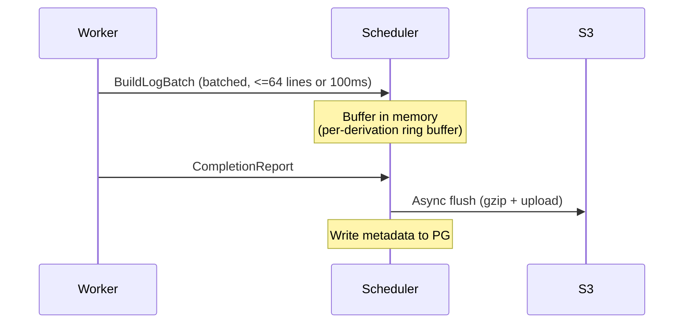

# Observability

rio-build provides three pillars of observability: logs, metrics, and traces.

## Build Log Storage

Build logs are stored durably for post-build analysis and the [dashboard](./components/dashboard.md) log viewer.

### Storage Format

Build logs are stored in S3 as gzipped blobs:

```
logs/{build_id}/{derivation_hash}.log.gz
```

Metadata (byte offsets, timestamps, line counts) is stored in PostgreSQL for efficient seeking and pagination.

### Log Lifecycle

r[obs.log.batch-64-100ms]
Log lines are batched (up to 64 lines or 100ms, whichever first) in `BuildLogBatch` messages.

r[obs.log.periodic-flush]
The scheduler flushes buffers to S3 periodically (every 30s) during active builds, not only on completion --- bounds log loss to at most 30s on failover.



1. Workers stream log lines to the scheduler via `BuildLogBatch` messages in the `BuildExecution` stream. Lines are batched (up to 64 lines or 100ms, whichever comes first) for efficiency.
2. The scheduler buffers logs in an in-memory ring buffer per active derivation.
3. On derivation completion, the scheduler asynchronously flushes the buffer to S3 as a gzipped blob and writes metadata (byte offsets, timestamps) to PostgreSQL.

> **Periodic flush:** Logs are also flushed to S3 periodically (every 30s) during active builds, not only on completion. This bounds log loss to at most 30s of output if the scheduler fails over.

> **Log durability tradeoff:** The 30-second flush interval is a deliberate tradeoff between write amplification and data loss. Flushing more frequently increases S3 PUT costs and scheduler CPU usage; flushing less frequently increases the window of log loss on crash. For most builds, 30s of lost logs is acceptable --- the build itself will be retried and new logs will be generated. For long-running builds where the final 30s of output is critical for debugging, consider a future enhancement: workers could write a local log file as a write-ahead log (WAL) that survives scheduler restarts, with the scheduler draining the WAL on recovery. This is a Phase 4+ consideration.
4. The `AdminService.GetBuildLogs` RPC reads from the in-memory buffer for active builds and from S3 for completed builds.

### Log Serving

| Build State | Log Source |
|-------------|-----------|
| Active (building) | In-memory ring buffer on scheduler |
| Completed | S3 blob (gzipped), seekable via PG metadata |
| Failed | S3 blob (flushed on failure as well) |

## Metrics

Each component exposes a Prometheus-compatible `/metrics` endpoint via `metrics-exporter-prometheus`.

### Gateway Metrics

r[obs.metric.gateway]
| Metric | Type | Description |
|--------|------|-------------|
| `rio_gateway_connections_total` | Counter | Total SSH connections |
| `rio_gateway_connections_active` | Gauge | Currently active connections |
| `rio_gateway_opcodes_total` | Counter | Protocol opcodes handled (labeled by opcode) |
| `rio_gateway_opcode_duration_seconds` | Histogram | Per-opcode latency |
| `rio_gateway_handshakes_total` | Counter | Protocol handshakes completed (labeled by result: success/rejected/failure) |
| `rio_gateway_channels_active` | Gauge | Currently active SSH channels |
| `rio_gateway_errors_total` | Counter | Protocol errors (labeled by type) |
| `rio_gateway_bytes_total` | Counter | Bytes forwarded to/from SSH client (labeled by `direction`: `rx`/`tx`) |

> **Note on `rio_gateway_connections_total`:** Incremented on first SSH auth attempt (`result=new`), then again on auth outcome (`result=accepted` or `result=rejected`). TCP probes that close before sending SSH bytes (NLB/kubelet health checks) do not increment — russh's `new_client()` fires on TCP accept, so the counter is deferred to the first `auth_*` callback. A single successful connection still generates two increments; use `result=accepted` + `result=rejected` for success/failure rates.

### Scheduler Metrics

r[obs.metric.scheduler]
| Metric | Type | Description |
|--------|------|-------------|
| `rio_scheduler_builds_total` | Counter | Total builds at terminal state (labeled by `outcome`: `success`/`failure`/`cancelled`) |
| `rio_scheduler_builds_active` | Gauge | Currently active builds |
| `rio_scheduler_derivations_queued` | Gauge | Derivations waiting for assignment |
| `rio_scheduler_derivations_running` | Gauge | Derivations currently building |
| `rio_scheduler_assignment_latency_seconds` | Histogram | Time from ready to assigned |
| `rio_scheduler_build_duration_seconds` | Histogram | Total build duration |
| `rio_scheduler_cache_hits_total` | Counter | Derivations served from cache (labeled by `source`: `scheduler`=TOCTOU check, `existing`=pre-existing completed) |
| `rio_scheduler_cache_check_failures_total` | Counter | Scheduler cache check (store FindMissingPaths) failures. Alert if rate > 0 sustained: indicates store connectivity issue, every submission treated as 100% cache miss. |
| `rio_scheduler_queue_backpressure` | Counter | Backpressure activations (queue reached 80% capacity) |
| `rio_scheduler_workers_active` | Gauge | Fully-registered workers (stream + heartbeat) |
| `rio_scheduler_assignments_total` | Counter | Total derivation->worker assignments |
| `rio_scheduler_cleanup_dropped_total` | Counter | Terminal-build cleanup commands dropped due to channel backpressure. Alert if rate > 0 sustained: indicates memory leak under load. |
| `rio_scheduler_transition_rejected_total` | Counter | State-machine transition rejections in the actor (labeled by `to` target state). Alert if rate > 0: these are defense-in-depth guards that should never fire; any non-zero rate indicates a race or logic bug. |
| `rio_scheduler_log_lines_forwarded_total` | Counter | Log lines forwarded via `BuildEvent::Log` (worker → scheduler → actor → gateway broadcast). Direct signal that the log pipeline's internal plumbing is live. |
| `rio_scheduler_log_flush_total` | Counter | Successful S3 log flushes (labeled by `kind`: `final`/`periodic`). |
| `rio_scheduler_log_flush_failures_total` | Counter | Failed S3 log flushes (labeled by `phase`: `s3`/`pg`). Alert if rate > 0 sustained: build logs are being lost. |
| `rio_scheduler_log_flush_dropped_total` | Counter | Final-flush requests dropped due to flusher channel backpressure. Periodic tick will snapshot instead. |
| `rio_scheduler_log_forward_dropped_total` | Counter | Live log forwards dropped due to actor channel backpressure. Lines remain in the ring buffer (serveable via AdminService) but the gateway misses the live stream. Sustained non-zero → actor is saturated. |
| `rio_scheduler_critical_path_accuracy` | Histogram | Predicted vs. actual completion ratio (actual/estimated; 1.0 = perfect, >1.0 = underestimate) |
| `rio_scheduler_size_class_assignments_total` | Counter | Assignments per size class (labeled by class name) |
| `rio_scheduler_misclassifications_total` | Counter | Builds that exceeded 2× their class cutoff duration (triggers penalty EMA overwrite) |
| `rio_scheduler_cutoff_seconds` | Gauge | Duration cutoff per class (labeled by class; set once at config load, static) |
| `rio_scheduler_class_queue_depth` | Gauge | Deferred derivations per target class (snapshot per dispatch pass) |
| `rio_scheduler_cache_check_circuit_open_total` | Counter | Circuit-breaker open transitions (store unreachable for 5 consecutive cache checks). Alert if rate > 0: scheduler falling back to rejecting SubmitBuild. |
| `rio_scheduler_prefetch_hints_sent_total` | Counter | PrefetchHint messages sent (one per assignment with paths to warm). Missing from a dispatch = leaf drv or bloom filter says worker already has everything. |
| `rio_scheduler_prefetch_paths_sent_total` | Counter | Total paths in sent PrefetchHints. Divide by `hints_sent` for avg paths-per-hint. High avg = workers cold (poor locality) or bloom stale. |
| `rio_scheduler_event_persist_dropped_total` | Counter | BuildEvents dropped from PG persister (channel backpressure). Broadcast still live; only mid-backlog reconnect loses it. Alert if rate > 0 sustained. |
| `rio_scheduler_lease_acquired_total` | Counter | Kubernetes Lease acquire transitions (standby → leader). *Internal — primary use is VM test observability.* |
| `rio_scheduler_lease_lost_total` | Counter | Kubernetes Lease loss transitions (leader → standby). *Internal — non-zero on a single-replica deployment is a bug.* |
| `rio_scheduler_recovery_total` | Counter | State recovery runs (on LeaderAcquired). Labeled by `outcome`: `success`/`failure`. |
| `rio_scheduler_recovery_duration_seconds` | Histogram | Time to reload non-terminal builds/derivations from PostgreSQL. |
| `rio_scheduler_backstop_timeouts_total` | Counter | Running derivations reset to Ready by the backstop timeout (running_since > max(est_duration×3, daemon_timeout+10m)). Non-zero indicates wedged workers. |
| `rio_scheduler_worker_disconnects_total` | Counter | BuildExecution stream closures (worker gone). Triggers reassignment. |
| `rio_scheduler_cancel_signals_total` | Counter | CancelSignal messages sent to workers (explicit CancelBuild, backstop timeout, or finalizer drain). |
| `rio_scheduler_estimator_refresh_total` | Counter | Build-history estimator refresh ticks (60s cadence). *Internal — VM test sync signal.* |
| `rio_scheduler_class_load_fraction` *(Phase 4+)* | Gauge | Load fraction per size class (adaptive rebalancer input) |

### Store Metrics

r[obs.metric.store]
| Metric | Type | Description |
|--------|------|-------------|
| `rio_store_put_path_total` | Counter | Total PutPath operations |
| `rio_store_put_path_duration_seconds` | Histogram | PutPath latency |
| `rio_store_integrity_failures_total` | Counter | GetPath content integrity check failures (bitrot/corruption) |
| `rio_store_chunks_total` | Gauge | Total chunks in storage (piggybacked on FindMissingChunks) |
| `rio_store_chunk_dedup_ratio` | Gauge | Per-upload dedup ratio (1.0 - missing/total after chunking) |
| `rio_store_s3_requests_total` | Counter | S3 API calls (labeled by operation) |
| `rio_store_chunk_cache_hits_total` | Counter | moka chunk cache hits (for cross-instance aggregation) |
| `rio_store_chunk_cache_misses_total` | Counter | moka chunk cache misses |
| `rio_store_hmac_rejected_total` | Counter | PutPath calls rejected by HMAC verifier (bad signature, expired, path not in `expected_outputs`). Alert if rate > 0: indicates misconfiguration or compromise attempt. |
| `rio_store_hmac_bypass_total` | Counter | PutPath calls that skipped HMAC verification via mTLS CN bypass (labeled by `cn`). Expected `cn="rio-gateway"` only. |
| `rio_store_gc_path_resurrected_total` | Counter | Paths skipped by GC sweep because a reference appeared between mark and sweep (sweep's per-path reference re-check caught it). |
| `rio_store_gc_chunk_resurrected_total` | Counter | S3 deletes skipped by the drain task because chunk refcount re-check found the chunk back in use (TOCTOU guard via `pending_s3_deletes.blake3_hash`). |
| `rio_store_s3_deletes_pending` | Gauge | Rows in `pending_s3_deletes` with `attempts < 10`. Normal operation: near-zero. |
| `rio_store_s3_deletes_stuck` | Gauge | Rows in `pending_s3_deletes` with `attempts >= 10` (max retries exhausted). Alert if > 0: manual investigation needed. |
| `rio_store_put_path_bytes_total` | Counter | Bytes accepted via PutPath (nar_size on success) |
| `rio_store_get_path_bytes_total` | Counter | Bytes served via GetPath (nar_size on stream start) |

### Worker Metrics

r[obs.metric.worker]
| Metric | Type | Description |
|--------|------|-------------|
| `rio_worker_builds_total` | Counter | Total builds executed (labeled by `outcome`: `success`/`failure`/`cancelled`) |
| `rio_worker_builds_active` | Gauge | Currently running builds on this worker |
| `rio_worker_uploads_total` | Counter | Output uploads (labeled by `status`) |
| `rio_worker_build_duration_seconds` | Histogram | Per-derivation build time |
| `rio_worker_fuse_cache_size_bytes` | Gauge | FUSE SSD cache usage |
| `rio_worker_fuse_cache_hits_total` | Counter | FUSE cache hits |
| `rio_worker_fuse_cache_misses_total` | Counter | FUSE cache misses |
| `rio_worker_fuse_fetch_duration_seconds` | Histogram | Store path fetch latency |
| `rio_worker_fuse_fallback_reads_total` | Counter | Successful userspace `read()` callbacks. Near-zero when passthrough is on (kernel handles reads directly); nonzero when `fuse_passthrough=false` or passthrough failed for specific files. |
| `rio_worker_overlay_teardown_failures_total` | Counter | Overlay unmount failures (leaked mount). Alert if rate > 0: indicates resource leak on worker. |
| `rio_worker_prefetch_total` | Counter | PrefetchHint outcomes (labeled by `result`: `fetched`/`already_cached`/`already_in_flight`/`error`/`malformed`/`panic`). Sustained high `already_cached` = scheduler bloom filter stale. |
| `rio_worker_upload_bytes_total` | Counter | Bytes uploaded to store via PutPath (nar_size on success) |
| `rio_worker_fuse_fetch_bytes_total` | Counter | Bytes fetched from store via FUSE cache misses |
| `rio_worker_cpu_fraction` | Gauge | Worker cgroup CPU utilization: delta `cpu.stat usage_usec` / wall-clock µs. 1.0 = one core fully used; >1.0 on multi-core. Directly comparable to cgroup `cpu.max` limits. |
| `rio_worker_memory_fraction` | Gauge | Worker cgroup memory utilization: `memory.current` / `memory.max`. 0.0 if `memory.max` is `"max"` (unbounded). |

> **Note on ratio metrics:** For aggregatable cache metrics, use counter pairs (e.g., `rio_store_chunk_cache_hits_total` + `rio_store_chunk_cache_misses_total`) and compute ratios at query time with PromQL's `rate()`. Pre-computed gauge ratios lose meaning when averaged across instances. Exception: `rio_store_chunk_dedup_ratio` is a per-upload event gauge (last-written-wins, not averaged) — useful for eyeballing recent PutPath dedup effectiveness but NOT for cross-instance aggregation.

r[obs.metric.transfer-volume]

Transfer-volume byte counters (`*_bytes_total`) are emitted at each hop: gateway (`rio_gateway_bytes_total{direction}`), store (`rio_store_{put,get}_path_bytes_total`), worker (`rio_worker_{upload,fuse_fetch}_bytes_total`). Summing these across the topology gives a full picture of data movement — e.g., `rate(rio_worker_fuse_fetch_bytes_total[5m])` vs `rate(rio_worker_upload_bytes_total[5m])` shows whether a worker is input-bound or output-bound.

r[obs.metric.worker-util]

Worker utilization gauges (`rio_worker_{cpu,memory}_fraction`) are polled from the worker's parent cgroup every 15s by `utilization_reporter_loop`. These capture the whole worker tree (rio-worker + per-build sub-cgroups + all subprocesses). CPU fraction >1.0 on multi-core is expected under full load. Memory fraction stays 0.0 if `memory.max` is unbounded — only meaningful when the pod has a memory limit configured.

### Controller Metrics

r[obs.metric.controller]
| Metric | Type | Description |
|--------|------|-------------|
| `rio_controller_reconcile_duration_seconds` | Histogram | Reconcile loop latency (labeled by reconciler) |
| `rio_controller_reconcile_errors_total` | Counter | Reconcile errors (labeled by reconciler) |
| `rio_controller_workerpool_replicas` | Gauge | WorkerPool replica count (labeled desired vs actual) |
| `rio_controller_scaling_decisions_total` | Counter | Scaling decisions (labeled by direction: up/down) |
| `rio_controller_build_watch_spawns_total` | Counter | WatchBuild background tasks spawned by the Build reconciler. Should equal the number of distinct Build UIDs seen (dedup by `ctx.watching` DashMap). Alert if >> Build count: indicates watch dedup failure → duplicate event processing. |
| `rio_controller_build_watch_reconnects_total` | Counter | Build watch stream reconnect attempts (both non-terminal EOF and transport errors). Nonzero is normal during scheduler failover; alert on sustained growth: indicates flapping scheduler or persistent connectivity issues. |
| `rio_controller_gc_runs_total` *(Phase 4+)* | Counter | GC runs (labeled by result: success/failure) — not yet emitted |

### Histogram Buckets

`metrics-exporter-prometheus` defaults to `[0.005, 0.01, 0.025, 0.05, 0.1, 0.25, 0.5, 1.0, 2.5, 5.0, 10.0]` — tuned for HTTP request latencies. Build durations span seconds to hours, so `rio-common::observability::init_metrics` installs per-metric overrides via `PrometheusBuilder::set_buckets_for_metric`:

| Metric(s) | Buckets (seconds unless noted) |
|---|---|
| `rio_scheduler_build_duration_seconds`, `rio_worker_build_duration_seconds` | `[1, 5, 15, 30, 60, 120, 300, 600, 1800, 3600, 7200]` |
| `rio_scheduler_critical_path_accuracy` | `[0.5, 0.75, 0.9, 1.0, 1.1, 1.25, 1.5, 2.0, 5.0]` (ratio: actual/estimated; 1.0 = perfect) |
| `rio_controller_reconcile_duration_seconds` | `[0.01, 0.05, 0.1, 0.25, 0.5, 1.0, 2.5, 5.0, 10.0]` |
| `rio_scheduler_assignment_latency_seconds` | `[0.001, 0.005, 0.01, 0.05, 0.1, 0.5, 1.0, 5.0]` |

Histograms not listed here (e.g., `rio_gateway_opcode_duration_seconds`, `rio_store_put_path_duration_seconds`, `rio_worker_fuse_fetch_duration_seconds`) use the default buckets — those are genuinely sub-second request latencies.

## Distributed Tracing

rio-build uses OpenTelemetry for distributed tracing with trace context propagation via gRPC metadata.

### Trace Structure

A typical build trace spans multiple components:

```
Build (gateway)
├── SubmitBuild (gateway → scheduler)
│   ├── DAG Merge (scheduler)
│   ├── Cache Check (scheduler → store)
│   └── Schedule (scheduler)
│       ├── Assign derivation-A (scheduler → worker-0)
│       │   ├── Fetch inputs (worker-0 → store)
│       │   ├── Build (worker-0, nix sandbox)
│       │   └── Upload output (worker-0 → store)
│       └── Assign derivation-B (scheduler → worker-1)
│           ├── Fetch inputs (worker-1 → store)
│           ├── Build (worker-1, nix sandbox)
│           └── Upload output (worker-1 → store)
└── Return result (gateway → client)
```

### Configuration

OTel config is read from environment variables (NOT figment) because `init_tracing()` runs before config parsing and must not depend on any crate's config layout.

| Env var | Description |
|---------|-------------|
| `RIO_OTEL_ENDPOINT` | OTLP gRPC collector endpoint (e.g., `http://otel-collector:4317`). Unset = OTel disabled entirely (zero overhead). |
| `RIO_OTEL_SAMPLE_RATE` | Trace sampling rate 0.0–1.0 (default: 1.0). Clamped. |
| `RIO_LOG_FORMAT` | `json` or `pretty` (default: `json`). |

The OTel `service.name` resource attribute is set automatically per component (gateway, scheduler, store, worker, controller) by `init_tracing()`.

### Trace Propagation

r[obs.trace.w3c-traceparent]

Trace context is propagated via gRPC metadata using the W3C `traceparent` header format.

r[sched.trace.assignment-traceparent]

ssh-ng has no gRPC metadata channel, so the scheduler→worker hop cannot use `inject_current`/`link_parent`. Span context also does not cross the scheduler's mpsc actor channel — calling `current_traceparent()` at dispatch time would capture an orphan actor span. Instead, the `SubmitBuild` gRPC handler captures `current_traceparent()` **after** `link_parent()` (so it's inside the gateway-linked span), and carries it as plain data: `MergeDagRequest.traceparent` → `DerivationState.traceparent` → `WorkAssignment.traceparent` at dispatch. The worker extracts it via `span_from_traceparent()` and wraps the spawned build-executor future in `.instrument(span)`. **First-submitter-wins on dedup:** when two builds merge the same derivation, the existing state's traceparent is preserved unless it is empty (recovery/poison-reset set `""`), in which case the first live submitter upgrades it. Traceparent is not persisted to PG — recovered derivations dispatched before any re-submit get a fresh worker root span. Empty traceparent → fresh root span. This closes the SSH-boundary tracing gap — Tempo shows gateway→scheduler→worker→store as a single trace for the common immediate-dispatch case. Injection and extraction are **manual**, not tonic interceptors: `rio_proto::interceptor::inject_current()` copies the current span's context into outgoing request metadata (client side), and `rio_proto::interceptor::link_parent()` stitches the `#[instrument]` span into the incoming parent (server side, first line of each handler). Manual is deliberate: tonic's `Interceptor` trait changes `connect_*` return types (62-callsite type churn), doesn't compose with server-side `#[instrument]`, and the explicit call makes propagation points greppable. The W3C `TraceContextPropagator` is registered globally in `init_tracing()` regardless of whether `RIO_OTEL_ENDPOINT` is set — propagation works even when spans aren't exported.

## SLOs, SLIs, and Alerting

### Service Level Indicators (SLIs)

| SLI | Source Metric(s) |
|-----|------------------|
| Gateway connection success rate | `rio_gateway_connections_total` minus connection errors / total |
| Scheduler build completion rate | `rio_scheduler_builds_total` outcome=success / total |
| Store PutPath success rate | `rio_store_put_path_total` minus errors / total |
| Worker build success rate | `rio_worker_builds_total` outcome=success / total |

### Service Level Objectives (SLOs)

| SLO | Target |
|-----|--------|
| Non-PermanentFailure builds complete within 2x estimated duration | 99.9% |
| PutPath success on first attempt | 99.99% |
| Cache-hit latency (p99) | < 1s |

### Alerting

- **Error budget burn rate:** Alert when the error budget consumption rate exceeds 14.4x the allowed rate over 1h (fast burn) or 6x over 6h (slow burn), following the multi-window multi-burn-rate approach.
- **Saturation alerts:** PostgreSQL connection pool utilization > 80%, S3 rate limiting (429 responses), worker queue depth exceeding 2x worker count.
- **Absence alerts:** No worker heartbeat received for > ~50-60s (the scheduler's effective deregistration threshold: 30s staleness + 3-tick confirmation). Indicates a worker has silently died or lost network connectivity.

## Structured Logging

r[obs.log.required-fields]
All components emit structured JSON logs via `tracing-subscriber` with the following required fields per log line:

| Field | Type | Description |
|-------|------|-------------|
| `timestamp` | RFC 3339 | Event time |
| `level` | string | Log level (TRACE, DEBUG, INFO, WARN, ERROR) |
| `component` | string | Emitting component (gateway, scheduler, store, worker, controller) |
| `build_id` | string | Build request ID (if applicable) |
| `derivation_hash` | string | Derivation hash (if applicable) |
| `worker_id` | string | Worker instance ID (worker component only) |
| `message` | string | Human-readable log message |

Conditionally present:

| Field | Type | When present |
|-------|------|--------------|
| `trace_id` | string | Only when `RIO_OTEL_ENDPOINT` is set AND the log is emitted within an active span. The default JSON fmt layer does NOT include trace/span IDs — they come from the OTel layer's span context. |
| `span_id` | string | Same condition as `trace_id`. |
| `tenant_id` *(Phase 4+)* | string | Tenant identifier. Gateway records `tenant` (name) on the session span (`session.rs`). Scheduler records `tenant_id` (UUID) on the `SubmitBuild` span after `resolve_tenant` succeeds. Persisted to `builds.tenant_id`. |

Optional fields may be added per component as `tracing` span fields. All fields use snake_case. Missing context fields (e.g., `build_id` outside a build context) are omitted rather than set to empty strings.

## Dashboard Data Sources

The [rio-dashboard](./components/dashboard.md) consumes data from two sources:

| Data | Source | Protocol |
|------|--------|----------|
| Builds, workers, logs | `AdminService` | gRPC-Web |
| Metrics, graphs | Prometheus | HTTP (direct or via Grafana) |

The dashboard does NOT query PostgreSQL or S3 directly.
