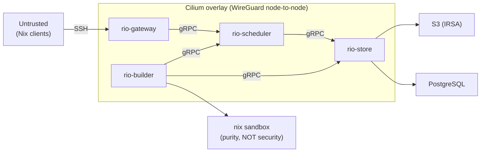

# Threat Model

## Trust Boundaries

### Boundary 1: Nix Client → Gateway (SSH)

r[sec.boundary.ssh-auth]
The gateway authenticates SSH connections via public key authentication. Authorized keys are loaded from an `authorized_keys`-format file at startup; only connections presenting a listed key are accepted. Password authentication is disabled.

- **Threat**: Malicious `.drv` files, crafted protocol messages, resource exhaustion
- **Mitigations**: Protocol parser fuzzing (see `rio-nix/fuzz/`), global NAR size limits (`MAX_NAR_SIZE`)

> **TODO:** per-tenant rate limiting; connection/channel limits; SSH-key→tenant mapping. (Key-algorithm filtering is not planned — operator's `authorized_keys` is operator's trust boundary.)

### Boundary 2: Gateway/Executor → Internal Services (gRPC)

r[sec.boundary.grpc-hmac]
Inter-component gRPC traffic is encrypted by Cilium WireGuard (`r[sec.transport.cilium-wireguard]`), reachability-restricted by CiliumNetworkPolicy, and — for write-path RPCs — authorized via HMAC-signed tokens.

- **Encryption**: Cilium WireGuard transparent encryption (node-to-node, kernel datapath). Components speak plaintext gRPC; the overlay encrypts.
- **Threat**: Compromised pod impersonating another component
- **Mitigations**: CiliumNetworkPolicy restricts pod-to-pod reachability by label-based identity (e.g., only pods labeled `app.kubernetes.io/name=rio-gateway` may reach `rio-store:9002`). Application-level HMAC tokens authorize sensitive write RPCs.
- **Authorization**: CNP gates *which pods can connect*; HMAC tokens gate *what a connected pod may write*:

r[sec.transport.cilium-wireguard]
All pod-to-pod traffic is encrypted by Cilium's WireGuard transparent encryption (`encryption.type: wireguard` in the Cilium helm values). Encryption is at the overlay layer (Geneve-encapsulated, ChaCha20-Poly1305) — rio components run plaintext gRPC servers and clients with no TLS configuration. There is no per-service certificate identity; component identity for reachability is the pod's Cilium security identity (derived from k8s labels), enforced by CiliumNetworkPolicy. There is no application-level certificate to rotate or expire.

r[common.hmac.claims]
The scheduler signs **assignment tokens** (HMAC-SHA256) when dispatching work. Token format is `base64url(json(AssignmentClaims)).base64url(hmac_sha256(key, claims_json))`. `AssignmentClaims` has the fields: `executor_id` (string, audit only — the store doesn't know which executor is calling), `drv_hash` (string, ties token to a specific build), `expected_outputs` (list of store paths, the authorization check), `is_ca` (bool, skips the membership check for floating-CA derivations whose output paths are computed post-build), `expiry_unix` (u64 Unix seconds, replay prevention), `role` (`Builder`/`Gateway`/`Admin` — `r[store.put.builder-chunked-only]` rejects `PutPath`/`PutPathBatch` for `Builder`), `tenant_id` (uuid — what `r[store.castore.tenant-scope]` reads from HMAC callers for `GetDirectory`/`ReadBlob`/`StatBlob`/`HasBlobs` scoping), `input_closure_digest` (32-byte blake3 over the sorted transitive-input-closure store-path strings — attests the `r[store.put.refs-sync]` refscan candidate set the builder echoes in `Begin.input_closure`).
  - Executors present the assignment token in the `x-rio-assignment-token` gRPC metadata header when calling `PutPath` on the store. The store verifies the token signature, checks `now < expiry_unix`, and rejects with `PERMISSION_DENIED` if the uploaded `store_path ∉ expected_outputs`.
  - This prevents a compromised executor from writing to store paths it was never assigned to build.
  - Token lifetime is scoped to the build assignment; tokens expire after a configurable TTL (default: 2× the build timeout).
  - The signing key is a shared HMAC secret between the scheduler and store, stored as a Kubernetes Secret (recommend KMS/Vault for production).
  - **Read authorization:** the **castore RPC surface** (`GetDirectory`/`HasDirectories`/`HasBlobs`/`ReadBlob`/`StatBlob`, ADR-022) IS tenant-scoped: queries join `directory_tenants`/`file_blob_tenants` on `AssignmentClaims.tenant_id` and return NotFound for digests the caller's tenant has not produced (`r[store.castore.tenant-scope]`). The legacy `GetPath`/`QueryPathInfo` surface remains gated only by CiliumNetworkPolicy (any reachable executor can read any store path) — acceptable because store paths are content-addressed and immutable, executors need shared paths (glibc, coreutils) regardless of tenant, and output isolation is enforced at scheduling.

r[sec.executor.identity-token+2]
The scheduler signs **executor-identity tokens** (`ExecutorClaims { intent_id, kind, expiry_unix }`, same HMAC envelope as `AssignmentClaims`, same key) per `SpawnIntent`. The controller passes the token through verbatim as the `RIO_EXECUTOR_TOKEN` pod env var. Builders MUST present it as `x-rio-executor-token` metadata on `BuildExecution` open and every `Heartbeat`. When the HMAC key is configured, the scheduler MUST reject ExecutorService calls without a valid token, MUST reject a heartbeat whose body `intent_id` OR `kind` differs from the token's, MUST reject a heartbeat whose token-attested `intent_id` differs from the target executor's stored `auth_intent` (set at connect, immutable — prevents a compromised pod A heartbeating as B with A's own intent), and MUST reject a `BuildExecution` reconnect whose token `intent_id` differs from the executor's stored `auth_intent` or whose existing stream is still live. The `BuildExecution` handler MUST learn the actor's accept/reject decision before spawning the stream-reader task (a body-supplied `executor_id` is otherwise unbound — `ExecutorClaims` cannot carry it because the scheduler signs before the controller picks a pod name). This binds a stream to the intent AND kind its pod was spawned for: a compromised builder holds a token for ITS OWN intent+kind only and cannot hijack another executor's `stream_tx` (and thereby its `WorkAssignment.assignment_token`), forge `ProcessCompletion` for another executor's build, mutate another executor's heartbeat-driven state, nor self-promote `kind` to receive work routed past its CiliumNetworkPolicy airgap boundary.

> **Service-token bypass (`r[sec.authz.service-token]`):** PutPath skips assignment-token verification when the caller presents a valid `x-rio-service-token` — an HMAC-signed `ServiceClaims { caller, expiry_unix }` keyed with `RIO_SERVICE_HMAC_KEY_PATH` (a separate secret from the assignment key). The gateway mints one per upload with a 60s expiry. The same mechanism gates **every mutating RPC** on the scheduler's `AdminService` and the store's `StoreAdminService` (`TriggerGC`, `AddUpstream`, `GetLoad`, …): builders share port 9001/9002 with those services (CCNP allows the port at L4 only), so without the gate a compromised builder could poison λ\[h\], drain arbitrary executors, set SLA overrides to bias the solver fleet-wide, un-poison quarantined derivations, or inject attacker-keyed upstream caches into another tenant's substitution path. Callers (rio-controller, rio-cli, rio-scheduler) mint `caller="<self>"` per request via `ServiceTokenInterceptor`; the verifier checks against a per-RPC allowlist. The canonical mutating-RPC list is the `mutating_rpcs_require_service_token` test. This replaces the former certificate-CN check and is transport-agnostic. See `rio_auth::hmac::ensure_service_caller`, `rio-store/src/grpc/{put_path/,admin.rs}`, `rio-scheduler/src/admin/mod.rs`.

r[sec.jwt.pubkey-mount]
When `jwt.enabled=true`, scheduler and store pods MUST have the `rio-jwt-pubkey` ConfigMap mounted at `/etc/rio/jwt/ed25519_pubkey` and `RIO_JWT__KEY_PATH` set to that path. Without the mount, `cfg.jwt.key_path` remains `None` and the interceptor falls through to inert mode (every RPC passes, no `Claims` attached) --- a silent fail-open. The gateway correspondingly mounts the `rio-jwt-signing` Secret at `/etc/rio/jwt/ed25519_seed`. Helm `_helpers.tpl` provides `rio.jwtVerifyEnv`/`VolumeMount`/`Volume` and `rio.jwtSignEnv`/`VolumeMount`/`Volume` triplets, self-guarded on `.Values.jwt.enabled`.

### Boundary 3: Executor → Nix Sandbox

- **Auth**: None (sandbox is a purity mechanism, NOT a security boundary)
- **Threat**: Malicious derivation escaping sandbox and accessing executor resources
- **Mitigations**: `CAP_SYS_ADMIN` + `seccompProfile: RuntimeDefault` (NOT `privileged: true`), `hostUsers: false` (user-namespace isolation), dedicated node pool, NetworkPolicy, `automountServiceAccountToken: false`, IMDSv2 hop limit=1

## Executor Pod Security

r[sec.pod.host-users-false]
Executor pods MUST set `hostUsers: false` to activate Kubernetes user-namespace
isolation (K8s 1.33+). Container UIDs are remapped to unprivileged host UIDs;
`CAP_SYS_ADMIN` applies only within the user namespace. A container escape
gaining `CAP_SYS_ADMIN` cannot affect the host or other pods. See
[ADR-012](./decisions/012-privileged-builder-pods.md#kubernetes-user-namespace-isolation).
The `privileged: true` escape hatch (for clusters whose containerd lacks
`base_runtime_spec` device injection) skips `hostUsers: false` — privileged
containers cannot be user-namespaced.

r[sec.pod.fuse-device-plugin]
<!-- rule-id is historical; mechanism is rio-mountd fd-handoff since ADR-022 §2.5 -->
Executor pods MUST NOT obtain `/dev/fuse` via a hostPath volume or
containerd `base_runtime_spec` device injection. `/dev/fuse` is opened
**by `rio-mountd`** (a node-level DaemonSet, hostPID, init-ns
`CAP_SYS_ADMIN`) and the fd is passed to the unprivileged builder via
`SCM_RIGHTS` over a UDS (`r[builder.mountd.fuse-handoff]`). The builder
pod has zero device exposure and no `CAP_SYS_ADMIN`. `/dev/kvm` is
host-conditional — kvm-pool builds receive it via hostPath CharDevice +
`extra-sandbox-paths`, routed to `.metal` via the `rio.build/kvm`
nodeSelector (`r[ctrl.pool.kvm-device]`). No device plugin runs.

### Boundary 4: Builder → rio-mountd (UDS)

r[sec.boundary.mountd]
`rio-mountd` is a privileged component reachable from untrusted builders
over a hostPath UDS. Auth: `SO_PEERCRED.gid == rio-builder` admits the
connection; `SO_PEERCRED.uid` binds it (one live conn per uid;
`r[builder.mountd.uid-bound]`). Threats and mitigations: **path traversal**
— `Mount{build_id}` validated `^[A-Za-z0-9_-]{1,64}$` and all per-build
paths via `openat(base_dirfd, …, O_NOFOLLOW)`
(`r[builder.mountd.build-id-validated]`); **node-disk fill** — mountd
enforces `staging_quota_bytes` per connection
(`r[builder.mountd.staging-quota]`); **cross-build interference** — staging
dirs mode 0700 owned by the connecting uid; **cache poisoning** —
`Promote`/`PromoteChunks` blake3-verify before writing the mountd-owned
read-only cache (`r[builder.mountd.promote-verified]`); **fd smuggling** —
`BACKING_OPEN` ioctl rejects depth>0 backing and `backing_id` is
conn-scoped.

r[sec.psa.control-plane-restricted]

The `rio-system` and `rio-store` namespaces MUST enforce Pod Security
Admission `restricted`. Control-plane pods (scheduler, gateway, controller,
store) set `runAsNonRoot: true`, `capabilities.drop: [ALL]`,
`allowPrivilegeEscalation: false`, `seccompProfile: RuntimeDefault`, and
`readOnlyRootFilesystem: true`. These are gRPC servers with no FUSE, no
mount, no raw-socket requirements — `restricted` is the correct floor. The
executor namespaces (`rio-builders`, `rio-fetchers`) stay at `privileged`
per [ADR-019](./decisions/019-builder-fetcher-split.md); they need
`CAP_SYS_ADMIN` for the build sandbox's mount namespace and overlay. (FUSE
no longer requires it pod-side: with ADR-022, `/dev/fuse` is opened by
`rio-mountd` and handed off via fd-passing — see
`r[builder.mountd.fuse-handoff]`.)

r[sec.image.control-plane-minimal]

Control-plane container images (scheduler, gateway, controller, store)
MUST contain only the component binary and its direct runtime
dependencies. Operator tooling — rio-cli, jq, debugging utilities —
MUST NOT be bundled. Admin operations run rio-cli LOCALLY via
`cargo xtask k8s cli`, which port-forwards the gRPC endpoints and
fetches the mTLS client cert from the cluster. Bundling tooling in the
scheduler image expands the attack surface (every transitive dependency
is an execution primitive in a compromised pod) and couples the
control-plane release cadence to CLI dependency updates.

> **seccomp:** Executor pods set `seccompProfile: RuntimeDefault` at the pod level (applies to all containers + init containers) when `privileged != true`. RuntimeDefault blocks ~40 syscalls including `kexec_load`, `open_by_handle_at`, `userfaultfd` that builds don't need. A Localhost profile additionally blocking `ptrace`/`bpf`/`setns`/`process_vm_*` under `CAP_SYS_ADMIN` is available — see `r[builder.seccomp.localhost-profile]` below.

r[builder.seccomp.localhost-profile+2]
Executor pods MAY be configured with a Localhost seccomp profile (`PoolSpec.seccompProfile: Localhost`) that denies `ptrace`, `bpf`, `setns`, `process_vm_readv`, `process_vm_writev` on top of RuntimeDefault's ~40-syscall denylist. The profile JSON lives at `nix/nixos-node/seccomp/rio-{builder,fetcher}.json`; the chart's default `localhostProfile` is `operator/rio-builder.json` (fetchers hardcode `operator/rio-fetcher.json`) — that path is relative to `/var/lib/kubelet/seccomp/`, where the file must exist on every node before a pod referencing it schedules. All supported targets are NixOS and bake the profiles via `systemd.tmpfiles` so the file is present before kubelet starts (`nix/nixos-node/hardening.nix` on EKS, [ADR-021](./decisions/021-nixos-node-ami.md); `nix/tests/fixtures/k3s-full.nix` for k3s VM tests); see [ADR-012 § Seccomp Profile Distribution](./decisions/012-privileged-builder-pods.md#seccomp-profile-distribution). The controller emits no wait machinery — a missing profile surfaces as the executor container's `CreateContainerError` with the profile path in the message.

## Key Security Properties

| Property | Mechanism | Status |
|----------|-----------|--------|
| **Build output integrity** | NAR SHA-256 verified on PutPath; ed25519 signatures | Designed |
| **Chunk integrity** | BLAKE3 verified on every read from S3/cache | Designed |
| **Signing key protection** | K8s Secret (minimum); recommend KMS/Vault for production | Designed |
| **S3 credential management** | IRSA (IAM Roles for Service Accounts) on EKS | Recommended |
| **Executor isolation** | Per-build overlayfs, Nix sandbox, NetworkPolicy | Designed |
| **Metadata service blocking** | NetworkPolicy egress deny `fd00:ec2::254` / `169.254.169.254`; IMDSv2 hop limit=1 | Designed |
| **Inter-component encryption** | Cilium WireGuard transparent encryption (overlay-level) | Implemented — `encryption.type: wireguard` in Cilium helm values |
| **Inter-component reachability** | CiliumNetworkPolicy (label-based identity) | Implemented — `infra/helm/rio-build/templates/networkpolicy.yaml` |
| **Multi-tenant data isolation** | Per-tenant narinfo visibility filtering + per-tenant signing keys; shared executors with per-build overlay isolation | Implemented |

## Derivation Validation

r[sec.drv.validate]
On `PutPath`, rio-store recomputes the SHA-256 digest of the uploaded NAR bytes and rejects the upload if the digest does not match the `nar_hash` declared in the accompanying `PathInfo`. This is the core integrity check: an executor cannot store data under a mismatched content hash. See `rio-store/src/validate.rs`.

Additional validation checks (below) are enforced at other points in the pipeline. These are **not** covered by `r[sec.drv.validate]` — each has its own tracey rule or phase deferral.

| Check | Where | Status | Description |
|-------|-------|--------|-------------|
| NAR SHA-256 verification | Store | `r[sec.drv.validate]` | On `PutPath`, the store recomputes SHA-256 over the NAR bytes and rejects on mismatch. |
| `restrict-eval` | Executor | Implemented | The executor's `nix.conf` sets `restrict-eval = true`, preventing derivations from accessing paths outside the Nix store during evaluation. |
| Sandbox enforcement | Executor | Implemented | `sandbox = true` in `nix.conf` ensures all builds run inside the Nix sandbox (user/mount/PID/network namespaces). |
| DAG size limit | Gateway + Scheduler | Implemented | Gateway's `translate::validate_dag` checks `nodes.len() > MAX_DAG_NODES` before SubmitBuild (early reject); scheduler also enforces. |
| `__noChroot` rejection | Gateway | Implemented | `translate::validate_dag` checks derivation env for `__noChroot=1` via drv_cache lookup. Rejected with "sandbox escape" error. |
| Per-tenant store quota | Gateway | Implemented | `TenantQuota` RPC gates `SubmitBuild` against `gc_max_store_bytes` (30s-TTL cached, eventually-enforcing). Per-upload NAR size uses the global `MAX_NAR_SIZE` limit. |
| Output path match | Store | Implemented | HMAC assignment tokens: store verifies `x-rio-assignment-token` metadata on PutPath, checks `store_path ∈ claims.expected_outputs`. Gateway bypasses via `x-rio-service-token` (`r[sec.authz.service-token]`). |

## Secrets Management

rio-build requires several secrets: SSH host keys, signing keys, database credentials, and HMAC signing keys (assignment tokens + service tokens). There are no application-level TLS certificates — transport encryption is at the Cilium overlay layer.

### Recommended Patterns (by maturity)

**Development / single-node:**
- Kubernetes Secrets with `stringData` fields. Adequate for development but not for production.

**Production baseline:**
- [External Secrets Operator](https://external-secrets.io/) syncing from AWS Secrets Manager, GCP Secret Manager, or HashiCorp Vault into Kubernetes Secrets. Secrets are managed externally and auto-rotated.
- Mount secrets as files (not environment variables) to avoid `/proc` and `ps` leakage. All rio-build secret config parameters use file paths (`signing_key_path`, `host_key_path`, `hmac_key_path`).

r[sec.host-key.file-mode]
A gateway-generated SSH host private key MUST be written with mode `0600` (owner-only) at creation time. The standalone NixOS module relies on the auto-generate path and sets neither `UMask=` nor `StateDirectoryMode=`, so a plain `std::fs::write` would leave the key world-readable.

**Production hardened:**
- HashiCorp Vault with the Vault Agent Injector sidecar. The sidecar injects secrets into a shared `emptyDir` volume, and rio-build reads them from file paths. Vault handles rotation; the sidecar re-renders secrets on change.
- For the `database_url` credential specifically: use Vault's database secrets engine to issue short-lived PostgreSQL credentials per pod, eliminating static database passwords entirely.

### Secret Inventory

| Secret | Used By | Rotation | Status |
|--------|---------|----------|--------|
| SSH host key (`ssh_host_ed25519_key`) | Gateway | Rarely (causes client known_hosts warnings) | Implemented |
| Authorized SSH keys[^authkeys] | Gateway | Per-tenant lifecycle | Implemented (flat file; no tenant annotation) |
| NAR signing key (`signing-key`) | Store | Annually or on compromise | Implemented |
| HMAC signing key (assignment tokens) | Scheduler + Store | Annually or on compromise | Implemented — `RIO_HMAC_KEY_PATH`, same key file both sides |
| HMAC signing key (service tokens) | Gateway + Store | Annually or on compromise | Implemented — `RIO_SERVICE_HMAC_KEY_PATH`; gateway signs, store verifies |
| JWT signing key (tenant tokens)[^jwt] | Gateway | Annually; SIGHUP reload for zero-downtime | Implemented — `RIO_JWT_SIGNING_KEY_PATH`, gateway mints per-session JWT on SSH accept |
| Database credentials (`database_url`) | Scheduler, Store, Controller | Via Vault database engine or External Secrets | Implemented |

[^authkeys]: The `authorized_keys` comment field carries the tenant name (e.g., `ssh-ed25519 AAAA... acme`). The gateway resolves this to a tenant UUID via `SchedulerService.ResolveTenant` on SSH accept and mints a per-session JWT with `Claims.sub = tenant_id`.
[^jwt]: The gateway mints a per-session JWT on SSH accept (`mint_session_jwt`, `r[gw.jwt.issue]`). Downstream services verify via `rio_auth::jwt_interceptor::JwtLayer` with SIGHUP-reloadable public key. Dual-mode fallback (`r[gw.jwt.dual-mode]`): when JWT is disabled, services fall back to `SubmitBuildRequest.tenant_name`.

## Additional Threats

### Signing Key Compromise/Rotation

- **Threat**: Leaked signing key allows an attacker to sign arbitrary store paths as trusted.
- **Mitigation**: Store signing keys in KMS/Vault (not raw K8s Secrets) for production deployments. See [rio-store key rotation](components/store.md#key-rotation) for the rotation procedure. Keys should be rotated annually or immediately on suspected compromise.

### DAG-Based Resource Exhaustion

- **Threat**: A malicious or buggy client submits a derivation DAG with millions of nodes, exhausting scheduler memory and CPU.
- **Mitigation**: Per-tenant limits on maximum DAG size (`max_dag_size`) and maximum concurrent builds (`max_concurrent_builds`). See [Multi-Tenancy](multi-tenancy.md) for quota configuration.
- **Implementation (Phase 3b):** `max_dag_size` is enforced at BOTH gateway (`translate::validate_dag`) and scheduler. Gateway-side check is early rejection — saves the gRPC round-trip for obvious over-size submissions.

### Build-Time Secrets

- **Threat**: Fixed-output derivations (FODs) needing credentials (e.g., private GitHub repos) require network access and authentication during build.
- **Mitigation**: FODs execute on dedicated fetcher pods with open egress; the FOD hash check is the integrity boundary. Per-tenant credentials are injected via fetcher pod env from Secrets, never via builder pods. See [ADR-019](./decisions/019-builder-fetcher-split.md).

### FOD Network Isolation

- **Threat**: FOD builds require internet egress. A compromised build could exfiltrate secrets or call home; a compromised upstream could serve tampered content.
- **Design**: Per [ADR-019](./decisions/019-builder-fetcher-split.md) §Network isolation, builds and fetches run on separate executor kinds with opposite network policies:
  - **Builders** (`rio-builders` namespace) are airgapped — egress to CoreDNS, rio-scheduler, rio-store only. No internet, no proxy. See `r[builder.netpol.airgap]`.
  - **Fetchers** (`rio-fetchers` namespace) get egress via Cilium `toEntities: [world]` on ports 80/443 — address-family-agnostic, and inherently excludes cluster, node, and host identities. See `r[fetcher.netpol.egress-open]`.
  - The FOD hash check (`r[builder.fod.verify-hash]`) is the integrity backstop: tampered content fails `verify_fod_hashes()` before upload.
  - The scheduler NEVER routes a FOD to a builder, even under fetcher pressure (`r[sched.dispatch.fod-to-fetcher]`).
- **Formerly:** the Squid `fod-proxy` with domain allowlisting. Deleted in ADR-019 — the hash check is sufficient; a domain allowlist adds operational friction for marginal gain.

### Log Injection

- **Threat**: Untrusted build output is displayed in the dashboard log viewer. Malicious builds could inject HTML/JavaScript into logs.
- **Mitigation**: The dashboard must sanitize all log content as raw text. Never render log lines as HTML. Use `<pre>` elements or equivalent with proper escaping.

### Cross-Tenant Chunk Probing

- **Threat**: `FindMissingChunks`/`HasChunks` can reveal whether another tenant has built a specific package (chunk-level probing). `HasBlobs`/`HasDirectories` are tenant-scoped per `r[store.castore.tenant-scope]` and do NOT have this exposure.
- **Mitigation**: Per-tenant chunk scoping (at the cost of dedup) or accept the risk. See [Multi-Tenancy](multi-tenancy.md#findmissingchunks-scoping).

## Ephemeral Builders

Builder pods are **always** one-shot Jobs (see `r[ctrl.pool.ephemeral]`
in [components/controller.md](components/controller.md#job-lifecycle)):
one pod per build, zero shared state. Each build gets a fresh emptyDir
for the FUSE cache and overlayfs upper — an untrusted tenant cannot
leave behind poisoned cache entries, doctored overlays, or stale mount
points for the next build, because there is no "next build" on that pod.
The pod terminates after one `CompletionReport`; K8s reaps the Job via
`ttlSecondsAfterFinished`.

**What this does NOT provide** (limitations #1–3 below still apply): the
Nix sandbox is still a purity boundary, not a security boundary. A
malicious derivation can still attempt sandbox escape and gain
`CAP_SYS_ADMIN` within the pod. The one-shot model limits the BLAST
RADIUS of such an escape — the attacker is confined to one pod with no
persistent state to poison. **Cross-tenant cache read is in scope:** with
ADR-022, `/var/rio/cache/` and `/var/rio/chunks/` are *node-shared* and
mounted RO into every builder pod ([ADR-022 §2.6](./decisions/022-lazy-store-fs-erofs-vs-riofs.md)); a
sandbox-escaped build can read any file/chunk a co-tenant build on the
same node has fetched. This is accepted: the cache holds substitutable
content (everything in it was fetched from rio-store, which the attacker's
own builds can also query); the alternative — per-tenant cache
partitioning — sacrifices the structural cross-build dedup that is
ADR-022's primary win. Tenants requiring confidential inputs against
co-tenants on shared nodes need a dedicated node pool (taint/toleration),
not cache isolation.

**Recommended combination** for untrusted multi-tenant:

| Layer | Mechanism | What it provides |
|---|---|---|
| Pod lifetime | One-shot Job (always on) | Zero cross-build state; no cache/overlay poisoning |
| User namespace | `hostUsers: false` (K8s 1.33+) | `CAP_SYS_ADMIN` scoped to unprivileged host UIDs (see limitation #2) |
| Seccomp | `PoolSpec.seccompProfile: Localhost` | `ptrace`/`bpf`/`setns`/`process_vm_*` denied (see `r[builder.seccomp.localhost-profile]`) |
| Node isolation | Dedicated tainted node pool | Sandbox escape confined to builder nodes |
| Network | NetworkPolicy egress deny | No exfil to arbitrary endpoints (FODs route to kind=Fetcher pools) |

The cost is per-build cold start (~10–30s pod scheduling + FUSE mount +
heartbeat) plus one reconciler tick (~10s).

## Known Limitations

1. **The Nix sandbox is NOT a security boundary.** It prevents builds from accessing undeclared inputs (purity) but does not prevent a determined attacker from escaping. For multi-tenant deployments, the security boundary is the executor pod + node isolation.

2. **`rio-mountd` requires init-ns `CAP_SYS_ADMIN`.** Post-ADR-022, executor pods themselves are unprivileged (`hostUsers: false`, no `CAP_SYS_ADMIN`, no device mounts). The privilege moves to a single node-level `rio-mountd` DaemonSet that opens `/dev/fuse`, brokers `FUSE_DEV_IOC_BACKING_OPEN`, and verify-copies into the shared cache; see Boundary 4. The builder mounts overlay inside its own userns via `userxattr`. `seccompProfile: RuntimeDefault` blocks ~40 syscalls (`kexec_load`, `open_by_handle_at`, etc.), but `CAP_SYS_ADMIN` still grants significant host access. The Localhost seccomp profile (`r[builder.seccomp.localhost-profile]`) additionally blocks `ptrace`/`bpf`/`setns`/`process_vm_*` — production deployments should set `PoolSpec.seccompProfile: {type: Localhost, localhostProfile: operator/rio-builder.json}` (the chart default). Dedicated node pools with taints are essential. **Mitigation (K8s 1.33+):** Executor pods must set `hostUsers: false` to enable user namespace isolation. With user namespaces, `CAP_SYS_ADMIN` applies only within the user namespace, not on the host --- the attacker gains capabilities within a namespace that maps to unprivileged host UIDs, significantly reducing the blast radius. See [ADR-012](./decisions/012-privileged-builder-pods.md#kubernetes-user-namespace-isolation).

3. **The Nix sandbox requires mount-namespace manipulation.** The builder mounts overlay inside its own user namespace via `userxattr` (no host capability needed). A sandbox escape lands inside the builder's userns with no host `CAP_SYS_ADMIN`; the attacker's reach is the rio-store gRPC egress (assignment-token-scoped) and the rio-mountd UDS (Boundary 4). Additional mitigations: RuntimeDefault or Localhost seccomp (`r[builder.seccomp.localhost-profile]`), dedicated node pools, and NetworkPolicy.

4. **Cross-tenant chunk deduplication leaks build activity.** A tenant can probe `FindMissingChunks`/`HasChunks` to determine whether another tenant has built a specific package. The castore surface (`HasBlobs`/`HasDirectories`/`GetDirectory`/`ReadBlob`/`StatBlob`) IS tenant-scoped via `r[store.castore.tenant-scope]` and does not have this exposure; the chunk-level surface remains a documented accepted risk. Mitigation: scope chunk presence per tenant (at the cost of dedup savings) or accept the risk with documentation.

5. **Fixed-output derivations (FODs) need network access.** FOD builds (fetchurl, fetchgit) require egress to the internet, which conflicts with the builder airgap. FODs route to dedicated fetcher pods with open egress; the hash check is the integrity boundary (see [FOD Network Isolation](#fod-network-isolation)).
