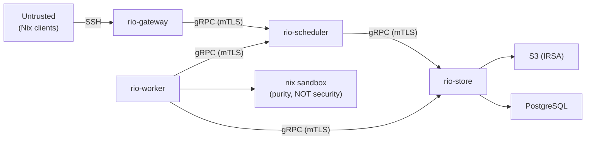

# Threat Model

## Trust Boundaries

### Boundary 1: Nix Client → Gateway (SSH)

r[sec.boundary.ssh-auth]
- **Auth**: SSH public key authentication. Keys map to tenants.
- **Threat**: Malicious `.drv` files, crafted protocol messages, resource exhaustion
- **Mitigations**: Protocol parser fuzzing, per-tenant rate limiting, connection limits, NAR size limits
- **SSH hardening**: Configure `russh` to accept only ed25519 keys, disable password auth, set connection timeouts, limit concurrent channels per connection

### Boundary 2: Gateway/Worker → Internal Services (gRPC)

r[sec.boundary.grpc-hmac]
- **Auth**: mTLS (service mesh or cert-manager). Each component has a distinct identity.
- **Threat**: Compromised pod impersonating another component
- **Mitigations**: mTLS with per-service certificates, NetworkPolicy restricting pod-to-pod communication
- **Authorization**: mTLS authenticates component identity. Application-level authorization uses assignment-scoped tokens for sensitive RPCs:
  - The scheduler signs **assignment tokens** (HMAC-SHA256) when dispatching work. Each token contains `(worker_id, derivation_hash, expected_output_paths, expiry)`.
  - Workers present the assignment token when calling `PutPath` on the store. The store verifies the token signature and checks that the output path being uploaded matches `expected_output_paths`.
  - This prevents a compromised worker from writing to store paths it was never assigned to build.
  - Token lifetime is scoped to the build assignment; tokens expire after a configurable TTL (default: 2× the build timeout).
  - The signing key is a shared HMAC secret between the scheduler and store, stored as a Kubernetes Secret (recommend KMS/Vault for production).
  - **Read authorization:** Workers call `GetPath` and `QueryPathInfo` on the store for FUSE cache fetches. Read access is authorized by mTLS component identity --- any authenticated worker can read any store path. This is acceptable because: (a) store paths are content-addressed and immutable, (b) workers need access to shared paths (glibc, coreutils) regardless of tenant, (c) output isolation is enforced at the scheduling level (workers only build what they are assigned). For deployments requiring strict tenant read isolation, a future enhancement could add tenant-scoped read tokens.

### Boundary 3: Worker → Nix Sandbox

- **Auth**: None (sandbox is a purity mechanism, NOT a security boundary)
- **Threat**: Malicious derivation escaping sandbox and accessing worker resources
- **Mitigations**: `CAP_SYS_ADMIN` + custom seccomp profile (NOT `privileged: true`), dedicated node pool, NetworkPolicy, `automountServiceAccountToken: false`, IMDSv2 hop limit=1

### Boundary 4: Binary Cache HTTP → External Clients

- **Auth**: Bearer token or `netrc`-compatible authentication. Nix clients use `netrc-file` or `access-tokens` settings.
- **Threat**: Unauthenticated enumeration of store paths; data exfiltration via narinfo/NAR download; resource exhaustion via large NAR downloads
- **Mitigations**:
  - Mandatory authentication (bearer token per tenant). Unauthenticated access must be an explicit opt-in for public caches.
  - Per-tenant path visibility: narinfo queries return 404 for paths outside the requesting tenant's scope.
  - Rate limiting on `/nar/` downloads (configurable per tenant).
  - NetworkPolicy: restrict access to the HTTP port from trusted CIDR ranges or ingress controller only.
- **Note**: The binary cache HTTP server runs in the same process as the gRPC StoreService. Consider separate NetworkPolicy rules for the HTTP port vs the gRPC port.

## Key Security Properties

| Property | Mechanism | Status |
|----------|-----------|--------|
| **Build output integrity** | NAR SHA-256 verified on PutPath; ed25519 signatures | Designed |
| **Chunk integrity** | BLAKE3 verified on every read from S3/cache | Designed |
| **Signing key protection** | K8s Secret (minimum); recommend KMS/Vault for production | Designed |
| **S3 credential management** | IRSA (IAM Roles for Service Accounts) on EKS | Recommended |
| **Worker isolation** | Per-build overlayfs, Nix sandbox, NetworkPolicy | Designed |
| **Metadata service blocking** | NetworkPolicy egress deny `169.254.169.254`; IMDSv2 hop limit=1 | Designed |
| **Inter-component auth** | mTLS between all gRPC endpoints | Required |
| **Multi-tenant data isolation** | Per-tenant data visibility (Phase 5); shared workers with per-build overlay isolation | Planned |

## Derivation Validation

r[sec.drv.validate]
Before a derivation is executed, the gateway and worker enforce several validation checks:

| Check | Where | Description |
|-------|-------|-------------|
| `__noChroot` rejection | Gateway | Derivations with `__noChroot = true` are rejected at the gateway. These derivations disable the Nix sandbox entirely and must never execute on shared workers. |
| DAG size limit | Gateway | The total number of nodes in the derivation DAG must not exceed the tenant's `max_dag_size` (simple integer check). |
| NAR size limit | Gateway | Individual NAR uploads are bounded by `max_nar_upload_size` per tenant. |
| `restrict-eval` | Worker | The worker's `nix.conf` sets `restrict-eval = true`, preventing derivations from accessing paths outside the Nix store during evaluation. |
| Sandbox enforcement | Worker | `sandbox = true` in `nix.conf` ensures all builds run inside the Nix sandbox (user/mount/PID/network namespaces). |
| Output path match | Store | On `PutPath`, the store verifies the uploaded output path matches the assignment token's `expected_output_paths`. |

## Secrets Management

rio-build requires several secrets: SSH host keys, signing keys, database credentials, HMAC signing keys for assignment tokens, and TLS certificates (if not using a service mesh).

### Recommended Patterns (by maturity)

**Development / single-node:**
- Kubernetes Secrets with `stringData` fields. Adequate for development but not for production.

**Production baseline:**
- [External Secrets Operator](https://external-secrets.io/) syncing from AWS Secrets Manager, GCP Secret Manager, or HashiCorp Vault into Kubernetes Secrets. Secrets are managed externally and auto-rotated.
- Mount secrets as files (not environment variables) to avoid `/proc` and `ps` leakage. All rio-build secret config parameters use file paths (`signing_key_path`, `host_key_path`, `tls_key_path`).

**Production hardened:**
- HashiCorp Vault with the Vault Agent Injector sidecar. The sidecar injects secrets into a shared `emptyDir` volume, and rio-build reads them from file paths. Vault handles rotation; the sidecar re-renders secrets on change.
- For the `database_url` credential specifically: use Vault's database secrets engine to issue short-lived PostgreSQL credentials per pod, eliminating static database passwords entirely.

### Secret Inventory

| Secret | Used By | Rotation |
|--------|---------|----------|
| SSH host key (`ssh_host_ed25519_key`) | Gateway | Rarely (causes client known_hosts warnings) |
| Authorized SSH keys | Gateway | Per-tenant lifecycle |
| NAR signing key (`signing-key`) | Store | Annually or on compromise |
| HMAC signing key (assignment tokens) | Scheduler + Store | Annually or on compromise |
| JWT signing key (tenant tokens) | Gateway | Annually; SIGHUP reload for zero-downtime |
| Database credentials (`database_url`) | Scheduler, Store, Controller | Via Vault database engine or External Secrets |
| TLS certificates (if no service mesh) | All gRPC components | Via cert-manager auto-renewal |

## Additional Threats

### Signing Key Compromise/Rotation

- **Threat**: Leaked signing key allows an attacker to sign arbitrary store paths as trusted.
- **Mitigation**: Store signing keys in KMS/Vault (not raw K8s Secrets) for production deployments. See [rio-store key rotation](components/store.md#key-rotation) for the rotation procedure. Keys should be rotated annually or immediately on suspected compromise.

### DAG-Based Resource Exhaustion

- **Threat**: A malicious or buggy client submits a derivation DAG with millions of nodes, exhausting scheduler memory and CPU.
- **Mitigation**: Per-tenant limits on maximum DAG size (`max_dag_size`) and maximum concurrent builds (`max_concurrent_builds`). See [Multi-Tenancy](multi-tenancy.md) for quota configuration.
- **Implementation note**: `max_dag_size` is enforced at the gateway as a simple integer check on DAG node count before forwarding to the scheduler. This is implemented from Phase 2a onwards --- it is a cheap safeguard that must not be deferred.

### Build-Time Secrets

- **Threat**: Fixed-output derivations (FODs) needing credentials (e.g., private GitHub repos) require network access and authentication during build.
- **Mitigation**: Route FOD network traffic through a forward proxy (e.g., Squid) with domain allowlisting. The proxy allowlist is configurable per tenant. See [Phase 3](phases/phase3.md) for the implementation plan.

### FOD Network Egress

- **Threat**: FOD builds require internet egress, which conflicts with the worker NetworkPolicy that blocks all external traffic.
- **Design**: FOD builds are routed through a dedicated HTTP/HTTPS forward proxy (e.g., Squid) deployed as a ClusterIP service within the cluster.
  - Workers detect FOD builds (output hash is known in advance) and set `http_proxy`/`https_proxy` environment variables pointing to the proxy.
  - The worker NetworkPolicy adds an egress exception allowing traffic to the proxy service on its listening port.
  - The proxy enforces a domain allowlist (configurable per deployment; default: `cache.nixos.org`, `github.com`, `gitlab.com`, common source forges).
  - All proxied requests are logged for audit. Requests to non-allowlisted domains are rejected.
  - Non-FOD builds retain the full egress deny NetworkPolicy --- no proxy access.
- **Phase**: Implemented in Phase 3. See [Phase 3 tasks](phases/phase3.md).

### Log Injection

- **Threat**: Untrusted build output is displayed in the dashboard log viewer. Malicious builds could inject HTML/JavaScript into logs.
- **Mitigation**: The dashboard must sanitize all log content as raw text. Never render log lines as HTML. Use `<pre>` elements or equivalent with proper escaping.

### Cross-Tenant Chunk Probing

- **Threat**: `FindMissingChunks` can reveal whether another tenant has built a specific package.
- **Mitigation**: Per-tenant chunk scoping (at the cost of dedup) or accept the risk. See [Multi-Tenancy](multi-tenancy.md#findmissingchunks-scoping).

## Known Limitations

1. **The Nix sandbox is NOT a security boundary.** It prevents builds from accessing undeclared inputs (purity) but does not prevent a determined attacker from escaping. For multi-tenant deployments, the security boundary is the worker pod + node isolation.

2. **Workers require `CAP_SYS_ADMIN`.** This capability enables mount namespace manipulation, which is powerful. The custom seccomp profile blocks dangerous syscalls (`ptrace`, `bpf`, `kexec_load`), but `CAP_SYS_ADMIN` still grants significant host access. Dedicated node pools with taints are essential. **Mitigation (K8s 1.33+):** Worker pods must set `hostUsers: false` to enable user namespace isolation. With user namespaces, `CAP_SYS_ADMIN` applies only within the user namespace, not on the host --- the attacker gains capabilities within a namespace that maps to unprivileged host UIDs, significantly reducing the blast radius. See [ADR-012](./decisions/012-privileged-worker-pods.md#kubernetes-user-namespace-isolation).

3. **`CAP_SYS_ADMIN` is held throughout build execution.** The worker cannot drop `CAP_SYS_ADMIN` between overlay setup and build completion because the Nix sandbox itself requires mount namespace manipulation. A sandbox escape gives the attacker `CAP_SYS_ADMIN` capabilities within the user namespace (see mitigation in #2). Additional mitigations: custom seccomp profile, dedicated node pools, and NetworkPolicy. Future work: explore splitting the worker into a privileged setup process and an unprivileged build supervisor.

4. **Cross-tenant chunk deduplication leaks build activity.** A tenant can probe `FindMissingChunks` to determine whether another tenant has built a specific package. Mitigation: scope `FindMissingChunks` per tenant (at the cost of dedup savings) or accept the risk with documentation.

5. **Fixed-output derivations (FODs) need network access.** FOD builds (fetchurl, fetchgit) require egress to the internet, which conflicts with the worker NetworkPolicy. FOD traffic is routed through a forward proxy with domain allowlisting (see [FOD Network Egress](#fod-network-egress)).
